# Data Structures - Chapter 1: Complete Study Guide

## Introduction and Overview

---

## TABLE OF CONTENTS

1. [Introduction](#11-introduction)
2. [Basic Terminology & Elementary Data Organization](#12-basic-terminology--elementary-data-organization)
   - What is Data?
   - Types of Data Items
   - Hierarchical Organization
   - Important Definitions
   - Entity Sets and Information
   - Primary Keys
   - Record Types
3. [Data Structures](#13-data-structures)
   - Classification of Data Structures
   - Primitive vs Non-Primitive
   - Linear vs Non-Linear
   - Arrays
   - Linked Lists
   - Trees
   - Other Structures (Stack, Queue, Graph)
4. [Data Structure Operations](#14-data-structure-operations)
   - Major Operations
   - Special Operations
5. [Abstract Data Types (ADT)](#15-abstract-data-types-adt)
   - ADT Definition
   - ADT Model
6. [Algorithms: Complexity & Time-Space Tradeoff](#16-algorithms-complexity-time-space-tradeoff)
   - Searching Algorithms
   - Time-Space Tradeoff Example
7. [Solved Problems](#solved-problems)
8. [Multiple Choice Questions](#multiple-choice-questions)

---

## 1.1 INTRODUCTION

This chapter introduces **data structures** - ways to organize and store data in computers. We'll learn about:
- Basic terminology and concepts
- Different types of data structures
- Operations we perform on data
- Algorithms and their complexity
- Time-space tradeoffs in choosing solutions

---

## 1.2 BASIC TERMINOLOGY & ELEMENTARY DATA ORGANIZATION

### What is Data?

**Data** = Values or sets of values

**Data Item** = A single unit of values

### Types of Data Items

1. **Elementary Items**: Cannot be divided further
   - Example: Social Security Number (134-24-5533)

2. **Group Items**: Can be divided into sub-items
   - Example: Employee Name can be divided into:
     - First Name
     - Middle Initial
     - Last Name

### Hierarchical Organization of Data

Data is organized in a hierarchy:


### Important Definitions

**Entity**: Something that has certain attributes or properties
- Example: An employee is an entity

**Attributes**: Properties of an entity
- Example: Name, Age, Sex, Social Security Number

**Values**: Actual data assigned to attributes
- Example:
  - Attribute: Name → Value: ROHLAND, GAIL
  - Attribute: Age → Value: 34
  - Attribute: Sex → Value: F
  - Attribute: Social Security Number → Value: 134-24-5533

**Entity Set**: Entities with similar attributes
- Example: All employees in an organization

**Range of Values**: Set of all possible values for an attribute
- Example: Age range might be 18-65 for employees

### Information

**Information** = Data with given attributes (meaningful or processed data)

### Hierarchy: Fields, Records, and Files

**Field**: Single elementary unit representing an attribute
- Example: Age = 34

**Record**: Collection of field values for one entity
- Example: One employee's complete data

**File**: Collection of records for all entities in an entity set
- Example: All employee records

### Primary Keys

**Primary Key (K)**: A Primary Key is a field that uniquely identifies a record (no two records can have the same key).

**Key Values**: Actual values in the primary key field (k₁, k₂, k₃...)

#### Example 1.1(a) - Automobile Dealership

**File Contains:**
- Serial Number
- Type
- Year  
- Price
- Accessories

**Primary Key**: Serial Number (because each car has a unique serial number)

#### Example 1.1(b) - Organization Membership

**File Contains:**
- Name
- Address (group item)
- Telephone Number
- Dues Owed

**Primary Key**: Name

**Why Address and Telephone can't be primary keys:**
- Family members may share the same address
- Family members may share the same telephone number

### Record Types by Length

**Fixed-Length Records**:
- All records contain the same data items
- Same amount of space for each data item
- Example: Employee basic information (fixed fields)

**Variable-Length Records**:
- Records may contain different lengths
- Have minimum and maximum length
- Example: Student records (different students take different numbers of courses)

### Three Steps to Study Data Structures

1. **Logical/Mathematical Description**: Understanding the structure conceptually

2. **Implementation**: How to build it on a computer

3. **Quantitative Analysis**: 
   - How much memory is needed?
   - How much time is required to process?

### Important Note: Memory Types

This textbook focuses on data stored in **main (primary) memory** where:
- Access time doesn't depend on which cell you're accessing
- Access time doesn't depend on the previously accessed cell

**Not covered in detail**: Secondary (external) storage (file/database management)

---

## 1.3 DATA STRUCTURES

### What is a Data Structure?

**Data Structure** = A logical or mathematical model for organizing data

It’s like a blueprint or model that tells the computer:

1. how data is arranged,
2. how data is connected, and
3. how we can use or change that data

### Choosing a Data Structure

Consider two factors:

1. **Rich enough structure**: Must mirror real-world relationships

2. **Simple enough**: Must allow effective data processing

### Classification of Data Structures

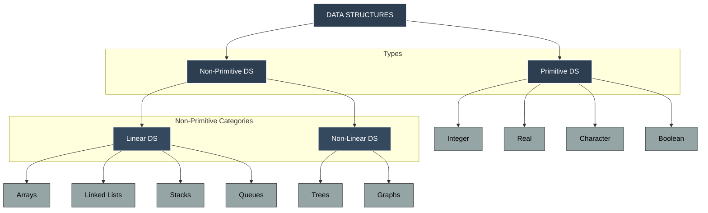

### Primitive Data Structures

**Definition**: Basic data types that cannot be divided
- Also called **simple data types**
- Examples: integer, real, character, boolean

**Example of Non-Primitive Use**: Complex numbers
- Most computers can't do complex number arithmetic directly
- Need special data structures to handle them

### Linear Data Structures

**Definition**: Elements form a sequence or linear list
- Data is arranged in linear fashion
- Storage in memory doesn't have to be sequential

**Examples**: Arrays, Linked Lists, Stacks, Queues

### Non-Linear Data Structures

**Definition**: Data is NOT arranged in sequence
- Insertion/deletion is not in linear fashion
- Elements have hierarchical or networked relationships

**Examples**: Trees, Graphs

---

## DETAILED DATA STRUCTURES

### 1. ARRAYS

An array is a list of data items that are all the same type, arranged in a specific order.

Think of it like a row of boxes, where each box stores one value, and each box has a number (index) so you can find it easily.

**Linear Array**: A linear array is a list containing a fixed number (n) of similar elements, arranged one after another.

**Notations for Arrays**:

There are different ways to write array elements:

1. **Subscript notation**: A₁, A₂, A₃, ..., Aₙ

2. **Parenthesis notation**: A(1), A(2), A(3), ..., A(N)

3. **Bracket notation**: A[1], A[2], A[3], ..., A[N]

**Terms**:
- **K** in A[K] = subscript
- **A[K]** = subscripted variable

#### Example 1.2 - Linear Array

Array name: STUDENT

```
Index | Value
------|-------------
1     | John Brown
2     | Sandra Gold
3     | Tom Jones
4     | June Kelly
5     | Mary Reed
6     | Alan Smith
```

**Access examples**:
- STUDENT[1] = John Brown
- STUDENT[2] = Sandra Gold
- STUDENT[6] = Alan Smith

**One-Dimensional Array**: Each element referenced by ONE subscript

🧠 Think of it as one row of data.

**Two-Dimensional Array**: Each element referenced by TWO subscripts
- Called **matrices** in mathematics
- Called **tables** in business applications

🧠 Think of it as rows and columns, like an Excel sheet.

**Multi-Dimensional Arrays**: Elements referenced by multiple subscripts

🧠 Think of it like a cube of data instead of a flat table.

#### Example 1.3 - Two-Dimensional Array

**Scenario**: Chain of 28 stores, each with 4 departments, tracking weekly sales

**Array Name**: SALES

**Format**: SALES[store, department]

```
        Dept 1  Dept 2  Dept 3  Dept 4
Store 1  2872    805     3211    1560
Store 2  2196    1223    2525    1744
Store 3  3257    1017    3686    1951
...
Store 28 2618    931     2333    982
```

**Examples**:
- SALES[1, 1] = 2872 (Store 1, Department 1)
- SALES[1, 2] = 805 (Store 1, Department 2)
- SALES[28, 4] = 982 (Store 28, Department 4)

**Size**: 28 × 4 (28 rows, 4 columns)

---

### 2. LINKED LISTS

**Introduction via Example**: Brokerage firm customer file

#### Original Data (Example)

```
Customer    | Salesperson
------------|------------
Adams       | Smith
Brown       | Ray
Clark       | Jones
Drew        | Ray
Evans       | Smith
Farmer      | Jones
Geller      | Ray
Hill        | Smith
Infeld      | Ray
```

#### Method 1: Simple Table
Store as two columns - but not most efficient

#### Method 2: Using Pointers

**Pointer**: Entry that gives the location of related data

```
Customer  | Pointer | Salesperson
----------|---------|------------
1 Adams   |    3    | Jones
2 Brown   |    2    | Ray
3 Clark   |    1    | Smith
4 Drew    |    2    | 
5 Evans   |    3    | 
6 Farmer  |    1    | 
7 Geller  |    2    | 
8 Hill    |    3    | 
9 Infeld  |    2    | 
```

**Advantage**: Pointer (integer) takes less space than name

**Disadvantage**: Must search entire customer file to find all customers of one salesperson

#### Method 3: Reverse Pointers

Each salesperson has pointers to their customers:

```
Salesperson | Pointers
------------|------------------
Jones       | 3, 6
Ray         | 2, 4, 7, 9
Smith       | 1, 5, 8
```

**Disadvantage**: 
- Each salesperson may have many pointers
- Pointer set changes as customers are added/deleted
- Difficult to manage

#### Method 4: Linked List (BEST SOLUTION)

Each salesperson has ONE pointer to first customer
Each customer has a link to the next customer
Last customer has 0 (end marker)

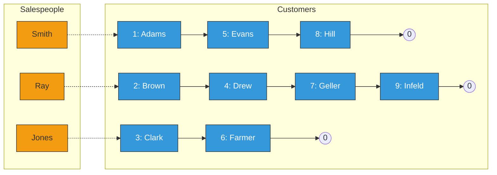

**Example for Ray**:
- Start at pointer 2 (Brown)
- Brown links to 4 (Drew)
- Drew links to 7 (Geller)
- Geller links to 9 (Infeld)
- Infeld links to 0 (end)
- Result: Ray's customers are Brown, Drew, Geller, Infeld

**Terminology**:
- **Pointer**: Element in one list pointing to element in DIFFERENT list
- **Link**: Element in a list pointing to element in SAME list

**Advantages**:
- Easy to get all customers for a salesperson
- Easy to insert new customers
- Easy to delete customers
- Efficient use of space

---

### 3. TREES

**Definition**: Data structure reflecting hierarchical relationships

**Also called**: Rooted tree graph

**Key Concept**: Parent-child relationships between elements

#### Example 1.4 - Record Structure

**Employee Personnel Record Contains**:
- Social Security Number
- Name
- Address
- Age
- Salary
- Dependents

**Hierarchical Breakdown**:

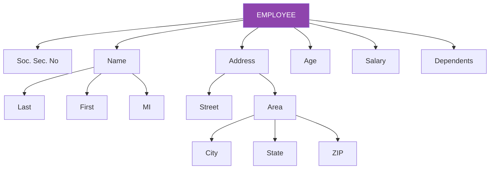

**Level Representation**:

```
01 Employee
  02 Social Security Number
  02 Name
    03 Last
    03 First
    03 Middle Initial
  02 Address
    03 Street
    03 Area
      04 City
      04 State
      04 ZIP
  02 Age
  02 Salary
  02 Dependents
```

**Understanding Levels**:
- Level 01: Root (Employee)
- Level 02: Main attributes
- Level 03: Sub-attributes
- Level 04: Sub-sub-attributes

#### Example 1.5 - Algebraic Expressions

**Expression**: (2x + y)(a - 7b)³

**Using symbols**:
- ↑ for exponentiation
- * for multiplication

**Tree Representation**:

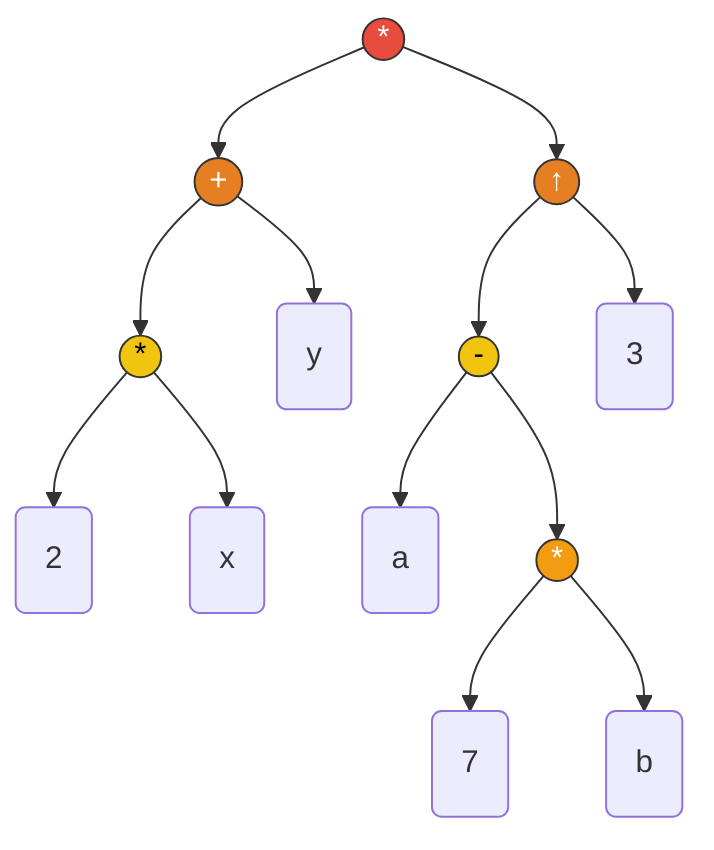

**Reading the tree**:
- Bottom operations execute first
- Top operations execute last
- This shows: 7*b first, then a-7b, then raise to power 3, then 2*x, then add y, finally multiply

**Order of operations**:
1. Multiply: 7 * b
2. Multiply: 2 * x
3. Add: 2x + y
4. Subtract: a - 7b
5. Exponentiate: (a-7b)³
6. Multiply: (2x + y) * (a-7b)³

---

### 4. OTHER DATA STRUCTURES

#### a) STACK (LIFO - Last In First Out)

**Definition**: Linear list where insertions and deletions happen only at one end (the TOP)

**Analogy**: Stack of dishes on a spring system

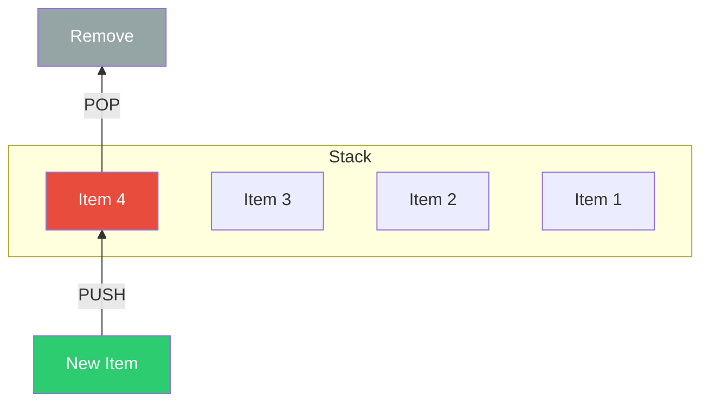

**Operations**:
- **Push**: Add item to top
- **Pop**: Remove item from top

**Real-world examples**:
- Stack of plates
- Browser back button history
- Undo operations in software

**Why called LIFO?**
- Last item inserted is first item removed
- Can't access items in the middle directly

#### b) QUEUE (FIFO - First In First Out)

**Definition**: Linear list where:
- Deletions happen at FRONT
- Insertions happen at REAR

**Analogy**: Line of people waiting for a bus

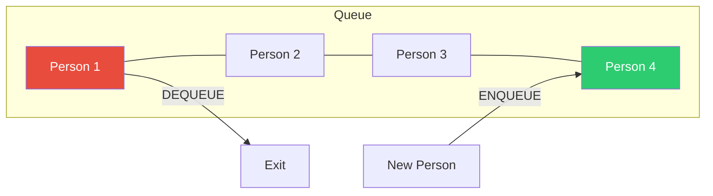

**Operations**:
- **Enqueue**: Add item to rear
- **Dequeue**: Remove item from front

**Real-world examples**:
- People waiting in line
- Cars at a traffic light
- Print job queue
- Customer service calls

**Why called FIFO?**
- First item inserted is first item removed
- Fair ordering (first come, first served)

#### c) GRAPH

**Definition**: Data structure reflecting relationships between pairs of elements (not necessarily hierarchical)

**Example**: Airline Flight Routes

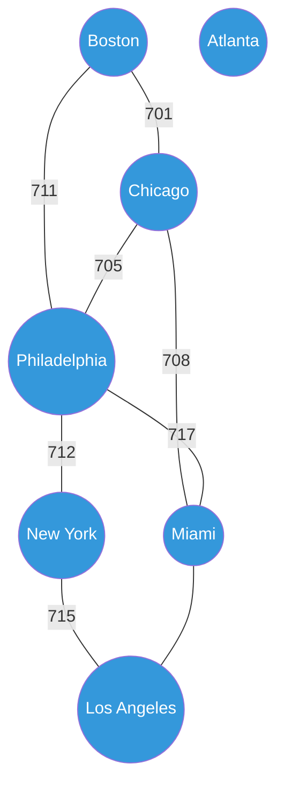

**Components**:
- **Nodes/Vertices**: Cities (Boston, Chicago, etc.)
- **Edges**: Flight routes (connections between cities)

**Characteristics**:
- No hierarchical structure (unlike trees)
- Can have cycles (can return to starting point)
- Multiple paths between nodes possible

**Applications**:
- Social networks (friends connections)
- Road maps
- Computer networks
- Recommendation systems

---

## 1.4 DATA STRUCTURE OPERATIONS

### Major Operations (Used Throughout This Text)

#### 1. TRAVERSING
**Definition**: Accessing each record exactly once so items can be processed

**Also called**: "Visiting" the record

**Example**: 
- Reading through entire customer list
- Processing each employee's salary

**Use case**: When you need to examine or process all data

#### 2. SEARCHING
**Definition**: Finding the location of:
- Record with a given key value, OR
- All records satisfying certain conditions

**Examples**:
- Find employee with Social Security Number 123-45-6789
- Find all students with GPA > 3.5

**Types**:
- Linear search (check each item)
- Binary search (faster, requires sorted data)

#### 3. INSERTING
**Definition**: Adding a new record to the structure

**Considerations**:
- Where to insert (beginning, end, specific position)?
- Maintain sorted order?
- Shift existing elements?

**Example**: Adding new customer to database

#### 4. DELETING
**Definition**: Removing a record from the structure

**Steps often involved**:
1. Search for the record
2. Remove it
3. Adjust structure (fill gaps, update links)

**Example**: Removing employee who left company

**Note**: Sometimes multiple operations are combined
- Example: Delete record with specific key = SEARCH + DELETE

### Special Operations

#### 5. SORTING
**Definition**: Arranging records in logical order

**Common orderings**:
- Alphabetical (by NAME)
- Numerical (by ID, date, salary)
- Ascending or descending

**Examples**:
- Sort students by name
- Sort transactions by date
- Sort products by price

**Importance**: Makes searching faster (enables binary search)

#### 6. MERGING
**Definition**: Combining records from two sorted files into one sorted file

**Requirements**:
- Both input files must be sorted
- Output file maintains sorted order

**Example**: 
- Merge January sales (sorted) with February sales (sorted) into Q1 sales (sorted)

### Example 1.6 - Operations on Membership File

**File Contains** (for each member):
- Name
- Address
- Telephone Number
- Age
- Sex

**Operation Examples**:

**(a) Mailing Announcement**
- **Operation**: TRAVERSING
- **Purpose**: Get Name and Address for each member
- **Process**: Visit each record, extract needed fields

**(b) Find Members in Specific Area**
- **Operation**: TRAVERSING
- **Purpose**: Get data for members in certain area
- **Process**: Visit each record, check area, collect matches

**(c) Find Address for Given Name**
- **Operation**: SEARCHING
- **Purpose**: Locate specific member's record
- **Process**: Search until Name matches

**(d) New Person Joins**
- **Operation**: INSERTING
- **Purpose**: Add new member record
- **Process**: Create record with all fields, add to file

**(e) Member Dies**
- **Operation**: DELETING
- **Purpose**: Remove member's record
- **Process**: Find record, remove it

**(f) Member Moves (Update)**
- **Operations**: SEARCHING + UPDATE
- **Purpose**: Change address and phone number
- **Process**:
  1. Search for member by Name
  2. Update address field
  3. Update telephone field

**(g) Count Members 65 or Older**
- **Operation**: TRAVERSING
- **Purpose**: Count specific subset
- **Process**: Visit each record, check age, count if ≥ 65

---

## 1.5 ABSTRACT DATA TYPES (ADT)

### What is an ADT?

**Abstract Data Type (ADT)** = A set of:
1. Data values
2. Associated operations
3. Specified accurately
4. Independent of any particular implementation

**Key Principle**: **WHAT** it does, not **HOW** it does it

**Analogy**: Like a TV remote
- You know WHAT each button does (volume up, channel change)
- You don't need to know HOW it sends signals to TV

### ADT Characteristics

**What you know**:
- What operations are available
- What each operation does
- What input/output each operation has

**What is hidden**:
- How data is actually stored
- How operations are implemented
- Internal data structures used

### Example 1.7 - List Representation

**Given**: List L = {1, 2, 3, 4, 5, 6, 7, 8, 9}

**Four possible implementations**:

**a) Linear List**:
```
[1] [2] [3] [4] [5] [6] [7] [8] [9]
```

**b) Matrix (3×3)**:
```
1  2  3
4  5  6
7  8  9
```

**c) Tree**:
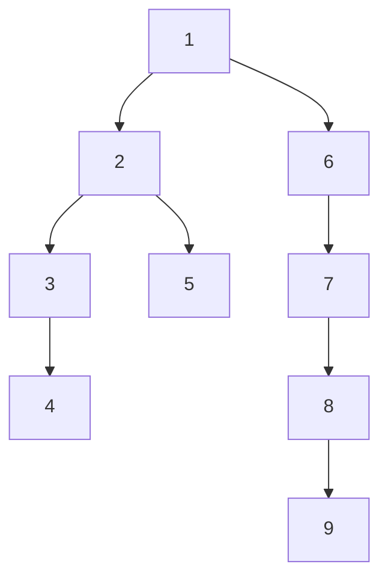

**d) Graph**:
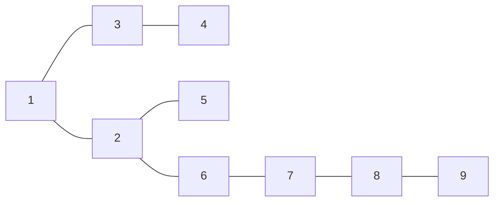

**ADT Principle Applied**:
- Users interact with "the list"
- Users can insert, retrieve, delete items
- Users DON'T need to know if it's stored as array, tree, graph, etc.
- Implementation can change without affecting users

### Example 1.8 - Shop Customer Queue

**Scenario**: 
- Shop has customers
- Shop has sales assistants
- Need to determine optimal number of assistants

**Problem**: Need to simulate waiting line (queue)

**Challenge**: Queues aren't built into most programming languages

**Two Approaches**:

**Approach 1**: Write specific program for shop
- Implements queue for this one problem
- Not reusable
- Time-consuming

**Approach 2**: Create Queue ADT (BETTER!)
- Build general-purpose queue
- Define operations:
  - Enqueue (add customer)
  - Dequeue (serve customer)
  - IsEmpty (check if queue empty)
  - Size (count waiting customers)
- Use this ADT for shop simulation
- Can reuse ADT for ANY queue problem

**Benefits of Approach 2**:
- Faster development
- Focus on shop logic, not queue mechanics
- Reusable for other projects
- Easier to maintain

### ADT Model Structure

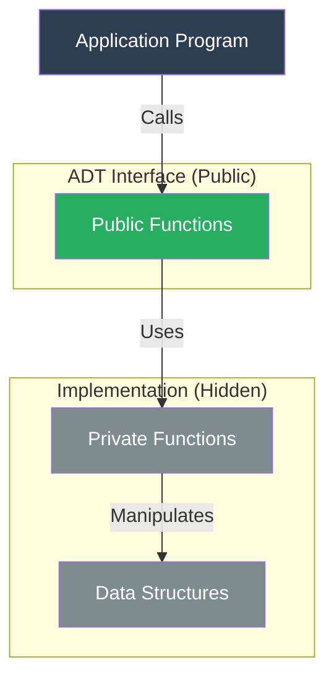

**Model Components**:

1. **Application Program**:
   - Uses the ADT
   - Only sees public interface
   - Cannot access data structures directly

2. **Public Functions**:
   - Available to application
   - Define what ADT can do
   - Examples: insert(), delete(), search()

3. **Private Functions**:
   - Used internally by public functions
   - Not visible to application
   - Helper functions

4. **Data Structures**:
   - How data is actually stored
   - Hidden from application
   - Can be changed without affecting application

### ADT Principles

**Encapsulation**: 
- Bundle data and operations together
- Hide internal details

**Information Hiding**:
- Application can't see how data is stored
- Application can't directly manipulate data structures
- Must use provided operations

**Multiple Instances**:
- Can create multiple versions of same ADT
- Each operates independently
- Example: Have two different queues at same time

**Implementation Independence**:
- Can change internal implementation
- Application code doesn't need to change
- Example: Switch from array to linked list internally

### Common ADT Implementations

**Array-based**:
- Fixed size
- Fast access
- Difficult to insert/delete

**Linked List-based**:
- Dynamic size
- Slower access
- Easy to insert/delete

**Key Point**: User doesn't need to know which is used!

---

## 1.6 ALGORITHMS: COMPLEXITY, TIME-SPACE TRADEOFF

### What is an Algorithm?

**Algorithm** = Well-defined list of steps for solving a particular problem

**Characteristics of good algorithm**:
- Clear steps
- Finite (terminates)
- Correct (produces right answer)
- Efficient (uses reasonable time/space)

### Algorithm Efficiency

**Two major measures**:

1. **Time Complexity**: How long does it take?
2. **Space Complexity**: How much memory does it use?

**Complexity Function**: 
- Written as f(n)
- n = input size
- f(n) = resources needed (time or space)

### Searching Algorithms Comparison

**Scenario**: Membership file with Name and Telephone Number
**Task**: Given Name, find Telephone Number

#### LINEAR SEARCH

**Algorithm**:

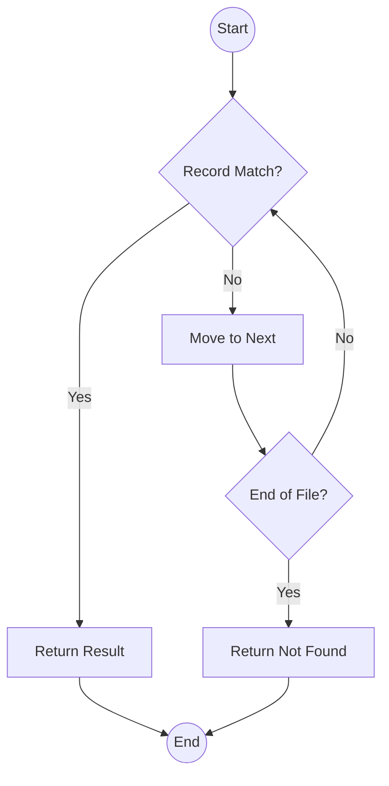

**Complexity Analysis**:
- Best case: Item is first (1 comparison)
- Worst case: Item is last or not present (n comparisons)
- Average case: n/2 comparisons

**Formula**: C(n) = n/2

**Example**:
- File with 1000 names
- Average: 500 comparisons
- Slow for large files!

**Advantages**:
- Simple to implement
- Works on unsorted data
- Works on any data structure

**Disadvantages**:
- Very slow for large datasets
- Inefficient

#### BINARY SEARCH

**Requirement**: Data must be sorted alphabetically

**Algorithm**:

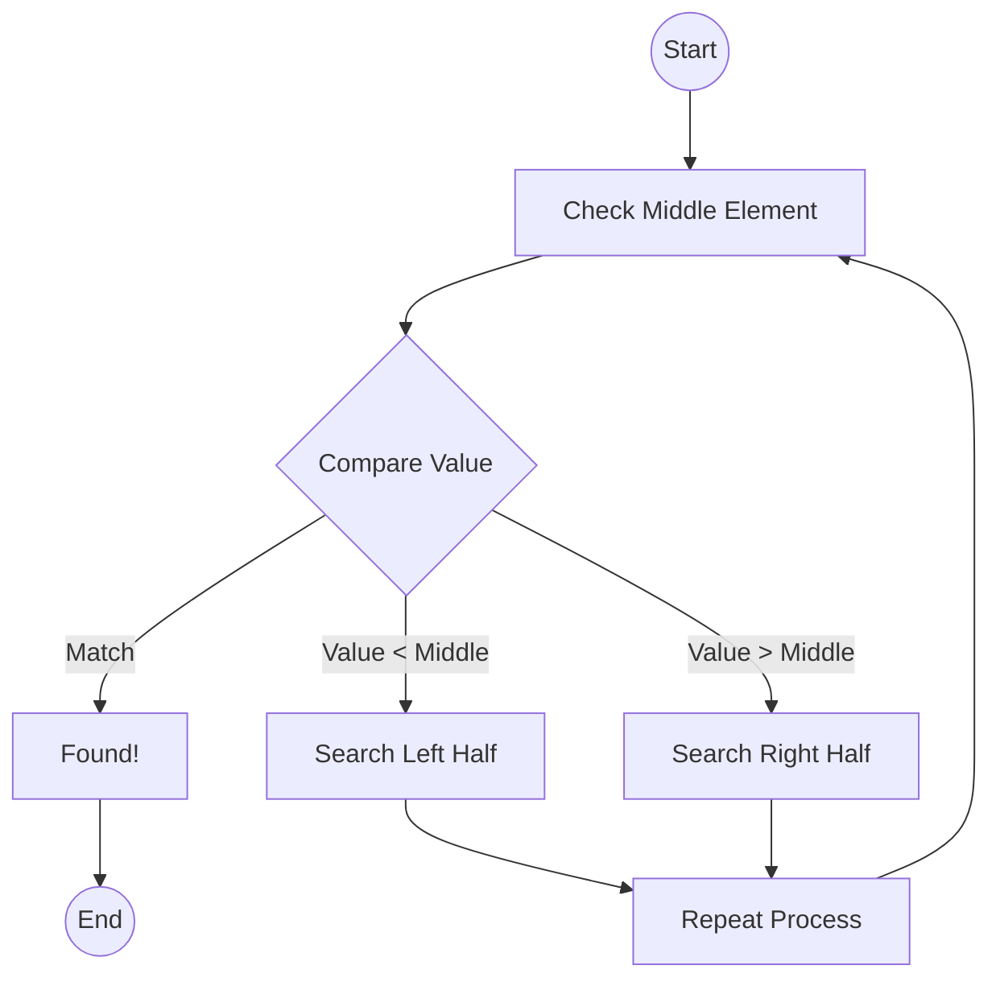

**Example with 8 names** (sorted):
```
[Adams, Brown, Clark, Davis, Evans, Gold, Hill, Jones]
```

Looking for "Gold":
1. Check middle (Davis) - Gold > Davis, go right
2. Check middle of right half (Gold) - Found!

**Complexity Analysis**:
- Divides problem in half each time
- Formula: C(n) = log₂ n

**Comparison**:

| File Size | Linear Search | Binary Search |
|-----------|---------------|---------------|
| 1,000     | 500          | 10            |
| 10,000    | 5,000        | 14            |
| 25,000    | 12,500       | 15            |
| 1,000,000 | 500,000      | 20            |

**Huge difference** as n grows!

**Advantages**:
- Extremely fast
- Efficient for large datasets

**Disadvantages**:
- Requires sorted data
- Requires direct access (like arrays)
- Doesn't work well with linked lists
- Inserting/deleting requires shifting elements

### When to Use Which?

**Use Linear Search when**:
- Data is unsorted
- Data is in linked list
- Small dataset
- Frequent insertions/deletions

**Use Binary Search when**:
- Data is sorted
- Data is in array
- Large dataset
- Rare insertions/deletions
- Searching is frequent operation

### Real-World Example: Telephone Directory

**Telephone Company's Solution**:
- Print new directory yearly (sorted)
- Keep separate temporary file for new customers
- Update once per year
- Binary search works great because:
  - Updates are infrequent
  - Searches are very frequent

**Bank's Needs**:
- Must add customers instantly
- Can't wait yearly for updates
- Linearly sorted list might not be best choice
- Might use different data structure (tree, hash table)

---

## TIME-SPACE TRADEOFF

**Concept**: Trade memory space for faster processing time (or vice versa)

### Example: Dual Key Access

**Scenario**: File with records containing:
- Name
- Social Security Number
- Additional information

**Need**: Search by EITHER Name OR Social Security Number quickly

#### Problem Analysis

**Option 1**: Sort by Name
- Fast name search (binary)
- Slow SSN search (linear)

**Option 2**: Sort by SSN
- Fast SSN search (binary)
- Slow name search (linear)

**Dilemma**: Can't sort by both simultaneously in one file!

#### Solution 1: Two Complete Files

**Implementation**:
- File A: Sorted by Name
- File B: Sorted by SSN (same data)

**Advantage**: Fast search on both keys

**Disadvantage**: **2x space required** - expensive!

#### Solution 2: Main File + Auxiliary Array (BETTER!)

**Implementation**:

```mermaid
graph LR
    subgraph "Auxiliary Array (Sorted by Name)"
        A1[Abbey, Gregory] -->|Pointer| R2
        A2[Brown, John] -->|Pointer| R4
        A3[Davis, Earl] -->|Pointer| R1
        A4[Lane, Alice] -->|Pointer| R3
        A5[Smith, Mary] -->|Pointer| R5
    end

    subgraph "Main File (Sorted by SSN)"
        R1[Rec 1: 013-44... | Davis, Earl]
        R2[Rec 2: 025-55... | Abbey, Gregory]
        R3[Rec 3: 027-73... | Lane, Alice]
        R4[Rec 4: 174-62... | Brown, John]
        R5[Rec 5: 182-74... | Smith, Mary]
    end

    style A1 fill:#f1c40f,stroke:#333
    style A2 fill:#f1c40f,stroke:#333
    style A3 fill:#f1c40f,stroke:#333
    style A4 fill:#f1c40f,stroke:#333
    style A5 fill:#f1c40f,stroke:#333
    
    style R1 fill:#3498db,color:#fff
    style R2 fill:#3498db,color:#fff
    style R3 fill:#3498db,color:#fff
    style R4 fill:#3498db,color:#fff
    style R5 fill:#3498db,color:#fff
```

**How it works**:

**Search by Name**:
1. Binary search auxiliary array for name
2. Get pointer to main file location
3. Access record directly

**Search by SSN**:
1. Binary search main file directly

**Advantages**:
- Fast search on both keys
- Minimal extra space (only 2 columns)
- Much better than full duplicate file

**Space Analysis**:
- Main file: Full records
- Auxiliary: Only Name + Pointer (small integers)
- Total extra space: Minimal

**This is the tradeoff**:
- Small amount of extra space
- Large gain in search speed

### Hashing: Another Approach

**Concept**: Use SSN as memory address

**Hashing Function H**:
- Input: Social Security Number (key)
- Output: Memory address

**Example**:
```
SSN 123-45-6789 → H(123456789) → Address 4521
```

**Advantages**:
- Instant access (no search needed!)
- No data movement when inserting

**Problems**:
- Would need 1 billion memory locations for all possible SSNs
- Most locations would be empty (sparse)
- Huge waste of space

**Solution**: Use hash function that maps to smaller address space
- Covered in detail in Chapter 9
- Handles collisions (multiple keys → same address)
- Much more practical

---

## SOLVED PROBLEMS

### Basic Terminology

#### Problem 1.1
**Given**: Professor's class list with:
- Name
- Major
- Student Number
- Test Scores
- Final Grade

**Questions**:
(a) State entities, attributes, and entity set
(b) Describe field values, records, and file
(c) Which attributes can serve as primary keys?

**Solution**:

**(a) Entities, Attributes, Entity Set**:
- **Entity**: Each individual student
- **Attributes**: Name, Major, Student Number, Test Scores, Final Grade
- **Entity Set**: Collection of all students in the class

**(b) Field Values, Records, File**:
- **Field Values**: Actual data
  - Example: "John Smith", "Computer Science", "12345", "85, 90, 92", "A"
- **Record**: All field values for one student
  - Example: One row containing all of John Smith's data
- **File**: Collection of all student records (all rows)

**(c) Primary Keys**:
- **Name**: Can serve as primary key (assuming no duplicate names)
- **Student Number**: Can serve as primary key (unique for each student)
- **Note**: Student Number is better choice because:
  - Guaranteed unique
  - Two students might have same name

#### Problem 1.2
**Given**: Hospital patient file with:
- Name
- Admission Date
- Social Security Number
- Room
- Bed Number
- Doctor

**Questions**:
(a) Which items can serve as primary keys?
(b) Which pair of items can serve as primary key?
(c) Which items can be group items?

**Solution**:

**(a) Single-field Primary Keys**:
- **Name**: Yes (assuming no two patients have same name)
- **Social Security Number**: Yes (unique for each person)

**(b) Combination Primary Key**:
- **Room + Bed Number**: Together uniquely identify patient
  - Example: Room 305, Bed 2
  - No two patients in same room and bed simultaneously

**(c) Group Items**:
- **Name**: Can be divided into First, Middle, Last
- **Admission Date**: Can be divided into Day, Month, Year
- **Doctor**: Can be divided into First Name, Last Name, Title

#### Problem 1.3
**Question**: Which data items may lead to variable-length records?
(a) age
(b) sex
(c) name of spouse
(d) names of children
(e) education
(f) previous employers

**Solution**:

**Variable-length items**:

**(d) Names of children**:
- Some people have 0 children
- Some have 1, 2, 3, or more
- Length varies greatly

**(f) Previous employers**:
- Some people have 1 previous employer
- Some have many
- Some have none

**(e) Education** (possibly):
- If recording all degrees and certifications: variable
- If recording only highest level: fixed length

**Fixed-length items**:
- (a) Age: Always a number (1-3 digits)
- (b) Sex: Single character or fixed code
- (c) Name of spouse: Fixed field (even if empty)

#### Problem 1.4
**Question**: Why are database systems only briefly covered in this text?

**Solution**:

**Database systems** = Data stored in **secondary (external) memory**

**This text focuses on**: Data in **main (primary) memory**

**Why the difference matters**:
- **Implementation** is very different
- **Analysis** is very different
- **Access patterns** differ
- **Storage methods** differ

**Main Memory**:
- Fast access
- Direct access to any location
- Limited size
- Focus of this textbook

**Secondary Memory (Databases)**:
- Slower access
- Sequential or indexed access
- Very large capacity
- Separate subject (Database Management)
- Beyond scope of this text

---

### Data Structures and Operations

#### Problem 1.5
**Question**: Give brief description of:
(a) Traversing
(b) Sorting
(c) Searching

**Solution**:

**(a) Traversing**:
- **Definition**: Accessing and processing each record exactly once
- **Purpose**: Examine or modify all data
- **Example**: Print all employee names

**(b) Sorting**:
- **Definition**: Arranging data in some given order
- **Orders**: Alphabetical, numerical, ascending, descending
- **Example**: Sort students by GPA

**(c) Searching**:
- **Definition**: Finding location of record with given key(s)
- **Purpose**: Locate specific data
- **Example**: Find employee with ID 12345

#### Problem 1.6
**Question**: Give brief description of:
(a) Inserting
(b) Deleting

**Solution**:

**(a) Inserting**:
- **Definition**: Adding a new record to data structure
- **Considerations**: 
  - Where to place it?
  - Maintain ordering?
  - Shift other elements?
- **Example**: Add new customer to database

**(b) Deleting**:
- **Definition**: Removing a particular record from structure
- **Steps**:
  1. Find the record
  2. Remove it
  3. Adjust structure (fill gap, update links)
- **Example**: Remove cancelled order

#### Problem 1.7
**Given**: Linear array NAME (sorted alphabetically)

```
Index | NAME
------|----------
1     | Adam
2     | Clark
3     | Evans
4     | Gupta
5     | Jones
6     | Lane
7     | Pace
8     | Smith
```

**Questions**:
(a) Find NAME[2], NAME[4], NAME[7]
(b) If Davis is inserted, how many names move?
(c) If Gupta is deleted, how many names move?

**Solution**:

**(a) Array Access**:
- NAME[2] = Clark (2nd position)
- NAME[4] = Gupta (4th position)
- NAME[7] = Pace (7th position)

**(b) Inserting Davis**:

**Current alphabetical position**: Davis comes between Clark and Evans

**Steps**:
1. Davis should be at position 3
2. Need to shift: Evans, Gupta, Jones, Lane, Pace, Smith
3. Move them from positions 3-8 to positions 4-9

**Result after insertion**:
```
1: Adam
2: Clark
3: Davis ← NEW
4: Evans (was 3)
5: Gupta (was 4)
6: Jones (was 5)
7: Lane (was 6)
8: Pace (was 7)
9: Smith (was 8)
```

**Answer**: **6 names** must be moved

**(c) Deleting Gupta**:

**Current position**: Gupta is at position 4

**Steps**:
1. Remove Gupta from position 4
2. Need to shift: Jones, Lane, Pace, Smith UP
3. Move them from positions 5-8 to positions 4-7

**Result after deletion**:
```
1: Adam
2: Clark
3: Evans
4: Jones (was 5)
5: Lane (was 6)
6: Pace (was 7)
7: Smith (was 8)
```

**Answer**: **4 names** must be moved

**Important Note**: 
- Arrays require shifting elements for insert/delete
- This is expensive for large arrays
- Linked lists handle this better

#### Problem 1.8
**Given**: Linear array NAME with FIRST pointer and LINK values

```
FIRST = 5

Index | NAME    | LINK
------|---------|------
1     | Rogers  | 7
2     | Clark   | 8
3     | (empty) | 
4     | Hansen  | 10
5     | Brooks  | 2
6     | Pitt    | 1
7     | Walker  | 0
8     | Fisher  | 4
10    | Leary   | 6
```

**Question**: Find the linear ordering of names

**Solution**:

**Following the links**:

1. **FIRST = 5** → Start at NAME[5] = **Brooks**
2. **LINK[5] = 2** → Next is NAME[2] = **Clark**
3. **LINK[2] = 8** → Next is NAME[8] = **Fisher**
4. **LINK[8] = 4** → Next is NAME[4] = **Hansen**
5. **LINK[4] = 10** → Next is NAME[10] = **Leary**
6. **LINK[10] = 6** → Next is NAME[6] = **Pitt**
7. **LINK[6] = 1** → Next is NAME[1] = **Rogers**
8. **LINK[1] = 7** → Next is NAME[7] = **Walker**
9. **LINK[7] = 0** → End of list (0 indicates end)

**Linear ordering**: 
**Brooks → Clark → Fisher → Hansen → Leary → Pitt → Rogers → Walker**

**Observation**: This is alphabetical order!

**Key Points**:
- Physical order in array doesn't matter
- Logical order determined by links
- This is a **linked list** structure
- Easy to insert/delete without moving elements
- Just change link values

#### Problem 1.9
**Given**: Algebraic expression (7x + y)(5a - b)³

**Questions**:
(a) Draw tree diagram
(b) Find scope of exponential operation

**Solution**:

**(a) Tree Diagram**:

Using symbols: ↑ for exponentiation, * for multiplication

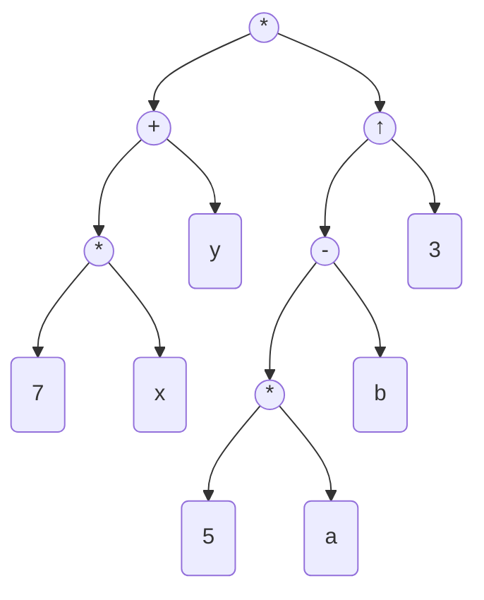

**Reading the tree**:
- Leaf nodes (bottom): 7, x, y, 5, a, b, 3
- Operations build up from bottom to top
- Root operation (top) executes last

**(b) Scope of Exponentiation (↑)**:

**Definition of Scope**: The subtree consisting of the node and all nodes following it

**Scope of ↑ (circled in diagram)**:
```
         ↑
        / \
       /   \
      -     3
     / \
    *   b
   / \
  5   a
```

**Algebraic expression of scope**: (5a - b)³

**This represents**:
- The subtraction: 5a - b
- Raised to power 3
- Everything that depends on the exponentiation operation

#### Problem 1.10
**Given**: Tree structure with level numbers

```
01 Employee
  02 Name
  02 Number
  02 Hours
    03 Regular
    03 Overtime
  02 Rate
```

**Question**: Draw the tree diagram

**Solution**:

**Understanding levels**:
- 01 = Root level
- 02 = Children of root
- 03 = Children of level 02 nodes

**Tree Diagram**:

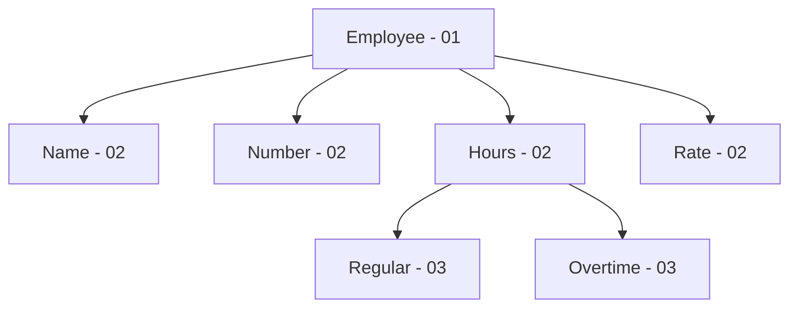

**Reading the structure**:
- **Employee** has 4 main attributes
- **Hours** is subdivided into Regular and Overtime
- **Name**, **Number**, **Rate** are elementary (not subdivided)

**Rule for drawing**:
- Each node is child of the preceding node with lower level number
- Same level = siblings
- Higher level = parent
- Lower level = children

#### Problem 1.11
**Question**: Stack or Queue for each situation?

(a) Batch computer programs submitted to computer center
(b) Program A calls subprogram B which calls subprogram C
(c) Employees have seniority system for hiring/firing

**Solution**:

**(a) Batch Programs → QUEUE**

**Reason**: First Come, First Served (FIFO)
- Program submitted first should run first
- Fair ordering
- No priority (unless specified)

**Example**:
```
[Prog1] [Prog2] [Prog3] [Prog4]
  ↑                        ↑
exits                  enters
```

**(b) Subprogram Calls → STACK**

**Reason**: Last In, First Out (LIFO)
- Last called executes first
- Must return to caller when done
- Nested structure

**Example**:
```
Program A calls B
  B calls C
    C executes (LAST called, FIRST executed)
    C returns to B
  B executes
  B returns to A
A continues
```

**Stack representation**:
```
| C | ← TOP (execute first)
| B |
| A |
```

**(c) Seniority System → STACK**

**Reason**: Last Hired, First Fired (LIFO)
- Most recent hire laid off first
- Senior employees protected
- Reverse of hiring order

**Example**:
```
Hired: Alice (2020), Bob (2021), Carol (2022)
Fire order: Carol, Bob, Alice
```

**Stack representation**:
```
| Carol | ← TOP (most recent, fired first)
| Bob   |
| Alice | ← BOTTOM (senior, fired last)
```

#### Problem 1.12
**Given**: Daily flights of airline company

```
CITY:
1 = Atlanta
2 = Boston
3 = Chicago
4 = Miami
5 = Philadelphia

FLIGHTS:
Number | Origin | Destination
-------|--------|------------
701    | 2      | 3
702    | 3      | 2
705    | 5      | 3
708    | 3      | 4
711    | 2      | 5
712    | 5      | 2
713    | 5      | 1
715    | 1      | 4
717    | 5      | 4
718    | 4      | 5
```

**Question**: Draw directed graph

**Solution**:

**Graph Representation**:

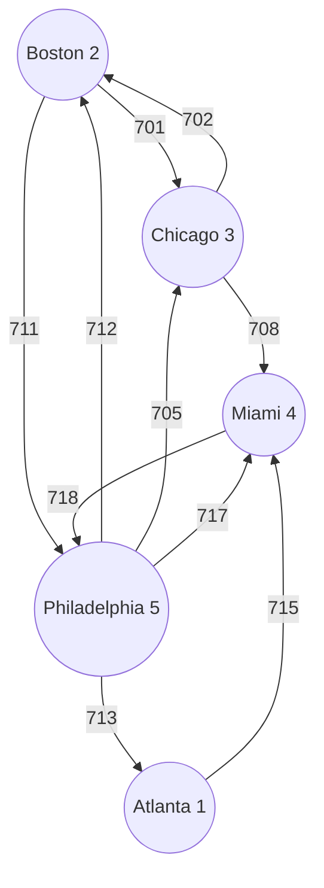

**Detailed connections**:

**From Boston (2)**:
- 701 → Chicago (3)
- 711 → Philadelphia (5)

**From Chicago (3)**:
- 702 → Boston (2)
- 708 → Miami (4)

**From Philadelphia (5)**:
- 705 → Chicago (3)
- 712 → Boston (2)
- 713 → Atlanta (1)
- 717 → Miami (4)

**From Atlanta (1)**:
- 715 → Miami (4)

**From Miami (4)**:
- 718 → Philadelphia (5)

**Graph Properties**:
- **Directed**: Arrows show one-way flights
- **Nodes**: 5 cities
- **Edges**: 10 flights
- **Cycles exist**: Can return to starting city
  - Example: Boston → Philadelphia → Boston (711, 712)
- **Not fully connected**: Not all city pairs have direct flights

---

### Complexity and Space-Time Tradeoffs

#### Problem 1.13
**Question**: Briefly describe:
(a) Complexity of an algorithm
(b) Space-time tradeoff

**Solution**:

**(a) Complexity of an Algorithm**:

**Definition**: Function f(n) that measures time and/or space used by algorithm in terms of input size n

**Components**:
- **n** = input size (number of elements)
- **f(n)** = resources needed

**Types**:
- **Time Complexity**: How long algorithm takes
- **Space Complexity**: How much memory algorithm uses

**Examples**:
- Linear search: f(n) = n/2
- Binary search: f(n) = log₂ n
- Bubble sort: f(n) = n²

**Why important**:
- Compare different algorithms
- Predict performance on large datasets
- Choose best algorithm for situation

**(b) Space-Time Tradeoff**:

**Definition**: Choice between algorithmic solutions where:
- Increasing space → Decreases time
- OR decreasing space → Increases time

**Can't optimize both simultaneously**!

**Example 1**: Caching
- Use more memory to store frequently accessed data
- Results in faster access (less computation)

**Example 2**: Compression
- Use less storage space
- Requires more time to compress/decompress

**Example 3**: Lookup tables
- Store precomputed results (more space)
- Faster than computing each time

**Decision factors**:
- Available memory
- Speed requirements
- Cost of memory vs. processing
- Frequency of operations

#### Problem 1.14
**Given**: Dataset S with n elements

**Questions**:
(a) Compare running times of linear vs. binary search for:
    (i) n = 1,000
    (ii) n = 10,000
(b) Discuss searching when S is stored as linked list

**Solution**:

**(a) Comparing Search Times**:

**Formulas**:
- Linear search: T₁ = n/2
- Binary search: T₂ = log₂ n

**(i) For n = 1,000**:
- **Linear**: T₁ = 1000/2 = **500 comparisons**
- **Binary**: T₂ = log₂ 1000 ≈ **10 comparisons**
- **Difference**: Binary is **50× faster**!

**(ii) For n = 10,000**:
- **Linear**: T₁ = 10000/2 = **5,000 comparisons**
- **Binary**: T₂ = log₂ 10000 ≈ **14 comparisons**
- **Difference**: Binary is **357× faster**!

**Observation**:
- As n increases, binary search advantage grows dramatically
- Linear grows proportionally with n
- Binary grows very slowly (logarithmically)

**Table**:
```
n        | Linear  | Binary | Speed Ratio
---------|---------|--------|------------
1,000    | 500     | 10     | 50×
10,000   | 5,000   | 14     | 357×
100,000  | 50,000  | 17     | 2,941×
```

**(b) Searching in Linked List**:

**Problem**: Binary search requires **direct access** to middle element

**Linked list limitation**:
- Can only access elements sequentially
- No direct access to middle
- Must traverse from beginning

**Example - Finding middle of 1000 elements**:
```
[1] → [2] → [3] → ... → [500] → ... → [1000]
 ↑                        ↑
start              must traverse 500 links
```

**Consequences**:
- Binary search **cannot work efficiently** on linked lists
- Must use **linear search** instead
- Lose the speed advantage of binary search

**Tradeoff**:
- **Array**: 
  - Fast search (binary)
  - Slow insert/delete (shift elements)
- **Linked list**: 
  - Slow search (linear only)
  - Fast insert/delete (change pointers)

**Choose based on usage**:
- **Frequent searching, rare updates** → Use array
- **Frequent updates, rare searching** → Use linked list

#### Problem 1.15
**Given**: Airline flight data (from Problem 1.12)

**Questions**: Discuss storage methods to decrease time for:
(a) Find origin and destination given flight number
(b) Find flight number given origin and destination cities

**Solution**:

**(a) Given Flight Number → Find Origin and Destination**

**Optimal Storage**: Arrays indexed by flight number

**Structure**:
- ORIG[flight_number] = origin_city
- DEST[flight_number] = destination_city

**Access method**:
- Given flight_number = 705
- origin = ORIG[705] = 5 (Philadelphia)
- destination = DEST[705] = 3 (Chicago)

**Advantages**:
- **O(1) access time** (instant/constant time)
- Direct array indexing
- No searching needed

**Disadvantages**:
- Wastes space if flight numbers are sparse
- Example: If flights are 701, 705, 850, need array size 850

**(b) Given Cities → Find Flight Number**

**Optimal Storage**: 2D array (matrix)

**Structure**:
- FLIGHT[origin_city][destination_city] = flight_number

**Example**:
```
FLIGHT array (rows = origin, columns = destination):

To:    1(ATL) 2(BOS) 3(CHI) 4(MIA) 5(PHI)
From:
1(ATL)   0      0      0      715     0
2(BOS)   0      0      701    0       711
3(CHI)   0      702    0      708     0
4(MIA)   0      0      0      0       718
5(PHI)   713    712    705    717     0
```

**Access method**:
- Given: origin = Boston (2), destination = Chicago (3)
- flight = FLIGHT[2][3] = 701

**Reading the table**:
- 0 = No direct flight
- Number = Flight number for that route

**Advantages**:
- **O(1) access time** (instant)
- Direct matrix indexing
- Easy to check if route exists

**Disadvantages**:
- Wastes space if few routes (sparse matrix)
- Size = (number of cities)²
- Many zeros if airline doesn't serve all routes

#### Problem 1.16
**Question**: Discuss drawbacks to representations in Problem 1.15 when airline serves n cities with s flights
- (a) Using arrays for flight number lookup
- (b) Using matrix for city-pair lookup

**Solution**:

**(a) Drawbacks of Array for Flight Number Lookup**:

**Problem**: **Sparse array** if flight numbers are spread out

**Example scenario**:
```
Flight numbers: 100, 250, 500, 750, 999
Number of flights (s): 5
Array size needed: 1000
Ratio s/n: 5/1000 = 0.005 (0.5%)
```

**Memory waste**:
- Need 1000 memory locations
- Only 5 actually used
- 995 locations wasted (99.5% waste!)

**When it's a problem**:
- Ratio s/array_size < 0.05 (less than 5% utilization)
- Large gaps between flight numbers
- Flight numbers use different ranges

**Cost consideration**:
- Memory is not free
- Wasted space costs money
- Not worth it for sparse data

**Better alternative for sparse data**:
- Use hash table
- Use associative array/dictionary
- Store only existing flight numbers

**(b) Drawbacks of Matrix for City-Pair Lookup**:

**Problem**: **Sparse matrix** if few routes compared to possible routes

**Example scenario**:
```
Number of cities (n): 50
Possible routes: n² = 50 × 50 = 2,500
Actual flights (s): 75
Ratio s/n²: 75/2500 = 0.03 (3%)
```

**Memory waste**:
- Need 2,500 memory locations
- Only 75 have actual flights
- 2,425 locations contain zeros (97% waste!)

**When it's a problem**:
- Ratio s/n² < 0.05 (less than 5% utilization)
- Airline doesn't serve all city pairs
- Hub-and-spoke model (not point-to-point)

**Real-world example**:
```
United Airlines:
- Serves: ~350 destinations
- Matrix size: 350² = 122,500
- Actual routes: ~4,000
- Utilization: 3.3%
- Waste: 96.7%!
```

**Better alternative for sparse matrix**:
- Adjacency list (only store existing connections)
- Hash table of routes
- Separate list of flights

**Memory comparison**:
```
Matrix storage:
- Space: O(n²)
- Access: O(1)

Adjacency list:
- Space: O(s) where s = actual flights
- Access: O(degree of node)
```

**Decision guideline**:
- **Dense connections (>20%)**: Use matrix
- **Sparse connections (<5%)**: Use list/hash table
- **In between**: Consider access patterns

#### Problem 1.17
**Question**: List examples of linear data structures

**Solution**:

**Linear Data Structures**:

1. **Arrays**
   - Elements in contiguous sequence
   - Fixed size
   - Direct access by index
   ```
   [10] [20] [30] [40] [50]
   ```

2. **Linked Lists**
   - Elements connected by pointers
   - Dynamic size
   - Sequential access
   ```
   [10|•]→[20|•]→[30|•]→[40|•]→[50|NULL]
   ```

3. **Stacks**
   - LIFO (Last In, First Out)
   - Operations at one end (top)
   - Push and Pop operations
   ```
   | 50 | ← TOP
   | 40 |
   | 30 |
   | 20 |
   | 10 |
   ```

4. **Queues**
   - FIFO (First In, First Out)
   - Insert at rear, delete at front
   - Enqueue and Dequeue operations
   ```
   FRONT → [10][20][30][40][50] ← REAR
   ```

**Common characteristics**:
- Elements form a sequence
- Each element (except first/last) has exactly one predecessor and one successor
- Can traverse elements one by one
- Linear relationship between elements

**Contrast with non-linear**:
- Trees: hierarchical (one-to-many)
- Graphs: networked (many-to-many)

#### Problem 1.18
**Question**: Define Abstract Data Type. Explain briefly.

**Solution**:

**Abstract Data Type (ADT) Definition**:

An ADT is a **data declaration packaged together with the operations** that are meaningful for the data type. It **encapsulates** the data and operations, then **hides** them from the user.

**Key Components**:

1. **Data Values**: What the ADT stores

2. **Operations**: What you can do with the data

3. **Specification**: Clear definition of behavior

4. **Implementation Hiding**: User doesn't see internal details

**Explanation**:

**What user sees** (Interface):
```
Stack ADT:
- push(item): Add item to top
- pop(): Remove and return top item
- peek(): View top item without removing
- isEmpty(): Check if stack is empty
```

**What user DOESN'T see** (Implementation):
- Is it using an array or linked list?
- How is memory managed?
- What are the internal variables?

**Analogy**: Car
- **Interface**: Steering wheel, pedals, gear shift
- **Hidden**: Engine mechanics, fuel injection, transmission details
- You can drive without knowing how engine works!

**Benefits**:

1. **Separation of concerns**:
   - User focuses on WHAT operations do
   - Implementer focuses on HOW they work

2. **Implementation independence**:
   - Can change internal implementation
   - User code doesn't need to change
   - Example: Switch from array to linked list

3. **Reusability**:
   - Same ADT can be used in many programs
   - Don't rewrite basic structures

4. **Maintainability**:
   - Fix bugs without affecting users
   - Improve performance without changing interface

**Example - Queue ADT**:

```
Public Interface (what user uses):
- enqueue(item)
- dequeue()
- size()
- isEmpty()

Hidden Implementation (user doesn't see):
- Internal array or linked list
- Front and rear pointers
- Memory management
- Resize operations
```

**Important principle**:
> "Tell me WHAT you do, not HOW you do it"

This allows flexibility, maintainability, and proper software engineering!

---

## MULTIPLE CHOICE QUESTIONS

### Questions

**1.1** _____ refers to a single unit of values.
- (a) Group item
- (b) Data item
- (c) Elementary item
- (d) Basic item

**1.2** A _____ is something that has certain attributes or properties which may be assigned values.
- (a) Field
- (b) Record
- (c) Entity
- (d) File

**1.3** _____ is the collection of records of the entities in a given entity set.
- (a) Field
- (b) Record
- (c) Entity
- (d) File

**1.4** The value in a _____ field uniquely determines the record in a file.
- (a) Primary key
- (b) Secondary key
- (c) Key
- (d) Pointer

**1.5** In _____ length records, file records may contain different lengths.
- (a) Fixed
- (b) Primary
- (c) Variable
- (d) Entity

**1.6** _____ is the logical or mathematical model of a particular organization of data.
- (a) Structure
- (b) Variable
- (c) Function
- (d) Data Structures

**1.7** Which of the following is not a primitive data structure?
- (a) Boolean
- (b) Integer
- (c) Arrays
- (d) Character

**1.8** Which of the following is a non-linear data structure?
- (a) Array
- (b) Linked List
- (c) Stack
- (d) Graph

**1.9** _____ is also called last-in-first-out (LIFO) system.
- (a) Queue
- (b) Stack
- (c) Graph
- (d) Tree

**1.10** _____ is also called first-in-first-out (FIFO) system.
- (a) Tree
- (b) Stack
- (c) Queue
- (d) Graph

**1.11** Which of the following operations accesses each record exactly once so that certain items may be processed?
- (a) Inserting
- (b) Deleting
- (c) Traversing
- (d) Searching

**1.12** _____ is a data structure that contains a relationship between a pair of elements, which is not necessarily hierarchical in nature.
- (a) Tree
- (b) Graph
- (c) Array
- (d) String

**1.13** _____ involves arranging the records in a logical order.
- (a) Merging
- (b) Sorting
- (c) Traversing
- (d) Searching

**1.14** _____ is a set of data values and associated operations that are specified accurately, independent of any particular implementation.
- (a) Stack
- (b) Tree
- (c) Abstract Data Type
- (d) Graph

**1.15** Which of the following operations combine records in two different sorted files into a single sorted file?
- (a) Inserting
- (b) Sorting
- (c) Searching
- (d) Merging

---

### ANSWERS TO MULTIPLE CHOICE QUESTIONS

| Question | Answer | Explanation |
|----------|--------|-------------|
| 1.1 | **(b)** | **Data item** refers to a single unit of values |
| 1.2 | **(c)** | An **Entity** has attributes that can be assigned values |
| 1.3 | **(d)** | A **File** is the collection of records for an entity set |
| 1.4 | **(a)** | **Primary key** uniquely identifies each record |
| 1.5 | **(c)** | **Variable** length records can have different sizes |
| 1.6 | **(d)** | **Data Structures** is the logical/mathematical model of data organization |
| 1.7 | **(c)** | **Arrays** are non-primitive (complex structures) |
| 1.8 | **(d)** | **Graph** is non-linear (networked relationships) |
| 1.9 | **(b)** | **Stack** follows LIFO principle |
| 1.10 | **(c)** | **Queue** follows FIFO principle |
| 1.11 | **(c)** | **Traversing** accesses each record exactly once |
| 1.12 | **(b)** | **Graph** represents non-hierarchical pair relationships |
| 1.13 | **(b)** | **Sorting** arranges records in logical order |
| 1.14 | **(c)** | **Abstract Data Type** specifies operations independent of implementation |
| 1.15 | **(d)** | **Merging** combines two sorted files into one sorted file |

---

## SUMMARY OF KEY CONCEPTS

### Data Organization Hierarchy
```
FILE → RECORD → FIELD → VALUE
```

### Data Structure Classification
```
Primitive: Integer, Real, Character, Boolean
Non-Primitive:
  └─ Linear: Array, Linked List, Stack, Queue
  └─ Non-Linear: Tree, Graph
```

### Major Operations
1. **Traversing**: Visit all elements
2. **Searching**: Find specific element
3. **Inserting**: Add new element
4. **Deleting**: Remove element
5. **Sorting**: Arrange in order
6. **Merging**: Combine sorted files

### Algorithm Complexity
- **Linear Search**: O(n/2) average
- **Binary Search**: O(log₂ n)
- Choose based on data structure and usage patterns

### Space-Time Tradeoff
- More space → Faster processing
- Less space → Slower processing
- Balance based on requirements and constraints

### Abstract Data Types
- **Encapsulation**: Bundle data and operations
- **Information Hiding**: Hide implementation details
- **Interface**: What operations do, not how
- **Benefits**: Reusability, maintainability, flexibility

---
