# Chapter 1: Introduction to Data Structures

## Table of Contents

1. [Introduction](#introduction)
2. [Basic Terminology](#basic-terminology)
3. [Data Organization Hierarchy](#data-organization-hierarchy)
4. [Data Structures Classification](#data-structures-classification)
5. [Linear Data Structures](#linear-data-structures)
   - Arrays
   - Linked Lists
6. [Non-Linear Data Structures](#non-linear-data-structures)
   - Trees
   - Graphs
7. [Other Important Structures](#other-important-structures)
   - Stacks
   - Queues
8. [Data Structure Operations](#data-structure-operations)
9. [Abstract Data Types (ADT)](#abstract-data-types-adt)
10. [Algorithms and Complexity](#algorithms-and-complexity)
11. [Time-Space Tradeoff](#time-space-tradeoff)
12. [Practice Exercises](#practice-exercises)

---

## Introduction

### What are Data Structures?

**In Simple Terms:** Data structures are like different ways to organize your closet. You can hang clothes, fold them in drawers, or put them in boxes. Similarly, data structures are different ways to organize information in a computer so it's easy to find and use.

**Formal Definition:** A data structure is a way of organizing and storing data in a computer so that it can be accessed and modified efficiently.

### Why Study Data Structures?

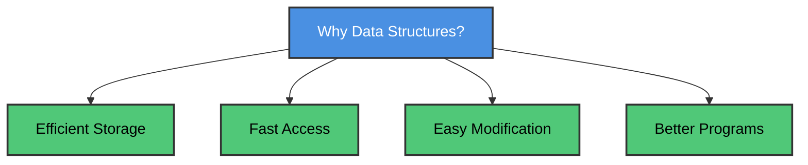

**Benefits:**
- ✅ Organize data efficiently
- ✅ Access data quickly
- ✅ Save memory space
- ✅ Write better programs

---

## Basic Terminology

### Data and Data Items

**Data:** Values or sets of values  
**Data Item:** A single unit of value

### Types of Data Items

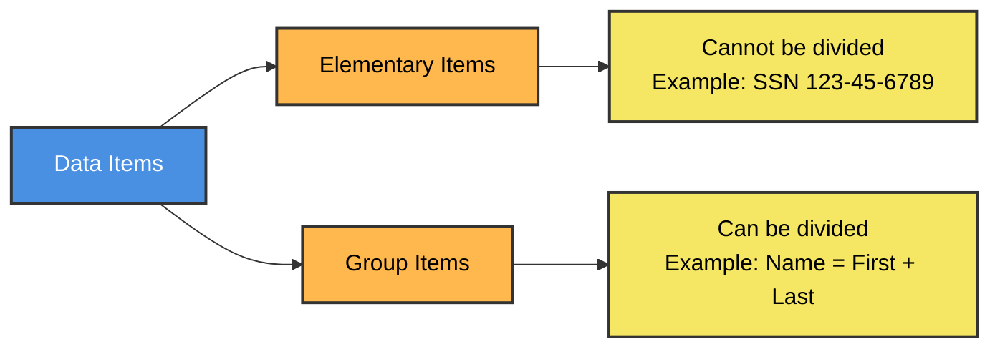

**1. Elementary Items** - Cannot be divided further
- Example: Social Security Number (134-24-5533)
- Example: Age (25)

**2. Group Items** - Can be divided into sub-items
- Example: Employee Name
  - First Name
  - Middle Initial
  - Last Name

### Important Concepts

**Entity:** Something that has certain properties
- Example: An employee, a student, a product

**Attributes:** Properties of an entity
- Example: Name, Age, Address

**Values:** Actual data assigned to attributes
- Example: Name = "John Smith", Age = 25

### C Program: Basic Data Representation

```c
#include <stdio.h>
#include <string.h>

// Structure to represent an Employee (Entity)
struct Employee {
    int id;                    // Elementary item
    char firstName[50];        // Part of group item (Name)
    char lastName[50];         // Part of group item (Name)
    int age;                   // Elementary item
    float salary;              // Elementary item
};

int main() {
    // Create an employee record
    struct Employee emp1;
    
    // Assign values to attributes
    emp1.id = 1001;
    strcpy(emp1.firstName, "John");
    strcpy(emp1.lastName, "Smith");
    emp1.age = 30;
    emp1.salary = 50000.00;
    
    // Display employee information
    printf("Employee Information:\n");
    printf("-------------------\n");
    printf("ID: %d\n", emp1.id);
    printf("Name: %s %s\n", emp1.firstName, emp1.lastName);
    printf("Age: %d\n", emp1.age);
    printf("Salary: $%.2f\n", emp1.salary);
    
    return 0;
}
```

**Output:**
```
Employee Information:
-------------------
ID: 1001
Name: John Smith
Age: 30
Salary: $50000.00
```

---

## Data Organization Hierarchy

### The Hierarchy

**In Simple Terms:** Think of data organization like a filing system:
- **File** = Filing cabinet (contains all documents)
- **Record** = One folder (contains one person's info)
- **Field** = One piece of paper (contains one piece of info)
- **Value** = The actual writing on the paper

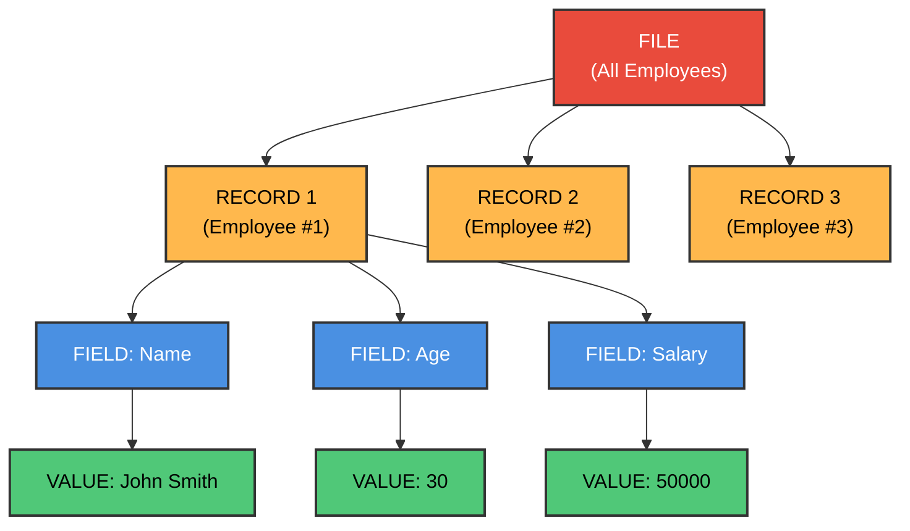

### Primary Keys

**In Simple Terms:** A primary key is like a unique ID card number - no two people can have the same one.

**Definition:** A field that uniquely identifies each record

**Example:** In a student database:
- ✅ Student ID (unique for each student)
- ❌ Name (two students might have same name)
- ❌ Age (many students have same age)

### C Program: File with Primary Key

```c
#include <stdio.h>
#include <string.h>

#define MAX_STUDENTS 100

struct Student {
    int studentID;      // Primary Key
    char name[50];
    int age;
    float gpa;
};

// Function to search by primary key
int searchByID(struct Student students[], int count, int searchID) {
    for(int i = 0; i < count; i++) {
        if(students[i].studentID == searchID) {
            return i;  // Found at index i
        }
    }
    return -1;  // Not found
}

int main() {
    struct Student students[MAX_STUDENTS];
    int count = 3;
    
    // Add some students
    students[0].studentID = 1001;
    strcpy(students[0].name, "Alice");
    students[0].age = 20;
    students[0].gpa = 3.8;
    
    students[1].studentID = 1002;
    strcpy(students[1].name, "Bob");
    students[1].age = 21;
    students[1].gpa = 3.5;
    
    students[2].studentID = 1003;
    strcpy(students[2].name, "Charlie");
    students[2].age = 20;
    students[2].gpa = 3.9;
    
    // Search for student with ID 1002
    int searchID = 1002;
    int index = searchByID(students, count, searchID);
    
    if(index != -1) {
        printf("Student Found:\n");
        printf("ID: %d\n", students[index].studentID);
        printf("Name: %s\n", students[index].name);
        printf("GPA: %.2f\n", students[index].gpa);
    } else {
        printf("Student with ID %d not found.\n", searchID);
    }
    
    return 0;
}
```

---

## Data Structures Classification

### Main Categories

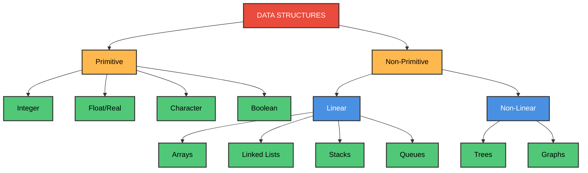

### Primitive vs Non-Primitive

| Primitive | Non-Primitive |
|-----------|---------------|
| Basic data types | Complex structures |
| Cannot be divided | Made of primitive types |
| Examples: int, float, char | Examples: arrays, trees |
| Built into language | Created by programmer |

### Linear vs Non-Linear

**Linear:** Elements form a sequence (like a line)
- Arrays, Linked Lists, Stacks, Queues

**Non-Linear:** Elements don't form a simple sequence
- Trees, Graphs

---

## Linear Data Structures

### Arrays

**In Simple Terms:** An array is like a row of numbered boxes, where each box holds one value.

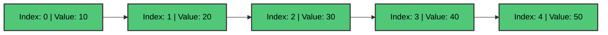

**Characteristics:**
- Fixed size
- Same data type for all elements
- Fast access by index
- Sequential memory storage

### C Program: Array Basics

```c
#include <stdio.h>

int main() {
    // Declare and initialize array
    int numbers[5] = {10, 20, 30, 40, 50};
    
    // Access elements
    printf("Array Elements:\n");
    for(int i = 0; i < 5; i++) {
        printf("numbers[%d] = %d\n", i, numbers[i]);
    }
    
    // Modify element
    numbers[2] = 99;
    printf("\nAfter modification:\n");
    printf("numbers[2] = %d\n", numbers[2]);
    
    // Calculate sum
    int sum = 0;
    for(int i = 0; i < 5; i++) {
        sum += numbers[i];
    }
    printf("\nSum of all elements: %d\n", sum);
    
    return 0;
}
```

### Two-Dimensional Arrays

**In Simple Terms:** A 2D array is like a spreadsheet with rows and columns.

```c
#include <stdio.h>

int main() {
    // 3x4 array (3 rows, 4 columns)
    int matrix[3][4] = {
        {1, 2, 3, 4},
        {5, 6, 7, 8},
        {9, 10, 11, 12}
    };
    
    // Print matrix
    printf("Matrix:\n");
    for(int i = 0; i < 3; i++) {
        for(int j = 0; j < 4; j++) {
            printf("%4d ", matrix[i][j]);
        }
        printf("\n");
    }
    
    // Access specific element
    printf("\nElement at [1][2]: %d\n", matrix[1][2]);
    
    return 0;
}
```

---

### Linked Lists

**In Simple Terms:** A linked list is like a treasure hunt where each clue points to the next location.


**Characteristics:**
- Dynamic size
- Elements not stored contiguously
- Each element points to next
- Easy insertion/deletion

### C Program: Linked List Basics

```c
#include <stdio.h>
#include <stdlib.h>

// Node structure
struct Node {
    int data;
    struct Node* next;
};

// Function to create new node
struct Node* createNode(int data) {
    struct Node* newNode = (struct Node*)malloc(sizeof(struct Node));
    newNode->data = data;
    newNode->next = NULL;
    return newNode;
}

// Function to print list
void printList(struct Node* head) {
    struct Node* current = head;
    printf("List: ");
    while(current != NULL) {
        printf("%d -> ", current->data);
        current = current->next;
    }
    printf("NULL\n");
}

int main() {
    // Create nodes
    struct Node* head = createNode(10);
    head->next = createNode(20);
    head->next->next = createNode(30);
    
    // Print list
    printList(head);
    
    return 0;
}
```

**Output:**
```
List: 10 -> 20 -> 30 -> NULL
```

---

## Non-Linear Data Structures

### Trees

**In Simple Terms:** A tree is like a family tree - one parent can have multiple children, and each child can have their own children.

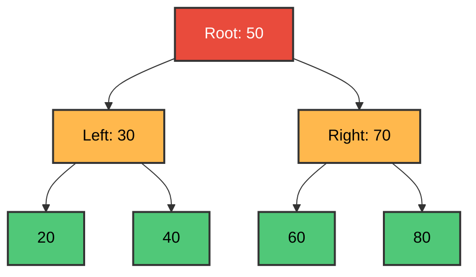

**Characteristics:**
- Hierarchical structure
- One root node
- Parent-child relationships
- No cycles

**Applications:**
- File systems
- Organization charts
- HTML DOM
- Decision trees

---

### Graphs

**In Simple Terms:** A graph is like a map of cities connected by roads - you can go from any city to any other city through different paths.

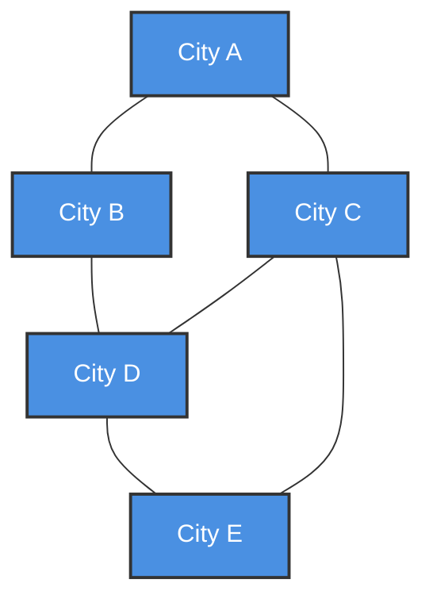

**Characteristics:**
- Nodes (vertices) connected by edges
- Can have cycles
- Multiple paths between nodes
- No hierarchical structure

**Applications:**
- Social networks
- Road maps
- Computer networks
- Recommendation systems

---

## Other Important Structures

### Stacks (LIFO - Last In, First Out)

**In Simple Terms:** A stack is like a stack of plates - you can only add or remove from the top.

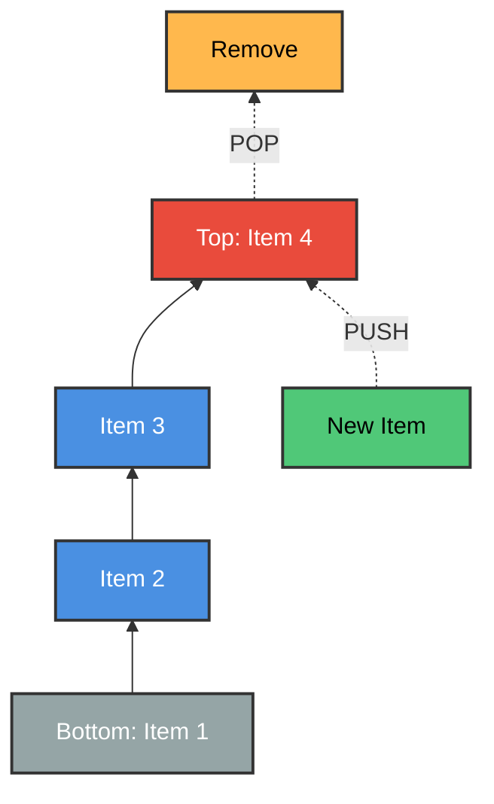

**Operations:**
- **Push:** Add to top
- **Pop:** Remove from top
- **Peek:** View top without removing

### C Program: Stack Implementation

```c
#include <stdio.h>
#define MAX 100

int stack[MAX];
int top = -1;

void push(int value) {
    if(top >= MAX - 1) {
        printf("Stack Overflow!\n");
        return;
    }
    stack[++top] = value;
    printf("Pushed %d\n", value);
}

int pop() {
    if(top < 0) {
        printf("Stack Underflow!\n");
        return -1;
    }
    return stack[top--];
}

void display() {
    if(top < 0) {
        printf("Stack is empty\n");
        return;
    }
    printf("Stack: ");
    for(int i = 0; i <= top; i++) {
        printf("%d ", stack[i]);
    }
    printf("\n");
}

int main() {
    push(10);
    push(20);
    push(30);
    display();
    
    printf("Popped: %d\n", pop());
    display();
    
    return 0;
}
```

---

### Queues (FIFO - First In, First Out)

**In Simple Terms:** A queue is like a line at a store - first person in line is first to be served.

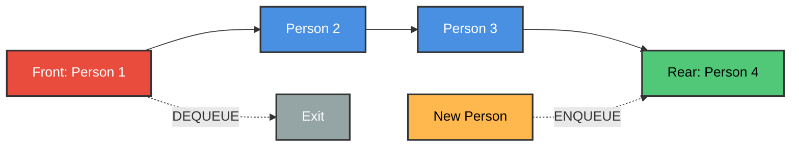

**Operations:**
- **Enqueue:** Add to rear
- **Dequeue:** Remove from front

### C Program: Queue Implementation

```c
#include <stdio.h>
#define MAX 100

int queue[MAX];
int front = -1, rear = -1;

void enqueue(int value) {
    if(rear >= MAX - 1) {
        printf("Queue Full!\n");
        return;
    }
    if(front == -1) front = 0;
    queue[++rear] = value;
    printf("Enqueued %d\n", value);
}

int dequeue() {
    if(front == -1 || front > rear) {
        printf("Queue Empty!\n");
        return -1;
    }
    return queue[front++];
}

void display() {
    if(front == -1 || front > rear) {
        printf("Queue is empty\n");
        return;
    }
    printf("Queue: ");
    for(int i = front; i <= rear; i++) {
        printf("%d ", queue[i]);
    }
    printf("\n");
}

int main() {
    enqueue(10);
    enqueue(20);
    enqueue(30);
    display();
    
    printf("Dequeued: %d\n", dequeue());
    display();
    
    return 0;
}
```

---

## Data Structure Operations

### Major Operations

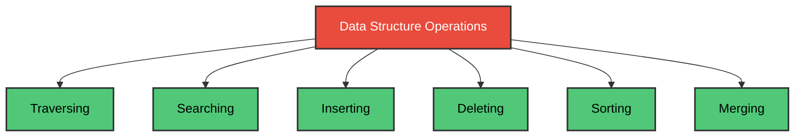

### 1. Traversing

**Definition:** Visiting each element exactly once

```c
#include <stdio.h>

void traverseArray(int arr[], int n) {
    printf("Traversing array:\n");
    for(int i = 0; i < n; i++) {
        printf("%d ", arr[i]);
    }
    printf("\n");
}

int main() {
    int arr[] = {10, 20, 30, 40, 50};
    int n = 5;
    traverseArray(arr, n);
    return 0;
}
```

### 2. Searching

**Definition:** Finding location of an element

```c
#include <stdio.h>

int linearSearch(int arr[], int n, int target) {
    for(int i = 0; i < n; i++) {
        if(arr[i] == target) {
            return i;  // Found at index i
        }
    }
    return -1;  // Not found
}

int main() {
    int arr[] = {10, 20, 30, 40, 50};
    int n = 5;
    int target = 30;
    
    int result = linearSearch(arr, n, target);
    if(result != -1) {
        printf("Found %d at index %d\n", target, result);
    } else {
        printf("%d not found\n", target);
    }
    
    return 0;
}
```

### 3. Inserting

**Definition:** Adding a new element

```c
#include <stdio.h>

void insertElement(int arr[], int *n, int pos, int value) {
    // Shift elements to right
    for(int i = *n; i > pos; i--) {
        arr[i] = arr[i-1];
    }
    arr[pos] = value;
    (*n)++;
}

int main() {
    int arr[10] = {10, 20, 30, 40, 50};
    int n = 5;
    
    printf("Before insertion: ");
    for(int i = 0; i < n; i++) printf("%d ", arr[i]);
    
    insertElement(arr, &n, 2, 25);
    
    printf("\nAfter inserting 25 at position 2: ");
    for(int i = 0; i < n; i++) printf("%d ", arr[i]);
    printf("\n");
    
    return 0;
}
```

### 4. Deleting

**Definition:** Removing an element

```c
#include <stdio.h>

void deleteElement(int arr[], int *n, int pos) {
    // Shift elements to left
    for(int i = pos; i < *n - 1; i++) {
        arr[i] = arr[i+1];
    }
    (*n)--;
}

int main() {
    int arr[] = {10, 20, 30, 40, 50};
    int n = 5;
    
    printf("Before deletion: ");
    for(int i = 0; i < n; i++) printf("%d ", arr[i]);
    
    deleteElement(arr, &n, 2);
    
    printf("\nAfter deleting element at position 2: ");
    for(int i = 0; i < n; i++) printf("%d ", arr[i]);
    printf("\n");
    
    return 0;
}
```

---

## Abstract Data Types (ADT)

### What is an ADT?

**In Simple Terms:** An ADT is like a TV remote - you know WHAT each button does, but you don't need to know HOW it works inside.

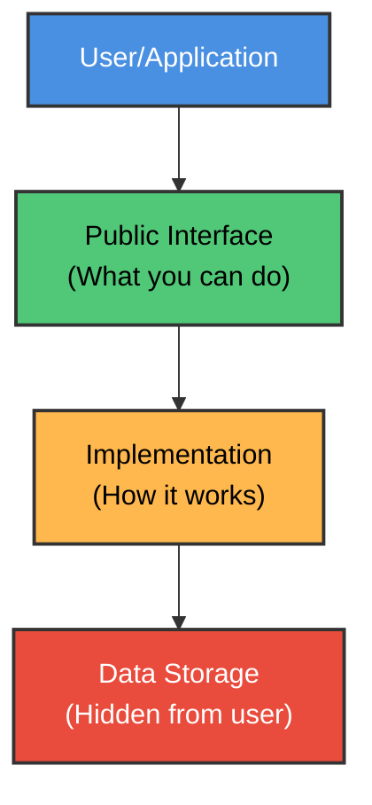

**ADT Components:**
1. **Data:** What information is stored
2. **Operations:** What you can do with the data
3. **Implementation:** Hidden from user

**Benefits:**
- ✅ Easier to use
- ✅ Can change implementation without affecting users
- ✅ Reduces complexity
- ✅ Reusable code

---

## Algorithms and Complexity

### What is an Algorithm?

**Definition:** A step-by-step procedure to solve a problem

### Complexity Analysis

**Time Complexity:** How long does it take?  
**Space Complexity:** How much memory does it use?

### Linear Search vs Binary Search

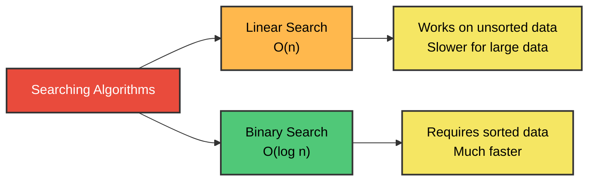

### Comparison Table

| Data Size | Linear Search | Binary Search |
|-----------|---------------|---------------|
| 100       | 50            | 7             |
| 1,000     | 500           | 10            |
| 10,000    | 5,000         | 14            |
| 1,000,000 | 500,000       | 20            |

**Huge difference!**

### C Program: Binary Search

```c
#include <stdio.h>

int binarySearch(int arr[], int n, int target) {
    int left = 0, right = n - 1;
    
    while(left <= right) {
        int mid = left + (right - left) / 2;
        
        if(arr[mid] == target) {
            return mid;  // Found
        }
        
        if(arr[mid] < target) {
            left = mid + 1;  // Search right half
        } else {
            right = mid - 1;  // Search left half
        }
    }
    
    return -1;  // Not found
}

int main() {
    int arr[] = {10, 20, 30, 40, 50, 60, 70, 80, 90};
    int n = 9;
    int target = 50;
    
    int result = binarySearch(arr, n, target);
    if(result != -1) {
        printf("Found %d at index %d\n", target, result);
    } else {
        printf("%d not found\n", target);
    }
    
    return 0;
}
```

---

## Time-Space Tradeoff

### The Concept

**In Simple Terms:** Sometimes you can use more memory to make your program faster, or use less memory but make it slower.

**Example:** Caching
- Store frequently used data in memory (uses more space)
- Access it quickly without recalculating (saves time)

### Real-World Example

**Problem:** Search by Name OR Social Security Number

**Solution 1:** One sorted file
- Fast for one key, slow for other

**Solution 2:** Two complete files
- Fast for both keys
- Uses 2x space

**Solution 3:** Main file + Index (BEST!)
- Fast for both keys
- Uses minimal extra space

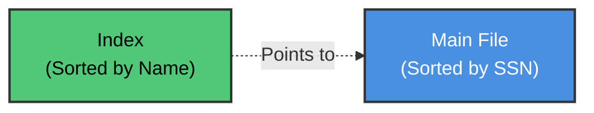

---

## Practice Exercises

### Exercise 1: Basic Concepts

**Question:** What is the difference between elementary and group data items?

<details>
<summary>Click for answer</summary>

**Elementary items** cannot be divided further (e.g., age, SSN)  
**Group items** can be divided into sub-items (e.g., name = first + last)
</details>

### Exercise 2: Primary Keys

**Question:** In a library system with books, which field(s) could serve as primary key?
- Title
- ISBN
- Author
- Publication Year

<details>
<summary>Click for answer</summary>

**ISBN** is the best primary key because:
- ✅ Unique for each book
- ✅ Standardized format
- ❌ Title: Multiple books can have same title
- ❌ Author: One author writes many books
- ❌ Year: Many books published same year
</details>

### Exercise 3: Data Structures

**Question:** Which data structure would you use for:
1. Browser back button?
2. Print job queue?
3. Family tree?

<details>
<summary>Click for answer</summary>

1. **Stack** (LIFO - last page visited is first to go back to)
2. **Queue** (FIFO - first job submitted prints first)
3. **Tree** (hierarchical parent-child relationships)
</details>

### Exercise 4: Algorithm Complexity

**Question:** If linear search takes 500 comparisons for 1000 items, how many comparisons does binary search need?

<details>
<summary>Click for answer</summary>

**Binary Search:** log₂(1000) ≈ **10 comparisons**

Much faster than 500!
</details>

---

## Summary

### Key Concepts Learned

✅ **Data Organization:** Fields → Records → Files  
✅ **Data Structures:** Arrays, Lists, Trees, Graphs, Stacks, Queues  
✅ **Operations:** Traverse, Search, Insert, Delete, Sort  
✅ **ADT:** Separation of interface from implementation  
✅ **Complexity:** Time vs Space tradeoffs  
✅ **Algorithms:** Linear search vs Binary search  

### Important Takeaways

1. **Choose the right structure** for your problem
2. **Understand tradeoffs** between time and space
3. **Use ADTs** for better code organization
4. **Analyze complexity** before implementing

---

**End of Chapter 1**

*Continue to [Chapter 2: Complexity and Asymptotic Notation](../Chapter%202%20-%20Complexity%20and%20Asymptotic%20Notation/README.md)*

