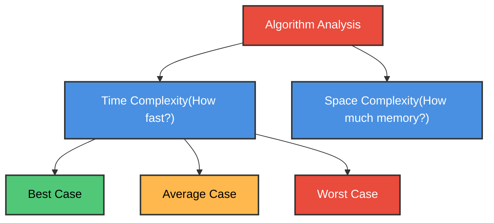
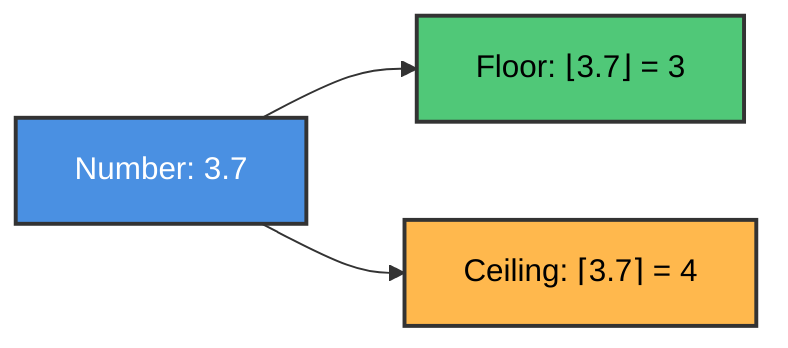
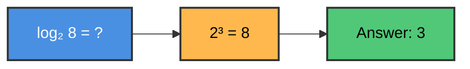
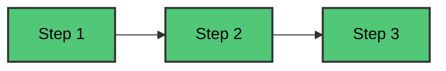
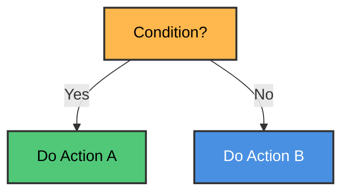
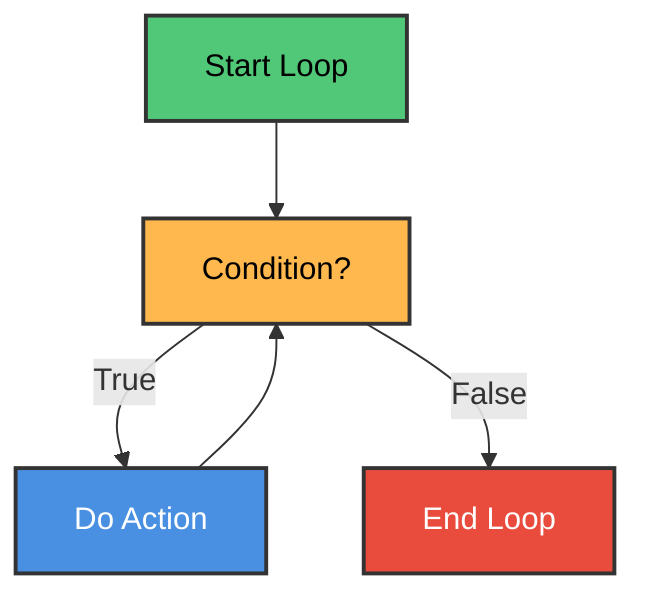
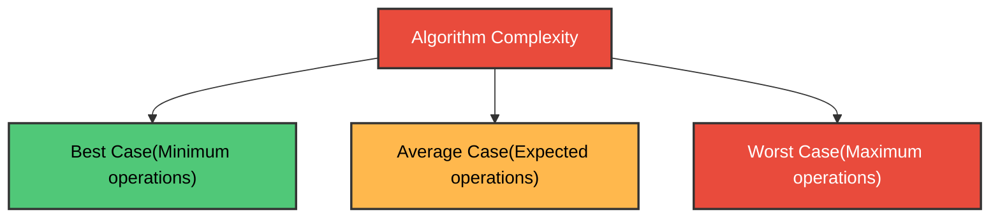
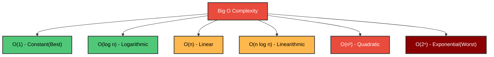
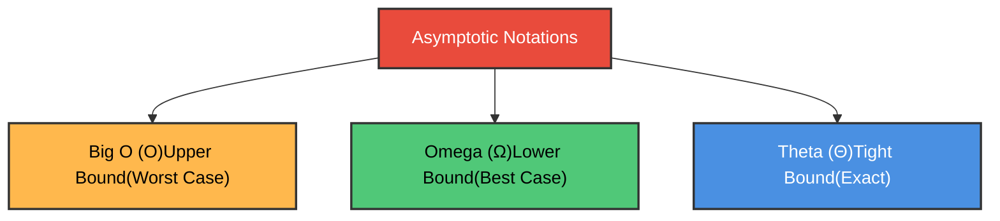

# Chapter 2: Algorithm Analysis and Complexity

## Table of Contents

1. [Introduction](#introduction)
2. [Mathematical Foundations](#mathematical-foundations)
   - Floor and Ceiling Functions
   - Modular Arithmetic
   - Summation and Factorial
   - Logarithms
3. [Algorithm Notation](#algorithm-notation)
4. [Control Structures](#control-structures)
5. [Algorithm Complexity](#algorithm-complexity)
6. [Big O Notation](#big-o-notation)
7. [Other Asymptotic Notations](#other-asymptotic-notations)
8. [Practice Exercises](#practice-exercises)

---

## Introduction

### What is Algorithm Analysis?

**In Simple Terms:** Algorithm analysis is like comparing different routes to get to school - which one is faster? Which one uses less gas? Similarly, we compare algorithms to see which one is faster or uses less memory.



**Why Study This?**
- ✅ Choose the best algorithm for a problem
- ✅ Predict how algorithm performs with large data
- ✅ Optimize programs for speed and memory

---

## Mathematical Foundations

### Floor and Ceiling Functions

**In Simple Terms:** 
- **Floor** ⌊x⌋ = Round DOWN to nearest integer
- **Ceiling** ⌈x⌉ = Round UP to nearest integer



**Examples:**

| Number | Floor ⌊x⌋ | Ceiling ⌈x⌉ |
|--------|-----------|-------------|
| 3.14   | 3         | 4           |
| 7.9    | 7         | 8           |
| -2.5   | -3        | -2          |
| 5.0    | 5         | 5           |

### C Program: Floor and Ceiling

```c
#include <stdio.h>
#include <math.h>

int main() {
    double numbers[] = {3.14, 7.9, -2.5, 5.0};
    int n = 4;
    
    printf("Number\tFloor\tCeiling\n");
    printf("------\t-----\t-------\n");
    
    for(int i = 0; i < n; i++) {
        printf("%.2f\t%.0f\t%.0f\n", 
               numbers[i], 
               floor(numbers[i]), 
               ceil(numbers[i]));
    }
    
    return 0;
}
```

---

### Modular Arithmetic

**In Simple Terms:** Modulo (mod) gives you the remainder after division. Like when you divide 17 cookies among 5 friends - each gets 3, with 2 left over. So 17 mod 5 = 2.

**Formula:** `k mod M = remainder when k ÷ M`

**Examples:**
- 25 mod 7 = 4 (because 25 = 7×3 + **4**)
- 100 mod 10 = 0 (because 100 = 10×10 + **0**)
- 17 mod 5 = 2 (because 17 = 5×3 + **2**)

### C Program: Modulo Operation

```c
#include <stdio.h>

int main() {
    int numbers[] = {25, 100, 17, 43};
    int divisors[] = {7, 10, 5, 8};
    int n = 4;
    
    printf("Number\tDivisor\tRemainder\n");
    printf("------\t-------\t---------\n");
    
    for(int i = 0; i < n; i++) {
        printf("%d\t%d\t%d\n", 
               numbers[i], 
               divisors[i], 
               numbers[i] % divisors[i]);
    }
    
    return 0;
}
```

**Output:**
```
Number	Divisor	Remainder
------	-------	---------
25	7	4
100	10	0
17	5	2
43	8	3
```

---

### Summation (Σ)

**In Simple Terms:** The Σ symbol means "add up a bunch of numbers."

**Example:** Sum of first 5 numbers
```
  5
  Σ i = 1 + 2 + 3 + 4 + 5 = 15
 i=1
```

**Formula for sum of first n numbers:**
```
  n
  Σ i = n(n+1)/2
 i=1
```

### C Program: Summation

```c
#include <stdio.h>

int main() {
    int n = 10;
    int sum = 0;
    
    // Method 1: Using loop
    for(int i = 1; i <= n; i++) {
        sum += i;
    }
    printf("Sum of 1 to %d (loop): %d\n", n, sum);
    
    // Method 2: Using formula
    int formulaSum = n * (n + 1) / 2;
    printf("Sum of 1 to %d (formula): %d\n", n, formulaSum);
    
    return 0;
}
```

**Output:**
```
Sum of 1 to 10 (loop): 55
Sum of 1 to 10 (formula): 55
```

---

### Factorial (n!)

**In Simple Terms:** Factorial means multiply all numbers from 1 to n.

**Examples:**
- 3! = 1 × 2 × 3 = 6
- 5! = 1 × 2 × 3 × 4 × 5 = 120
- 0! = 1 (special case)

### C Program: Factorial

```c
#include <stdio.h>

// Iterative version
long factorial(int n) {
    long result = 1;
    for(int i = 1; i <= n; i++) {
        result *= i;
    }
    return result;
}

// Recursive version
long factorialRecursive(int n) {
    if(n == 0 || n == 1) return 1;
    return n * factorialRecursive(n - 1);
}

int main() {
    printf("n\tFactorial\n");
    printf("--\t---------\n");
    
    for(int i = 0; i <= 10; i++) {
        printf("%d\t%ld\n", i, factorial(i));
    }
    
    return 0;
}
```

---

### Logarithms

**In Simple Terms:** Logarithm asks "what power do I raise this base to get this number?"

**log₂ 8 = 3** means "2 to what power equals 8?" Answer: 3 (because 2³ = 8)



**Common Logarithms:**
- log₂ (base 2) - used in computer science
- log₁₀ (base 10) - common logarithm
- ln (base e ≈ 2.718) - natural logarithm

**Examples:**

| Expression | Value | Why |
|------------|-------|-----|
| log₂ 8     | 3     | 2³ = 8 |
| log₂ 16    | 4     | 2⁴ = 16 |
| log₁₀ 100  | 2     | 10² = 100 |
| log₂ 1     | 0     | 2⁰ = 1 |

### C Program: Logarithm

```c
#include <stdio.h>
#include <math.h>

int main() {
    int numbers[] = {8, 16, 32, 64, 128};
    int n = 5;
    
    printf("Number\tlog₂\n");
    printf("------\t----\n");
    
    for(int i = 0; i < n; i++) {
        // log₂(x) = log(x) / log(2)
        double log2_value = log(numbers[i]) / log(2);
        printf("%d\t%.0f\n", numbers[i], log2_value);
    }
    
    return 0;
}
```

---

## Algorithm Notation

### Algorithm Structure

**Parts of an Algorithm:**
1. **Header:** Name and description
2. **Input:** What data is needed
3. **Output:** What result is produced
4. **Steps:** Numbered instructions

### Example: Find Maximum Element

**Algorithm:** Find the largest number in an array

```
Input: Array DATA with N numbers
Output: MAX (largest value)

Step 1. Set MAX = DATA[0]
Step 2. For i = 1 to N-1:
           If DATA[i] > MAX then:
              Set MAX = DATA[i]
        [End loop]
Step 3. Return MAX
```

### C Implementation

```c
#include <stdio.h>

int findMax(int arr[], int n) {
    int max = arr[0];
    
    for(int i = 1; i < n; i++) {
        if(arr[i] > max) {
            max = arr[i];
        }
    }
    
    return max;
}

int main() {
    int numbers[] = {45, 23, 67, 12, 89, 34};
    int n = 6;
    
    int maximum = findMax(numbers, n);
    printf("Maximum value: %d\n", maximum);
    
    return 0;
}
```

**Output:**
```
Maximum value: 89
```

---

## Control Structures

### 1. Sequence (Do things in order)



**Example:**
```c
int a = 5;      // Step 1
int b = 10;     // Step 2
int sum = a + b; // Step 3
```

---

### 2. Selection (Make decisions)



**Example:**
```c
if(age >= 18) {
    printf("Adult");
} else {
    printf("Minor");
}
```

---

### 3. Iteration (Repeat actions)



**Example:**
```c
for(int i = 0; i < 5; i++) {
    printf("%d ", i);
}
// Output: 0 1 2 3 4
```

---

## Algorithm Complexity

### What is Complexity?

**In Simple Terms:** Complexity measures how much time or memory an algorithm needs as the input size grows.

**Two Types:**
- **Time Complexity:** How many steps does it take?
- **Space Complexity:** How much memory does it use?

### Measuring Time Complexity

We count the number of **basic operations** (comparisons, assignments, etc.)

**Example: Linear Search**

```c
int linearSearch(int arr[], int n, int target) {
    for(int i = 0; i < n; i++) {        // n iterations
        if(arr[i] == target) {          // 1 comparison per iteration
            return i;
        }
    }
    return -1;
}
```

**Analysis:**
- **Best Case:** Target is first element → 1 comparison
- **Worst Case:** Target is last or not present → n comparisons
- **Average Case:** Target is in middle → n/2 comparisons

---

### Three Cases



**Example with Array [10, 20, 30, 40, 50]:**

Searching for different values:
- Search for 10: **Best case** (1 comparison)
- Search for 30: **Average case** (3 comparisons)
- Search for 50 or 99: **Worst case** (5 comparisons)

---

## Big O Notation

### What is Big O?

**In Simple Terms:** Big O describes how an algorithm's time grows as input size increases. It's like saying "this algorithm gets slower linearly" or "this one gets slower exponentially."

**Notation:** O(f(n)) where n is input size

### Common Big O Values



### Complexity Comparison

| Big O | Name | Example | n=10 | n=100 | n=1000 |
|-------|------|---------|------|-------|--------|
| O(1) | Constant | Array access | 1 | 1 | 1 |
| O(log n) | Logarithmic | Binary search | 3 | 7 | 10 |
| O(n) | Linear | Linear search | 10 | 100 | 1000 |
| O(n log n) | Linearithmic | Merge sort | 30 | 700 | 10000 |
| O(n²) | Quadratic | Bubble sort | 100 | 10000 | 1000000 |
| O(2ⁿ) | Exponential | Recursive fibonacci | 1024 | huge | impossible |

### Examples with Code

**O(1) - Constant Time:**
```c
int getFirst(int arr[]) {
    return arr[0];  // Always 1 operation
}
```

**O(n) - Linear Time:**
```c
int sum(int arr[], int n) {
    int total = 0;
    for(int i = 0; i < n; i++) {  // n operations
        total += arr[i];
    }
    return total;
}
```

**O(n²) - Quadratic Time:**
```c
void printPairs(int arr[], int n) {
    for(int i = 0; i < n; i++) {        // n iterations
        for(int j = 0; j < n; j++) {    // n iterations each
            printf("(%d,%d) ", arr[i], arr[j]);
        }
    }
}
// Total: n × n = n² operations
```

**O(log n) - Logarithmic Time:**
```c
int binarySearch(int arr[], int n, int target) {
    int left = 0, right = n - 1;
    
    while(left <= right) {
        int mid = left + (right - left) / 2;
        
        if(arr[mid] == target) return mid;
        
        if(arr[mid] < target)
            left = mid + 1;
        else
            right = mid - 1;
    }
    return -1;
}
// Divides search space in half each time
```

---

### Big O Rules

**Rule 1: Drop Constants**
- O(2n) → O(n)
- O(500) → O(1)

**Rule 2: Drop Lower Order Terms**
- O(n² + n) → O(n²)
- O(n + log n) → O(n)

**Rule 3: Different Inputs Use Different Variables**
- Two loops over different arrays: O(a + b)
- Nested loops over different arrays: O(a × b)

### C Program: Complexity Demonstration

```c
#include <stdio.h>
#include <time.h>

// O(1) - Constant
int constant(int arr[], int n) {
    return arr[0];
}

// O(n) - Linear
int linear(int arr[], int n) {
    int sum = 0;
    for(int i = 0; i < n; i++) {
        sum += arr[i];
    }
    return sum;
}

// O(n²) - Quadratic
int quadratic(int arr[], int n) {
    int count = 0;
    for(int i = 0; i < n; i++) {
        for(int j = 0; j < n; j++) {
            count++;
        }
    }
    return count;
}

int main() {
    int sizes[] = {10, 100, 1000};
    
    printf("Input Size\tO(1)\tO(n)\tO(n²)\n");
    printf("----------\t----\t----\t-----\n");
    
    for(int i = 0; i < 3; i++) {
        int n = sizes[i];
        printf("%d\t\t1\t%d\t%d\n", n, n, n*n);
    }
    
    return 0;
}
```

**Output:**
```
Input Size	O(1)	O(n)	O(n²)
----------	----	----	-----
10		1	10	100
100		1	100	10000
1000		1	1000	1000000
```

---

## Other Asymptotic Notations

### Omega Notation (Ω) - Lower Bound

**In Simple Terms:** Ω describes the **best case** - the minimum time an algorithm will take.

**Example:** Linear search is Ω(1) because in the best case, we find the element immediately.

---

### Theta Notation (Θ) - Tight Bound

**In Simple Terms:** Θ describes when the best and worst cases are the same.

**Example:** Printing all elements is Θ(n) - always takes exactly n steps.

```c
void printAll(int arr[], int n) {
    for(int i = 0; i < n; i++) {
        printf("%d ", arr[i]);
    }
}
// Always n operations, so Θ(n)
```

---

### Summary of Notations



| Notation | Meaning | Example |
|----------|---------|---------|
| O(f(n)) | At most f(n) | Linear search: O(n) |
| Ω(f(n)) | At least f(n) | Linear search: Ω(1) |
| Θ(f(n)) | Exactly f(n) | Print array: Θ(n) |

---

## Practice Exercises

### Exercise 1: Floor and Ceiling

**Question:** Calculate ⌊7.8⌋ and ⌈7.8⌉

<details>
<summary>Click for answer</summary>

- ⌊7.8⌋ = **7** (round down)
- ⌈7.8⌉ = **8** (round up)
</details>

---

### Exercise 2: Modular Arithmetic

**Question:** Calculate 47 mod 5

<details>
<summary>Click for answer</summary>

47 ÷ 5 = 9 remainder **2**

So 47 mod 5 = **2**

(Because 47 = 5×9 + 2)
</details>

---

### Exercise 3: Big O Analysis

**Question:** What is the time complexity of this code?

```c
for(int i = 0; i < n; i++) {
    for(int j = 0; j < n; j++) {
        printf("%d ", i + j);
    }
}
```

<details>
<summary>Click for answer</summary>

**O(n²)** - Quadratic time

The outer loop runs n times, and for each iteration, the inner loop runs n times.
Total operations: n × n = n²
</details>

---

### Exercise 4: Factorial

**Question:** Calculate 6!

<details>
<summary>Click for answer</summary>

6! = 6 × 5 × 4 × 3 × 2 × 1 = **720**

Or using the recursive property:
6! = 6 × 5! = 6 × 120 = **720**
</details>

---

### Exercise 5: Logarithm

**Question:** What is log₂ 64?

<details>
<summary>Click for answer</summary>

log₂ 64 = **6**

Because 2⁶ = 64
</details>

---

### Exercise 6: Algorithm Analysis

**Question:** Which is faster for searching in a sorted array of 1000 elements?
- A) Linear Search
- B) Binary Search

<details>
<summary>Click for answer</summary>

**B) Binary Search** is much faster!

- Linear Search: O(n) → up to 1000 comparisons
- Binary Search: O(log n) → about 10 comparisons

Binary search is ~100x faster!
</details>

---

## Summary

### Key Concepts Learned

✅ **Mathematical Functions:** Floor, ceiling, modulo, factorial, logarithms  
✅ **Algorithm Notation:** How to write and read algorithms  
✅ **Control Structures:** Sequence, selection, iteration  
✅ **Complexity Analysis:** Best, average, worst cases  
✅ **Big O Notation:** O(1), O(log n), O(n), O(n²), etc.  
✅ **Asymptotic Notations:** O, Ω, Θ  

### Complexity Hierarchy (Fastest to Slowest)

```
O(1) < O(log n) < O(n) < O(n log n) < O(n²) < O(2ⁿ)
```

### Important Takeaways

1. **Big O describes growth rate**, not exact time
2. **Drop constants and lower terms** in Big O
3. **Logarithmic is much better than linear** for large inputs
4. **Quadratic and exponential are slow** for large inputs
5. **Always analyze worst case** for safety

---

**End of Chapter 2**

*Continue to [Chapter 3: String Processing](../Chapter%203%20-%20String%20Processing/README.md)*


