# Chapter 3: String Processing - Complete Guide

## Table of Contents
1. [Introduction](#1-introduction)
2. [Basic Terminology](#2-basic-terminology)
3. [Storing Strings](#3-storing-strings)
4. [Character Data Type](#4-character-data-type)
5. [Strings as ADT](#5-strings-as-adt)
6. [String Operations](#6-string-operations)
7. [Word/Text Processing](#7-wordtext-processing)
8. [Pattern Matching Algorithms](#8-pattern-matching-algorithms)
9. [Solved Problems](#9-solved-problems)
10. [Programming Exercises](#10-programming-exercises)

---

## 1. Introduction

### Historical Context
- **Early computers**: Designed primarily for numerical data processing
- **Modern computers**: Extensively used for character (non-numerical) data processing
- **Primary application**: Word processing and text manipulation

### Key Concepts
- **Pattern Matching**: Finding if a word/pattern S appears in text T
- **String vs Word**: Computer science uses "string" for character sequences
- **Alternative terms**: String processing, string manipulation, text editing

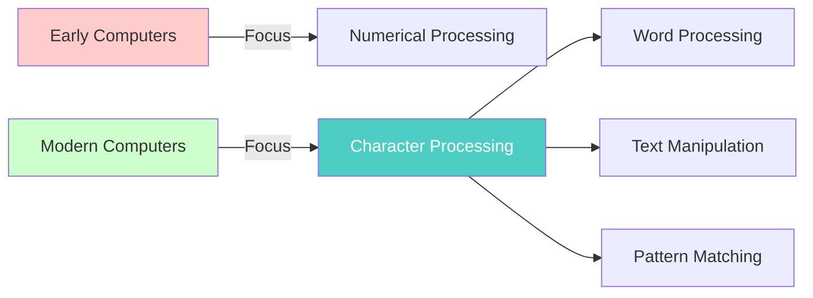

---

## 2. Basic Terminology

### Character Sets
Every programming language includes:

```
Alphabet:  A B C D E F G H I J K L M N O P Q R S T U V W X Y Z
Digits:    0 1 2 3 4 5 6 7 8 9
Special:   + - / * ( ) , . $ = ' □ (blank space)
```

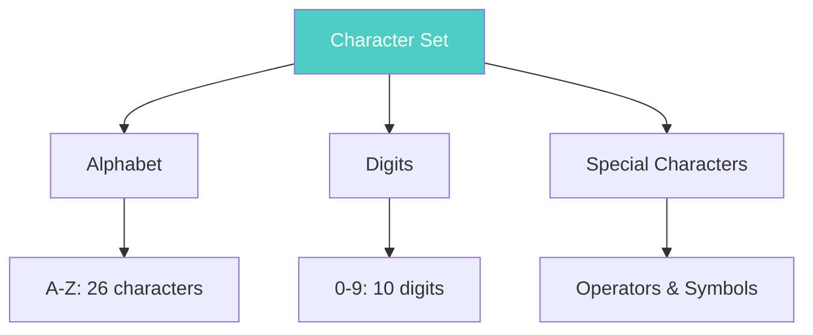

### String Definition
**String**: A finite sequence of zero or more characters

**Length**: The number of characters in a string

**Empty/Null String**: A string with zero characters

### String Notation
Strings are enclosed in single quotation marks:
```
'THE END'           -> Length: 7
'TO BE OR NOT TO BE' -> Length: 18
''                  -> Length: 0 (empty string)
'12'                -> Length: 2
```

-> **Important**: The blank space [space] is a character and counts toward length!

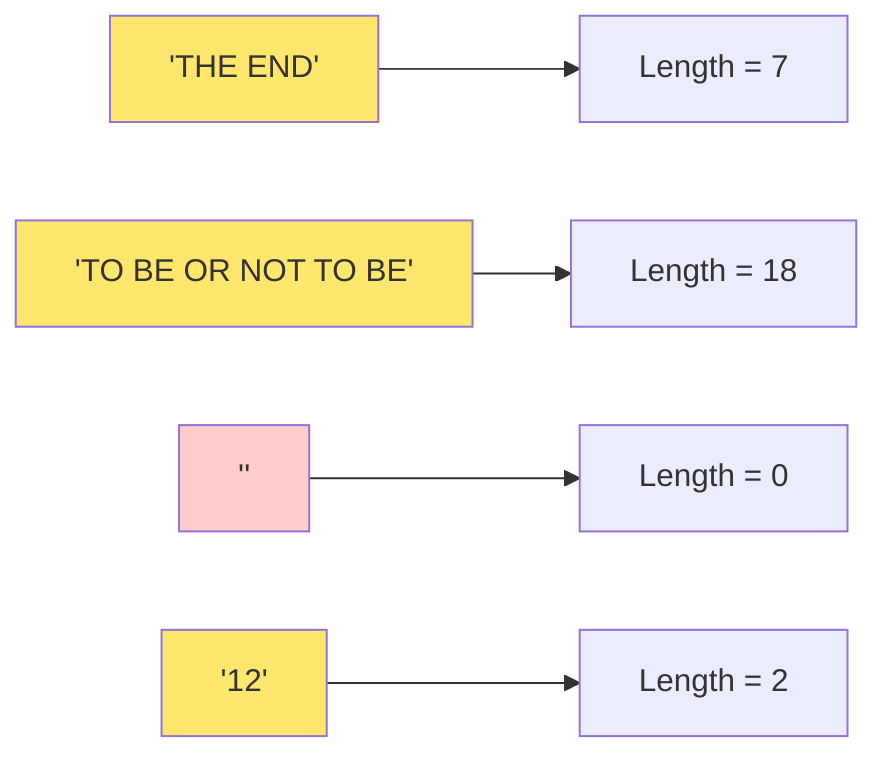

### Concatenation
The operation of joining two strings S1 and S2 is denoted: **S1//S2**

**Examples:**
```
'THE' // 'END' = 'THEEND'
'THE' // ' ' // 'END' = 'THE END'
```

**Property**: LENGTH(S1//S2) = LENGTH(S1) + LENGTH(S2)

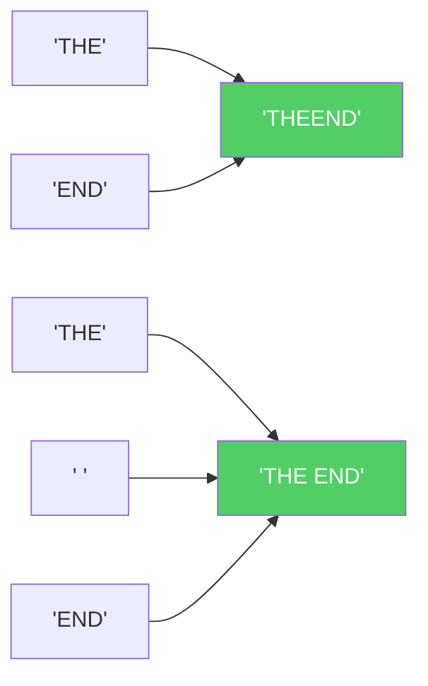

### Substrings

```
Visual Representation:
S = X // Y // Z
    ^    ^    ^
 prefix  substring  suffix
```

**Definition**: Y is a substring of S if:
- S = X // Y // Z (for some strings X and Z)

**Special Cases:**
- **Initial substring**: X is empty (Y starts at beginning)
- **Terminal substring**: Z is empty (Y ends at end)

**Example:**
```
S = 'TO BE OR NOT TO BE'

'BE OR NOT'  -> substring (general)
'TO'         -> initial substring
'TO BE'      -> substring (property: length <= length of S)
```

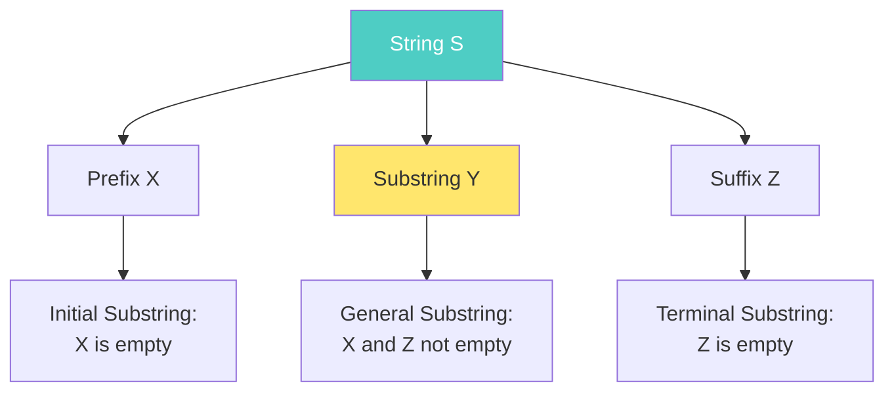

### Storage Representation

**Byte**: Unit equal to number of bits needed to represent a character
- 6-bit code (rare)
- 7-bit code (ASCII)
- 8-bit code (EBCDIC, most common)

**Byte-addressable machine**: Computer that can access individual bytes

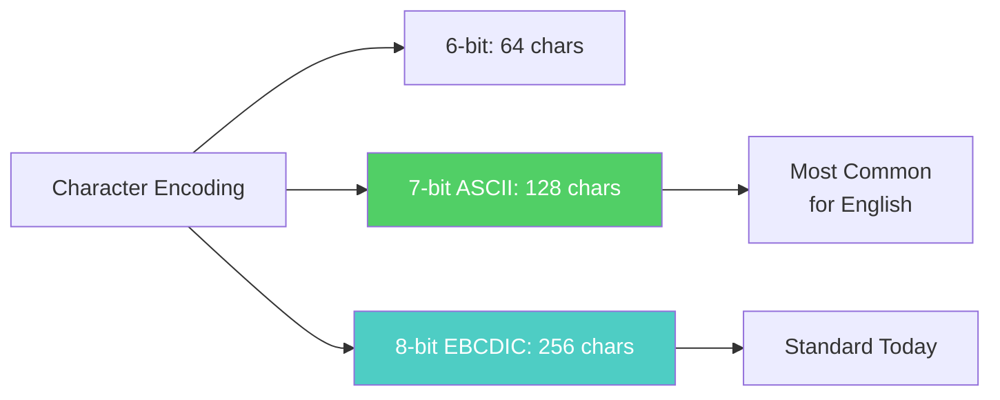

---

## 3. Storing Strings

### Three Main Storage Structures

```mermaid
graph TB
    A[String Storage Methods] --> B[Fixed-Length Structures]
    A --> C[Variable-Length with Fixed Maximum]
    A --> D[Linked Storage]
    
    B --> B1[✓ Easy access O&#40;1&#41;<br/>✗ Wasted space]
    C --> C1[✓ Flexible within limit<br/>✓ Less waste]
    D --> D1[✓ Fully dynamic<br/>✗ Slower access O&#40;n&#41;]
    
    style A fill:#4ecdc4,color:#fff
    style B fill:#ff6b6b,color:#fff
    style C fill:#ffe66d
    style D fill:#51cf66,color:#fff
```

#### 3.1 Fixed-Length Structures

**Concept**: Each line is a record of same length (typically 80 characters)

**Visual Example:**
```
Example Input:
/*PROGRAM PRINTING TWO INTEGERS IN DECREASING ORDER*/
void main()
{
    int J, K;
    scanf("%d %d", &J, &K);
    ...
}

Memory Storage (80 chars per record):
+--------------------------------------------------+
| /*PROGRAM PRINTING TWO...                         | Record 1
+--------------------------------------------------+
| void main()                                      | Record 2
+--------------------------------------------------+
| {                                                | Record 3
+--------------------------------------------------+
( [space] represents blank space padding)
```

```mermaid
graph TD
    subgraph "Fixed-Length Storage - 80 Characters"
        R1[Record 1: /*PROGRAM PRINTING...■■■■■■]
        R2[Record 2: void main&#40;&#41;■■■■■■■■■■■■■■■■■■■]
        R3[Record 3: {■■■■■■■■■■■■■■■■■■■■■■■■■■■■■■]
    end
    
    R1 -.-> A1[Actual: 55 chars]
    R1 -.-> P1[Padding: 25 chars]
    
    style R1 fill:#ffcccc
    style R2 fill:#ffcccc
    style R3 fill:#ffcccc
```

**Advantages:**
1. [OK] Easy access to any record
2. [OK] Easy updating within record length limit

**Disadvantages:**
1. [X] Wasted space (blank padding)
2. [X] Fixed size may be insufficient
3. [X] Difficult to modify length

**Using Pointers (Improved):**
```
POINT Array:
[1] → 200  /*PROGRAM PRINTING TWO INTEGERS IN DECREASING ORDER*/
[2] → 280  void main()
[3] → 360  int J, K;
[4] → 440  scanf("%d %d", &J, &K);

Advantage: Records need not be consecutive in memory
```

```mermaid
graph LR
    subgraph "Pointer Array"
        P1[Index 1] --> M1[Memory 200]
        P2[Index 2] --> M2[Memory 280]
        P3[Index 3] --> M3[Memory 360]
        P4[Index 4] --> M4[Memory 440]
    end
    
    M1 -.-> D1[/*PROGRAM PRINTING...]
    M2 -.-> D2[void main&#40;&#41;]
    M3 -.-> D3[int J, K;]
    M4 -.-> D4[scanf...]
    
    style P1 fill:#4ecdc4
    style P2 fill:#4ecdc4
    style P3 fill:#4ecdc4
    style P4 fill:#4ecdc4
```

#### 3.2 Variable-Length with Fixed Maximum

**Two Methods:**

**Method 1: Sentinel Markers ($$)**
```
Record 1: /*PROGRAM PRINTING TWO INTEGERS...$$
Record 2: void main()$$
Record 3: {int J, K;$$
```

**Method 2: Length Array**
```
POINT Array:
[Index] [Length] [Content]
   1      55      /*PROGRAM PRINTING...
   2      18      void main()
   3      21      {int J, K;
```

```mermaid
graph TD
    subgraph "Method 1: Sentinel Markers"
        S1[Record 1: Data...$$]
        S2[Record 2: Data...$$]
        S3[Record 3: Data...$$]
    end
    
    subgraph "Method 2: Length Prefix"
        L1[55 | Data...]
        L2[18 | Data...]
        L3[21 | Data...]
    end
    
    style S1 fill:#ffe66d
    style S2 fill:#ffe66d
    style S3 fill:#ffe66d
    style L1 fill:#51cf66,color:#fff
    style L2 fill:#51cf66,color:#fff
    style L3 fill:#51cf66,color:#fff
```

**Visual Comparison:**
```
(a) With Sentinels:
+------------------------------+
| String content here$$        |
+------------------------------+

(b) With Length Listing:
+---+--------------------------+
|55 | String content here      |
+---+--------------------------+
```

#### 3.3 Linked Storage

**Structure**: Linear sequence of nodes with links

**Visual Representation:**
```
One Character per Node:
[T] -> [o] -> [ ] -> [b] -> [e] -> [ ] -> [o] -> [r] -> ...

Four Characters per Node:
[To b] -> [e or] -> [ not] -> [ to ] -> [be, ] -> [that] -> ...
```

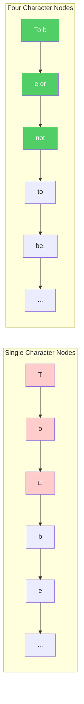

**Example: "To be or not to be, that is the question"**
```
Single Character Nodes:
[T] -> [o] -> [ ] -> [b] -> [e] -> [ ] -> [o] -> [r] -> ...

Four Character Nodes:
[To b] -> [e or] -> [ not] -> [ to ] -> [be, ] -> [that] -> ...
```

**Advantages:**
 - [OK] Easy insertion/deletion
 - [OK] Dynamic size
 - [OK] Flexible modifications

**Disadvantages:**
- [X] Extra space for links
- [X] No direct character access

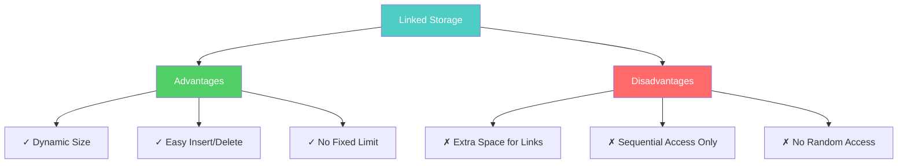

---

## 4. Character Data Type

### Constants
Denoted by quotation marks:
```c
'THE END'              // Length 7
'TO BE OR NOT TO BE'   // Length 18
```

### Variables in C

**Three Categories:**
1. **Static**: Fixed length before execution
2. **Semistatic**: Variable length ≤ maximum
3. **Dynamic**: Fully variable length

```mermaid
graph TD
    A[String Variables in C] --> B[Static]
    A --> C[Semistatic]
    A --> D[Dynamic]
    
    B --> B1[Fixed size<br/>char str[20]]
    C --> C1[Max size limit<br/>strlen ≤ max]
    D --> D1[Fully variable<br/>malloc/realloc]
    
    style A fill:#4ecdc4,color:#fff
    style B fill:#ffcccc
    style C fill:#ffe66d
    style D fill:#51cf66,color:#fff
```

**C Declaration Examples:**
```c
// Single character variable
char a;

// Character array (string) of length 20
char str[20];

// Variable naming rules:
// ✓ Must begin with letter
// ✓ Can contain letters, digits, underscore (_)
// ✗ Cannot match system keywords
// ✗ No white spaces allowed

// Valid examples:
char student_name[50];
char city2[30];
char _temp[10];

// Invalid examples:
char 2city[30];      // Starts with digit
char int[20];        // Keyword
char my name[40];    // Contains space
```

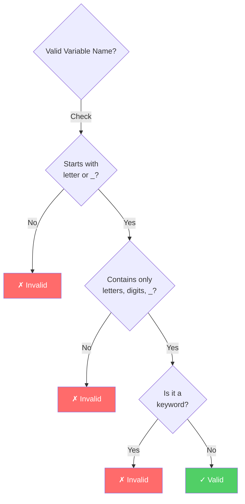

---

## 5. Strings as ADT

### Core Operations

| Operation | Description | Return Type |
|-----------|-------------|-------------|
| `GETCHAR(str, n)` | Returns nth character | Character |
| `PUTCHAR(str, n, c)` | Sets nth character to c | Void |
| `LENGTH(str)` | Returns string length | Integer |
| `POS(str1, str2)` | Position of str2 in str1 | Integer |
| `CONCAT(str1, str2)` | Concatenates strings | String |
| `SUBSTRING(str1, i, m)` | Extracts substring | String |
| `DELETE(str, i, m)` | Deletes m chars from position i | String |
| `INSERT(str1, str2, i)` | Inserts str2 at position i | String |
| `COMPARE(str1, str2)` | Compares strings | Integer |

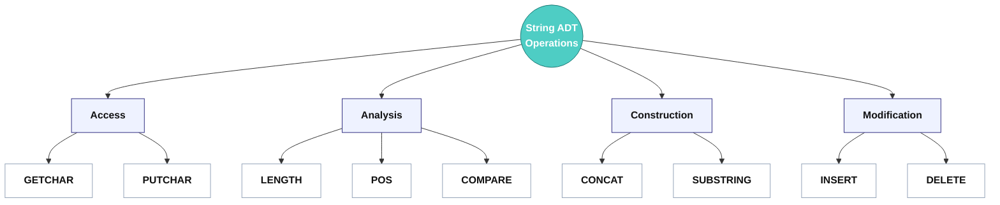

### Implementation Methods

**Method 1: Fixed Length Array**
```
S1 = 'JANICE'

[6, J, A, N, I, C, E]
 ↑
 Length stored in first element
```

**Method 2: Dynamic with NULL Terminator**
```
S1 = 'JANICE'

[J, A, N, I, C, E, \0, ...]
                   ↑
                   NULL terminator
```

```mermaid
graph TD
    subgraph "Method 1: Length Prefix"
        M1A[6] --> M1B[J A N I C E]
    end
    
    subgraph "Method 2: NULL Terminator"
        M2A[J A N I C E] --> M2B[\0]
    end
    
    M1A -.Length.-> M1C[O&#40;1&#41; to get length]
    M2B -.Terminator.-> M2C[O&#40;n&#41; to get length]
    
    style M1A fill:#4ecdc4,color:#fff
    style M2B fill:#ffe66d
```

**Comparison:**
```
┌────────────────────┬──────────────┬──────────────┐
│ Aspect             │ Method 1     │ Method 2     │
├────────────────────┼──────────────┼──────────────┤
│ Space efficiency   │ Fixed waste  │ Dynamic      │
│ Length operation   │ O(1)         │ O(n)         │
│ Modification       │ Difficult    │ Easier       │
│ Memory allocation  │ Static       │ Dynamic      │
└────────────────────┴──────────────┴──────────────┘
```

---

## 6. String Operations

### 6.1 SUBSTRING Operation

**Format**: `SUBSTRING(string, initial, length)`

**Parameters:**
- `string`: Source string or variable
- `initial`: Starting position
- `length`: Number of characters

**Examples:**
```
S = 'TO BE OR NOT TO BE'

SUBSTRING(S, 4, 7) = 'BE OR N'
                     ↑       ↑
                 Position 4  7 chars

SUBSTRING('THE END', 4, 4) = '[space]END'
```

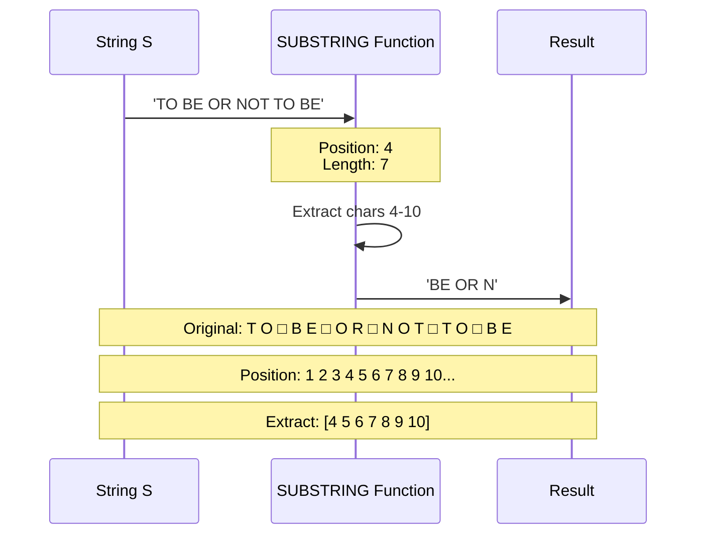

**C Implementation:**
```c
char *SUBSTR(char *STR, int i, int j) {
    int k, m = 0;
    char STRRES[80];
    
    // Extract j characters starting from position i
    for (k = i-1; k <= i+j-2; k++) {
        STRRES[m] = STR[k];
        m = m + 1;
    }
    STRRES[m] = '\0';
    return(STRRES);
}
```

**Visual Process:**
```
Original: T O   B E   O R   N O T   T O   B E
Position: 1 2 3 4 5 6 7 8 9...

SUBSTRING(S, 4, 7):
          Extract: B E   O R   N
          Result: 'BE OR N'
```

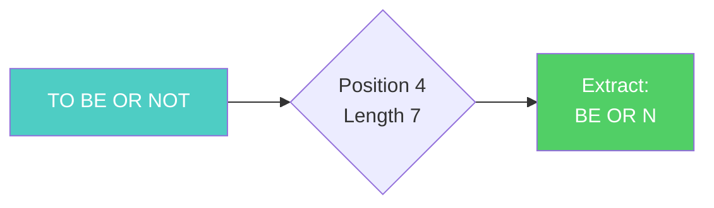

### 6.2 INDEX (Pattern Matching)

**Format**: `INDEX(text, pattern)`

**Returns**: Position where pattern first appears (0 if not found)

**Examples:**
```
T = 'HIS FATHER IS THE PROFESSOR'

INDEX(T, 'THE')  = 7   ✓ Found at position 7
INDEX(T, 'THEN') = 0   ✗ Not found
INDEX(T, ' THE') = 14  ✓ With space, position 14
```

```mermaid
flowchart TD
    Start([INDEX&#40;T, P&#41;]) --> Init[K = 1]
    Init --> Loop{K ≤ MAX?}
    Loop -->|No| NotFound[Return 0]
    Loop -->|Yes| Compare[Compare P<br/>with T[K...K+r-1]]
    Compare --> Match{Full Match?}
    Match -->|Yes| Found[Return K]
    Match -->|No| Inc[K = K + 1]
    Inc --> Loop
    
    style Start fill:#4ecdc4
    style Found fill:#51cf66,color:#fff
    style NotFound fill:#ff6b6b,color:#fff
```

**Visual Search:**
```
T = H I S   F A T H E R   I S   T H E   P R O F E S S O R
    1 2 3 4 5 6 7 8 9...              14 15 16

Pattern 'THE':
                                      ↓ Match!
                                    T H E
Position = 14 (with leading space)
```

**C Implementation:**
```c
int INDEX(char *STR1, char *STR2) {
    int m, n, index, flag;
    
    for (m = 0; m < strlen(STR1); m++) {
        index = m;
        flag = 1;
        
        for (n = 0; n < strlen(STR2); n++) {
            if (STR1[m+n] == STR2[n])
                continue;
            else {
                flag = 0;
                break;
            }
        }
        
        if (flag == 1)
            return(index);
    }
    return(-1);  // Not found
}
```

### 6.3 CONCATENATION

**Format**: `S1 // S2`

**C Function**: `strcat(S1, S2)`

**Examples:**
```c
S1 = 'MARK'
S2 = 'TWAIN'

S1 // S2 = 'MARKTWAIN'
S1 // ' ' // S2 = 'MARK TWAIN'
```

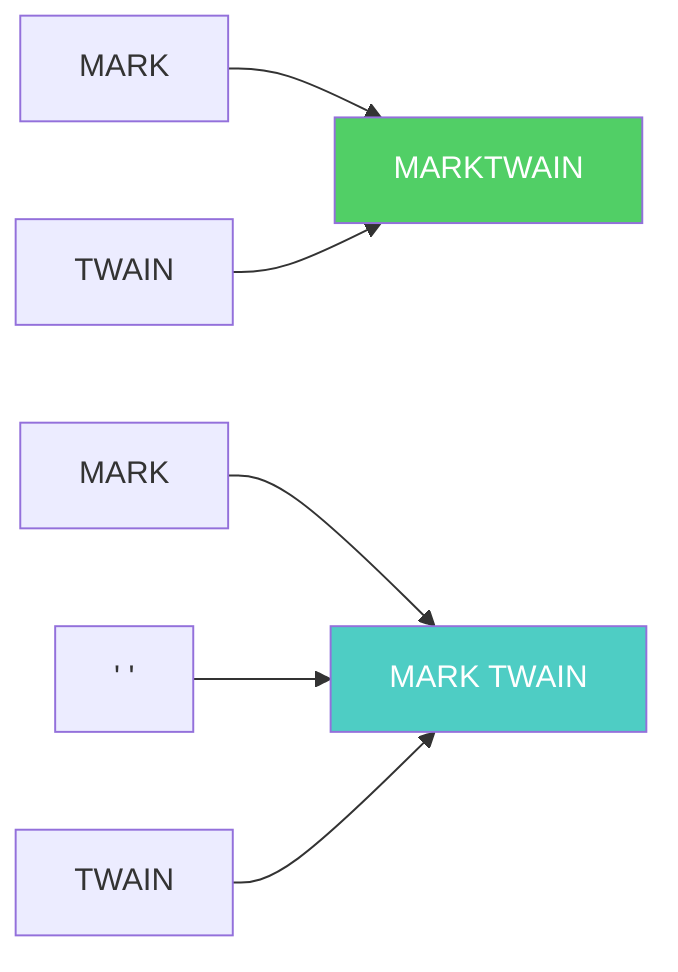

**Visual Process:**
```
[MARK] // [TWAIN] = MARKTWAIN

[MARK] // [ ] // [TWAIN] = MARK TWAIN
```

**C Implementation:**
```c
#include <string.h>

char S1[80] = "MARK";
char S2[80] = "TWAIN";

strcat(S1, S2);  // S1 now contains "MARKTWAIN"

// For spaced concatenation:
strcat(strcat(S1, " "), S2);  // "MARK TWAIN"
```

### 6.4 LENGTH

**Format**: `LENGTH(string)`

**C Function**: `strlen(string)`

**Examples:**
```c
S = 'COMPUTER'
LENGTH(S) = 8

strlen("MARC TWAIN") = 10  // Counts the space
```

**Character Counting:**
```
C O M P U T E R
1 2 3 4 5 6 7 8  → Length = 8

M A R C   T W A I N
1 2 3 4 5 6 7 8 9 10  → Length = 10
```

```mermaid
flowchart LR
    S1[COMPUTER] --> L1[Count = 8]
    S2[MARC TWAIN] --> L2[Count = 10<br/>includes space]
    
    style L1 fill:#51cf66,color:#fff
    style L2 fill:#4ecdc4,color:#fff
```

**C Implementation:**
```c
#include <string.h>

char S1[80] = "COMPUTER";
int len = strlen(S1);  // len = 8
```

---

## 7. Word/Text Processing

### Core Operations

```mermaid
graph TD
    A[Text Processing] --> B[INSERT]
    A --> C[DELETE]
    A --> D[REPLACE]
    
    B --> B1[Add at position]
    C --> C1[Remove portion]
    D --> D1[Find & swap]
    
    B1 --> E[Split → Insert → Join]
    C1 --> F[Keep prefix & suffix]
    D1 --> G[DELETE → INSERT]
    
    style A fill:#4ecdc4,color:#fff
```

#### 7.1 INSERTION

**Format**: `INSERT(text, position, string)`

**Definition**: Inserts string S at position K in text T

**Examples:**
```
INSERT('ABCDEFG', 3, 'XYZ') = 'ABXYZCDEFG'
                   ↑ Insert here

INSERT('ABCDEFG', 6, 'XYZ') = 'ABCDEXYZFG'
                        ↑ Insert here
```

```mermaid
stateDiagram-v2
    [*] --> Original: ABCDEFG
    Original --> Split: Position 3
    Split --> Prefix: AB
    Split --> Suffix: CDEFG
    Prefix --> Insert: Add XYZ
    Suffix --> Insert
    Insert --> Result: ABXYZCDEFG
    Result --> [*]
    
    note right of Split
        Split at position K
        Prefix: chars 1 to K-1
        Suffix: chars K to end
    end note
```

**Visual Process:**
```
Original: A B C D E F G
          1 2 3 4 5 6 7

INSERT at position 3:
Step 1: Split at position 3
        [A B] [C D E F G]
        
Step 2: Insert XYZ
        [A B] [X Y Z] [C D E F G]
        
Result: A B X Y Z C D E F G
```

**Implementation Formula:**
```
INSERT(T, K, S) = 
    SUBSTRING(T, 1, K-1) // S // SUBSTRING(T, K, LENGTH(T)-K+1)
```

```mermaid
flowchart TD
    A[INSERT Operation] --> B[Extract Prefix<br/>1 to K-1]
    A --> C[New String S]
    A --> D[Extract Suffix<br/>K to end]
    B --> E[Concatenate All]
    C --> E
    D --> E
    E --> F[Result]
    
    style A fill:#4ecdc4,color:#fff
    style F fill:#51cf66,color:#fff
```

**Breakdown:**
1. Extract prefix: Characters 1 to K-1
2. Add new string: S
3. Add suffix: Characters K to end

#### 7.2 DELETION

**Format**: `DELETE(text, position, length)`

**Definition**: Deletes L characters starting at position K

**Examples:**
```
DELETE('ABCDEFG', 4, 2) = 'ABCFG'
                  ↑  ↑
           Position 4, Delete 2 chars (D, E)

DELETE('ABCDEFG', 2, 4) = 'AFG'
                  ↑  ↑
           Position 2, Delete 4 chars (B,C,D,E)
```

```mermaid
stateDiagram-v2
    [*] --> Original: ABCDEFG
    Original --> Identify: DELETE pos 4, len 2
    Identify --> Keep1: ABC
    Identify --> Remove: DE
    Identify --> Keep2: FG
    Keep1 --> Combine
    Remove --> Discard
    Keep2 --> Combine
    Combine --> Result: ABCFG
    Result --> [*]
    
    note right of Remove
        Remove L chars
        from position K
        Range: K to K+L-1
    end note
```

**Visual Process:**
```
Original: A B C D E F G
          1 2 3 4 5 6 7

DELETE(4, 2):
        A B C [D E] F G  → Delete D, E
        A B C F G
```

**Implementation Formula:**
```
DELETE(T, K, L) = 
    SUBSTRING(T, 1, K-1) // SUBSTRING(T, K+L, LENGTH(T)-K-L+1)
```

```mermaid
flowchart LR
    A[DELETE Operation] --> B[Keep Prefix<br/>1 to K-1]
    A --> C[Remove Middle<br/>K to K+L-1]
    A --> D[Keep Suffix<br/>K+L to end]
    B --> E[Join Prefix+Suffix]
    D --> E
    E --> F[Result]
    
    style C fill:#ff6b6b,color:#fff
    style F fill:#51cf66,color:#fff
```

**Special Case:**
```
DELETE(T, 0, L) = T  (No deletion when K=0)
```

**Pattern Deletion:**
```
DELETE(T, INDEX(T, P), LENGTH(P))
```
Deletes first occurrence of pattern P from text T.

#### 7.3 REPLACEMENT

**Format**: `REPLACE(text, pattern1, pattern2)`

**Definition**: Replaces first occurrence of P1 with P2

**Examples:**
```
REPLACE('XABYABZ', 'AB', 'C') = 'XCYABZ'
         ↑↑                     ↑
      First AB replaced        Only first occurrence

REPLACE('XABYABZ', 'BA', 'C') = 'XABYABZ'
                                Pattern not found, no change
```

```mermaid
sequenceDiagram
    participant T as Text
    participant I as INDEX
    participant D as DELETE
    participant In as INSERT
    participant R as Result
    
    T->>I: Find 'AB' position
    I->>T: K = 2
    T->>D: DELETE(T, 2, 2)
    D->>T: 'XYABZ'
    T->>In: INSERT(T, 2, 'C')
    In->>R: 'XCYABZ'
    
    Note over T,R: REPLACE('XABYABZ', 'AB', 'C')
    Note over T,R: Step 1: Find at position 2
    Note over T,R: Step 2: Delete 'AB'
    Note over T,R: Step 3: Insert 'C'
```

**Implementation Steps:**
```
1. K := INDEX(T, P1)        Find position
2. T := DELETE(T, K, LENGTH(P1))   Delete old
3. T := INSERT(T, K, P2)    Insert new
```

**Visual Process:**
```
Original: X A B Y A B Z

Step 1: Find 'AB' → Position 2
        X [A B] Y A B Z

Step 2: Delete 'AB'
        X Y A B Z

Step 3: Insert 'C' at position 2
        X C Y A B Z

Result: XCYABZ
```

```mermaid
flowchart TD
    Start([REPLACE&#40;T,P1,P2&#41;]) --> Find[K = INDEX&#40;T,P1&#41;]
    Find --> Check{K = 0?}
    Check -->|Yes| NoChange[Return T unchanged]
    Check -->|No| Del[T = DELETE&#40;T,K,LENGTH&#40;P1&#41;&#41;]
    Del --> Ins[T = INSERT&#40;T,K,P2&#41;]
    Ins --> Done[Return T]
    
    style Start fill:#4ecdc4
    style Done fill:#51cf66,color:#fff
    style NoChange fill:#ffe66d
```

### Algorithm 3.1: Delete All Occurrences

**Purpose**: Delete every occurrence of pattern P in text T

```
Algorithm DELETE_ALL(T, P):
1. K := INDEX(T, P)
2. WHILE K ≠ 0:
   a. T := DELETE(T, K, LENGTH(P))
   b. K := INDEX(T, P)
3. OUTPUT T
```

```mermaid
flowchart TD
    Start([DELETE_ALL&#40;T,P&#41;]) --> Find[K = INDEX&#40;T,P&#41;]
    Find --> Loop{K ≠ 0?}
    Loop -->|No| Output[OUTPUT T]
    Loop -->|Yes| Del[T = DELETE&#40;T,K,LENGTH&#40;P&#41;&#41;]
    Del --> Find
    Output --> End([End])
    
    style Start fill:#4ecdc4
    style Del fill:#ff6b6b,color:#fff
    style Output fill:#51cf66,color:#fff
```

**Example Execution:**
```
Initial: T = 'XABYABZ', P = 'AB'

Iteration 1:
  K = 1 (AB at position 1)
  Delete: T = 'XYABZ'

Iteration 2:
  K = 3 (AB at position 3)
  Delete: T = 'XYZ'

Iteration 3:
  K = 0 (no more AB)
  STOP

Output: XYZ
```

```mermaid
stateDiagram-v2
    [*] --> State1: T='XABYABZ'
    State1 --> State2: DELETE 'AB' at pos 1
    State2 --> State3: T='XYABZ'
    State3 --> State4: DELETE 'AB' at pos 3
    State4 --> Final: T='XYZ'
    Final --> [*]: No more 'AB'
    
    note right of State1
        Initial text
        Find 'AB' at position 1
    end note
    
    note right of State3
        After first deletion
        Find 'AB' at position 3
    end note
```

**Important Case:**
```
T = 'XAAABBBY', P = 'AB'

Loop executes 3 times even though P appears once initially!

Iteration 1: XAABBY  (deleted first AB)
Iteration 2: XABY   (new AB formed!)
Iteration 3: XY     (deleted final AB)
```

### Algorithm 3.2: Replace All Occurrences

**Purpose**: Replace every occurrence of P with Q

```
Algorithm REPLACE_ALL(T, P, Q):
1. K := INDEX(T, P)
2. WHILE K ≠ 0:
   a. T := REPLACE(T, P, Q)
   b. K := INDEX(T, P)
3. OUTPUT T
```

```mermaid
flowchart TD
    Start([REPLACE_ALL&#40;T,P,Q&#41;]) --> Find[K = INDEX&#40;T,P&#41;]
    Find --> Loop{K ≠ 0?}
    Loop -->|No| Output[OUTPUT T]
    Loop -->|Yes| Check{LENGTH&#40;Q&#41;<br/>< LENGTH&#40;P&#41;?}
    Check -->|Yes| Safe[T = REPLACE&#40;T,P,Q&#41;]
    Check -->|No| Danger[⚠️ May not terminate!]
    Safe --> Find
    Danger --> Infinite[Infinite Loop]
    Output --> End([End])
    
    style Start fill:#4ecdc4
    style Danger fill:#ff6b6b,color:#fff
    style Infinite fill:#ff6b6b,color:#fff
    style Safe fill:#51cf66,color:#fff
    style Output fill:#51cf66,color:#fff
```

**⚠️ WARNING**: This may not terminate!

**Safe Case:**
```
T = 'XABYABZ', P = 'AB', Q = 'C'

Iteration 1: XCYABZ
Iteration 2: XCYCZ
Output: XCYCZ ✓ Terminates
```

**Dangerous Case:**
```
T = 'XAY', P = 'A', Q = 'AB'

Iteration 1: XABY    (A → AB)
Iteration 2: XABBY   (A → AB again!)
Iteration 3: XABBBY  (infinite loop!)
...never terminates because P is substring of Q
```

```mermaid
graph TD
    A[REPLACE_ALL Safety] --> B{LENGTH&#40;Q&#41; vs LENGTH&#40;P&#41;}
    B -->|Q < P| C[✓ Safe - Always terminates]
    B -->|Q = P| D[✓ Safe - String doesn't grow]
    B -->|Q > P| E[⚠️ Dangerous]
    
    E --> F{Is P substring of Q?}
    F -->|Yes| G[✗ Infinite Loop!]
    F -->|No| H[✓ May be safe]
    
    style C fill:#51cf66,color:#fff
    style D fill:#51cf66,color:#fff
    style G fill:#ff6b6b,color:#fff
```

**Safe Condition**: Algorithm terminates if `LENGTH(Q) < LENGTH(P)`

---

## 8. Pattern Matching Algorithms

### Problem Statement
Given:
- Pattern P (length r)
- Text T (length s)
Find: Does P appear in T? If yes, where?

```mermaid
graph LR
    A[Pattern Matching Problem] --> B[Input]
    A --> C[Output]
    
    B --> B1[Pattern P<br/>length r]
    B --> B2[Text T<br/>length s]
    
    C --> C1[Position K<br/>if found]
    C --> C2[0 if not found]
    
    style A fill:#4ecdc4,color:#fff
```

### 8.1 First Algorithm (Brute Force)

**Concept**: Compare P with each substring of T

**Visual Example:**
```
P = 'bab' (length 4)
T = 'aabbbabb' (length 20)

Substrings to check:
W₁ = T[1]T[2]T[3]T[4]
W₂ = T[2]T[3]T[4]T[5]
...
W₁₇ = T[17]T[18]T[19]T[20]

MAX = s - r + 1 = 20 - 4 + 1 = 17 substrings
```

```mermaid
flowchart LR
    T[Text: aabbbabb] --> W1[W₁: aabb]
    T --> W2[W₂: abbb]
    T --> W3[W₃: bbba]
    T --> W4[W₄: bbab]
    T --> W5[W₅: babb ✓]
    
    P[Pattern: bab] -.compare.-> W1
    P -.compare.-> W2
    P -.compare.-> W3
    P -.compare.-> W4
    P -.match!.-> W5
    
    style W5 fill:#51cf66,color:#fff
    style P fill:#4ecdc4,color:#fff
```

**Algorithm 3.3: Pattern Matching (Brute Force)**

```
INPUT: P (pattern, length R), T (text, length S)
OUTPUT: INDEX (position of P in T, or 0)

1. K := 1
   MAX := S - R + 1

2. WHILE K ≤ MAX:
   
   3. FOR L = 1 TO R:
      IF P[L] ≠ T[K+L-1] THEN
         GOTO Step 5
   
   4. [Success]
      INDEX := K
      EXIT
   
   5. K := K + 1

6. [Failure]
   INDEX := 0

7. EXIT
```

```mermaid
flowchart TD
    Start([Algorithm 3.3<br/>Brute Force]) --> Init[K=1<br/>MAX=S-R+1]
    Init --> OuterLoop{K ≤ MAX?}
    OuterLoop -->|No| Fail[INDEX = 0<br/>Not Found]
    OuterLoop -->|Yes| InnerLoop[L = 1 to R]
    InnerLoop --> Compare{P[L] =<br/>T[K+L-1]?}
    Compare -->|No| NextK[K = K+1]
    Compare -->|Yes| CheckL{L = R?}
    CheckL -->|No| InnerLoop
    CheckL -->|Yes| Success[INDEX = K<br/>Found!]
    NextK --> OuterLoop
    
    style Start fill:#4ecdc4
    style Success fill:#51cf66,color:#fff
    style Fail fill:#ff6b6b,color:#fff
```

**Detailed Example:**
```
P = 'bab'
T = 'aabbbabb'

Step-by-step:
K=1: aab vs bab → a≠b, continue
K=2: abb vs bab → a≠b, continue
K=3: bbb vs bab → b=b, b=b, b≠a, continue
K=4: bba vs bab → b=b, b=b, a≠b, continue
K=5: bab vs bab → b=b, a=a, b=b ✓ MATCH!

INDEX = 5
```

**Visual Matching Process:**
```
T: a a b b b a b b
P:     b a b
   ✗

T: a a b b b a b b
P:       b a b
     ✗

T: a a b b b a b b
P:         b a b
       ✗

T: a a b b b a b b
P:           b a b
         ✓ MATCH at position 5
```

```mermaid
gantt
    title Brute Force Pattern Matching Execution
    dateFormat X
    axisFormat %s
    
    section K=1
    Compare a≠b: 0, 1
    
    section K=2
    Compare a≠b: 1, 2
    
    section K=3
    b=b, b=b, b≠a: 2, 5
    
    section K=4
    b=b, b=b, a≠b: 5, 8
    
    section K=5
    b=b, a=a, b=b MATCH!: crit, 8, 11
```

### Complexity Analysis

**Best Case:**
```
P found immediately: C(n) = r comparisons
Example: P = 'TO', T = 'TO BE...'
Only need to check first substring
```

**Worst Case:**
```
P = 'aaab'
T = 'aaaa...aaa' (20 a's)

Every substring requires r comparisons!
C(n) = r × (s-r+1)
     = r × (n-2r+1)  where n = r+s

Maximum when r = (n+1)/4
C(n) = (n+1)²/8 = O(n²)
```

```mermaid
flowchart LR
    Start["Brute Force Complexity"] --> Best["Best: O(r) comparisons\n(found immediately)"]
    Start --> Avg["Average: grows with n\n(depends on overlaps)"]
    Start --> Worst["Worst: O(n^2) comparisons\n(r substrings × r chars)"]

    Avg --> NoteAvg[Example: 50→1250 comparisons]
    Worst --> NoteWorst[Example: all 'a' text → quadratic]

    classDef head fill:#4ecdc4,stroke:#155e75,color:#fff,font-weight:600;
    classDef case fill:#ffffff,stroke:#475569,color:#111;
    classDef note fill:#fef9c3,stroke:#a16207,color:#111;

    class Start head;
    class Best,Avg,Worst case;
    class NoteAvg,NoteWorst note;
```

**Complexity**: **O(n²)** where n = r + s

### 8.2 Second Algorithm (KMP-style)

**Concept**: Use pattern analysis to avoid redundant comparisons

**Pattern Table Construction:**

For P = 'aaba':
```
Initial substrings:
Q₀ = Λ (empty)
Q₁ = 'a'
Q₂ = 'aa'
Q₃ = 'aab'
Q₄ = 'aaba' (complete pattern)
```

```mermaid
graph LR
    Q0[Q₀: Empty] --> Q1[Q₁: a]
    Q1 --> Q2[Q₂: aa]
    Q2 --> Q3[Q₃: aab]
    Q3 --> Q4[Q₄: aaba]
    Q4 --> P[P: Complete Match!]
    
    style Q0 fill:#ffcccc
    style Q1 fill:#ffe66d
    style Q2 fill:#ffe66d
    style Q3 fill:#ffe66d
    style Q4 fill:#4ecdc4,color:#fff
    style P fill:#51cf66,color:#fff
```

**State Transition Table:**
```
|     | a  | b  | x  |
|-----|----|----|----|
| Q0  | Q1 | Q0 | Q0 |
| Q1  | Q2 | Q0 | Q0 |
| Q2  | Q2 | Q3 | Q0 |
| Q3  | P  | Q0 | Q0 |

Legend:
- Row: Current state
- Column: Character read
- Cell: Next state
- x: Any character not in P
```

```mermaid
graph TD
    subgraph "State Transition Table for P='aaba'"
        T["
        ┌─────┬────┬────┬────┐
        │State│ a  │ b  │ x  │
        ├─────┼────┼────┼────┤
        │ Q₀  │ Q₁ │ Q₀ │ Q₀ │
        │ Q₁  │ Q₂ │ Q₀ │ Q₀ │
        │ Q₂  │ Q₂ │ Q₃ │ Q₀ │
        │ Q₃  │ P  │ Q₀ │ Q₀ │
        └─────┴────┴────┴────┘
        "]
    end
```

**State Transition Graph:**
```
        a         a         b         a
   Q₀ ────→ Q₁ ────→ Q₂ ────→ Q₃ ────→ P
    ↑        │        │        │
    │b       │b       │a       │b
    └────────┴────────┴────────┘
```

```mermaid
stateDiagram-v2
    [*] --> Q0: Start
    Q0 --> Q1: a
    Q0 --> Q0: b, x
    
    Q1 --> Q2: a
    Q1 --> Q0: b, x
    
    Q2 --> Q2: a
    Q2 --> Q3: b
    Q2 --> Q0: x
    
    Q3 --> P: a
    Q3 --> Q0: b, x
    
    P --> [*]: Match Found!
    
    note right of Q0
        Empty state
        No match yet
    end note
    
    note right of Q1
        Matched: 'a'
    end note
    
    note right of Q2
        Matched: 'aa'
    end note
    
    note right of Q3
        Matched: 'aab'
    end note
    
    note right of P
        Complete pattern!
        'aaba' matched
    end note
```

**Example Execution:**

```
T = 'abcaabaca'
P = 'aaba'

States: Q₀ → Q₁ → Q₀ → Q₀ → Q₁ → Q₂ → Q₃ → P
Chars:     a    b    c    a    a    b    a    c

Position 8 - 4 = 4 ✓ Pattern found at index 4
```

```mermaid
sequenceDiagram
    participant T as Text
    participant S as State Machine
    participant R as Result
    
    T->>S: Read 'a'
    S->>S: Q₀ → Q₁
    T->>S: Read 'b'
    S->>S: Q₁ → Q₀
    T->>S: Read 'c'
    S->>S: Q₀ → Q₀
    T->>S: Read 'a'
    S->>S: Q₀ → Q₁
    T->>S: Read 'a'
    S->>S: Q₁ → Q₂
    T->>S: Read 'b'
    S->>S: Q₂ → Q₃
    T->>S: Read 'a'
    S->>S: Q₃ → P
    S->>R: Match at position 4
    
    Note over T,R: Text: a b c a a b a c a
    Note over T,R: Pattern 'aaba' found at position 4
```

**Visual State Transitions:**
```
Input:  a  b  c  a  a  b  a  c  a
State: Q₀ Q₁ Q₀ Q₀ Q₁ Q₂ Q₃ P
        ↓  ↓  ↓  ↓  ↓  ↓  ↓  ↓
Read:   a→ b→ c→ a→ a→ b→ a→ ✓
```

**Algorithm 3.4: Fast Pattern Matching**

```
INPUT: Pattern table F(Q,T), text T (length N)
OUTPUT: INDEX

1. K := 1
   S₁ := Q₀

2. WHILE Sₖ ≠ P AND K ≤ N:
   3. Read Tₖ
   4. Sₖ₊₁ := F(Sₖ, Tₖ)
   5. K := K + 1

6. IF Sₖ = P THEN:
      INDEX := K - LENGTH(P)
   ELSE:
      INDEX := 0

7. EXIT
```

```mermaid
flowchart TD
    Start([Algorithm 3.4<br/>KMP Style]) --> Init[K=1, S₁=Q₀]
    Init --> Loop{Sₖ≠P AND<br/>K≤N?}
    Loop -->|No| Check{Sₖ = P?}
    Loop -->|Yes| Read[Read Tₖ]
    Read --> Transition[Sₖ₊₁ = F&#40;Sₖ,Tₖ&#41;]
    Transition --> Inc[K = K+1]
    Inc --> Loop
    Check -->|Yes| Found[INDEX = K-LENGTH&#40;P&#41;]
    Check -->|No| NotFound[INDEX = 0]
    
    style Start fill:#4ecdc4
    style Found fill:#51cf66,color:#fff
    style NotFound fill:#ff6b6b,color:#fff
```

**Complexity**: **O(n)** where n = LENGTH(T)

**Comparison:**
```
| Algorithm   | Complexity | Performance |
|-------------|------------|-------------|
| Brute Force | O(n²)      | Polynomial  |
| KMP-style   | O(n)       | Linear      |
```

```mermaid
flowchart TD
    Compare["Pattern Matching Options"] --> BF["Brute Force\nComplexity: O(n^2)\nGood for tiny inputs"]
    Compare --> KMP["KMP / Automata\nComplexity: O(n)\nBest for long texts"]
    BF --> BFExample["Example workload: n=100 → ~10k ops"]
    KMP --> KMPExample["Example workload: n=100 → ~100 ops"]

    classDef head fill:#4ecdc4,stroke:#155e75,color:#fff,font-weight:600;
    classDef option fill:#ffffff,stroke:#475569,color:#111;
    classDef note fill:#fef9c3,stroke:#a16207,color:#111;

    class Compare head;
    class BF,KMP option;
    class BFExample,KMPExample note;
```

```mermaid
graph TD
    A[Pattern Matching<br/>Algorithm Selection] --> B{Pattern Length}
    B -->|Short<br/>&#40;< 5 chars&#41;| C[Brute Force<br/>Simple & Fast]
    B -->|Medium<br/>&#40;5-20 chars&#41;| D{Text Length}
    B -->|Long<br/>&#40;> 20 chars&#41;| E[KMP or<br/>Boyer-Moore]
    
    D -->|Short| C
    D -->|Long| E
    
    style A fill:#4ecdc4,color:#fff
    style C fill:#ffe66d
    style E fill:#51cf66,color:#fff
```

---

## 9. Solved Problems

### Problem 3.1: String Analysis

**Question**: Let W = 'ABCD'
a) Find length
b) List all substrings
c) List initial substrings

**Solution:**

a) **Length**: 4 characters

b) **All Substrings:**
```
Length 4: ABCD
Length 3: ABC, BCD
Length 2: AB, BC, CD
Length 1: A, B, C, D
Length 0: Λ (empty string)

Total: 11 substrings
```

```mermaid
graph TD
    W[W = 'ABCD'] --> L4[Length 4: ABCD]
    W --> L3[Length 3: ABC, BCD]
    W --> L2[Length 2: AB, BC, CD]
    W --> L1[Length 1: A, B, C, D]
    W --> L0[Length 0: Λ]
    
    L4 --> T[Total: 11 substrings]
    L3 --> T
    L2 --> T
    L1 --> T
    L0 --> T
    
    style W fill:#4ecdc4,color:#fff
    style T fill:#51cf66,color:#fff
```

c) **Initial Substrings:**
```
ABCD  (entire string)
ABC   (first 3)
AB    (first 2)
A     (first 1)
Λ     (empty)
```

```mermaid
flowchart LR
    S[ABCD] --> I1[ABCD]
    S --> I2[ABC]
    S --> I3[AB]
    S --> I4[A]
    S --> I5[Λ]
    
    style S fill:#4ecdc4,color:#fff
```

### Problem 3.2: Character Representation

**Question**: How many bits needed for 48 characters (26 letters + 10 digits + 12 special)?

**Solution:**
```
Analysis:
2⁵ = 32 < 48 (insufficient)
2⁶ = 64 > 48 ✓ (minimum)
2⁷ = 128 (ASCII standard)
2⁸ = 256 (EBCDIC, common)

Answer: Minimum 6 bits, typically 7 or 8 bits
```

```mermaid
graph LR
    A[48 Characters] --> B{Bits Needed}
    B --> C[2⁵=32 ✗]
    B --> D[2⁶=64 ✓]
    B --> E[2⁷=128 ASCII]
    B --> F[2⁸=256 EBCDIC]
    
    C --> C1[Insufficient]
    D --> D1[Minimum]
    E --> E1[Standard]
    F --> F1[Common]
    
    style C fill:#ff6b6b,color:#fff
    style D fill:#51cf66,color:#fff
    style E fill:#4ecdc4,color:#fff
    style F fill:#4ecdc4,color:#fff
```

### Problem 3.8: String Operations

Given: S = 'JOHN PAUL JONES', T = 'A THING OF BEAUTY...'

**Find:**
```
a) LENGTH(S) = 15
   J O H N □ P A U L □ J O N E S
   1 2 3 4 5 6 7 8 9...      15

b) LENGTH(T) = 35
```

### Problem 3.9: SUBSTRING Examples

```
S = 'JOHN PAUL JONES'

a) SUBSTRING(S, 4, 8)
   Position 4, extract 8 chars:
   N □ P A U L □ J
   Result: 'N PAUL J'

T = 'A THING OF BEAUTY...'

b) SUBSTRING(T, 10, 5)
   Position 10, extract 5 chars:
   Result: 'F BEA'
```

```mermaid
flowchart TD
    S["S = 'JOHN PAUL JONES'"] --> Op1[SUBSTRING&#40;S,4,8&#41;]
    Op1 --> R1["Result: 'N PAUL J'"]
    
    T["T = 'A THING OF BEAUTY...'"] --> Op2[SUBSTRING&#40;T,10,5&#41;]
    Op2 --> R2["Result: 'F BEA'"]
    
    style R1 fill:#51cf66,color:#fff
    style R2 fill:#51cf66,color:#fff
```

### Problem 3.10: INDEX Function

```
S = 'JOHN PAUL JONES'

a) INDEX(S, 'JO') = 1  (first position)
b) INDEX(S, 'JOY') = 0  (not found)
c) INDEX(S, ' JO') = 10  (with space)

T = 'A THING OF BEAUTY IS A JOY FOREVER'

d) INDEX(T, 'A') = 1  (first 'A')
e) INDEX(T, ' A') = 21  (space before 'A')
f) INDEX(T, 'THE') = 0  (not in text)
```

```mermaid
graph TD
    S["S = 'JOHN PAUL JONES'"] --> I1["INDEX&#40;S,'JO'&#41; = 1 ✓"]
    S --> I2["INDEX&#40;S,'JOY'&#41; = 0 ✗"]
    S --> I3["INDEX&#40;S,' JO'&#41; = 10 ✓"]
    
    T["T = 'A THING OF BEAUTY...'"] --> I4["INDEX&#40;T,'A'&#41; = 1 ✓"]
    T --> I5["INDEX&#40;T,' A'&#41; = 21 ✓"]
    T --> I6["INDEX&#40;T,'THE'&#41; = 0 ✗"]
    
    style I1 fill:#51cf66,color:#fff
    style I2 fill:#ff6b6b,color:#fff
    style I3 fill:#51cf66,color:#fff
    style I4 fill:#51cf66,color:#fff
    style I5 fill:#51cf66,color:#fff
    style I6 fill:#ff6b6b,color:#fff
```

### Problem 3.11: Concatenation

```c
// C Implementation

a) 'THE' // 'END' = 'THEEND'

b) 'THE' // ' ' // 'END' = 'THE END'

S = 'JOHN PAUL JONES'
T = 'A THING OF BEAUTY...'

c) SUBSTRING(S, 11, 5) // ',' // SUBSTRING(S, 1, 9)
   = 'JONES' // ',' // 'JOHN PAUL'
   = 'JONES, JOHN PAUL'

d) SUBSTRING(T, 28, 3) // 'GIVEN'
   = 'FOR' // 'GIVEN'
   = 'FORGIVEN'
```

```mermaid
flowchart LR
    A['THE'] --> C1['THEEND']
    B['END'] --> C1
    
    D['THE'] --> C2['THE END']
    E[' '] --> C2
    F['END'] --> C2
    
    style C1 fill:#ffe66d
    style C2 fill:#51cf66,color:#fff
```

### Problem 3.12: INSERT Operations

```
a) INSERT('AAAAA', 1, 'BBB')
   Insert at position 1:
   BBB AAAAA
   Result: 'BBBAAAAA'

b) INSERT('AAAAA', 3, 'BBB')
   A A [BBB] AAA
   Result: 'AABBBAAA'

c) INSERT('AAAAA', 6, 'BBB')
   AAAAA [BBB]
   Result: 'AAAAABBB'

T = 'THE STUDENT IS ILL.'

d) Change to 'The student is very ill.'
   INSERT(T, 15, 'VERY ')
   
e) Change to 'The student is ill today.'
   INSERT(T, 19, ' TODAY')
   
f) Change to 'The student is very ill today.'
   INSERT(INSERT(T, 19, ' TODAY'), 15, 'VERY ')
```

```mermaid
stateDiagram-v2
    [*] --> Original: AAAAA
    Original --> Insert1: INSERT at pos 1
    Insert1 --> Result1: BBBAAAAA
    
    Original --> Insert2: INSERT at pos 3
    Insert2 --> Result2: AABBBAAA
    
    Original --> Insert3: INSERT at pos 6
    Insert3 --> Result3: AAAAABBB
    
    note right of Insert1
        Insert 'BBB' before position 1
        Prepend to string
    end note
    
    note right of Insert2
        Insert 'BBB' at position 3
        Split: AA + BBB + AAA
    end note
    
    note right of Insert3
        Insert 'BBB' at position 6
        Append to string
    end note
```

### Problem 3.13: DELETE and REPLACE

```
a) DELETE('AAABBB', 2, 2)
   A [AA] BBB → Delete 2 chars from position 2
   Result: 'ABBB'

b) DELETE('JOHN PAUL JONES', 6, 5)
   JOHN [PAUL ] JONES → Delete 5 chars from position 6
   Result: 'JOHN JONES'

c) REPLACE('AAABBB', 'AA', 'BB')
   [AA] ABBB → Replace first 'AA' with 'BB'
   Result: 'BBABBB'

d) REPLACE('JOHN PAUL JONES', 'PAUL', 'DAVID')
   JOHN [PAUL] JONES → Replace 'PAUL' with 'DAVID'
   Result: 'JOHN DAVID JONES'
```

```mermaid
flowchart TD
    subgraph "DELETE Operations"
        D1["DELETE&#40;'AAABBB',2,2&#41;"] --> DR1["'ABBB'"]
        D2["DELETE&#40;'JOHN PAUL JONES',6,5&#41;"] --> DR2["'JOHN JONES'"]
    end
    
    subgraph "REPLACE Operations"
        R1["REPLACE&#40;'AAABBB','AA','BB'&#41;"] --> RR1["'BBABBB'"]
        R2["REPLACE&#40;'JOHN PAUL JONES','PAUL','DAVID'&#41;"] --> RR2["'JOHN DAVID JONES'"]
    end
    
    style DR1 fill:#51cf66,color:#fff
    style DR2 fill:#51cf66,color:#fff
    style RR1 fill:#4ecdc4,color:#fff
    style RR2 fill:#4ecdc4,color:#fff
```

### Problem 3.18: Pattern Matching Complexity

**Analysis of comparison counts:**

```
a) P = 'abc', T = 'ababababab' (10 chars)
   
   Comparisons per substring:
   W₁: ab... → 2 comparisons (a=a, b≠b at P[2])
   W₂: ba... → 1 comparison (b≠a)
   W₃: ab... → 2 comparisons
   W₄: ba... → 1 comparison
   W₅: ab... → 2 comparisons
   W₆: ba... → 1 comparison
   W₇: ab... → 2 comparisons
   W₈: ba... → 1 comparison
   
   C = 2+1+2+1+2+1+2+1 = 12 comparisons
   INDEX = 0 (not found)

b) P = 'abc', T = (ab)²ⁿ (length 4n)
   
   Number of substrings: 4n - 3 + 1 = 4n - 2
   Pattern: 2, 1, 2, 1, 2, 1...
   
   C = (2n-1)×2 + (2n-1)×1 = (2n-1)×3 = 6n - 3
   INDEX = 0

c) P = 'aaa', T = 'aabbaabbaabb' (12 chars)
   
   W₁: aab → 3 comparisons
   W₂: abb → 2 comparisons
   W₃: bba → 1 comparison
   W₄: baa → 1 comparison
   W₅: aab → 3 comparisons
   W₆: abb → 2 comparisons
   W₇: bba → 1 comparison
   W₈: baa → 1 comparison
   W₉: aab → 3 comparisons
   W₁₀: abb → 2 comparisons
   
   C = 3+2+1+1+3+2+1+1+3+2 = 19 comparisons
   INDEX = 0

d) P = 'aaa', T = 'abaabbaaabbbaaaabbbb'
   
   W₁: aba → 2 comparisons
   W₂: baa → 1 comparison
   W₃: aab → 3 comparisons
   W₄: abb → 2 comparisons
   W₅: bba → 1 comparison
   W₆: baa → 1 comparison
   W₇: aaa → 3 comparisons ✓ MATCH!
   
   C = 2+1+3+2+1+1+3 = 13 comparisons
   INDEX = 7
```

```mermaid
gantt
    title Problem 3.18(d): Pattern Matching Execution
    dateFormat X
    axisFormat %s
    
    section K=1
    W₁ 2 comps: 0, 2
    
    section K=2
    W₂ 1 comp: 2, 3
    
    section K=3
    W₃ 3 comps: 3, 6
    
    section K=4
    W₄ 2 comps: 6, 8
    
    section K=5
    W₅ 1 comp: 8, 9
    
    section K=6
    W₆ 1 comp: 9, 10
    
    section K=7
    W₇ MATCH 3 comps: crit, 10, 13
```

### Problem 3.20: State Table Construction

**Question**: Create table for P = 'aaabb'

**Solution:**

**Initial Substrings:**
```
Q₀ = Λ
Q₁ = a
Q₂ = aa
Q₃ = aaa
Q₄ = aaab
Q₅ = aaabb (P)
```

```mermaid
graph LR
    Q0[Q₀: Λ] --> Q1[Q₁: a]
    Q1 --> Q2[Q₂: aa]
    Q2 --> Q3[Q₃: aaa]
    Q3 --> Q4[Q₄: aaab]
    Q4 --> Q5[Q₅: aaabb]
    
    style Q0 fill:#ffcccc
    style Q1 fill:#ffe66d
    style Q2 fill:#ffe66d
    style Q3 fill:#ffe66d
    style Q4 fill:#4ecdc4,color:#fff
    style Q5 fill:#51cf66,color:#fff
```

**State Transition Table:**
```
┌────┬────┬────┬────┐
│    │ a  │ b  │ x  │
├────┼────┼────┼────┤
│ Q₀ │ Q₁ │ Q₀ │ Q₀ │  Empty → read 'a' → Q₁
│ Q₁ │ Q₂ │ Q₀ │ Q₀ │  'a' → read 'a' → Q₂
│ Q₂ │ Q₃ │ Q₀ │ Q₀ │  'aa' → read 'a' → Q₃
│ Q₃ │ Q₃ │ Q₄ │ Q₀ │  'aaa' → read 'b' → Q₄
│ Q₄ │ Q₁ │ P  │ Q₀ │  'aaab' → read 'b' → P!
└────┴────┴────┴────┘
```

**State Transition Graph:**
```
     a       a       a       b       b
Q₀ ───→ Q₁ ───→ Q₂ ───→ Q₃ ───→ Q₄ ───→ P
 ↑      │       │       ↓       │
 │b     │b      │b      a       │a
 └──────┴───────┴───────────────┘
```

```mermaid
stateDiagram-v2
    [*] --> Q0
    Q0 --> Q1: a
    Q0 --> Q0: b, x
    
    Q1 --> Q2: a
    Q1 --> Q0: b, x
    
    Q2 --> Q3: a
    Q2 --> Q0: b, x
    
    Q3 --> Q3: a
    Q3 --> Q4: b
    Q3 --> Q0: x
    
    Q4 --> Q1: a
    Q4 --> P: b
    Q4 --> Q0: x
    
    P --> [*]: Success!
    
    note right of Q3
        On 'a': Stay at Q₃
        Still have 'aaa'
    end note
    
    note right of Q4
        On 'a': Go to Q₁
        Partial match restart
    end note
```

**Explanation of transitions:**
- From Q₃ on 'a': Stay at Q₃ (still have 'aaa')
- From Q₄ on 'a': Go to Q₁ (partial match 'aaaba' → restart with 'a')
- From Q₄ on 'b': Success! Go to P (complete pattern)

### Problem 3.21: Pattern 'ababab'

**Initial Substrings:**
```
Q₀ = Λ
Q₁ = a
Q₂ = ab
Q₃ = aba
Q₄ = abab
Q₅ = ababa
Q₆ = ababab (P)
```

```mermaid
flowchart LR
    Q0[Q₀] -->|a| Q1[Q₁]
    Q1 -->|b| Q2[Q₂]
    Q2 -->|a| Q3[Q₃]
    Q3 -->|b| Q4[Q₄]
    Q4 -->|a| Q5[Q₅]
    Q5 -->|b| Q6[Q₆ - P]
    
    style Q0 fill:#ffcccc
    style Q6 fill:#51cf66,color:#fff
```

**State Transition Table:**
```
┌────┬────┬────┐
│    │ a  │ b  │
├────┼────┼────┤
│ Q₀ │ Q₁ │ Q₀ │
│ Q₁ │ Q₁ │ Q₂ │
│ Q₂ │ Q₃ │ Q₀ │
│ Q₃ │ Q₁ │ Q₄ │
│ Q₄ │ Q₅ │ Q₀ │
│ Q₅ │ Q₁ │ P  │
└────┴────┴────┘
```

**State Transition Graph:**
```
     a       b       a       b       a       b
Q₀ ───→ Q₁ ───→ Q₂ ───→ Q₃ ───→ Q₄ ───→ Q₅ ───→ P
 ↑      ↓       │       │       │       │
 │b     └a──────┘b      │a      │b      │a
 └──────────────────────┴───────┴───────┘
```

```mermaid
stateDiagram-v2
    [*] --> Q0
    Q0 --> Q1: a
    Q0 --> Q0: b
    
    Q1 --> Q1: a
    Q1 --> Q2: b
    
    Q2 --> Q3: a
    Q2 --> Q0: b
    
    Q3 --> Q1: a
    Q3 --> Q4: b
    
    Q4 --> Q5: a
    Q4 --> Q0: b
    
    Q5 --> Q1: a
    Q5 --> P: b
    
    P --> [*]: Match!
    
    note right of Q1
        On 'a': Loop at Q₁
        Consecutive a's
    end note
    
    note right of Q3
        On 'a': Back to Q₁
        Restart partial match
    end note
```

**Key Features:**
- Pattern has repeating structure
- Multiple back-transitions due to overlap
- Q₁ loops on 'a' (consecutive a's)

---

## 10. Programming Exercises

### Complete C Programs

#### Program 1: SUBSTRING Implementation

```c
/* Complete implementation of SUBSTRING function */
#include <stdio.h>
#include <string.h>

char* SUBSTR(char *STR, int i, int j) {
    static char STRRES[80];
    int k, m = 0;
    
    // Extract j characters starting from position i
    for (k = i-1; k <= i+j-2; k++) {
        STRRES[m] = STR[k];
        m++;
    }
    STRRES[m] = '\0';
    return STRRES;
}

int main() {
    char S[] = "TO BE OR NOT TO BE";
    
    printf("Original: %s\n", S);
    printf("SUBSTRING(S,4,7): %s\n", SUBSTR(S, 4, 7));
    printf("SUBSTRING(S,1,5): %s\n", SUBSTR(S, 1, 5));
    
    return 0;
}

/* Output:
Original: TO BE OR NOT TO BE
SUBSTRING(S,4,7): BE OR N
SUBSTRING(S,1,5): TO BE
*/
```

```mermaid
flowchart TD
    Start([SUBSTR Function]) --> Input[Input: STR, i, j]
    Input --> Init[Initialize m=0]
    Init --> Loop[for k = i-1 to i+j-2]
    Loop --> Copy[STRRES[m] = STR[k]]
    Copy --> Inc[m++]
    Inc --> Check{More chars?}
    Check -->|Yes| Loop
    Check -->|No| Term[Add '\0']
    Term --> Return[Return STRRES]
    
    style Start fill:#4ecdc4
    style Return fill:#51cf66,color:#fff
```

#### Program 2: INDEX Function

```c
/* Complete INDEX (pattern matching) implementation */
#include <stdio.h>
#include <string.h>

int INDEX(char *STR1, char *STR2) {
    int m, n, index, flag;
    
    for (m = 0; m < strlen(STR1); m++) {
        index = m;
        flag = 1;
        
        // Check if pattern matches at position m
        for (n = 0; n < strlen(STR2); n++) {
            if (STR1[m+n] != STR2[n]) {
                flag = 0;
                break;
            }
        }
        
        if (flag == 1)
            return index + 1;  // Return 1-indexed position
    }
    return 0;  // Pattern not found
}

int main() {
    char T[] = "HIS FATHER IS THE PROFESSOR";
    
    printf("Text: %s\n\n", T);
    printf("INDEX(T,'THE'): %d\n", INDEX(T, "THE"));
    printf("INDEX(T,'THEN'): %d\n", INDEX(T, "THEN"));
    printf("INDEX(T,' THE '): %d\n", INDEX(T, " THE "));
    
    return 0;
}

/* Output:
Text: HIS FATHER IS THE PROFESSOR

INDEX(T,'THE'): 15
INDEX(T,'THEN'): 0
INDEX(T,' THE '): 14
*/
```

```mermaid
flowchart TD
    Start([INDEX Function]) --> OuterLoop[for m in text]
    OuterLoop --> SetFlag[flag = 1]
    SetFlag --> InnerLoop[for n in pattern]
    InnerLoop --> Compare{STR1[m+n]<br/>== STR2[n]?}
    Compare -->|No| SetFalse[flag = 0, break]
    Compare -->|Yes| NextChar[Continue]
    NextChar --> InnerLoop
    SetFalse --> CheckFlag{flag == 1?}
    InnerLoop --> CheckFlag
    CheckFlag -->|Yes| Found[return m+1]
    CheckFlag -->|No| NextPos[m++]
    NextPos --> OuterLoop
    OuterLoop --> NotFound[return 0]
    
    style Start fill:#4ecdc4
    style Found fill:#51cf66,color:#fff
    style NotFound fill:#ff6b6b,color:#fff
```

#### Program 3: String Concatenation

```c
/* Complete CONCATENATION implementation */
#include <stdio.h>
#include <string.h>

int main() {
    char S1[80] = "MARK";
    char S2[80] = "TWAIN";
    char S3[80], S4[80];
    
    // Simple concatenation
    strcpy(S3, S1);
    strcat(S3, S2);
    printf("S1//S2: %s\n", S3);
    
    // Concatenation with space
    strcpy(S4, S1);
    strcat(S4, " ");
    strcat(S4, S2);
    printf("S1//' '//S2: %s\n", S4);
    
    return 0;
}

/* Output:
S1//S2: MARKTWAIN
S1//' '//S2: MARK TWAIN
*/
```

#### Program 4: Complete INSERT, DELETE, REPLACE

```c
/* Complete text processing operations */
#include <stdio.h>
#include <string.h>

// Helper function: SUBSTRING
char* SUBSTR(char *STR, int i, int j) {
    static char STRRES[80];
    int k, m = 0;
    
    for (k = i-1; k <= i+j-2; k++) {
        STRRES[m] = STR[k];
        m++;
    }
    STRRES[m] = '\0';
    return STRRES;
}

// INSERT function
char* INSERT(char *S1, int K, char *S2) {
    static char RESULT[80];
    
    // Part before insertion point
    strcpy(RESULT, SUBSTR(S1, 1, K-1));
    
    // Insert string
    strcat(RESULT, S2);
    
    // Part after insertion point
    strcat(RESULT, SUBSTR(S1, K, strlen(S1)-K+1));
    
    return RESULT;
}

// DELETE function
char* DELETE(char *S1, int K, int L) {
    static char RESULT[80];
    
    if (K == 0) {
        strcpy(RESULT, S1);
        return RESULT;
    }
    
    // Part before deletion
    strcpy(RESULT, SUBSTR(S1, 1, K-1));
    
    // Part after deletion
    strcat(RESULT, SUBSTR(S1, K+L, strlen(S1)-K-L+1));
    
    return RESULT;
}

// INDEX function
int INDEX_STR(char *STR1, char *STR2) {
    int m, n, flag;
    
    for (m = 0; m < strlen(STR1); m++) {
        flag = 1;
        for (n = 0; n < strlen(STR2); n++) {
            if (STR1[m+n] != STR2[n]) {
                flag = 0;
                break;
            }
        }
        if (flag == 1)
            return m + 1;
    }
    return 0;
}

// REPLACE function
char* REPLACE(char *S1, char *S2, char *S3) {
    static char RES1[80], RES2[80];
    int K;
    
    K = INDEX_STR(S1, S2);
    
    if (K == 0) {
        strcpy(RES2, S1);
        return RES2;
    }
    
    strcpy(RES1, DELETE(S1, K, strlen(S2)));
    strcpy(RES2, INSERT(RES1, K, S3));
    
    return RES2;
}

int main() {
    char S[] = "ABCDEFG";
    
    printf("Original: %s\n\n", S);
    
    // INSERT examples
    printf("INSERT Operations:\n");
    printf("INSERT('%s',3,'XYZ'): %s\n", S, INSERT(S, 3, "XYZ"));
    printf("INSERT('%s',6,'XYZ'): %s\n\n", S, INSERT(S, 6, "XYZ"));
    
    // DELETE examples
    printf("DELETE Operations:\n");
    printf("DELETE('%s',4,2): %s\n", S, DELETE(S, 4, 2));
    printf("DELETE('%s',2,4): %s\n\n", S, DELETE(S, 2, 4));
    
    // REPLACE examples
    printf("REPLACE Operations:\n");
    printf("REPLACE('XABYABZ','AB','C'): %s\n", 
           REPLACE("XABYABZ", "AB", "C"));
    printf("REPLACE('XABYABZ','BA','C'): %s\n", 
           REPLACE("XABYABZ", "BA", "C"));
    
    return 0;
}

/* Output:
Original: ABCDEFG

INSERT Operations:
INSERT('ABCDEFG',3,'XYZ'): ABXYZCDEFG
INSERT('ABCDEFG',6,'XYZ'): ABCDEXYZFG

DELETE Operations:
DELETE('ABCDEFG',4,2): ABCFG
DELETE('ABCDEFG',2,4): AFG

REPLACE Operations:
REPLACE('XABYABZ','AB','C'): XCYABZ
REPLACE('XABYABZ','BA','C'): XABYABZ
*/
```

```mermaid
graph TD
    subgraph "Program 4 Function Dependencies"
        Main[Main Program] --> Ins[INSERT]
        Main --> Del[DELETE]
        Main --> Rep[REPLACE]
        
        Ins --> Sub[SUBSTR]
        Del --> Sub
        Rep --> Idx[INDEX_STR]
        Rep --> Del
        Rep --> Ins
    end
    
    style Main fill:#4ecdc4,color:#fff
    style Sub fill:#ffe66d
```

#### Program 5: Pattern Matching (Brute Force)

```c
/* Algorithm 3.3: Brute Force Pattern Matching */
#include <stdio.h>
#include <string.h>

int PATTERN_MATCH(char *P, char *T) {
    int R = strlen(P);
    int S = strlen(T);
    int K, L, MAX;
    
    K = 0;
    MAX = S - R;
    
    while (K <= MAX) {
        // Check if pattern matches at position K
        for (L = 0; L < R; L++) {
            if (P[L] != T[K+L])
                break;
        }
        
        // If all characters matched
        if (L == R)
            return K + 1;  // Return 1-indexed position
        
        K++;
    }
    
    return 0;  // Pattern not found
}

int main() {
    char P[] = "bab";
    char T[] = "aabbbabb";
    int index;
    
    printf("Pattern: %s\n", P);
    printf("Text: %s\n", T);
    
    index = PATTERN_MATCH(P, T);
    
    if (index != 0)
        printf("\nPattern found at position: %d\n", index);
    else
        printf("\nPattern not found\n");
    
    return 0;
}

/* Output:
Pattern: bab
Text: aabbbabb

Pattern found at position: 5
*/
```

#### Program 6: Word Counter

```c
/* Count occurrences of a word in text */
#include <stdio.h>
#include <string.h>

int COUNT_WORD(char TEXT[][80], int N, char *WORD) {
    int count = 0;
    int K, J;
    char BEG[80], END[80], MID[80];
    char TEMP[80];
    
    // Prepare patterns
    strcpy(BEG, WORD);
    strcat(BEG, " ");
    
    strcpy(END, " ");
    strcat(END, WORD);
    
    strcpy(MID, " ");
    strcat(MID, WORD);
    strcat(MID, " ");
    
    // Check each line
    for (K = 0; K < N; K++) {
        strcpy(TEMP, TEXT[K]);
        
        // Check if word at beginning
        if (strncmp(TEMP, BEG, strlen(BEG)) == 0)
            count++;
        
        // Check if word at end
        if (strlen(TEMP) >= strlen(END)) {
            if (strcmp(TEMP + strlen(TEMP) - strlen(END), END) == 0)
                count++;
        }
        
        // Check word in middle
        for (J = 0; J < strlen(TEMP) - strlen(MID) + 1; J++) {
            if (strncmp(TEMP + J, MID, strlen(MID)) == 0)
                count++;
        }
    }
    
    return count;
}

int main() {
    char TEXT[10][80] = {
        "This is the story of a boy",
        "who lived in Delhi",
        "THE boy was named Rohan",
        "He studied THE subject well",
        "THE end THE"
    };
    int N = 5;
    int count;
    
    count = COUNT_WORD(TEXT, N, "THE");
    
    printf("Text contains 'THE' %d times\n", count);
    
    return 0;
}

/* Output:
Text contains 'THE' 4 times
*/
```

```mermaid
flowchart TD
    Start([COUNT_WORD]) --> Prep[Prepare patterns:<br/>BEG, MID, END]
    Prep --> Loop[For each line K]
    Loop --> CheckBeg{Word at<br/>beginning?}
    CheckBeg -->|Yes| Inc1[count++]
    CheckBeg -->|No| CheckEnd{Word at<br/>end?}
    Inc1 --> CheckEnd
    CheckEnd -->|Yes| Inc2[count++]
    CheckEnd -->|No| CheckMid[Check middle]
    Inc2 --> CheckMid
    CheckMid --> MoreLines{More lines?}
    MoreLines -->|Yes| Loop
    MoreLines -->|No| Return[Return count]
    
    style Start fill:#4ecdc4
    style Return fill:#51cf66,color:#fff
```

---

## Summary Tables

### String Operations Quick Reference

```
| Operation       | C Function               | Complexity |
|-----------------|--------------------------|------------|
| Length          | strlen(s)                | O(n)       |
| Copy            | strcpy(dest, src)        | O(n)       |
| Concatenate     | strcat(s1, s2)           | O(n)       |
| Compare         | strcmp(s1, s2)           | O(n)       |
| Find char       | strchr(s, c)             | O(n)       |
| Find substring  | strstr(text, pattern)    | O(nm)      |
| Substring       | Custom (SUBSTR)          | O(m)       |
| Insert          | Custom (INSERT)          | O(n)       |
| Delete          | Custom (DELETE)          | O(n)       |
| Replace         | Custom (REPLACE)         | O(n)       |
```

```mermaid
graph TD
    subgraph "String Operations Complexity"
        A[Operations] --> B[O&#40;1&#41;]
        A --> C[O&#40;n&#41;]
        A --> D[O&#40;mn&#41;]
        
        C --> C1[strlen<br/>strcpy<br/>strcat]
        C --> C2[INSERT<br/>DELETE<br/>REPLACE]
        D --> D1[strstr<br/>Pattern Match]
    end
    
    style B fill:#51cf66,color:#fff
    style C fill:#ffe66d
    style D fill:#ff6b6b,color:#fff
```

### Pattern Matching Comparison

```
| Algorithm    | Best Case | Worst Case | Space     |
|--------------|-----------|------------|-----------|
| Brute Force  | O(m)      | O(mn)      | O(1)      |
| KMP          | O(n)      | O(m+n)     | O(m)      |
| Boyer-Moore  | O(n/m)    | O(mn)      | O(m+σ)    |
| Rabin-Karp   | O(m+n)    | O(mn)      | O(1)      |

where: m = pattern length, n = text length, σ = alphabet size
```

```mermaid
graph LR
    subgraph "Algorithm Selection Guide"
        Q{Pattern Length?}
        Q -->|Short| BF[Brute Force<br/>Simple & Fast]
        Q -->|Medium| KMP[KMP<br/>Balanced]
        Q -->|Long| BM[Boyer-Moore<br/>Optimal
### Storage Methods Comparison

```
┌───────────────────┬──────────────┬──────────────┬──────────┐
│ Storage Type      │ Flexibility  │ Space Eff.   │ Access   │
├───────────────────┼──────────────┼──────────────┼──────────┤
│ Fixed-Length      │ Low          │ Low          │ O(1)     │
│ Variable w/ Max   │ Medium       │ Medium       │ O(1)     │
│ Linked List       │ High         │ High         │ O(n)     │
└───────────────────┴──────────────┴──────────────┴──────────┘
```

---

## Practice Exercises

### Exercise Set 1: Basic Operations

1. **String Analysis**
   - Given S = "DATA STRUCTURES"
   - Find: LENGTH(S), all substrings of length 4
   - Find: INDEX(S, "STRUCT"), INDEX(S, "TRU")

2. **Operations**
   - SUBSTRING("ALGORITHM", 4, 5) = ?
   - INSERT("ABCDEFG", 4, "XY") = ?
   - DELETE("PROGRAMMING", 3, 5) = ?
   - REPLACE("HELLO WORLD", "WORLD", "THERE") = ?

3. **Pattern Matching**
   - Use brute force to find "abc" in "xabxabcabx"
   - Count comparisons at each step
   - Verify final INDEX value

### Exercise Set 2: Algorithms

4. **Delete All Algorithm**
   - T = "ABABABAB", P = "AB"
   - Trace execution showing T after each iteration
   - Count total iterations

5. **State Table**
   - Construct state table for P = "aabaa"
   - Draw state transition graph
   - Test with T = "aabaabaa"

6. **Complexity Analysis**
   - Prove O(n²) worst case for brute force
   - Calculate comparisons for P="aaa", T=a²⁰
   - Compare with KMP approach

### Exercise Set 3: Programming

7. **Word Counter**
   - Count total words in a paragraph
   - Count unique words
   - Find most frequent word

8. **Text Editor**
   - Implement find and replace all
   - Add case-insensitive option
   - Handle word boundaries

9. **Pattern Statistics**
   - Find all positions of pattern in text
   - Return array of indices
   - Calculate pattern frequency

---

## Key Takeaways

### Fundamental Concepts
[OK] Strings are sequences of characters with specific properties
[OK] Different storage methods suit different applications
[OK] Pattern matching is a core string operation
[OK] Complexity analysis guides algorithm selection

### Best Practices
[OK] Always check bounds in string operations
[OK] Handle empty strings and edge cases
[OK] Use appropriate storage for your use case
[OK] Consider time-space tradeoffs

### Common Pitfalls
[X] Off-by-one errors in indexing
[X] Buffer overflow in fixed-length storage
[X] Forgetting NULL terminators in C
[X] Infinite loops in replacement algorithms

### Performance Tips
⚡ Use KMP for repeated pattern searches
⚡ Pre-allocate buffers for concatenation
⚡ Cache string lengths when possible
⚡ Consider Boyer-Moore for long patterns

---

## Conclusion

String processing is fundamental to computer science with applications in:
- **Text Editors**: Word processors, IDEs
- **Search Engines**: Web search, database queries
- **Compilers**: Lexical analysis, parsing
- **Bioinformatics**: DNA sequence matching
- **Data Mining**: Text analytics, pattern recognition

Master these concepts and you'll have a strong foundation for advanced text processing and algorithm design!
