# Chapter 4: Arrays, Records and Pointers

## Table of Contents

1. [Introduction](#introduction)
2. [Linear Arrays (One-Dimensional)](#linear-arrays-one-dimensional)
3. [Array Representation in Memory](#array-representation-in-memory)
4. [Traversing Arrays](#traversing-arrays)
5. [Inserting and Deleting Elements](#inserting-and-deleting-elements)
6. [Sorting: Bubble Sort](#sorting-bubble-sort)
7. [Searching: Linear Search](#searching-linear-search)
8. [Searching: Binary Search](#searching-binary-search)
9. [Multidimensional Arrays](#multidimensional-arrays)
10. [Pointers and Pointer Arrays](#pointers-and-pointer-arrays)
11. [Records and Record Structures](#records-and-record-structures)
12. [Matrices](#matrices)
13. [Sparse Matrices](#sparse-matrices)
14. [Practice Exercises](#practice-exercises)

---

## Introduction

### What are Data Structures?

**In Simple Terms:** Think of data structures as different ways to organize your stuff. Just like you might organize books on a shelf (in a line) or arrange photos in an album (in a grid), we organize data in different patterns in computer memory.

Data structures are classified into two main types:

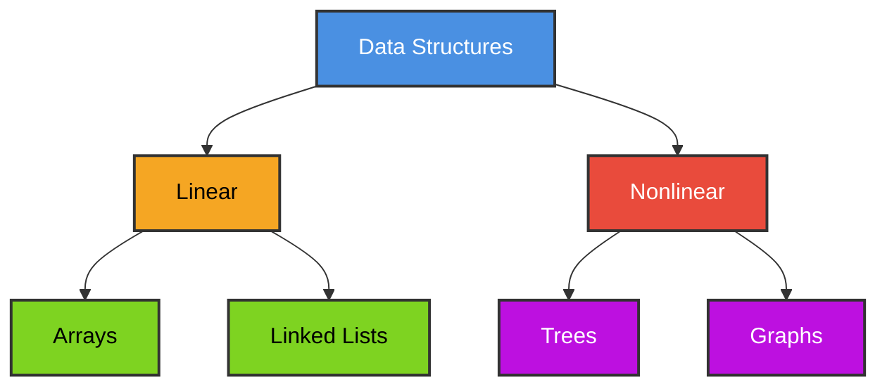

**Linear Data Structures:** Elements form a sequence (like a line of people)
- Arrays
- Linked Lists

**Nonlinear Data Structures:** Elements don't form a simple sequence
- Trees
- Graphs

### Common Operations on Linear Structures

No matter which linear structure you use, you'll typically perform these operations:

| Operation | Description | Example |
|-----------|-------------|---------|
| **Traversal** | Visit each element one by one | Print all student names |
| **Search** | Find an element with a specific value | Find student with ID 12345 |
| **Insertion** | Add a new element | Add a new student to the list |
| **Deletion** | Remove an element | Remove a student who graduated |
| **Sorting** | Arrange elements in order | Sort students by name |
| **Merging** | Combine two lists | Merge two class lists |

---

## Linear Arrays (One-Dimensional)

### What is a Linear Array?

**In Simple Terms:** A linear array is like a row of numbered boxes where each box holds one piece of data. All boxes hold the same type of data (all numbers, or all names, etc.).

**Formal Definition:** A linear array is a list of a finite number `n` of homogeneous data elements where:
1. Elements are referenced by consecutive index numbers
2. Elements are stored in successive memory locations

```mermaid
graph LR
    A["Index: 1 | Value: 247"] --> B["Index: 2 | Value: 56"]
    B --> C["Index: 3 | Value: 429"]
    C --> D["Index: 4 | Value: 135"]
    D --> E["Index: 5 | Value: 87"]
    E --> F["Index: 6 | Value: 156"]
    
    style A fill:#50C878,stroke:#333,stroke-width:2px,color:#000
    style B fill:#50C878,stroke:#333,stroke-width:2px,color:#000
    style C fill:#50C878,stroke:#333,stroke-width:2px,color:#000
    style D fill:#50C878,stroke:#333,stroke-width:2px,color:#000
    style E fill:#50C878,stroke:#333,stroke-width:2px,color:#000
    style F fill:#50C878,stroke:#333,stroke-width:2px,color:#000
```

### Array Properties

**Length Formula:**
```
Length = Upper Bound - Lower Bound + 1
```

**Example:** If an array has indices from 1932 to 1984:
```
Length = 1984 - 1932 + 1 = 53 elements
```

### Array Declaration in C

```c
#include <stdio.h>

int main() {
    // Method 1: Declare and initialize
    int numbers[5] = {10, 20, 30, 40, 50};
    
    // Method 2: Declare then assign
    float prices[3];
    prices[0] = 19.99;
    prices[1] = 29.99;
    prices[2] = 39.99;
    
    // Method 3: Let compiler count elements
    char grades[] = {'A', 'B', 'C', 'D', 'F'};
    
    // Print array elements
    printf("Numbers: ");
    for(int i = 0; i < 5; i++) {
        printf("%d ", numbers[i]);
    }
    
    return 0;
}
```

**Output:**
```
Numbers: 10 20 30 40 50
```

### Real-World Example

```c
#include <stdio.h>

int main() {
    // Store automobile sales from 1932 to 1936
    int AUTO[5] = {1200, 1450, 980, 1650, 1820};
    int years[5] = {1932, 1933, 1934, 1935, 1936};
    
    printf("Automobile Sales Report\n");
    printf("------------------------\n");
    
    for(int i = 0; i < 5; i++) {
        printf("Year %d: %d cars sold\n", years[i], AUTO[i]);
    }
    
    return 0;
}
```

---

## Array Representation in Memory

### How Arrays are Stored

**In Simple Terms:** Computer memory is like a long street with numbered houses. When you create an array, the computer reserves several houses in a row and remembers only the address of the first house.

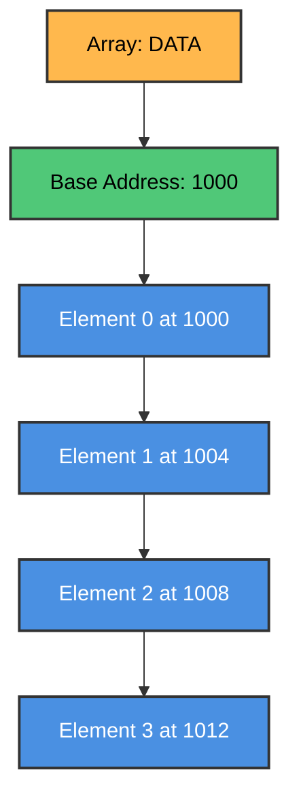

### Address Calculation Formula

```
LOC(LA[K]) = Base(LA) + w × (K - lower_bound)
```

Where:
- `LOC(LA[K])` = Memory address of element K
- `Base(LA)` = Address of first element
- `w` = Number of bytes per element
- `K` = Index of element we want

### Example Calculation

```c
#include <stdio.h>

int main() {
    int arr[5] = {10, 20, 30, 40, 50};
    
    // Print addresses of array elements
    printf("Array Element Addresses:\n");
    printf("------------------------\n");
    
    for(int i = 0; i < 5; i++) {
        printf("arr[%d] = %d, Address = %p\n", 
               i, arr[i], (void*)&arr[i]);
    }
    
    // Calculate size of each element
    printf("\nSize of each int: %lu bytes\n", sizeof(int));
    
    return 0;
}
```

**Sample Output:**
```
Array Element Addresses:
------------------------
arr[0] = 10, Address = 0x7ffd5c8e4a20
arr[1] = 20, Address = 0x7ffd5c8e4a24
arr[2] = 30, Address = 0x7ffd5c8e4a28
arr[3] = 40, Address = 0x7ffd5c8e4a2c
arr[4] = 50, Address = 0x7ffd5c8e4a30

Size of each int: 4 bytes
```

**Notice:** Each address increases by 4 bytes (size of int on most systems).

---

## Traversing Arrays

### What is Traversal?

**In Simple Terms:** Traversal means visiting each element in the array one by one, like checking each box in a row of boxes.

---

### 📘 Algorithm 4.1: Traversing a Linear Array

> **Purpose:** Visit every element in an array exactly once and apply some operation (like printing or counting).

#### Pseudocode (from textbook)

```
Algorithm 4.1: TRAVERSE(LA, LB, UB)
────────────────────────────────────
LA    = Linear Array
LB    = Lower Bound (first index)
UB    = Upper Bound (last index)

1. [Initialize counter] Set K := LB
2. Repeat Steps 3 and 4 while K ≤ UB
3.     [Visit element] Apply PROCESS to LA[K]
4.     [Increase counter] Set K := K + 1
   [End of Step 2 loop]
5. Exit
```

#### 🔍 Step-by-Step Explanation

| Step | What Happens | Example (array of 5 elements) |
|------|--------------|-------------------------------|
| 1 | Start at first element | K = 1 (or 0 in C) |
| 2 | Check if more elements exist | Is K ≤ 5? Yes! |
| 3 | Do something with current element | Print LA[1] |
| 4 | Move to next element | K = 2 |
| 2-4 | Repeat until done | Continue until K > 5 |
| 5 | Finished! | All elements visited |

#### 🎯 Visual Flowchart

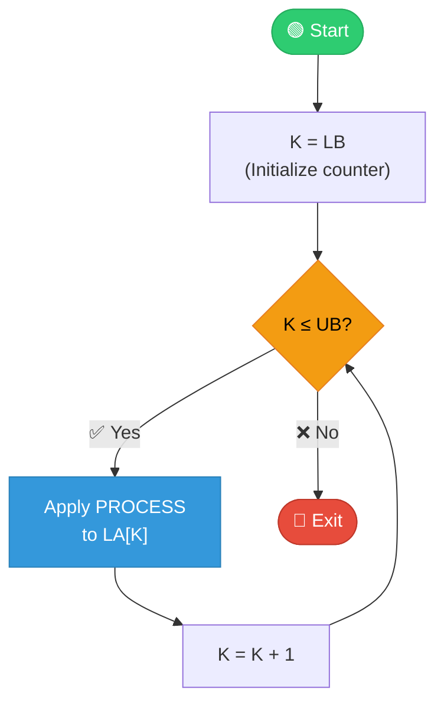

#### 💡 Why This Works

- **K starts at the first index** → We don't skip any element
- **K increases by 1 each time** → We visit elements in order
- **Loop stops when K > UB** → We don't go past the array

---

### C Program: Array Traversal

```c
#include <stdio.h>

// Function to traverse and print array
void traverseArray(int arr[], int n) {
    printf("Array elements: ");
    for(int i = 0; i < n; i++) {
        printf("%d ", arr[i]);
    }
    printf("\n");
}

// Function to count elements greater than a value
int countGreaterThan(int arr[], int n, int value) {
    int count = 0;
    for(int i = 0; i < n; i++) {
        if(arr[i] > value) {
            count++;
        }
    }
    return count;
}

// Function to find sum of all elements
int sumArray(int arr[], int n) {
    int sum = 0;
    for(int i = 0; i < n; i++) {
        sum += arr[i];
    }
    return sum;
}

int main() {
    int numbers[] = {45, 23, 67, 12, 89, 34, 56};
    int n = 7;
    
    // Traverse and print
    traverseArray(numbers, n);
    
    // Count elements greater than 50
    int count = countGreaterThan(numbers, n, 50);
    printf("Elements greater than 50: %d\n", count);
    
    // Find sum
    int total = sumArray(numbers, n);
    printf("Sum of all elements: %d\n", total);
    
    // Find average
    float average = (float)total / n;
    printf("Average: %.2f\n", average);
    
    return 0;
}
```

**Output:**
```
Array elements: 45 23 67 12 89 34 56
Elements greater than 50: 3
Sum of all elements: 326
Average: 46.57
```

---

## Inserting and Deleting Elements

### Insertion in Arrays

**In Simple Terms:** To insert an element in the middle of an array, you need to shift elements to make space, like making room for someone in a line of people.

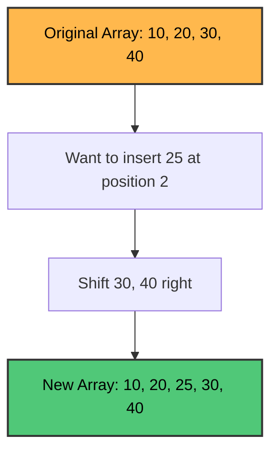

---

### 📘 Algorithm 4.2: Inserting into a Linear Array

> **Purpose:** Insert a new element ITEM at position K in array LA that has N elements.

#### Pseudocode (from textbook)

```
Algorithm 4.2: INSERT(LA, N, K, ITEM)
─────────────────────────────────────
LA   = Linear Array with N elements
K    = Position where ITEM should be inserted (K ≤ N)
ITEM = Element to insert

1. [Initialize counter] Set J := N
2. Repeat Steps 3 and 4 while J ≥ K
3.     [Move Jth element downward] Set LA[J+1] := LA[J]
4.     [Decrease counter] Set J := J - 1
   [End of Step 2 loop]
5. [Insert element] Set LA[K] := ITEM
6. [Reset N] Set N := N + 1
7. Exit
```

#### 🔍 Step-by-Step Example

**Insert 25 at position 3 in array [10, 20, 30, 40, 50]**

| Step | J | Action | Array State |
|------|---|--------|-------------|
| Start | - | Original array | [10, 20, 30, 40, 50, _] |
| 1 | 5 | J = N = 5 | - |
| 3 | 5 | LA[6] = LA[5] = 50 | [10, 20, 30, 40, 50, **50**] |
| 4 | 4 | J = 4 | - |
| 3 | 4 | LA[5] = LA[4] = 40 | [10, 20, 30, **40**, 50, 50] |
| 4 | 3 | J = 3 | - |
| 3 | 3 | LA[4] = LA[3] = 30 | [10, 20, **30**, 40, 50, 50] |
| 4 | 2 | J = 2, now J < K, exit loop | - |
| 5 | - | LA[3] = 25 | [10, 20, **25**, 30, 40, 50] |
| 6 | - | N = 6 | Done! |

#### 🎯 Visual Flowchart

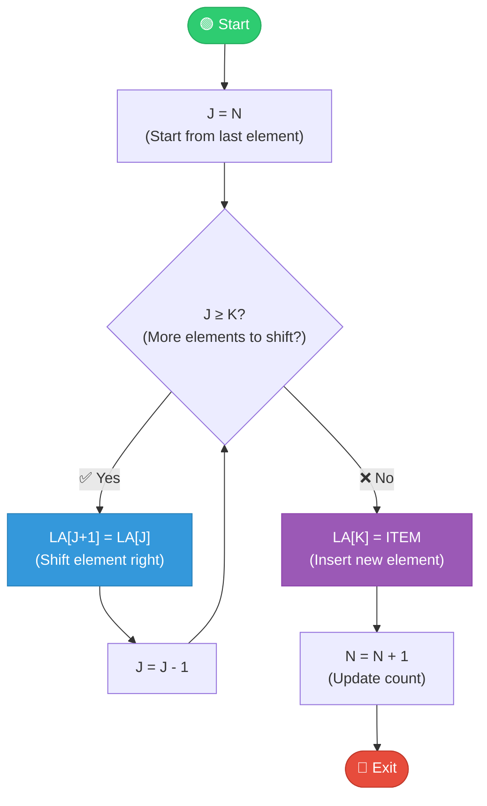

#### ⚠️ Important: Why Shift in Reverse Order?

We shift from **right to left** (starting from the last element) because:
- If we shifted left to right, we would **overwrite** data before saving it!

```
❌ Wrong (left to right): LA[4] = LA[3] → We lose LA[4]'s value!
✅ Correct (right to left): LA[6] = LA[5], then LA[5] = LA[4], etc.
```

---

### 📘 Algorithm 4.3: Deleting from a Linear Array

> **Purpose:** Delete the element at position K from array LA and store it in ITEM.

#### Pseudocode (from textbook)

```
Algorithm 4.3: DELETE(LA, N, K, ITEM)
─────────────────────────────────────
LA   = Linear Array with N elements
K    = Position of element to delete (K ≤ N)
ITEM = Will store the deleted element

1. Set ITEM := LA[K]
2. Repeat for J = K to N-1:
       [Move J+1st element upward] Set LA[J] := LA[J+1]
   [End of loop]
3. [Reset N] Set N := N - 1
4. Exit
```

#### 🔍 Step-by-Step Example

**Delete element at position 2 from array [10, 20, 30, 40, 50]**

| Step | J | Action | Array State |
|------|---|--------|-------------|
| Start | - | Original array | [10, 20, 30, 40, 50] |
| 1 | - | ITEM = LA[2] = 20 | Saved: 20 |
| 2 | 2 | LA[2] = LA[3] = 30 | [10, **30**, 30, 40, 50] |
| 2 | 3 | LA[3] = LA[4] = 40 | [10, 30, **40**, 40, 50] |
| 2 | 4 | LA[4] = LA[5] = 50 | [10, 30, 40, **50**, 50] |
| 3 | - | N = 4 | [10, 30, 40, 50] ✅ |

#### 🎯 Visual Flowchart

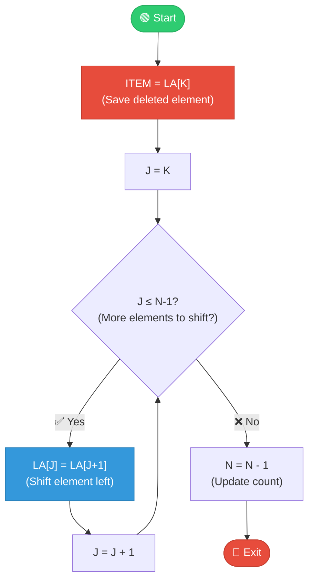

#### 💡 Key Difference from Insertion

| Operation | Shift Direction | Reason |
|-----------|-----------------|--------|
| **Insert** | Right → Left (reverse) | Create space for new element |
| **Delete** | Left → Right (forward) | Fill the gap left by removed element |

---

### C Program: Insertion

```c
#include <stdio.h>

void insertElement(int arr[], int *n, int pos, int value) {
    // Shift elements to the right
    for(int i = *n; i > pos; i--) {
        arr[i] = arr[i-1];
    }
    
    // Insert new element
    arr[pos] = value;
    
    // Increase array size
    (*n)++;
}

void printArray(int arr[], int n) {
    for(int i = 0; i < n; i++) {
        printf("%d ", arr[i]);
    }
    printf("\n");
}

int main() {
    int arr[10] = {10, 20, 30, 40, 50};
    int n = 5;
    
    printf("Original array: ");
    printArray(arr, n);
    
    // Insert 25 at position 2
    insertElement(arr, &n, 2, 25);
    
    printf("After inserting 25 at position 2: ");
    printArray(arr, n);
    
    // Insert 5 at position 0
    insertElement(arr, &n, 0, 5);
    
    printf("After inserting 5 at position 0: ");
    printArray(arr, n);
    
    return 0;
}
```

**Output:**
```
Original array: 10 20 30 40 50
After inserting 25 at position 2: 10 20 25 30 40 50
After inserting 5 at position 0: 5 10 20 25 30 40 50
```

### Deletion from Arrays

**In Simple Terms:** To delete an element, you remove it and shift the remaining elements left to fill the gap.

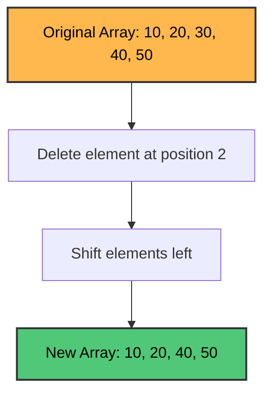

### C Program: Deletion

```c
#include <stdio.h>

int deleteElement(int arr[], int *n, int pos) {
    if(pos < 0 || pos >= *n) {
        printf("Invalid position!\n");
        return -1;
    }
    
    int deleted = arr[pos];
    
    // Shift elements to the left
    for(int i = pos; i < *n - 1; i++) {
        arr[i] = arr[i+1];
    }
    
    // Decrease array size
    (*n)--;
    
    return deleted;
}

void printArray(int arr[], int n) {
    for(int i = 0; i < n; i++) {
        printf("%d ", arr[i]);
    }
    printf("\n");
}

int main() {
    int arr[10] = {10, 20, 30, 40, 50};
    int n = 5;
    
    printf("Original array: ");
    printArray(arr, n);
    
    // Delete element at position 2
    int deleted = deleteElement(arr, &n, 2);
    printf("Deleted element: %d\n", deleted);
    printf("After deletion: ");
    printArray(arr, n);
    
    // Delete first element
    deleted = deleteElement(arr, &n, 0);
    printf("Deleted element: %d\n", deleted);
    printf("After deletion: ");
    printArray(arr, n);
    
    return 0;
}
```

**Output:**
```
Original array: 10 20 30 40 50
Deleted element: 30
After deletion: 10 20 40 50
Deleted element: 10
After deletion: 20 40 50
```

---

## Sorting: Bubble Sort

### How Bubble Sort Works

**In Simple Terms:** Bubble sort is like organizing a line of people by height. You compare two people at a time and swap them if they're in the wrong order. The tallest person "bubbles up" to the end.

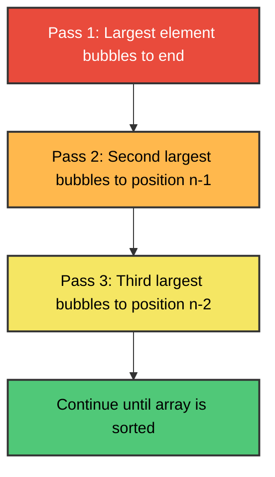

---

### 📘 Algorithm 4.4: Bubble Sort

> **Purpose:** Sort an array DATA with N elements in ascending order by repeatedly comparing adjacent elements and swapping if needed.

#### Pseudocode (from textbook)

```
Algorithm 4.4: BUBBLE(DATA, N)
──────────────────────────────
DATA = Array with N elements

1. Repeat Steps 2 and 3 for K = 1 to N-1:
2.     Set PTR := 1  [Initialize pass pointer]
3.     Repeat while PTR ≤ N - K:  [Execute pass]
           (a) If DATA[PTR] > DATA[PTR+1], then:
                   Interchange DATA[PTR] and DATA[PTR+1]
               [End of If structure]
           (b) Set PTR := PTR + 1
       [End of inner loop]
   [End of Step 1 outer loop]
4. Exit
```

#### 🔍 Understanding the Algorithm

**Two Loops:**
- **Outer loop (K):** Controls the number of passes (N-1 passes total)
- **Inner loop (PTR):** Compares adjacent elements in each pass

**Why `PTR ≤ N - K`?**
- After each pass, the largest unsorted element is in its final position
- So we don't need to check it again!

#### 🎯 Visual Flowchart

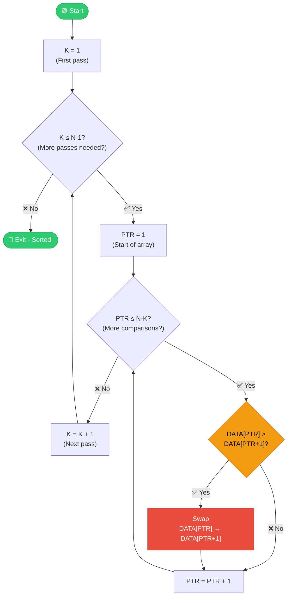

#### 📊 Complete Example: Sort [32, 51, 27, 85, 66, 23, 13, 57]

**Pass 1 (K=1): Find largest element (bubbles to position 8)**
```
[32, 51, 27, 85, 66, 23, 13, 57]  Compare 32,51 → No swap
[32, 51, 27, 85, 66, 23, 13, 57]  Compare 51,27 → Swap!
[32, 27, 51, 85, 66, 23, 13, 57]  Compare 51,85 → No swap
[32, 27, 51, 85, 66, 23, 13, 57]  Compare 85,66 → Swap!
[32, 27, 51, 66, 85, 23, 13, 57]  Compare 85,23 → Swap!
[32, 27, 51, 66, 23, 85, 13, 57]  Compare 85,13 → Swap!
[32, 27, 51, 66, 23, 13, 85, 57]  Compare 85,57 → Swap!
[32, 27, 51, 66, 23, 13, 57, 85]  ← 85 is now in correct position! ✅
```

**Pass 2-7:** Continue until fully sorted
```
After Pass 2: [27, 32, 51, 23, 13, 57, 66, 85]
After Pass 3: [27, 32, 23, 13, 51, 57, 66, 85]
After Pass 4: [27, 23, 13, 32, 51, 57, 66, 85]
After Pass 5: [23, 13, 27, 32, 51, 57, 66, 85]
After Pass 6: [13, 23, 27, 32, 51, 57, 66, 85]
After Pass 7: [13, 23, 27, 32, 51, 57, 66, 85] ✅ Sorted!
```

#### ⏱️ Time Complexity Analysis

**Counting Comparisons:**
```
Pass 1: n-1 comparisons
Pass 2: n-2 comparisons
Pass 3: n-3 comparisons
...
Pass n-1: 1 comparison

Total = (n-1) + (n-2) + ... + 1 = n(n-1)/2 ≈ n²/2
```

| Case | Complexity | When |
|------|------------|------|
| **Best** | O(n) | Array already sorted (with FLAG optimization) |
| **Average** | O(n²) | Random order |
| **Worst** | O(n²) | Array in reverse order |

---

### Step-by-Step Example

**Original Array:** `[64, 34, 25, 12, 22, 11, 90]`

**Pass 1:**
- Compare 64 & 34 → Swap → `[34, 64, 25, 12, 22, 11, 90]`
- Compare 64 & 25 → Swap → `[34, 25, 64, 12, 22, 11, 90]`
- Compare 64 & 12 → Swap → `[34, 25, 12, 64, 22, 11, 90]`
- Compare 64 & 22 → Swap → `[34, 25, 12, 22, 64, 11, 90]`
- Compare 64 & 11 → Swap → `[34, 25, 12, 22, 11, 64, 90]`
- Compare 64 & 90 → No swap → `[34, 25, 12, 22, 11, 64, 90]`

After Pass 1: **90 is in correct position**

### C Program: Bubble Sort

```c
#include <stdio.h>

void bubbleSort(int arr[], int n) {
    int i, j, temp;
    int swapped;
    
    for(i = 0; i < n-1; i++) {
        swapped = 0;
        
        // Last i elements are already sorted
        for(j = 0; j < n-i-1; j++) {
            if(arr[j] > arr[j+1]) {
                // Swap arr[j] and arr[j+1]
                temp = arr[j];
                arr[j] = arr[j+1];
                arr[j+1] = temp;
                swapped = 1;
            }
        }
        
        // If no swapping happened, array is sorted
        if(swapped == 0)
            break;
    }
}

void printArray(int arr[], int n) {
    for(int i = 0; i < n; i++) {
        printf("%d ", arr[i]);
    }
    printf("\n");
}

int main() {
    int arr[] = {64, 34, 25, 12, 22, 11, 90};
    int n = sizeof(arr)/sizeof(arr[0]);
    
    printf("Original array: ");
    printArray(arr, n);
    
    bubbleSort(arr, n);
    
    printf("Sorted array: ");
    printArray(arr, n);
    
    return 0;
}
```

**Output:**
```
Original array: 64 34 25 12 22 11 90
Sorted array: 11 12 22 25 34 64 90
```

### Time Complexity

- **Best Case:** O(n) - when array is already sorted
- **Average Case:** O(n²)
- **Worst Case:** O(n²) - when array is reverse sorted

**Number of comparisons:** `n(n-1)/2 ≈ n²/2`

---

## Searching: Linear Search

### How Linear Search Works

**In Simple Terms:** Linear search is like looking for a book on a shelf by checking each book one by one from left to right until you find it.

---

### 📘 Algorithm 4.5: Linear Search

> **Purpose:** Find the location LOC of ITEM in array DATA with N elements. Returns LOC=0 if not found.

#### Pseudocode (from textbook)

```
Algorithm 4.5: LINEAR(DATA, N, ITEM, LOC)
─────────────────────────────────────────
DATA = Linear Array with N elements
ITEM = Element to search for
LOC  = Will store location of ITEM (or 0 if not found)

1. [Insert ITEM at the end] Set DATA[N+1] := ITEM
2. [Initialize counter] Set LOC := 1
3. [Search for ITEM]
   Repeat while DATA[LOC] ≠ ITEM:
       Set LOC := LOC + 1
   [End of loop]
4. [Successful?] If LOC = N+1, then: Set LOC := 0
5. Exit
```

#### 🔍 Understanding the Sentinel Trick

**Why add ITEM at the end (Step 1)?**
- This is called a **sentinel** - a guard value
- It guarantees the loop will always terminate
- Without it, we'd need two checks: `LOC ≤ N` AND `DATA[LOC] ≠ ITEM`
- With sentinel, we only need one check: `DATA[LOC] ≠ ITEM`

```
Without sentinel: while (LOC ≤ N AND DATA[LOC] ≠ ITEM)  ← 2 checks
With sentinel:    while (DATA[LOC] ≠ ITEM)              ← 1 check (faster!)
```

#### 🎯 Visual Flowchart

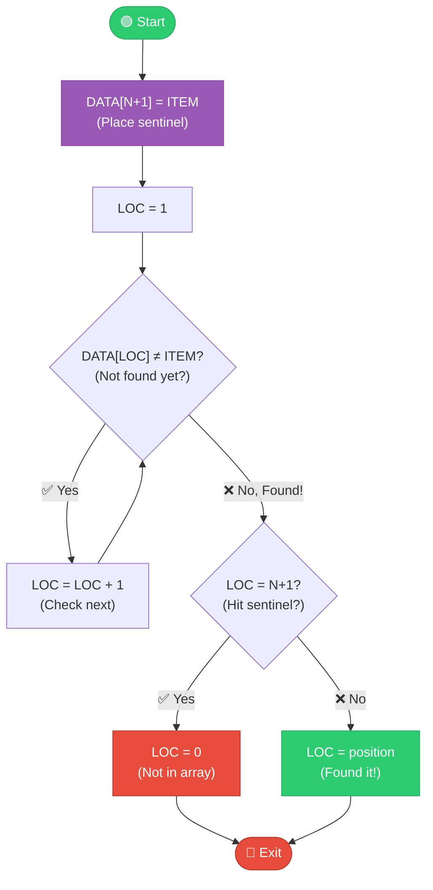

#### 📊 Example: Search for "Susan" in [Mary, Jane, Diane, Susan, Karen, Edith]

| Step | LOC | DATA[LOC] | Action |
|------|-----|-----------|--------|
| 1 | - | - | Place "Susan" at DATA[7] (sentinel) |
| 2 | 1 | Mary | Mary ≠ Susan → continue |
| 3 | 2 | Jane | Jane ≠ Susan → continue |
| 3 | 3 | Diane | Diane ≠ Susan → continue |
| 3 | 4 | Susan | Susan = Susan → **Found!** |
| 4 | 4 | - | LOC=4 ≠ N+1=7, so keep LOC=4 |

**Result:** Susan found at position 4 ✅

#### 📊 Example: Search for "Paula" (not in array)

| Step | LOC | DATA[LOC] | Action |
|------|-----|-----------|--------|
| 1 | - | - | Place "Paula" at DATA[7] |
| 3 | 1-6 | ... | Keep searching, not found |
| 3 | 7 | Paula | Paula = Paula → "Found" (sentinel) |
| 4 | 7 | - | LOC=7 = N+1=7, so LOC = 0 |

**Result:** Paula not found (LOC = 0) ❌

#### ⏱️ Time Complexity

| Case | Comparisons | When |
|------|-------------|------|
| **Best** | O(1) | ITEM is first element |
| **Average** | O(n/2) ≈ O(n) | ITEM is in middle |
| **Worst** | O(n) | ITEM is last or not present |

---

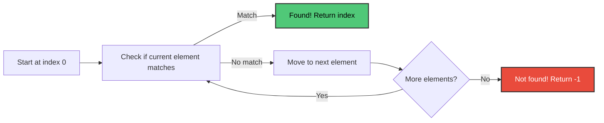

### C Program: Linear Search

```c
#include <stdio.h>

int linearSearch(int arr[], int n, int target) {
    for(int i = 0; i < n; i++) {
        if(arr[i] == target) {
            return i;  // Return index where found
        }
    }
    return -1;  // Not found
}

int main() {
    int arr[] = {45, 23, 67, 12, 89, 34, 56};
    int n = sizeof(arr)/sizeof(arr[0]);
    int target;
    
    printf("Array: ");
    for(int i = 0; i < n; i++) {
        printf("%d ", arr[i]);
    }
    printf("\n");
    
    // Search for 89
    target = 89;
    int result = linearSearch(arr, n, target);
    if(result != -1) {
        printf("%d found at index %d\n", target, result);
    } else {
        printf("%d not found\n", target);
    }
    
    // Search for 100
    target = 100;
    result = linearSearch(arr, n, target);
    if(result != -1) {
        printf("%d found at index %d\n", target, result);
    } else {
        printf("%d not found\n", target);
    }
    
    return 0;
}
```

**Output:**
```
Array: 45 23 67 12 89 34 56
89 found at index 4
100 not found
```

### Time Complexity

- **Best Case:** O(1) - element is at first position
- **Average Case:** O(n/2) ≈ O(n)
- **Worst Case:** O(n) - element is at last position or not present

---

## Searching: Binary Search

### How Binary Search Works

**In Simple Terms:** Binary search is like finding a word in a dictionary. You open it in the middle, check if your word comes before or after, then repeat with the appropriate half. Much faster than checking every page!

**Important:** Binary search only works on **sorted arrays**.

---

### 📘 Algorithm 4.6: Binary Search

> **Purpose:** Find ITEM in a **sorted** array DATA. Returns LOC (position) or NULL (0) if not found.

#### Pseudocode (from textbook)

```
Algorithm 4.6: BINARY(DATA, LB, UB, ITEM, LOC)
──────────────────────────────────────────────
DATA = Sorted array with lower bound LB and upper bound UB
ITEM = Element to search for
LOC  = Will store location (or NULL=0 if not found)
BEG, END, MID = Beginning, end, and middle of current segment

1. [Initialize segment variables]
   Set BEG := LB, END := UB
   Set MID := INT((BEG + END) / 2)

2. Repeat Steps 3 and 4 while BEG ≤ END and DATA[MID] ≠ ITEM

3.     If ITEM < DATA[MID], then:
           Set END := MID - 1      [Search left half]
       Else:
           Set BEG := MID + 1      [Search right half]
       [End of If structure]

4.     Set MID := INT((BEG + END) / 2)
   [End of Step 2 loop]

5. If DATA[MID] = ITEM, then:
       Set LOC := MID
   Else:
       Set LOC := NULL
   [End of If structure]

6. Exit
```

#### 🔍 The Key Insight

**Each comparison eliminates HALF the remaining elements!**

```
Start:    1,000,000 elements
After 1:    500,000 elements
After 2:    250,000 elements
After 3:    125,000 elements
...
After 20:        ~1 element  ← Found in just 20 steps!
```

#### 🎯 Visual Flowchart

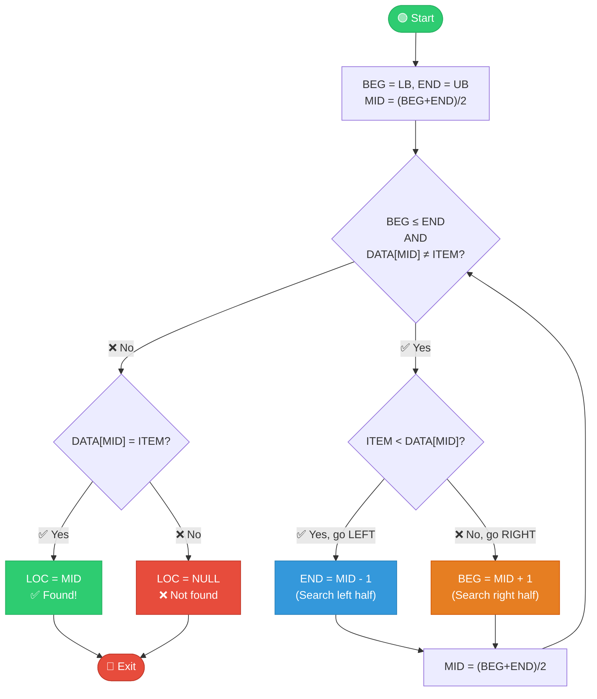

#### 📊 Complete Example: Find 40 in [11, 22, 30, 33, 40, 44, 55, 60, 66, 77, 80, 88, 99]

```
Array indices: 1   2   3   4   5   6   7   8   9  10  11  12  13
Values:       11  22  30  33  40  44  55  60  66  77  80  88  99
```

| Step | BEG | END | MID | DATA[MID] | Comparison | Action |
|------|-----|-----|-----|-----------|------------|--------|
| 1 | 1 | 13 | 7 | 55 | 40 < 55 | Search LEFT: END = 6 |
| 2 | 1 | 6 | 3 | 30 | 40 > 30 | Search RIGHT: BEG = 4 |
| 3 | 4 | 6 | 5 | **40** | 40 = 40 | **FOUND at position 5!** ✅ |

**Only 3 comparisons!** (Linear search would need 5)

#### 📊 Example: Find 85 (Not in array)

| Step | BEG | END | MID | DATA[MID] | Comparison | Action |
|------|-----|-----|-----|-----------|------------|--------|
| 1 | 1 | 13 | 7 | 55 | 85 > 55 | Search RIGHT: BEG = 8 |
| 2 | 8 | 13 | 10 | 77 | 85 > 77 | Search RIGHT: BEG = 11 |
| 3 | 11 | 13 | 12 | 88 | 85 < 88 | Search LEFT: END = 11 |
| 4 | 11 | 11 | 11 | 80 | 85 > 80 | Search RIGHT: BEG = 12 |
| 5 | 12 | 11 | - | - | BEG > END | **NOT FOUND** ❌ |

#### ⏱️ Time Complexity Comparison

| Array Size | Linear Search | Binary Search |
|------------|---------------|---------------|
| 10 | 10 | 4 |
| 100 | 100 | 7 |
| 1,000 | 1,000 | 10 |
| 1,000,000 | 1,000,000 | **20** |

**Formula:** Binary search needs at most $\lceil \log_2 n \rceil + 1$ comparisons

#### ⚠️ Limitations of Binary Search

| Requirement | Why It Matters |
|-------------|----------------|
| **Array must be sorted** | Can't compare with middle if unsorted |
| **Direct access needed** | Must jump to middle (arrays: ✅, linked lists: ❌) |
| **Static data preferred** | Inserting/deleting requires maintaining sort order |

---

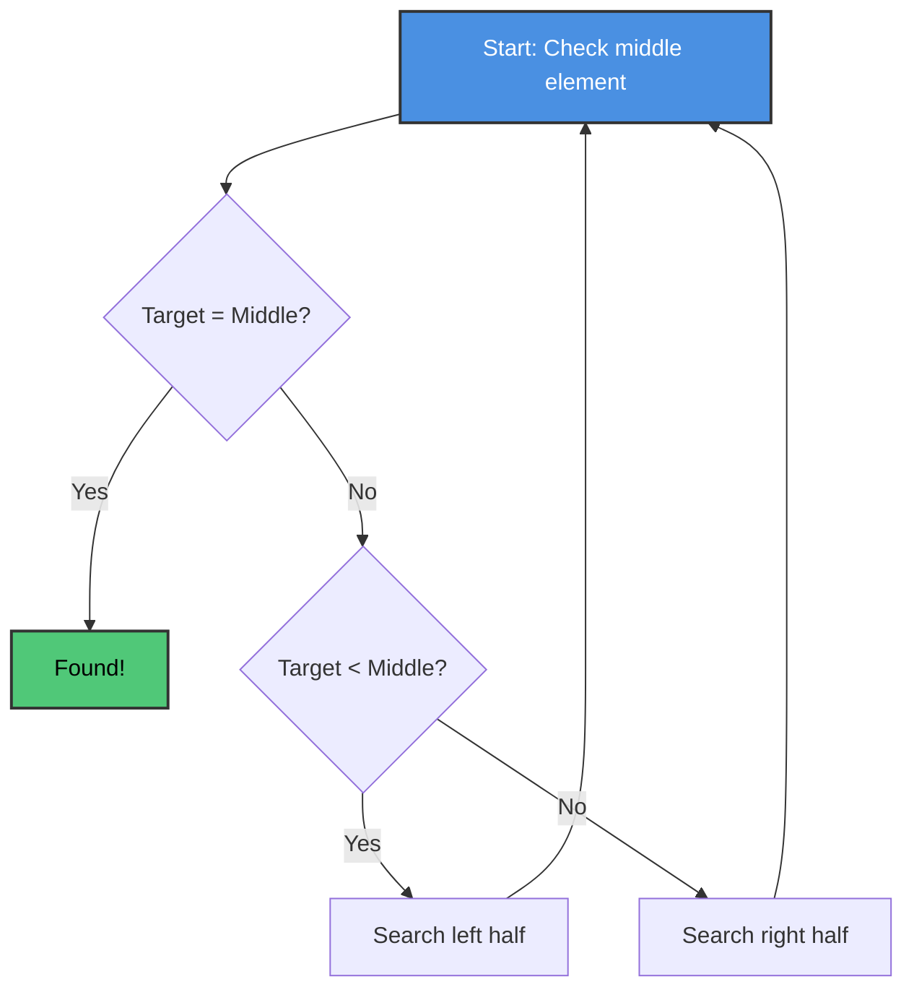

### Step-by-Step Example

**Sorted Array:** `[11, 22, 30, 33, 40, 44, 55, 60, 66, 77, 80, 88, 99]`
**Target:** 40

**Step 1:**
- Left = 0, Right = 12, Mid = 6
- arr[6] = 55
- 40 < 55, search left half

**Step 2:**
- Left = 0, Right = 5, Mid = 2
- arr[2] = 30
- 40 > 30, search right half

**Step 3:**
- Left = 3, Right = 5, Mid = 4
- arr[4] = 40
- **Found at index 4!**

### C Program: Binary Search

```c
#include <stdio.h>

int binarySearch(int arr[], int n, int target) {
    int left = 0;
    int right = n - 1;
    
    while(left <= right) {
        int mid = left + (right - left) / 2;
        
        // Check if target is at mid
        if(arr[mid] == target) {
            return mid;
        }
        
        // If target is greater, ignore left half
        if(arr[mid] < target) {
            left = mid + 1;
        }
        // If target is smaller, ignore right half
        else {
            right = mid - 1;
        }
    }
    
    return -1;  // Not found
}

void printArray(int arr[], int n) {
    for(int i = 0; i < n; i++) {
        printf("%d ", arr[i]);
    }
    printf("\n");
}

int main() {
    int arr[] = {11, 22, 30, 33, 40, 44, 55, 60, 66, 77, 80, 88, 99};
    int n = sizeof(arr)/sizeof(arr[0]);
    
    printf("Sorted Array: ");
    printArray(arr, n);
    
    // Search for 40
    int target = 40;
    int result = binarySearch(arr, n, target);
    if(result != -1) {
        printf("%d found at index %d\n", target, result);
    } else {
        printf("%d not found\n", target);
    }
    
    // Search for 85
    target = 85;
    result = binarySearch(arr, n, target);
    if(result != -1) {
        printf("%d found at index %d\n", target, result);
    } else {
        printf("%d not found\n", target);
    }
    
    return 0;
}
```

**Output:**
```
Sorted Array: 11 22 30 33 40 44 55 60 66 77 80 88 99
40 found at index 4
85 not found
```

### Time Complexity

- **Best Case:** O(1) - element is at middle
- **Average Case:** O(log n)
- **Worst Case:** O(log n)

**Example:** For 1,000,000 elements:
- Linear search: up to 1,000,000 comparisons
- Binary search: only about 20 comparisons!

---

## Multidimensional Arrays

### Two-Dimensional Arrays (2D Arrays)

**In Simple Terms:** A 2D array is like a table or spreadsheet with rows and columns. Think of it as a grid where you need two numbers (row and column) to find any element.

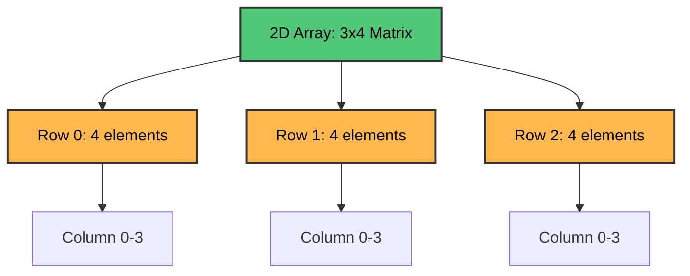

### Visualization of 2D Array

```
    Col 0  Col 1  Col 2  Col 3
Row 0  [10]   [20]   [30]   [40]
Row 1  [50]   [60]   [70]   [80]
Row 2  [90]   [100]  [110]  [120]
```

### C Program: 2D Array Basics

```c
#include <stdio.h>

int main() {
    // Declare and initialize 2D array
    int matrix[3][4] = {
        {10, 20, 30, 40},
        {50, 60, 70, 80},
        {90, 100, 110, 120}
    };
    
    int rows = 3;
    int cols = 4;
    
    // Print the matrix
    printf("Matrix:\n");
    for(int i = 0; i < rows; i++) {
        for(int j = 0; j < cols; j++) {
            printf("%4d ", matrix[i][j]);
        }
        printf("\n");
    }
    
    // Access specific element
    printf("\nElement at [1][2]: %d\n", matrix[1][2]);
    
    // Modify an element
    matrix[0][0] = 999;
    printf("After modification, [0][0]: %d\n", matrix[0][0]);
    
    return 0;
}
```

**Output:**
```
Matrix:
  10   20   30   40
  50   60   70   80
  90  100  110  120

Element at [1][2]: 70
After modification, [0][0]: 999
```

### Real-World Example: Student Test Scores

```c
#include <stdio.h>

int main() {
    // 4 students, 3 tests each
    int scores[4][3] = {
        {85, 90, 78},  // Student 0
        {92, 88, 95},  // Student 1
        {76, 82, 80},  // Student 2
        {88, 85, 90}   // Student 3
    };
    
    int students = 4;
    int tests = 3;
    
    // Print all scores
    printf("Student Test Scores:\n");
    printf("Student\tTest1\tTest2\tTest3\tAverage\n");
    printf("---------------------------------------\n");
    
    for(int i = 0; i < students; i++) {
        printf("%d\t", i);
        int sum = 0;
        
        for(int j = 0; j < tests; j++) {
            printf("%d\t", scores[i][j]);
            sum += scores[i][j];
        }
        
        float avg = (float)sum / tests;
        printf("%.2f\n", avg);
    }
    
    // Find highest score in each test
    printf("\nHighest score in each test:\n");
    for(int j = 0; j < tests; j++) {
        int max = scores[0][j];
        for(int i = 1; i < students; i++) {
            if(scores[i][j] > max) {
                max = scores[i][j];
            }
        }
        printf("Test %d: %d\n", j+1, max);
    }
    
    return 0;
}
```

**Output:**
```
Student Test Scores:
Student	Test1	Test2	Test3	Average
---------------------------------------
0	85	90	78	84.33
1	92	88	95	91.67
2	76	82	80	79.33
3	88	85	90	87.67

Highest score in each test:
Test 1: 92
Test 2: 90
Test 3: 95
```

### Memory Representation

2D arrays can be stored in memory in two ways:

**Row-Major Order** (used by C):
```
[Row 0 elements] [Row 1 elements] [Row 2 elements] ...
```

**Column-Major Order** (used by Fortran):
```
[Column 0 elements] [Column 1 elements] [Column 2 elements] ...
```

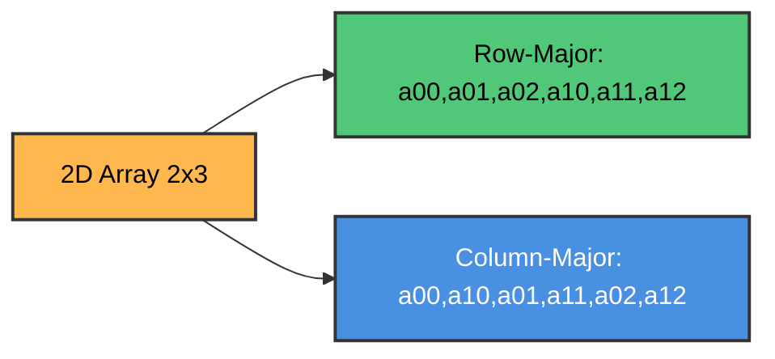

---

## Pointers and Pointer Arrays

### What is a Pointer?

**In Simple Terms:** A pointer is like a signpost that points to a location. Instead of storing data directly, it stores the address where the data is located.

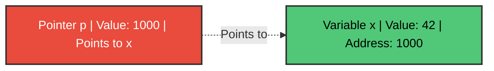

### C Program: Pointer Basics

```c
#include <stdio.h>

int main() {
    int x = 42;
    int *ptr;  // Declare a pointer to int
    
    ptr = &x;  // Store address of x in ptr
    
    printf("Value of x: %d\n", x);
    printf("Address of x: %p\n", (void*)&x);
    printf("Value of ptr: %p\n", (void*)ptr);
    printf("Value pointed to by ptr: %d\n", *ptr);
    
    // Modify x through pointer
    *ptr = 100;
    printf("\nAfter *ptr = 100:\n");
    printf("Value of x: %d\n", x);
    
    return 0;
}
```

**Output:**
```
Value of x: 42
Address of x: 0x7ffd5c8e4a20
Value of ptr: 0x7ffd5c8e4a20
Value pointed to by ptr: 42

After *ptr = 100:
Value of x: 100
```

### Pointer Arrays

**In Simple Terms:** A pointer array is an array where each element is a pointer. This is useful for managing groups of data efficiently.

### C Program: Array of Pointers

```c
#include <stdio.h>
#include <string.h>

int main() {
    // Array of string pointers
    char *names[] = {
        "Alice",
        "Bob",
        "Charlie",
        "Diana"
    };
    
    int count = 4;
    
    printf("Names:\n");
    for(int i = 0; i < count; i++) {
        printf("%d. %s\n", i+1, names[i]);
    }
    
    // Sort names (bubble sort)
    for(int i = 0; i < count-1; i++) {
        for(int j = 0; j < count-i-1; j++) {
            if(strcmp(names[j], names[j+1]) > 0) {
                // Swap pointers
                char *temp = names[j];
                names[j] = names[j+1];
                names[j+1] = temp;
            }
        }
    }
    
    printf("\nSorted names:\n");
    for(int i = 0; i < count; i++) {
        printf("%d. %s\n", i+1, names[i]);
    }
    
    return 0;
}
```

**Output:**
```
Names:
1. Alice
2. Bob
3. Charlie
4. Diana

Sorted names:
1. Alice
2. Bob
3. Charlie
4. Diana
```

---

## Records and Record Structures

### What is a Record?

**In Simple Terms:** A record (called a "struct" in C) is like a folder that holds different types of related information. For example, a student record might contain name (text), age (number), and grade (letter).

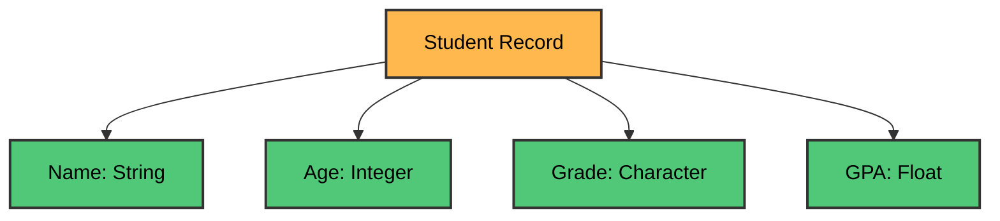

### C Program: Basic Structure

```c
#include <stdio.h>
#include <string.h>

// Define a structure for student
struct Student {
    char name[50];
    int age;
    char grade;
    float gpa;
};

int main() {
    // Create a student record
    struct Student s1;
    
    // Assign values
    strcpy(s1.name, "John Smith");
    s1.age = 20;
    s1.grade = 'A';
    s1.gpa = 3.8;
    
    // Print student information
    printf("Student Information:\n");
    printf("-------------------\n");
    printf("Name: %s\n", s1.name);
    printf("Age: %d\n", s1.age);
    printf("Grade: %c\n", s1.grade);
    printf("GPA: %.2f\n", s1.gpa);
    
    return 0;
}
```

**Output:**
```
Student Information:
-------------------
Name: John Smith
Age: 20
Grade: A
GPA: 3.80
```

### Array of Structures

```c
#include <stdio.h>
#include <string.h>

struct Student {
    char name[50];
    int rollNo;
    float marks;
};

int main() {
    struct Student class[3];
    
    // Input student data
    for(int i = 0; i < 3; i++) {
        printf("Enter details for student %d:\n", i+1);
        printf("Name: ");
        scanf("%s", class[i].name);
        printf("Roll No: ");
        scanf("%d", &class[i].rollNo);
        printf("Marks: ");
        scanf("%f", &class[i].marks);
        printf("\n");
    }
    
    // Display all students
    printf("\nStudent Records:\n");
    printf("%-20s %-10s %-10s\n", "Name", "Roll No", "Marks");
    printf("----------------------------------------\n");
    
    for(int i = 0; i < 3; i++) {
        printf("%-20s %-10d %-10.2f\n", 
               class[i].name, 
               class[i].rollNo, 
               class[i].marks);
    }
    
    // Find student with highest marks
    int topIndex = 0;
    for(int i = 1; i < 3; i++) {
        if(class[i].marks > class[topIndex].marks) {
            topIndex = i;
        }
    }
    
    printf("\nTop student: %s with %.2f marks\n", 
           class[topIndex].name, 
           class[topIndex].marks);
    
    return 0;
}
```

### Nested Structures

```c
#include <stdio.h>
#include <string.h>

struct Date {
    int day;
    int month;
    int year;
};

struct Employee {
    char name[50];
    int id;
    struct Date joinDate;
    float salary;
};

int main() {
    struct Employee emp;
    
    strcpy(emp.name, "Alice Johnson");
    emp.id = 1001;
    emp.joinDate.day = 15;
    emp.joinDate.month = 6;
    emp.joinDate.year = 2020;
    emp.salary = 50000.00;
    
    printf("Employee Information:\n");
    printf("--------------------\n");
    printf("Name: %s\n", emp.name);
    printf("ID: %d\n", emp.id);
    printf("Join Date: %02d/%02d/%d\n", 
           emp.joinDate.day, 
           emp.joinDate.month, 
           emp.joinDate.year);
    printf("Salary: $%.2f\n", emp.salary);
    
    return 0;
}
```

---

## Matrices

### Matrix Operations

**In Simple Terms:** Matrices are 2D arrays of numbers that we can add, subtract, and multiply using special rules.

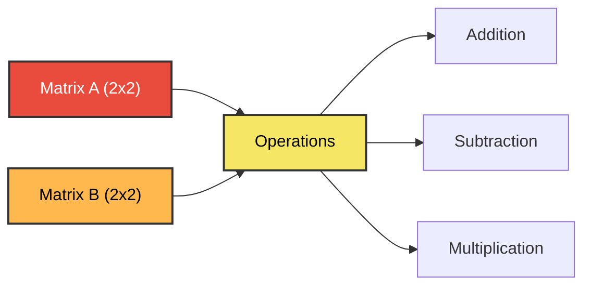

---

### 📘 Algorithm 4.7: Matrix Multiplication

> **Purpose:** Multiply matrix A (M×P) by matrix B (P×N) to produce matrix C (M×N).

#### Pseudocode (from textbook)

```
Algorithm 4.7: MATMUL(A, B, C, M, P, N)
──────────────────────────────────────
A = M × P matrix
B = P × N matrix  
C = Result matrix (M × N)

1. Repeat Steps 2 to 4 for I = 1 to M:
2.     Repeat Steps 3 and 4 for J = 1 to N:
3.         Set C[I,J] := 0  [Initialize element]
4.         Repeat for K = 1 to P:
               C[I,J] := C[I,J] + A[I,K] * B[K,J]
           [End of inner loop]
       [End of Step 2 middle loop]
   [End of Step 1 outer loop]
5. Exit
```

#### 🔍 Understanding Matrix Multiplication

**The Rule:** Each element C[i,j] is the **dot product** of:
- Row i of matrix A
- Column j of matrix B

```
C[i,j] = A[i,1]×B[1,j] + A[i,2]×B[2,j] + ... + A[i,P]×B[P,j]
       = Σ(k=1 to P) A[i,k] × B[k,j]
```

#### 🎯 Visual Flowchart

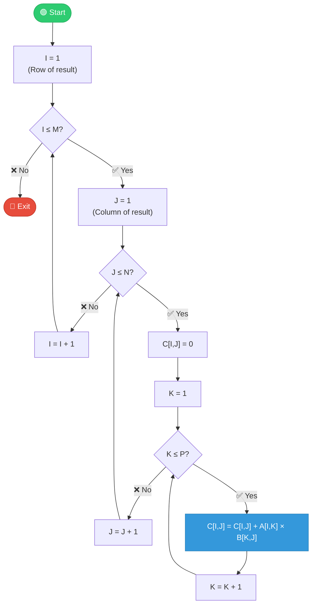

#### 📊 Example: Multiply 2×3 by 3×2 matrices

```
    A (2×3)           B (3×2)           C (2×2)
┌─────────────┐   ┌─────────┐      ┌───────────┐
│ 1   2   3   │   │  7   8  │      │  58   64  │
│ 4   5   6   │ × │  9  10  │  =   │ 139  154  │
└─────────────┘   │ 11  12  │      └───────────┘
                  └─────────┘
```

**Calculating C[1,1]:**
```
C[1,1] = A[1,1]×B[1,1] + A[1,2]×B[2,1] + A[1,3]×B[3,1]
       = 1×7 + 2×9 + 3×11
       = 7 + 18 + 33
       = 58 ✅
```

**Calculating C[1,2]:**
```
C[1,2] = A[1,1]×B[1,2] + A[1,2]×B[2,2] + A[1,3]×B[3,2]
       = 1×8 + 2×10 + 3×12
       = 8 + 20 + 36
       = 64 ✅
```

#### ⏱️ Time Complexity

**Counting Multiplications:**
- Outer loop runs M times
- Middle loop runs N times  
- Inner loop runs P times
- Each iteration does 1 multiplication

**Total:** $M \times N \times P$ multiplications = **O(n³)** for n×n matrices

#### 💡 Important Notes

| Requirement | Rule |
|-------------|------|
| **Dimension Match** | Columns of A must equal rows of B (A is M×**P**, B is **P**×N) |
| **Result Size** | C has M rows (from A) and N columns (from B) |
| **Not Commutative** | A×B ≠ B×A in general! |

---

### C Program: Matrix Addition

```c
#include <stdio.h>

#define ROWS 3
#define COLS 3

void printMatrix(int mat[][COLS], int rows) {
    for(int i = 0; i < rows; i++) {
        for(int j = 0; j < COLS; j++) {
            printf("%4d ", mat[i][j]);
        }
        printf("\n");
    }
}

void addMatrices(int a[][COLS], int b[][COLS], int result[][COLS], int rows) {
    for(int i = 0; i < rows; i++) {
        for(int j = 0; j < COLS; j++) {
            result[i][j] = a[i][j] + b[i][j];
        }
    }
}

int main() {
    int A[ROWS][COLS] = {
        {1, 2, 3},
        {4, 5, 6},
        {7, 8, 9}
    };
    
    int B[ROWS][COLS] = {
        {9, 8, 7},
        {6, 5, 4},
        {3, 2, 1}
    };
    
    int C[ROWS][COLS];
    
    printf("Matrix A:\n");
    printMatrix(A, ROWS);
    
    printf("\nMatrix B:\n");
    printMatrix(B, ROWS);
    
    addMatrices(A, B, C, ROWS);
    
    printf("\nMatrix C (A + B):\n");
    printMatrix(C, ROWS);
    
    return 0;
}
```

**Output:**
```
Matrix A:
   1    2    3
   4    5    6
   7    8    9

Matrix B:
   9    8    7
   6    5    4
   3    2    1

Matrix C (A + B):
  10   10   10
  10   10   10
  10   10   10
```

### C Program: Matrix Multiplication

```c
#include <stdio.h>

#define R1 2
#define C1 3
#define R2 3
#define C2 2

void multiplyMatrices(int a[][C1], int b[][C2], int result[][C2]) {
    // Initialize result matrix to 0
    for(int i = 0; i < R1; i++) {
        for(int j = 0; j < C2; j++) {
            result[i][j] = 0;
        }
    }
    
    // Multiply matrices
    for(int i = 0; i < R1; i++) {
        for(int j = 0; j < C2; j++) {
            for(int k = 0; k < C1; k++) {
                result[i][j] += a[i][k] * b[k][j];
            }
        }
    }
}

void printMatrix(int mat[][C2], int rows) {
    for(int i = 0; i < rows; i++) {
        for(int j = 0; j < C2; j++) {
            printf("%4d ", mat[i][j]);
        }
        printf("\n");
    }
}

int main() {
    int A[R1][C1] = {
        {1, 2, 3},
        {4, 5, 6}
    };
    
    int B[R2][C2] = {
        {7, 8},
        {9, 10},
        {11, 12}
    };
    
    int C[R1][C2];
    
    printf("Matrix A (2x3):\n");
    for(int i = 0; i < R1; i++) {
        for(int j = 0; j < C1; j++) {
            printf("%4d ", A[i][j]);
        }
        printf("\n");
    }
    
    printf("\nMatrix B (3x2):\n");
    for(int i = 0; i < R2; i++) {
        for(int j = 0; j < C2; j++) {
            printf("%4d ", B[i][j]);
        }
        printf("\n");
    }
    
    multiplyMatrices(A, B, C);
    
    printf("\nMatrix C (A × B) (2x2):\n");
    printMatrix(C, R1);
    
    return 0;
}
```

**Output:**
```
Matrix A (2x3):
   1    2    3
   4    5    6

Matrix B (3x2):
   7    8
   9   10
  11   12

Matrix C (A × B) (2x2):
  58   64
 139  154
```

**Calculation:**
- C[0][0] = 1×7 + 2×9 + 3×11 = 7 + 18 + 33 = 58
- C[0][1] = 1×8 + 2×10 + 3×12 = 8 + 20 + 36 = 64
- C[1][0] = 4×7 + 5×9 + 6×11 = 28 + 45 + 66 = 139
- C[1][1] = 4×8 + 5×10 + 6×12 = 32 + 50 + 72 = 154

---

## Sparse Matrices

### What is a Sparse Matrix?

**In Simple Terms:** A sparse matrix is a matrix where most elements are zero. Instead of storing all the zeros (which wastes space), we only store the non-zero elements.

**Example:**
```
Regular Matrix (5x5):
0  0  3  0  0
0  0  5  7  0
0  0  0  0  0
0  2  6  0  0
0  0  0  0  0

Only 5 non-zero elements out of 25!
```

```mermaid
graph TD
    A["Sparse Matrix 5x5"] --> B["Total elements: 25"]
    B --> C["Non-zero: 5"]
    B --> D["Zero: 20"]
    C --> E["Storage: Only store 5 values + their positions"]
    
    style A fill:#FFB84D,stroke:#333,stroke-width:2px,color:#000
    style C fill:#50C878,stroke:#333,stroke-width:2px,color:#000
    style D fill:#E94B3C,stroke:#333,stroke-width:2px,color:#fff
```

### Efficient Storage: Triplet Representation

Store only: (row, column, value) for non-zero elements

```c
#include <stdio.h>

#define MAX 100

struct Element {
    int row;
    int col;
    int value;
};

struct SparseMatrix {
    int rows;
    int cols;
    int numNonZero;
    struct Element data[MAX];
};

void createSparseMatrix(int mat[][5], int r, int c, struct SparseMatrix *sparse) {
    sparse->rows = r;
    sparse->cols = c;
    sparse->numNonZero = 0;
    
    // Store only non-zero elements
    for(int i = 0; i < r; i++) {
        for(int j = 0; j < c; j++) {
            if(mat[i][j] != 0) {
                sparse->data[sparse->numNonZero].row = i;
                sparse->data[sparse->numNonZero].col = j;
                sparse->data[sparse->numNonZero].value = mat[i][j];
                sparse->numNonZero++;
            }
        }
    }
}

void printSparseMatrix(struct SparseMatrix *sparse) {
    printf("Sparse Matrix (%dx%d) with %d non-zero elements:\n", 
           sparse->rows, sparse->cols, sparse->numNonZero);
    printf("Row\tCol\tValue\n");
    printf("---\t---\t-----\n");
    
    for(int i = 0; i < sparse->numNonZero; i++) {
        printf("%d\t%d\t%d\n", 
               sparse->data[i].row, 
               sparse->data[i].col, 
               sparse->data[i].value);
    }
}

int main() {
    int matrix[5][5] = {
        {0, 0, 3, 0, 0},
        {0, 0, 5, 7, 0},
        {0, 0, 0, 0, 0},
        {0, 2, 6, 0, 0},
        {0, 0, 0, 0, 0}
    };
    
    struct SparseMatrix sparse;
    
    printf("Original Matrix:\n");
    for(int i = 0; i < 5; i++) {
        for(int j = 0; j < 5; j++) {
            printf("%3d ", matrix[i][j]);
        }
        printf("\n");
    }
    printf("\n");
    
    createSparseMatrix(matrix, 5, 5, &sparse);
    printSparseMatrix(&sparse);
    
    printf("\nSpace saved:\n");
    printf("Normal storage: %d elements\n", 5*5);
    printf("Sparse storage: %d elements\n", sparse.numNonZero * 3);
    printf("Savings: %.1f%%\n", 
           (1.0 - (sparse.numNonZero * 3.0) / (5.0 * 5.0)) * 100);
    
    return 0;
}
```

**Output:**
```
Original Matrix:
  0   0   3   0   0
  0   0   5   7   0
  0   0   0   0   0
  0   2   6   0   0
  0   0   0   0   0

Sparse Matrix (5x5) with 5 non-zero elements:
Row	Col	Value
---	---	-----
0	2	3
1	2	5
1	3	7
3	1	2
3	2	6

Space saved:
Normal storage: 25 elements
Sparse storage: 15 elements
Savings: 40.0%
```

---

## Practice Exercises

### Exercise 1: Array Basics
**Problem:** Write a program to find the second largest element in an array.

**Hint:** Keep track of the largest and second largest as you traverse the array.

<details>
<summary>Click to see solution</summary>

```c
#include <stdio.h>
#include <limits.h>

int findSecondLargest(int arr[], int n) {
    if(n < 2) return -1;
    
    int first = INT_MIN, second = INT_MIN;
    
    for(int i = 0; i < n; i++) {
        if(arr[i] > first) {
            second = first;
            first = arr[i];
        } else if(arr[i] > second && arr[i] != first) {
            second = arr[i];
        }
    }
    
    return (second == INT_MIN) ? -1 : second;
}

int main() {
    int arr[] = {12, 35, 1, 10, 34, 1};
    int n = sizeof(arr)/sizeof(arr[0]);
    
    int result = findSecondLargest(arr, n);
    if(result != -1)
        printf("Second largest: %d\n", result);
    else
        printf("No second largest element\n");
    
    return 0;
}
```
</details>

### Exercise 2: Array Rotation
**Problem:** Rotate an array to the right by k positions.

**Example:** `[1,2,3,4,5]` rotated by 2 becomes `[4,5,1,2,3]`

**Hint:** Use a temporary array or reverse parts of the array.

<details>
<summary>Click to see solution</summary>

```c
#include <stdio.h>

void reverse(int arr[], int start, int end) {
    while(start < end) {
        int temp = arr[start];
        arr[start] = arr[end];
        arr[end] = temp;
        start++;
        end--;
    }
}

void rotateRight(int arr[], int n, int k) {
    k = k % n;  // Handle k > n
    
    // Reverse entire array
    reverse(arr, 0, n-1);
    // Reverse first k elements
    reverse(arr, 0, k-1);
    // Reverse remaining elements
    reverse(arr, k, n-1);
}

void printArray(int arr[], int n) {
    for(int i = 0; i < n; i++) {
        printf("%d ", arr[i]);
    }
    printf("\n");
}

int main() {
    int arr[] = {1, 2, 3, 4, 5};
    int n = 5;
    int k = 2;
    
    printf("Original: ");
    printArray(arr, n);
    
    rotateRight(arr, n, k);
    
    printf("Rotated by %d: ", k);
    printArray(arr, n);
    
    return 0;
}
```
</details>

### Exercise 3: Matrix Transpose
**Problem:** Write a program to find the transpose of a matrix.

**Hint:** Transpose means swapping rows with columns: `result[j][i] = original[i][j]`

<details>
<summary>Click to see solution</summary>

```c
#include <stdio.h>

#define ROWS 3
#define COLS 4

void transpose(int mat[][COLS], int result[][ROWS], int r, int c) {
    for(int i = 0; i < r; i++) {
        for(int j = 0; j < c; j++) {
            result[j][i] = mat[i][j];
        }
    }
}

void printMatrix(int mat[][COLS], int r, int c) {
    for(int i = 0; i < r; i++) {
        for(int j = 0; j < c; j++) {
            printf("%3d ", mat[i][j]);
        }
        printf("\n");
    }
}

int main() {
    int mat[ROWS][COLS] = {
        {1, 2, 3, 4},
        {5, 6, 7, 8},
        {9, 10, 11, 12}
    };
    
    int result[COLS][ROWS];
    
    printf("Original Matrix (3x4):\n");
    printMatrix(mat, ROWS, COLS);
    
    transpose(mat, result, ROWS, COLS);
    
    printf("\nTransposed Matrix (4x3):\n");
    for(int i = 0; i < COLS; i++) {
        for(int j = 0; j < ROWS; j++) {
            printf("%3d ", result[i][j]);
        }
        printf("\n");
    }
    
    return 0;
}
```
</details>

### Exercise 4: Merge Sorted Arrays
**Problem:** Merge two sorted arrays into one sorted array.

**Hint:** Use two pointers, one for each array, and compare elements.

<details>
<summary>Click to see solution</summary>

```c
#include <stdio.h>

void mergeSortedArrays(int arr1[], int n1, int arr2[], int n2, int result[]) {
    int i = 0, j = 0, k = 0;
    
    while(i < n1 && j < n2) {
        if(arr1[i] <= arr2[j]) {
            result[k++] = arr1[i++];
        } else {
            result[k++] = arr2[j++];
        }
    }
    
    // Copy remaining elements
    while(i < n1) {
        result[k++] = arr1[i++];
    }
    
    while(j < n2) {
        result[k++] = arr2[j++];
    }
}

void printArray(int arr[], int n) {
    for(int i = 0; i < n; i++) {
        printf("%d ", arr[i]);
    }
    printf("\n");
}

int main() {
    int arr1[] = {1, 3, 5, 7};
    int arr2[] = {2, 4, 6, 8, 10};
    int n1 = 4, n2 = 5;
    int result[9];
    
    printf("Array 1: ");
    printArray(arr1, n1);
    printf("Array 2: ");
    printArray(arr2, n2);
    
    mergeSortedArrays(arr1, n1, arr2, n2, result);
    
    printf("Merged: ");
    printArray(result, n1 + n2);
    
    return 0;
}
```
</details>

### Exercise 5: Remove Duplicates
**Problem:** Remove duplicate elements from a sorted array in-place.

**Hint:** Use two pointers - one for reading, one for writing unique elements.

<details>
<summary>Click to see solution</summary>

```c
#include <stdio.h>

int removeDuplicates(int arr[], int n) {
    if(n == 0) return 0;
    
    int writeIndex = 1;
    
    for(int i = 1; i < n; i++) {
        if(arr[i] != arr[i-1]) {
            arr[writeIndex++] = arr[i];
        }
    }
    
    return writeIndex;
}

void printArray(int arr[], int n) {
    for(int i = 0; i < n; i++) {
        printf("%d ", arr[i]);
    }
    printf("\n");
}

int main() {
    int arr[] = {1, 1, 2, 2, 2, 3, 4, 4, 5};
    int n = 9;
    
    printf("Original: ");
    printArray(arr, n);
    
    int newLength = removeDuplicates(arr, n);
    
    printf("After removing duplicates: ");
    printArray(arr, newLength);
    
    return 0;
}
```
</details>

---

## Summary

### Key Concepts Covered

✅ **Linear Arrays**: One-dimensional data structures with indexed elements  
✅ **Memory Representation**: How arrays are stored and accessed in memory  
✅ **Array Operations**: Traversal, insertion, deletion  
✅ **Searching**: Linear search (O(n)) and Binary search (O(log n))  
✅ **Sorting**: Bubble sort algorithm (O(n²))  
✅ **Multidimensional Arrays**: 2D and 3D arrays, row-major vs column-major  
✅ **Pointers**: Memory addresses and pointer arrays  
✅ **Records**: Structures for heterogeneous data  
✅ **Matrices**: Matrix operations and algorithms  
✅ **Sparse Matrices**: Efficient storage for matrices with many zeros  

### Time Complexity Comparison

| Operation | Array | Sorted Array |
|-----------|-------|--------------|
| Access by index | O(1) | O(1) |
| Search | O(n) | O(log n) |
| Insert at end | O(1) | O(n) |
| Insert in middle | O(n) | O(n) |
| Delete | O(n) | O(n) |

### When to Use Arrays

**✅ Use arrays when:**
- You know the size in advance
- You need fast random access
- Memory is contiguous
- Data is homogeneous

**❌ Avoid arrays when:**
- Size changes frequently
- Many insertions/deletions in middle
- Memory is fragmented
- Need dynamic sizing

---

## Additional Resources

### Practice Problems
1. Find the kth largest element in an unsorted array
2. Implement selection sort and insertion sort
3. Find all pairs in an array that sum to a target value
4. Rotate a matrix 90 degrees clockwise
5. Implement sparse matrix addition

### Further Reading
- Algorithm complexity and Big-O notation
- Dynamic arrays and vectors
- Cache-friendly data structures
- Memory alignment and padding

---

**End of Chapter 4**

*Continue to [Chapter 5: Linked Lists](../Chapter%205%20-%20Linked%20Lists/README.md)*
