# Chapter 4: Arrays, Records and Pointers

## Table of Contents

- [Introduction to Data Structures](#introduction-to-data-structures)
- [Linear Arrays (One-Dimensional Arrays)](#section-42-linear-arrays-one-dimensional-arrays)
- [Representation of Linear Arrays in Memory](#section-43-representation-of-linear-arrays-in-memory)
- [Traversing Linear Arrays](#section-44-traversing-linear-arrays)
- [Inserting and Deleting](#section-45-inserting-and-deleting)
- [Sorting - Bubble Sort](#section-46-sorting---bubble-sort)
- [Searching - Linear Search](#section-47-searching---linear-search)
- [Binary Search](#section-48-binary-search)
- [Multidimensional Arrays](#section-49-multidimensional-arrays)
- [Pointers and Pointer Arrays](#section-410-pointers-and-pointer-arrays)
- [Records and Record Structures](#section-411-records-and-record-structures)
- [Representation of Records in Memory](#section-412-representation-of-records-in-memory)
- [Matrices](#section-413-matrices)

## Introduction to Data Structures

Data structures are fundamental building blocks in computer science that organize and store data efficiently. They are classified into two primary categories:

### Linear vs Nonlinear Data Structures

**Linear Data Structures**: Elements form a sequence or linear list where each element has a unique predecessor and successor (except for the first and last elements).

**Nonlinear Data Structures**: Elements do not form a sequence. Examples include trees and graphs, which are covered in later chapters.

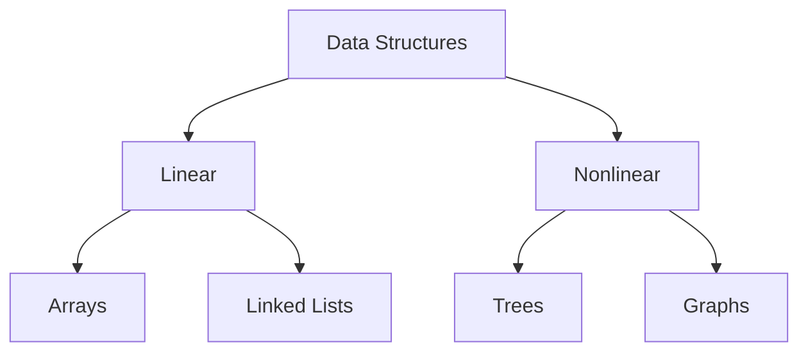

### Two Ways to Represent Linear Structures

1. **Arrays**: Linear relationship represented by sequential memory locations
2. **Linked Lists**: Linear relationship represented by pointers or links (covered in Chapter 5)

### Common Operations on Linear Structures

All linear structures support the following fundamental operations:

**(a) Traversal**: Processing each element in the list sequentially

**(b) Search**: Finding the location of an element with a given value or a record with a given key

**(c) Insertion**: Adding a new element to the list

**(d) Deletion**: Removing an element from the list

**(e) Sorting**: Arranging elements in a specific order (ascending, descending, alphabetical)

**(f) Merging**: Combining two lists into a single list

The choice between arrays and linked lists depends on the relative frequency of these operations. **Arrays** are ideal when data is relatively permanent and requires frequent traversal, searching, and sorting. **Linked lists** are better suited when the size and data constantly change, requiring frequent insertions and deletions.

---

## Section 4.2: Linear Arrays (One-Dimensional Arrays)

### Definition

A **linear array** (or one-dimensional array) is a list of a finite number **n** of homogeneous data elements (elements of the same type) with two key properties:

**(a) Index Set**: Elements are referenced by an index set consisting of consecutive numbers

**(b) Sequential Storage**: Elements are stored in successive memory locations

### Array Properties

**Length or Size**: The number **n** of elements in the array

**Index Set**: Unless explicitly stated, we assume indices are 1, 2, ..., n

**Formula for Length**:
\[ \text{Length} = UB - LB + 1 \]

where:
- **UB** = Upper Bound (largest index)
- **LB** = Lower Bound (smallest index)

**Note**: When LB = 1, then Length = UB

### Notation for Array Elements

Array elements can be denoted using different notations:

1. **Subscript notation**: \( A_1, A_2, A_3, ..., A_n \)
2. **Parentheses notation** (FORTRAN, PL/1, BASIC): `A(1), A(2), ..., A(N)`
3. **Bracket notation** (Pascal, C, Java, Python): `A[1], A[2], A[3], ..., A[N]`

In `A[K]`:
- **K** is called the **subscript** or **index**
- **A[K]** is called a **subscripted variable**

Subscripts allow any element to be referenced by its relative position in the array.

### Example 4.1: Basic Array Usage

**(a) Array DATA with 6 integer elements**:

```
DATA[1] = 247
DATA[2] = 56
DATA[3] = 429
DATA[4] = 135
DATA[5] = 87
DATA[6] = 156
```

**Compact notation**: `DATA: 247, 56, 429, 135, 87, 156`

**Visual representations**:

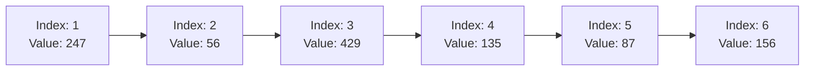

Alternative vertical representation:
```
Index | Value
------|------
  1   |  247
  2   |   56
  3   |  429
  4   |  135
  5   |   87
  6   |  156
```

**(b) Array AUTO for automobile sales (1932-1984)**:

An automobile company uses array AUTO to record annual car sales from 1932 to 1984. Instead of starting with index 1, it's more meaningful to use the year as the index:

```
AUTO[K] = number of automobiles sold in year K
```

- **LB** = 1932 (lower bound)
- **UB** = 1984 (upper bound)
- **Length** = 1984 - 1932 + 1 = 53 elements

**Note**: The original text states length = 55, which appears to be calculated as 1984 - 1930 + 1, suggesting a typo. Using the stated bounds 1932-1984 gives 53 elements.

### Example 4.2: Array Declarations in Different Languages

**(a) DATA: A 6-element linear array of real values**

**FORTRAN**:
```fortran
REAL DATA(6)
```

**PL/1**:
```pl1
DECLARE DATA(6) FLOAT;
```

**Pascal**:
```pascal
VAR DATA: ARRAY[1 .. 6] OF REAL
```

**Simplified notation** (used in this text):
```
DATA(6)
```

**(b) AUTO: Integer array with custom bounds (LB=1932, UB=1984)**

**FORTRAN 77**:
```fortran
INTEGER AUTO(1932:1984)
```

**PL/1**:
```pl1
DECLARE AUTO(1932:1984) FIXED;
```

**Pascal**:
```pascal
VAR AUTO: ARRAY[1932 .. 1984] OF INTEGER
```

**Simplified notation**:
```
AUTO(1932:1984)
```

### Static vs Dynamic Memory Allocation

**Static Allocation** (FORTRAN, Pascal): Memory space is allocated at compile time; array size is fixed during program execution.

**Dynamic Allocation** (Modern languages): Memory space can be allocated at runtime. The program can read an integer **n** and then declare an array with **n** elements.

---

## Section 4.3: Representation of Linear Arrays in Memory

### Computer Memory Structure

Computer memory consists of a sequence of addressed locations. Each location has a unique address.

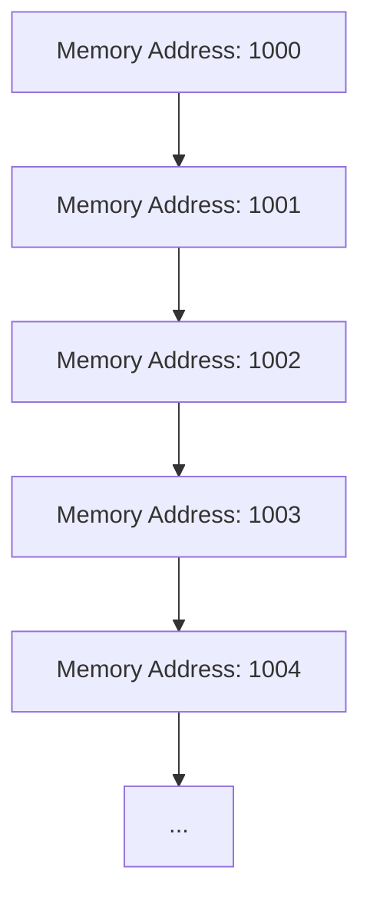

### Address Notation

For a linear array **LA**, we use:
```
LOC(LA[K]) = address of element LA[K]
```

### Base Address Concept

Since array elements are stored in successive memory cells, the computer only needs to track:

```
Base(LA) = address of the first element LA[1]
```

This is called the **base address** of LA.

### Address Calculation Formula

For any element **LA[K]**, the computer calculates its address using:

\[ \text{LOC}(LA[K]) = \text{Base}(LA) + w \times (K - \text{lower bound}) \]

where:
- **w** = number of words per memory cell for array LA
- **K** = the index we're looking for
- **lower bound** = the smallest index in the array

**Key advantage**: The time to calculate LOC(LA[K]) is essentially the same for any value of K. We can locate and access LA[K] without scanning any other elements.

### Example 4.3: Address Calculation

Consider array **AUTO** from Example 4.1(b), storing automobile sales from 1932 to 1984.

**Given**:
- Base(AUTO) = 200
- w = 4 words per memory cell
- Lower bound = 1932

**Memory layout**:
```
Address | Element
--------|--------
  200   | AUTO[1932]
  201   | (part of AUTO[1932])
  202   | (part of AUTO[1932])
  203   | (part of AUTO[1932])
  204   | AUTO[1933]
  205   | (part of AUTO[1933])
  206   | (part of AUTO[1933])
  207   | (part of AUTO[1933])
  208   | AUTO[1934]
  ...   | ...
```

**Find address of AUTO[1965]**:

\[ \text{LOC}(AUTO[1965]) = 200 + 4 \times (1965 - 1932) \]
\[ = 200 + 4 \times 33 \]
\[ = 200 + 132 \]
\[ = 332 \]

**Visualization**:

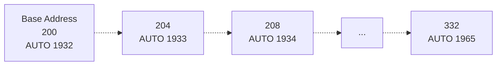

### Indexed Collections

**Definition**: A collection **A** of data elements is **indexed** if any element A[K] can be located and processed in time independent of K.

**Important property**: Linear arrays can be indexed. This is a very important property that distinguishes arrays from linked lists (which cannot be directly indexed).

---

## Section 4.4: Traversing Linear Arrays

### Definition of Traversal

**Traversal** means accessing and processing (visiting) each element of the array exactly once. Common applications include:
- Printing all elements
- Counting elements with a specific property
- Finding sum, average, maximum, or minimum

### Algorithm 4.1: Traversing a Linear Array (While Loop Version)

**Input**: 
- LA: linear array with lower bound LB and upper bound UB
- PROCESS: an operation to apply to each element

**Steps**:

1. **[Initialize counter]** Set K := LB
2. **Repeat Steps 3 and 4 while K ≤ UB**:
3. **[Visit element]** Apply PROCESS to LA[K]
4. **[Increase counter]** Set K := K + 1
   [End of Step 2 loop]
5. **Exit**

**Flowchart**:

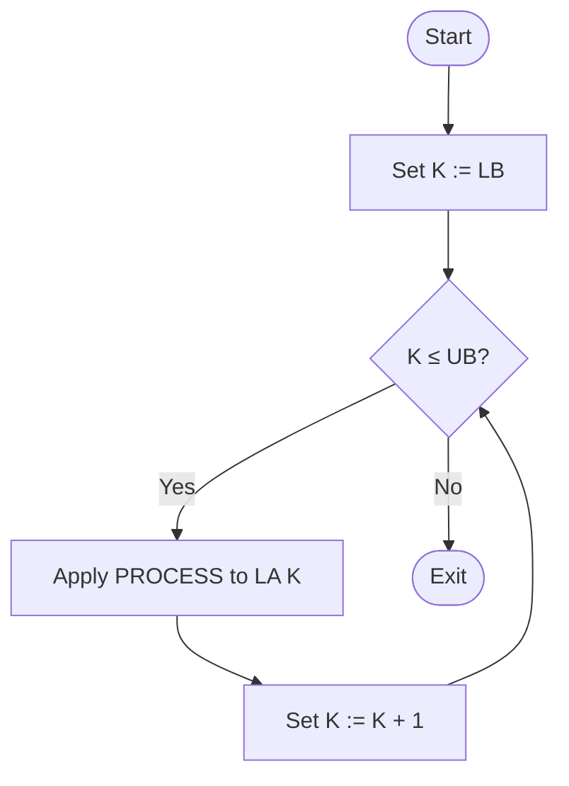

### Algorithm 4.1': Alternative Form (For Loop Version)

**Steps**:

1. **Repeat for K = LB to UB**:
   Apply PROCESS to LA[K]
   [End of loop]
2. **Exit**

**Note**: The for-loop version is more concise but functionally equivalent to the while-loop version.

### Example 4.4: Traversing AUTO Array

Array **AUTO** records automobile sales from 1932 to 1984.

**(a) Count years with more than 300 automobiles sold**:

```
1. [Initialization] Set NUM := 0
2. Repeat for K = 1932 to 1984:
     If AUTO[K] > 300, then: Set NUM := NUM + 1
   [End of loop]
3. Return
```

**Explanation**:
- Initialize counter NUM to 0
- For each year K from 1932 to 1984:
  - Check if AUTO[K] > 300
  - If true, increment NUM by 1
- Return the final count

**(b) Print each year and its sales figure**:

```
1. Repeat for K = 1932 to 1984:
     Write: K, AUTO[K]
   [End of loop]
2. Return
```

**Explanation**:
- For each year K:
  - Print the year K and the sales figure AUTO[K]
- No initialization needed (unlike part a)

**Important Note**: Part (a) requires initialization of NUM to 0 before traversing. This is a common pattern when accumulating values during traversal.

---

## Section 4.5: Inserting and Deleting

### Overview

**Insertion**: Adding a new element to the collection
**Deletion**: Removing an element from the collection

### Insertion at the End

**Easy case**: Inserting at the end of an array is straightforward, provided sufficient memory space is allocated.

#### Example 4.5: Inserting at the End

Suppose **TEST** is declared as a 5-element array, but only TEST[1], TEST[2], and TEST[3] contain data.

**To add value X**:
```
TEST[4] := X
```

**To add value Y after X**:
```
TEST[5] := Y
```

**Problem**: After filling all 5 positions, no new test scores can be added without reallocating memory.

### Insertion in the Middle

**Challenge**: Inserting in the middle requires moving elements to create space.

**Average cost**: On average, half the elements must be moved downward (to higher indices) to accommodate the new element while maintaining order.

### Deletion Operations

**Deletion at the end**: Easy, no elements need to be moved.

**Deletion in the middle**: Each subsequent element must be moved upward (to lower indices) to "fill up" the gap.

**Terminology**:
- **Downward** = toward larger subscripts (lower in visual representation)
- **Upward** = toward smaller subscripts (higher in visual representation)

### Example 4.6: Insertion and Deletion in Alphabetical Array

Array **NAME** contains 8 positions with 5 names in alphabetical order.

**Initial state** (a):
```
NAME[1] = Brown
NAME[2] = Davis
NAME[3] = Johnson
NAME[4] = Smith
NAME[5] = Wagner
NAME[6] = (empty)
NAME[7] = (empty)
NAME[8] = (empty)
```

**State (b): Insert "Ford"**
- Ford should go between Davis (index 2) and Johnson (index 3)
- Must move Johnson, Smith, Wagner down one position
- Result:
```
NAME[1] = Brown
NAME[2] = Davis
NAME[3] = Ford      ← inserted here
NAME[4] = Johnson   ← moved from [3]
NAME[5] = Smith     ← moved from [4]
NAME[6] = Wagner    ← moved from [5]
NAME[7] = (empty)
NAME[8] = (empty)
```

**State (c): Insert "Taylor"**
- Taylor goes between Smith and Wagner
- Only Wagner needs to move
- Result:
```
NAME[1] = Brown
NAME[2] = Davis
NAME[3] = Ford
NAME[4] = Johnson
NAME[5] = Smith
NAME[6] = Taylor    ← inserted here
NAME[7] = Wagner    ← moved from [6]
NAME[8] = (empty)
```

**State (d): Delete "Davis"**
- Remove Davis from index 2
- Move all subsequent names up one position
- Result:
```
NAME[1] = Brown
NAME[2] = Ford      ← moved from [3]
NAME[3] = Johnson   ← moved from [4]
NAME[4] = Smith     ← moved from [5]
NAME[5] = Taylor    ← moved from [6]
NAME[6] = Wagner    ← moved from [7]
NAME[7] = (empty)
NAME[8] = (empty)
```

**Visualization of insertion and deletion**:

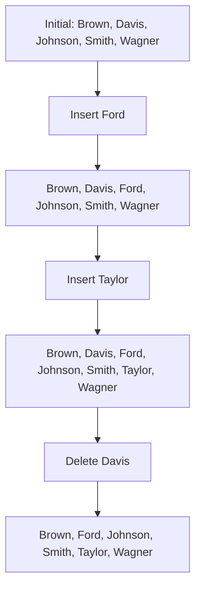

**Cost consideration**: With thousands of names, such data movement would be very expensive in terms of time and computational resources.

### Algorithm 4.2: Inserting into a Linear Array

**INSERT(LA, N, K, ITEM)**

**Input**:
- LA: linear array with N elements
- K: positive integer where K ≤ N
- ITEM: element to insert

**Output**: LA with ITEM inserted at position K; N increased by 1

**Steps**:

1. **[Initialize counter]** Set J := N
2. **Repeat Steps 3 and 4 while J ≥ K**:
3. **[Move Jth element downward]** Set LA[J + 1] := LA[J]
4. **[Decrease counter]** Set J := J - 1
   [End of Step 2 loop]
5. **[Insert element]** Set LA[K] := ITEM
6. **[Reset N]** Set N := N + 1
7. **Exit**

**Explanation**:
- Steps 1-4 create space by moving elements downward in **reverse order**
- Why reverse order? To prevent overwriting data (see Solved Problem 4.3)
- Start from LA[N], then LA[N-1], ..., down to LA[K]
- Step 5 places ITEM in the newly created space
- Step 6 updates the count of elements

**Flowchart**:

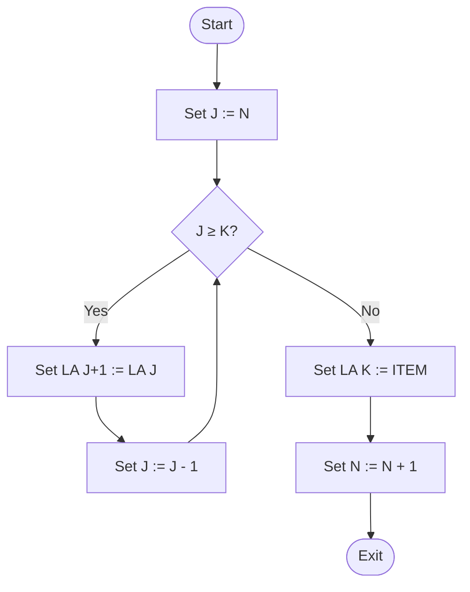

### Algorithm 4.3: Deleting from a Linear Array

**DELETE(LA, N, K, ITEM)**

**Input**:
- LA: linear array with N elements
- K: positive integer where K ≤ N

**Output**: 
- ITEM: the deleted element (LA[K])
- LA with element at position K removed; N decreased by 1

**Steps**:

1. **[Save deleted element]** Set ITEM := LA[K]
2. **Repeat for J = K to N - 1**:
   **[Move J+1st element upward]** Set LA[J] := LA[J + 1]
   [End of loop]
3. **[Reset N]** Set N := N - 1
4. **Exit**

**Explanation**:
- Step 1 saves the element to be deleted
- Step 2 moves all subsequent elements up one position
- Movement is in forward order: LA[K], LA[K+1], ..., LA[N-1]
- Step 3 decreases the element count
- The last position LA[N] still contains old data but is now beyond the active array

**Flowchart**:

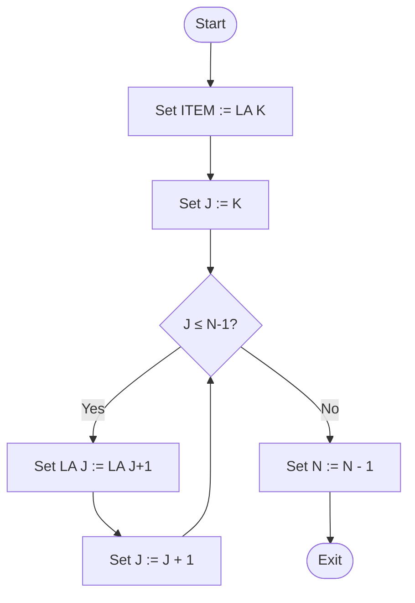

**Important Remark**: If many insertions and deletions are required, a linear array may not be the most efficient data structure. Consider using linked lists instead (Chapter 5).

---

## Section 4.6: Sorting - Bubble Sort

### What is Sorting?

**Sorting** a list A of n numbers means rearranging elements in increasing order:

\[ A[1] < A[2] < A[3] < ... < A[N] \]

#### Example:

**Original list**:
```
8, 4, 19, 2, 7, 13, 5, 16
```

**After sorting**:
```
2, 4, 5, 7, 8, 13, 16, 19
```

**Note**: Sorting can also mean:
- Arranging numbers in **decreasing** order
- Arranging non-numerical data **alphabetically**
- Arranging records by a **key** field

### The Bubble Sort Algorithm

Bubble sort is a simple sorting algorithm that works by repeatedly comparing and swapping adjacent elements.

#### How Bubble Sort Works

Given list A[1], A[2], ..., A[N]:

**Step 1** (Pass 1):
- Compare A[1] and A[2]; arrange so A[1] < A[2]
- Compare A[2] and A[3]; arrange so A[2] < A[3]
- Compare A[3] and A[4]; arrange so A[3] < A[4]
- Continue until comparing A[N-1] and A[N]
- **Result**: Largest element "bubbles up" or "sinks" to position N
- **Comparisons**: N - 1

**Step 2** (Pass 2):
- Repeat Step 1, but stop at A[N-2] and A[N-1]
- **Result**: Second largest element moves to position N-1
- **Comparisons**: N - 2

**Step 3** (Pass 3):
- Repeat, stopping at A[N-3] and A[N-2]
- **Comparisons**: N - 3

**Continue** until:

**Step N-1** (Pass N-1):
- Compare only A[1] and A[2]
- **Comparisons**: 1

**Total passes**: N - 1 (for N elements)

### Example 4.7: Bubble Sort Walkthrough

**Initial array A**:
```
32, 51, 27, 85, 66, 23, 13, 57
```

**Pass 1** (7 comparisons):

(a) Compare 32 and 51: 32 < 51 ✓ No change
```
32, 51, 27, 85, 66, 23, 13, 57
```

(b) Compare 51 and 27: 51 > 27 ⇒ **Swap**
```
32, 27, 51, 85, 66, 23, 13, 57
```

(c) Compare 51 and 85: 51 < 85 ✓ No change
```
32, 27, 51, 85, 66, 23, 13, 57
```

(d) Compare 85 and 66: 85 > 66 ⇒ **Swap**
```
32, 27, 51, 66, 85, 23, 13, 57
```

(e) Compare 85 and 23: 85 > 23 ⇒ **Swap**
```
32, 27, 51, 66, 23, 85, 13, 57
```

(f) Compare 85 and 13: 85 > 13 ⇒ **Swap**
```
32, 27, 51, 66, 23, 13, 85, 57
```

(g) Compare 85 and 57: 85 > 57 ⇒ **Swap**
```
32, 27, 51, 66, 23, 13, 57, 85
```

**Result after Pass 1**: Largest element (85) is in final position.

**Pass 2** (6 comparisons, showing only swaps):

```
32, 27, 51, 66, 23, 13, 57, 85
⇓ swap(32,27)
27, 32, 51, 66, 23, 13, 57, 85
⇓ swap(66,23)
27, 32, 51, 23, 66, 13, 57, 85
⇓ swap(66,13)
27, 32, 51, 23, 13, 66, 57, 85
⇓ swap(66,57)
27, 32, 51, 23, 13, 57, 66, 85
```

**Result after Pass 2**: Second largest (66) is in position.

**Pass 3** (5 comparisons):
```
27, 32, 51, 23, 13, 57, 66, 85
⇓ swap(51,23)
27, 32, 23, 51, 13, 57, 66, 85
⇓ swap(51,13)
27, 32, 23, 13, 51, 57, 66, 85
```

**Pass 4** (4 comparisons):
```
27, 32, 23, 13, 51, 57, 66, 85
⇓ swap(32,23)
27, 23, 32, 13, 51, 57, 66, 85
⇓ swap(32,13)
27, 23, 13, 32, 51, 57, 66, 85
```

**Pass 5** (3 comparisons):
```
27, 23, 13, 32, 51, 57, 66, 85
⇓ swap(27,23)
23, 27, 13, 32, 51, 57, 66, 85
⇓ swap(27,13)
23, 13, 27, 32, 51, 57, 66, 85
```

**Pass 6** (2 comparisons):
```
23, 13, 27, 32, 51, 57, 66, 85
⇓ swap(23,13)
13, 23, 27, 32, 51, 57, 66, 85
```

**Pass 7** (1 comparison):
```
13, 23, 27, 32, 51, 57, 66, 85
```
Compare 13 and 23: 13 < 23 ✓ No swap needed

**Final sorted array**:
```
13, 23, 27, 32, 51, 57, 66, 85
```

**Visualization of bubble sort process**:

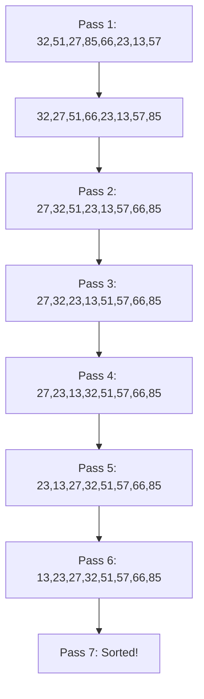

### Algorithm 4.4: Bubble Sort (Formal)

**BUBBLE(DATA, N)**

**Input**: DATA array with N elements
**Output**: DATA sorted in ascending order

**Steps**:

1. **Repeat Steps 2 and 3 for K = 1 to N - 1**:
2. **[Initialize pass pointer]** Set PTR := 1
3. **Repeat while PTR ≤ N - K**: [Execute pass]
   (a) **If DATA[PTR] > DATA[PTR + 1], then**:
       Interchange DATA[PTR] and DATA[PTR + 1]
       [End of If structure]
   (b) Set PTR := PTR + 1
   [End of inner loop]
   [End of Step 1 outer loop]
4. **Exit**

**Key points**:
- **Outer loop** (controlled by K): Executes N-1 passes
- **Inner loop** (controlled by PTR): Makes comparisons within each pass
- PTR is used as a subscript for array access
- K is used only as a counter, not as a subscript

**Flowchart**:

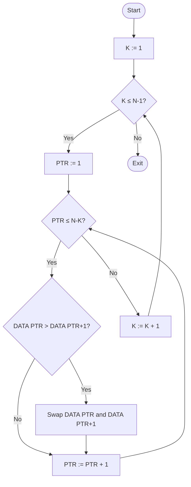

### Complexity of Bubble Sort

**Measurement**: Time complexity is measured by the number of comparisons.

**Total comparisons** f(n):
- Pass 1: n - 1 comparisons
- Pass 2: n - 2 comparisons
- Pass 3: n - 3 comparisons
- ...
- Pass n - 1: 1 comparison

\[ f(n) = (n-1) + (n-2) + ... + 2 + 1 \]
\[ f(n) = \frac{n(n-1)}{2} \]
\[ f(n) = \frac{n^2}{2} + O(n) \]
\[ f(n) = O(n^2) \]

**Conclusion**: Bubble sort has **quadratic time complexity**. The running time is proportional to \( n^2 \).

### Optimization with FLAG Variable

**Improvement**: Use a FLAG (boolean) to detect when the list is already sorted.

**How it works**:
- Set FLAG = 0 before each pass
- Set FLAG = 1 whenever a swap occurs
- If FLAG = 0 after a pass, the list is sorted → stop early

**When is this efficient?**
- Only when the list is "almost" sorted
- For random data, the overhead of checking FLAG may not be worthwhile

**Trade-off**: Must initialize, change, and test FLAG during each pass, adding overhead.

---

## Section 4.7: Searching - Linear Search

### What is Searching?

**Searching** is the operation of finding the location LOC of a specific ITEM in a data collection DATA.

**Outcomes**:
- **Successful**: ITEM found at LOC
- **Unsuccessful**: ITEM not in DATA (print message or return special value)

**Search and Insertion**: After unsuccessful search, often want to add ITEM to DATA.

**Complexity Measure**: Number of comparisons f(n) required to find ITEM in DATA with n elements.

### Linear Search (Sequential Search)

**Concept**: Search DATA by comparing ITEM with each element one by one, from start to end.

**Process**:
1. Test if DATA[1] = ITEM
2. Test if DATA[2] = ITEM
3. Continue until ITEM is found or end of array reached

**Optimization trick**: Place ITEM at position DATA[N+1] (sentinel) to guarantee the search will "succeed" and avoid repeated end-of-array checks.

**Outcome interpretation**:
- If LOC = N + 1: Search unsuccessful (ITEM not in original array)
- If LOC ≤ N: Search successful (ITEM found at position LOC)

### Algorithm 4.5: Linear Search

**LINEAR(DATA, N, ITEM, LOC)**

**Input**:
- DATA: linear array with N elements
- ITEM: item to search for

**Output**:
- LOC: location of ITEM in DATA, or LOC = 0 if not found

**Steps**:

1. **[Insert ITEM at end]** Set DATA[N + 1] := ITEM
2. **[Initialize counter]** Set LOC := 1
3. **[Search for ITEM]**
   Repeat while DATA[LOC] ≠ ITEM:
     Set LOC := LOC + 1
   [End of loop]
4. **[Successful?]** If LOC = N + 1, then: Set LOC := 0
5. **Exit**

**Explanation**:
- Step 1 guarantees the loop will terminate (sentinel technique)
- Step 3 uses single comparison (not checking LOC ≤ N each time)
- Step 4 checks if we found the sentinel (meaning ITEM not in original array)

**Flowchart**:

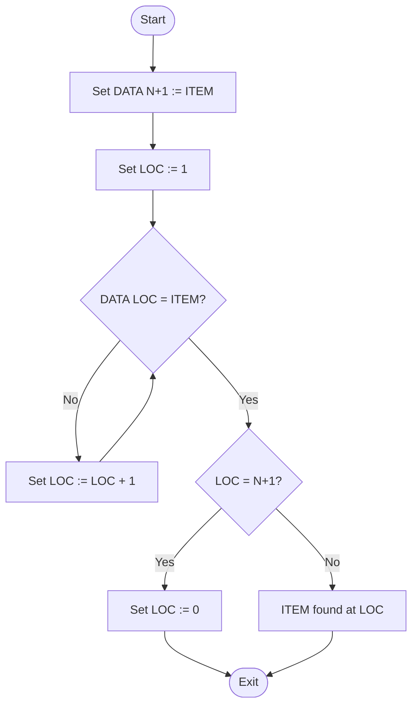

**Trade-off**: Sentinel technique requires unused memory at DATA[N+1], but saves repeated boundary checks.

### Example 4.8: Linear Search in Action

**Array NAME** with n = 6:
```
NAME[1] = Mary
NAME[2] = Jane
NAME[3] = Diane
NAME[4] = Susan
NAME[5] = Karen
NAME[6] = Edith
NAME[7] = (empty - available for sentinel)
```

**(a) Search for "Paula"**:

1. Set NAME[7] = "Paula" (sentinel)
2. Compare from index 1:
   - NAME[1] = "Mary" ≠ "Paula"
   - NAME[2] = "Jane" ≠ "Paula"
   - NAME[3] = "Diane" ≠ "Paula"
   - NAME[4] = "Susan" ≠ "Paula"
   - NAME[5] = "Karen" ≠ "Paula"
   - NAME[6] = "Edith" ≠ "Paula"
   - NAME[7] = "Paula" = "Paula" ✓
3. LOC = 7 = N + 1
4. **Result**: Paula NOT in original array

**(b) Search for "Susan"**:

1. Set NAME[7] = "Susan" (sentinel)
2. Compare from index 1:
   - NAME[1] = "Mary" ≠ "Susan"
   - NAME[2] = "Jane" ≠ "Susan"
   - NAME[3] = "Diane" ≠ "Susan"
   - NAME[4] = "Susan" = "Susan" ✓
3. LOC = 4 ≤ N
4. **Result**: Susan found at position 4

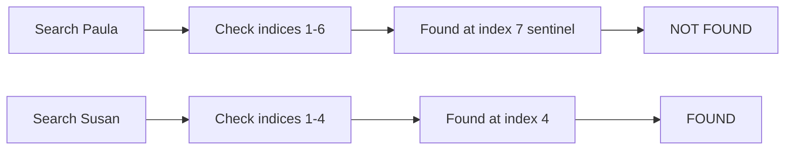

### Complexity of Linear Search

#### Worst Case

**When**: ITEM not in DATA (must search entire array)

**Comparisons**: f(n) = n + 1

**Time**: Proportional to n

#### Average Case

**Probabilistic approach**: Let
- \( p_i \) = probability ITEM is at DATA[i]
- q = probability ITEM not in DATA
- Constraint: \( p_1 + p_2 + ... + p_n + q = 1 \)

**Average comparisons**:
\[ f(n) = 1 \cdot p_1 + 2 \cdot p_2 + ... + n \cdot p_n + (n+1) \cdot q \]

**Special case**: Equal probability, negligible q

If:
- q ≈ 0 (ITEM almost certainly in DATA)
- Each \( p_i = \frac{1}{n} \) (equal probability at each position)

Then:
\[ f(n) = 1 \cdot \frac{1}{n} + 2 \cdot \frac{1}{n} + ... + n \cdot \frac{1}{n} + (n+1) \cdot 0 \]
\[ f(n) = \frac{1}{n}(1 + 2 + ... + n) \]
\[ f(n) = \frac{1}{n} \cdot \frac{n(n+1)}{2} \]
\[ f(n) = \frac{n+1}{2} \]

**Conclusion**: On average, linear search requires approximately **half the number of elements** to find ITEM.

---

## Section 4.8: Binary Search

### Prerequisites

**Binary search** requires:
- DATA must be **sorted** (increasing order or alphabetically)

**Advantage**: Extremely efficient - much faster than linear search

### Intuitive Example: Phone Directory

Finding a name in a phone directory (or word in dictionary):

1. Open book in the **middle**
2. Determine which **half** contains the name
3. Open that half in the **middle**
4. Determine which **quarter** contains the name
5. Continue halving until name is found

**Key idea**: Reduce search space by half with each step.

### Binary Search Algorithm Description

**Variables**:
- **BEG**: beginning of current search segment
- **END**: end of current search segment
- **MID**: middle of current segment

**Process**:

Initially: BEG = 1 (or LB), END = N (or UB)

**Each iteration**:
1. Calculate middle position:
   \[ \text{MID} = \text{INT}\left(\frac{\text{BEG} + \text{END}}{2}\right) \]

2. Compare ITEM with DATA[MID]:
   - If **DATA[MID] = ITEM**: Found! Set LOC := MID
   - If **ITEM < DATA[MID]**: Search left half
     - Set END := MID - 1
   - If **ITEM > DATA[MID]**: Search right half
     - Set BEG := MID + 1

3. Repeat until found or BEG > END

**Unsuccessful search**: Eventually BEG > END, meaning ITEM not in DATA. Set LOC := NULL (typically 0).

### Algorithm 4.6: Binary Search (Formal)

**BINARY(DATA, LB, UB, ITEM, LOC)**

**Input**:
- DATA: sorted array with lower bound LB, upper bound UB
- ITEM: item to search for

**Output**:
- LOC: location of ITEM, or NULL if not found

**Steps**:

1. **[Initialize segment variables]**
   Set BEG := LB, END := UB, MID := INT((BEG + END)/2)

2. **Repeat Steps 3 and 4 while BEG ≤ END and DATA[MID] ≠ ITEM**:

3. **If ITEM < DATA[MID], then**:
     Set END := MID - 1
   **Else**:
     Set BEG := MID + 1
   [End of If structure]

4. Set MID := INT((BEG + END)/2)
   [End of Step 2 loop]

5. **If DATA[MID] = ITEM, then**:
     Set LOC := MID
   **Else**:
     Set LOC := NULL
   [End of If structure]

6. **Exit**

**Flowchart**:

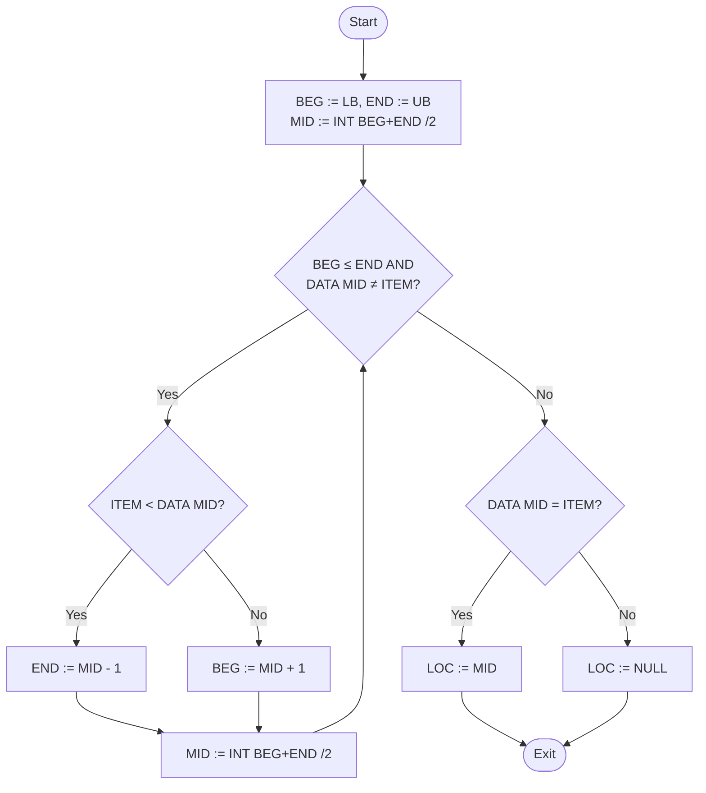

### Example 4.9: Binary Search Walkthrough

**Sorted array DATA** (13 elements):
```
Index:  1   2   3   4   5   6   7   8   9  10  11  12  13
Value: 11  22  30  33  40  44  55  60  66  77  80  88  99
```

#### Part (a): Search for ITEM = 40

**Iteration 1**:
- BEG = 1, END = 13
- MID = INT((1 + 13)/2) = 7
- DATA[7] = 55
- Since 40 < 55: Set END = 7 - 1 = 6

**Iteration 2**:
- BEG = 1, END = 6
- MID = INT((1 + 6)/2) = 3
- DATA[3] = 30
- Since 40 > 30: Set BEG = 3 + 1 = 4

**Iteration 3**:
- BEG = 4, END = 6
- MID = INT((4 + 6)/2) = 5
- DATA[5] = 40
- **Found!** LOC = 5

**Visual trace**:
```
(1) [11, 22, 30, 33, 40, 44, |55|, 60, 66, 77, 80, 88, 99]
     ^BEG                              ^END  ^MID
     
(2) [11, 22, |30|, 33, 40, 44] 55, 60, 66, 77, 80, 88, 99
     ^BEG     ^MID      ^END
     
(3) [11, 22, 30, 33, |40|, 44] 55, 60, 66, 77, 80, 88, 99
                 ^BEG ^MID^END
```

**Result**: ITEM = 40 found at LOC = 5 in **3 comparisons**.

#### Part (b): Search for ITEM = 85 (not in array)

**Iteration 1**:
- BEG = 1, END = 13
- MID = 7, DATA[7] = 55
- Since 85 > 55: Set BEG = 8

**Iteration 2**:
- BEG = 8, END = 13
- MID = INT((8 + 13)/2) = 10
- DATA[10] = 77
- Since 85 > 77: Set BEG = 11

**Iteration 3**:
- BEG = 11, END = 13
- MID = INT((11 + 13)/2) = 12
- DATA[12] = 88
- Since 85 < 88: Set END = 11

**Iteration 4**:
- BEG = 11, END = 11
- MID = INT((11 + 11)/2) = 11
- DATA[11] = 80
- Since 85 > 80: Set BEG = 12

**Termination**:
- Now BEG = 12 > END = 11
- Loop exits
- DATA[MID] ≠ ITEM
- **Not found**: LOC = NULL (0)

**Visual trace**:
```
(1) [11, 22, 30, 33, 40, 44, |55|, 60, 66, 77, 80, 88, 99]
     
(2) [11, 22, 30, 33, 40, 44, 55, (60, 66, |77|, 80, 88, 99)]
                                   ^BEG    ^MID       ^END
     
(3) [11, 22, 30, 33, 40, 44, 55, 60, 66, 77, (80, |88|, 99)]
                                             ^BEG^END^MID
     
(4) [11, 22, 30, 33, 40, 44, 55, 60, 66, 77, (|80|, 88, 99)]
                                            ^BEG=END=MID
     
(5) BEG(12) > END(11) → Search unsuccessful
```

**Result**: ITEM = 85 not found after **4 comparisons** (plus final check).

### Complexity of Binary Search

**Observation**: Each comparison reduces search space by half.

**Maximum comparisons** f(n):

After k comparisons, at most \( \frac{n}{2^k} \) elements remain.

When \( 2^k \geq n \), the search completes.

Therefore: \( k \geq \log_2 n \)

**Formal result**:
\[ f(n) = \lfloor \log_2 n \rfloor + 1 \]

**Time complexity**: O(log n)

**Average case**: Approximately equal to worst case for binary search.

### Example 4.10: Binary Search with 1,000,000 Elements

**Given**: DATA contains 1,000,000 elements

**Calculation**:
- \( 2^{10} = 1024 > 1000 \)
- \( 2^{20} = (2^{10})^2 > 1000^2 = 1,000,000 \)

**Conclusion**: Binary search requires only about **20 comparisons** to search 1,000,000 elements!

**Comparison with linear search**:
- Linear search worst case: 1,000,000 comparisons
- Binary search worst case: ~20 comparisons
- **Speedup**: 50,000× faster!

### Limitations of Binary Search

**Question**: If binary search is so efficient, why use any other search algorithm?

**Requirements** for binary search:
1. Data must be **sorted**
2. Must have **direct access** to middle element (need indexed structure)

**Implications**:
- Must use sorted array
- Maintaining sorted array is expensive with frequent insertions/deletions
- Each insertion/deletion may require moving many elements

**When binary search is NOT ideal**:
- Frequent insertions and deletions
- Data constantly changing

**Alternative data structures**:
- **Linked lists**: Easy insertion/deletion, but no direct access to middle
- **Binary search trees**: Combines advantages of both
- **Hash tables**: O(1) average search time

**Conclusion**: Binary search is excellent for static or rarely-changed sorted data, but may not be suitable when data changes frequently.

---

## Section 4.9: Multidimensional Arrays

### Introduction

**One-dimensional arrays** (linear arrays): Elements referenced by a single subscript

**Multidimensional arrays**: Elements referenced by multiple subscripts
- **Two-dimensional**: 2 subscripts (matrices, tables)
- **Three-dimensional**: 3 subscripts
- **Higher dimensions**: Some languages allow up to 7 dimensions

### Two-Dimensional Arrays

#### Definition

A **two-dimensional m × n array A** is a collection of m·n data elements where each element is specified by a pair of integers (J, K):

- **J**: Row index, where 1 ≤ J ≤ m
- **K**: Column index, where 1 ≤ K ≤ n

#### Notation

**Element notation**:
- Subscript: \( A_{JK} \)
- Comma: `A[J, K]`
- FORTRAN style: `A(J, K)`

#### Terminology

**Matrix**: Mathematical term for two-dimensional array

**Table**: Business term for two-dimensional array

**Matrix array**: General programming term

#### Visual Representation

A two-dimensional m × n array is drawn as a rectangular grid:
- **m rows** (horizontal)
- **n columns** (vertical)
- Element A[J, K] appears in row J and column K

**Example**: 3 × 4 array

```
         Column 1    Column 2    Column 3    Column 4
Row 1    A[1,1]     A[1,2]      A[1,3]      A[1,4]
Row 2    A[2,1]     A[2,2]      A[2,3]      A[2,4]
Row 3    A[3,1]     A[3,2]      A[3,3]      A[3,4]
```

**Key observations**:
- Each **row** contains elements with the same **first subscript**
- Each **column** contains elements with the same **second subscript**

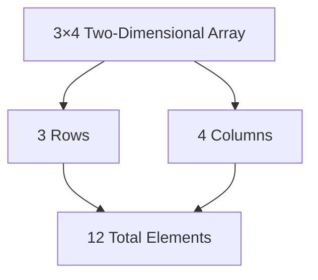

### Example 4.11: Student Test Scores

**Scenario**: 25 students, each takes 4 tests

**Array**: SCORE (25 × 4 matrix)
- Rows: Students (1 to 25)
- Columns: Tests (1 to 4)

**Element interpretation**:
```
SCORE[K, L] = Kth student's score on Lth test
```

**Example data**:
```
Student  Test1  Test2  Test3  Test4
   1      84     73     88     81
   2      95    100     88     96
   3      72     66     77     72
  ...
  25      78     82     70     85
```

**Accessing specific scores**:
- SCORE[2, 1] = 95 (Student 2, Test 1)
- SCORE[2, 2] = 100 (Student 2, Test 2)
- SCORE[2, 3] = 88 (Student 2, Test 3)
- SCORE[2, 4] = 96 (Student 2, Test 4)

**Row access** (all scores for Student 2):
```
SCORE[2, 1], SCORE[2, 2], SCORE[2, 3], SCORE[2, 4]
= 95, 100, 88, 96
```

### Array Dimensions and Bounds

#### Regular Arrays

**First dimension**:
- Index set: 1, 2, ..., m
- Lower bound: 1
- Upper bound: m
- Length: m

**Second dimension**:
- Index set: 1, 2, ..., n
- Lower bound: 1
- Upper bound: n
- Length: n

**Size**: m × n (pronounced "m by n")

**Total elements**: m · n

#### Nonregular Arrays

Some languages allow **custom lower bounds** (not always 1).

**Length formula** (same as Eq. 4.1):
\[ \text{Length} = \text{upper bound} - \text{lower bound} + 1 \]

**Example**: Array with bounds (2:8, -4:1)
- First dimension: Length = 8 - 2 + 1 = 7
- Second dimension: Length = 1 - (-4) + 1 = 6
- Total elements: 7 × 6 = 42

### Array Declarations

**FORTRAN** (4 × 8 array of reals):
```fortran
REAL DATA(4, 8)
```

**PL/1**:
```pl1
DECLARE DATA(4, 8) FLOAT;
```

**Pascal**:
```pascal
VAR DATA: ARRAY[1 .. 4, 1 .. 8] OF REAL;
```

**Note**: Pascal explicitly includes lower bounds even when they are 1.

**Nonregular array** (FORTRAN):
```fortran
INTEGER NUMB(2:5, -3:1)
```

This declares NUMB with:
- First dimension: indices 2, 3, 4, 5 (length 4)
- Second dimension: indices -3, -2, -1, 0, 1 (length 5)
- Total: 4 × 5 = 20 elements

**Separator convention**:
- **Colon (:)**: Separates lower and upper bounds within dimension
- **Comma (,)**: Separates different dimensions

### Representation in Memory

#### Memory Organization

**Problem**: 2D arrays are logical rectangular grids, but computer memory is **linear** (one-dimensional sequence).

**Solution**: Store 2D array in linear sequence using one of two orders:

1. **Column-major order**: Store column by column
2. **Row-major order**: Store row by row

**Language dependence**: The storage order depends on the programming language, not the programmer's choice.

#### Column-Major Order

**Process**: Store entire first column, then second column, etc.

**Example**: 3 × 4 array A

```
Logical view:
     Col1  Col2  Col3  Col4
Row1  a    b     c     d
Row2  e    f     g     h
Row3  i    j     k     l

Memory storage (column-major):
[a, e, i, b, f, j, c, g, k, d, h, l]
 └─Col1─┘ └─Col2─┘ └─Col3─┘ └─Col4─┘

Subscripts in order:
(1,1), (2,1), (3,1), (1,2), (2,2), (3,2), (1,3), (2,3), (3,3), (1,4), (2,4), (3,4)
```

**Rule**: First subscript varies fastest.

#### Row-Major Order

**Process**: Store entire first row, then second row, etc.

**Example**: Same 3 × 4 array A

```
Memory storage (row-major):
[a, b, c, d, e, f, g, h, i, j, k, l]
 └──Row1──┘ └──Row2──┘ └──Row3──┘

Subscripts in order:
(1,1), (1,2), (1,3), (1,4), (2,1), (2,2), (2,3), (2,4), (3,1), (3,2), (3,3), (3,4)
```

**Rule**: Last subscript varies fastest.

**Visualization**:

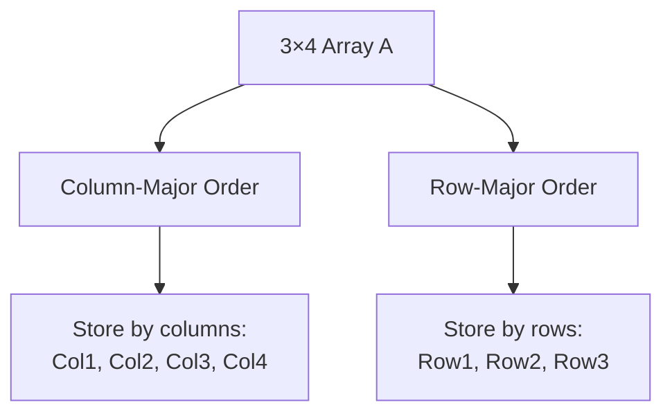

### Address Calculation for 2D Arrays

**Variables**:
- **Base(A)**: Address of first element A[1, 1]
- **w**: Number of words per memory cell
- **M**: Number of rows (first dimension length)
- **N**: Number of columns (second dimension length)

#### Column-Major Order Formula

\[ \text{LOC}(A[J, K]) = \text{Base}(A) + w[M(K - 1) + (J - 1)] \]

**Explanation**:
- (K - 1) complete columns before column K
- Each column has M elements
- (J - 1) elements within column K before row J

#### Row-Major Order Formula

\[ \text{LOC}(A[J, K]) = \text{Base}(A) + w[N(J - 1) + (K - 1)] \]

**Explanation**:
- (J - 1) complete rows before row J
- Each row has N elements
- (K - 1) elements within row J before column K

**Key property**: Both formulas are **linear** in J and K, allowing constant-time access.

### Example 4.12: Address Calculation

**Array SCORE** (25 × 4) from Example 4.11:
- Size: 25 rows (students) × 4 columns (tests)
- Base(SCORE) = 200
- w = 4 words per cell
- Storage: Row-major order

**Find**: Address of SCORE[12, 3] (Student 12, Test 3)

**Using row-major formula** (Eq. 4.5):
\[ \text{LOC}(SCORE[12, 3]) = 200 + 4[4(12 - 1) + (3 - 1)] \]
\[ = 200 + 4[4 \times 11 + 2] \]
\[ = 200 + 4[44 + 2] \]
\[ = 200 + 4 \times 46 \]
\[ = 200 + 184 \]
\[ = 384 \]

**Result**: SCORE[12, 3] is stored at memory address 384.

### Logical vs Physical Views

**Logical view**: How we think about data (e.g., rectangular grid)

**Physical view**: How data is actually stored in memory (linear sequence)

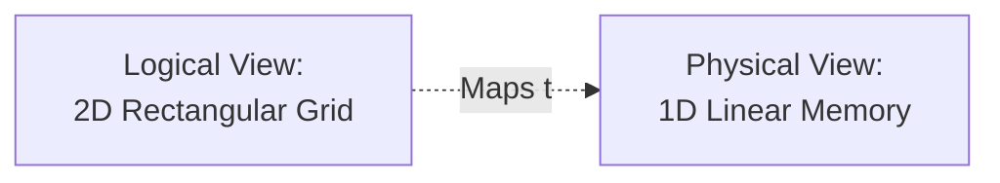

**Importance**: This distinction appears throughout data structures:
- Trees and graphs have logical hierarchical/network structure
- But physically stored in linear memory cells

**Programming advantage**: Languages handle the mapping automatically, so programmers work with logical view while computer handles physical storage.

### Three-Dimensional Arrays

#### Definition

An **n-dimensional array** \( B_{m_1 \times m_2 \times ... \times m_n} \) contains \( m_1 \cdot m_2 \cdot ... \cdot m_n \) elements.

Each element specified by **n subscripts**: \( K_1, K_2, ..., K_n \)

**Constraints**: \( 1 \leq K_i \leq m_i \) for each dimension i

**Notation**:
- \( B_{K_1 K_2 ... K_n} \) (subscript)
- `B[K1, K2, ..., KN]` (bracket)

#### Storage in Memory

**Row-major order**:
- Last subscript varies first (fastest)
- Next-to-last varies second
- Like an automobile odometer

**Column-major order**:
- First subscript varies first (fastest)
- Second subscript varies second

### Example 4.13: Three-Dimensional Array

**Array B**: 2 × 4 × 3 (24 elements)

**Dimensions**:
- Rows: 2
- Columns: 4
- Pages: 3

**Total elements**: 2 × 4 × 3 = 24

**Visual representation** (3 pages):

```
Page 1:
     Col1     Col2     Col3     Col4
R1   B[1,1,1] B[1,2,1] B[1,3,1] B[1,4,1]
R2   B[2,1,1] B[2,2,1] B[2,3,1] B[2,4,1]

Page 2:
     Col1     Col2     Col3     Col4
R1   B[1,1,2] B[1,2,2] B[1,3,2] B[1,4,2]
R2   B[2,1,2] B[2,2,2] B[2,3,2] B[2,4,2]

Page 3:
     Col1     Col2     Col3     Col4
R1   B[1,1,3] B[1,2,3] B[1,3,3] B[1,4,3]
R2   B[2,1,3] B[2,2,3] B[2,3,3] B[2,4,3]
```

**Column-major order** in memory:
```
B[1,1,1], B[2,1,1], B[1,2,1], B[2,2,1], B[1,3,1], B[2,3,1], B[1,4,1], B[2,4,1],
B[1,1,2], B[2,1,2], ..., B[2,4,3]
```
Pattern: First subscript varies fastest

**Row-major order** in memory:
```
B[1,1,1], B[1,1,2], B[1,1,3], B[1,2,1], B[1,2,2], B[1,2,3], B[1,3,1], B[1,3,2],
..., B[2,4,3]
```
Pattern: Last subscript varies fastest

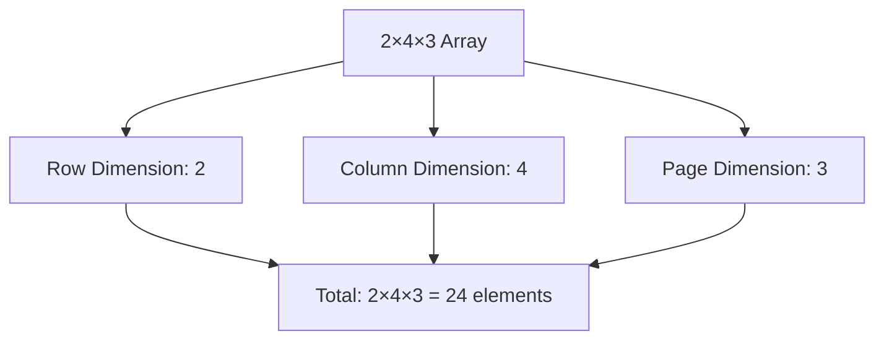

### General Multidimensional Array Formulas

#### Dimension Length

For dimension i with custom bounds:
\[ L_i = \text{upper bound} - \text{lower bound} + 1 \]

#### Effective Index

The **effective index** \( E_i \) for subscript \( K_i \):
\[ E_i = K_i - \text{lower bound} \]

**Meaning**: Number of indices preceding \( K_i \) in the index set.

#### Address Calculation

**Column-major order**:
\[ \text{LOC}(C[K_1, K_2, ..., K_N]) = \text{Base}(C) + w[((...((E_N L_{N-1} + E_{N-1})L_{N-2} + ...) L_2 + E_2)L_1 + E_1] \]

**Row-major order**:
\[ \text{LOC}(C[K_1, K_2, ..., K_N]) = \text{Base}(C) + w[((...((E_1 L_2 + E_2)L_3 + E_3)L_4 + ...) L_N + E_N] \]

### Example 4.14: Address Calculation for 3D Array

**Declaration**:
```
MAZE(2:8, -4:1, 6:10)
```

**Calculate dimension lengths**:
- \( L_1 = 8 - 2 + 1 = 7 \)
- \( L_2 = 1 - (-4) + 1 = 6 \)
- \( L_3 = 10 - 6 + 1 = 5 \)

**Total elements**: 7 × 6 × 5 = 210

**Given**:
- Storage: Row-major order
- Base(MAZE) = 200
- w = 4 words per cell

**Find**: LOC(MAZE[5, -1, 8])

**Calculate effective indices**:
- \( E_1 = 5 - 2 = 3 \)
- \( E_2 = -1 - (-4) = 3 \)
- \( E_3 = 8 - 6 = 2 \)

**Apply row-major formula** (Eq. 4.9):

Step 1: \( E_1 L_2 = 3 \times 6 = 18 \)
Step 2: \( E_1 L_2 + E_2 = 18 + 3 = 21 \)
Step 3: \( (E_1 L_2 + E_2)L_3 = 21 \times 5 = 105 \)
Step 4: \( (E_1 L_2 + E_2)L_3 + E_3 = 105 + 2 = 107 \)

**Final calculation**:
\[ \text{LOC}(MAZE[5, -1, 8]) = 200 + 4 \times 107 = 200 + 428 = 628 \]

**Result**: MAZE[5, -1, 8] is stored at address 628.

---

## Section 4.10: Pointers and Pointer Arrays

### Definition of Pointer

**Pointer**: A variable P that "points to" an element in an array DATA by containing the **address** of that element.

**Pointer array**: Array PTR where each element is a pointer.

**Purpose**: Facilitate processing by providing indirect access to data.

### Motivation: Grouped Membership List

**Scenario**: Organization divides members into 4 geographical groups:

```
Group 1:        Group 2:        Group 3:    Group 4:
Evans           Conrad          Davis       Baker
Harris          Felt            Segal       Cooper
Lewis           Glass                       Ford
Shaw            Hill                        Gray
                Jones                       King
                Penn                        Penn
                Reed
                Silver
                Troy
                Wagner
```

**Counts**: 4, 9, 2, 6 members respectively (21 total)

### Storage Approach 1: Two-Dimensional Array

**Option**: Use 4 × 9 or 9 × 4 array (one row/column per group)

**Problem**: **Jagged array** - groups have different sizes

```
Group 1: [*, *, *, *, 0, 0, 0, 0, 0]
Group 2: [*, *, *, *, *, *, *, *, *]
Group 3: [*, *, 0, 0, 0, 0, 0, 0, 0]
Group 4: [*, *, *, *, *, *, 0, 0, 0]

* = data element
0 = unused (wasted) space
```

**Space waste**: 36 cells needed for 21 names (42% waste!)

**Diagram**:

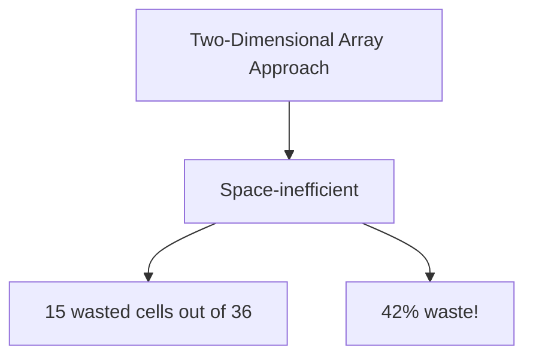

### Storage Approach 2: Linear Array (Simple)

**Method**: Store all names in one linear array, group by group.

```
MEMBER:
1  Evans
2  Harris
3  Lewis
4  Shaw
5  Conrad
6  Felt
...
21 Reed
```

**Advantages**:
- Space-efficient (21 cells for 21 names)
- Easy to traverse entire list

**Disadvantages**:
- **Cannot access individual groups**
- No way to find just Group 3 members
- Groups are not indexed

### Storage Approach 3: Linear Array with Sentinels

**Method**: Use markers ($$$) to separate groups.

```
MEMBER:
1  Evans
2  Harris      } Group 1
3  Lewis
4  Shaw
5  $$$         ← Sentinel (end of Group 1)
6  Conrad
...
14 Wagner      } Group 2
15 $$$         ← Sentinel (end of Group 2)
16 Davis
17 Segal       } Group 3
18 $$$         ← Sentinel (end of Group 3)
19 Baker
...
24 Reed        } Group 4
25 $$$         ← Sentinel (end of Group 4)
```

**Advantages**:
- Space-efficient (24 cells: 21 names + 3 sentinels)
- Can identify and process individual groups

**Disadvantages**:
- Must traverse from beginning to find Group 3
- Groups still not directly indexed
- O(n) time to access specific group

### Storage Approach 4: Pointer Array (Best Solution)

**Method**: Use linear array MEMBER plus pointer array GROUP.

**Structure**:

```
GROUP:               MEMBER:
1  → 1              1  Evans
2  → 5              2  Harris        } Group 1
3  → 14             3  Lewis
4  → 16             4  Shaw
5  → 22 (sentinel)  5  Conrad
                    6  Felt
                    ...              } Group 2
                    13 Wagner
                    14 Davis
                    15 Segal         } Group 3
                    16 Baker
                    17 Cooper
                    ...              } Group 4
                    21 Reed
                    22 $$$ (sentinel)
```

**GROUP array interpretation**:
- GROUP[L] = location of **first** element in Group L
- GROUP[L+1] - 1 = location of **last** element in Group L
- GROUP[5] = 22 points to sentinel (end marker)

**Example**:
- Group 1: MEMBER[1] to MEMBER[4] (GROUP[1]=1, GROUP[2]-1=4)
- Group 2: MEMBER[5] to MEMBER[13] (GROUP[2]=5, GROUP[3]-1=13)
- Group 3: MEMBER[14] to MEMBER[15] (GROUP[3]=14, GROUP[4]-1=15)
- Group 4: MEMBER[16] to MEMBER[21] (GROUP[4]=16, GROUP[5]-1=21)

**Diagram**:

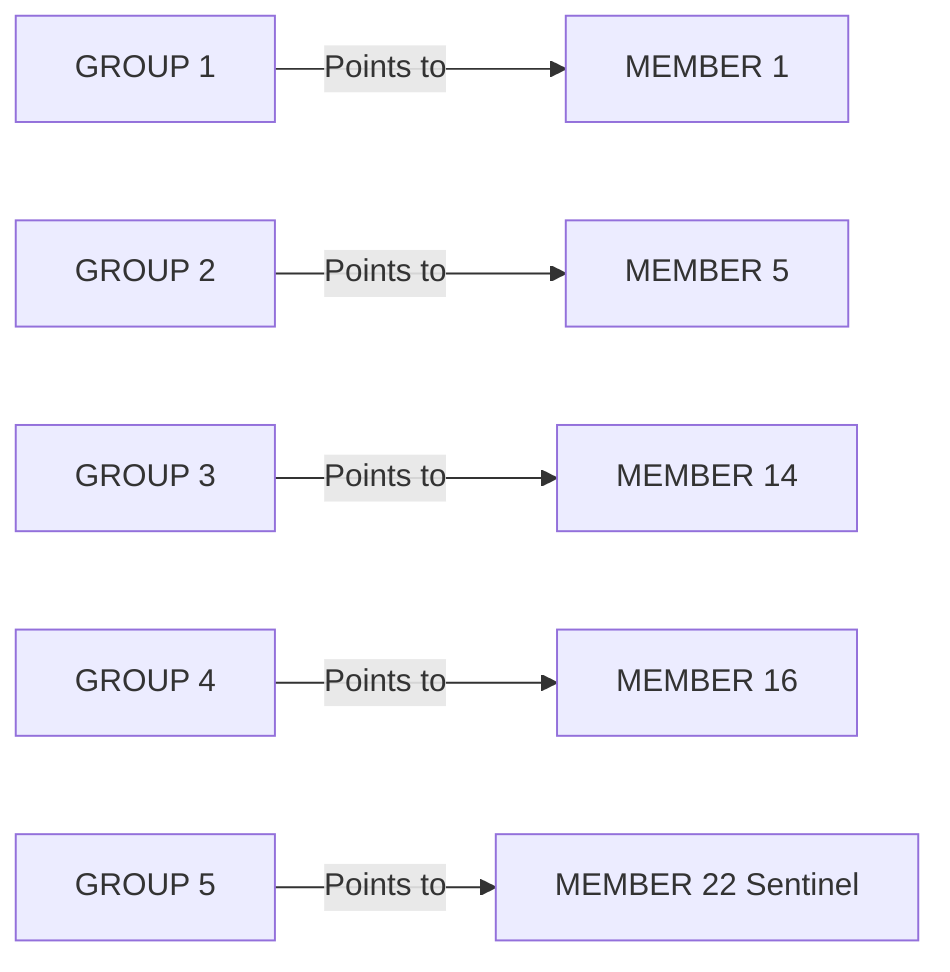

**Advantages**:
- Space-efficient
- **Direct access** to any group (indexed)
- O(1) time to find start of any group

### Example 4.15: Processing a Group with Pointers

**Task**: Print all names in Group L (given L as input)

**Algorithm**:

```
1. Set FIRST := GROUP[L] and LAST := GROUP[L + 1] - 1
2. Repeat for K = FIRST to LAST:
     Write: MEMBER[K]
   [End of loop]
3. Return
```

**Explanation**:
- FIRST = start location of Group L
- LAST = end location of Group L
- Loop through positions FIRST to LAST
- FIRST and LAST are for notational convenience

**Example execution** (L = 3):
- FIRST = GROUP[3] = 14
- LAST = GROUP[4] - 1 = 16 - 1 = 15
- Print MEMBER[14] = "Davis"
- Print MEMBER[15] = "Segal"

**Simplicity**: The pointer array GROUP makes this task trivial!

### Storage Approach 5: Pointer Array with Gaps

**Enhancement**: Leave empty cells between groups for growth.

**Structure**:

```
GROUP:              MEMBER:           NUMB:      FREE:
1  → 1             1  Evans           1  4       1  2
2  → 7             2  Harris          2  9       2  3
3  → 19            3  Lewis           3  2       3  2
4  → 23            4  Shaw            4  6       4  4
                   5  (empty)
                   6  (empty)
                   7  Conrad
                   ...                } Group 2
                   15 Wagner
                   16 (empty)
                   17 (empty)
                   18 (empty)
                   19 Davis
                   20 Segal           } Group 3
                   21 (empty)
                   22 (empty)
                   23 Baker
                   ...                } Group 4
                   28 Reed
                   29 (empty)
                   30 (empty)
                   31 (empty)
                   32 (empty)
```

**Additional arrays**:

**NUMB[K]**: Number of elements in Group K
- NUMB[1] = 4
- NUMB[2] = 9
- NUMB[3] = 2
- NUMB[4] = 6

**FREE[K]**: Number of empty cells after Group K
\[ \text{FREE}[K] = \text{GROUP}[K + 1] - \text{GROUP}[K] - \text{NUMB}[K] \]

Examples:
- FREE[1] = 7 - 1 - 4 = 2
- FREE[2] = 19 - 7 - 9 = 3
- FREE[3] = 23 - 19 - 2 = 2
- FREE[4] = 33 - 23 - 6 = 4 (assuming GROUP[5] = 33)

**Advantages**:
- Can insert elements without moving other groups
- Reduces expensive data movement

**Trade-offs**:
- More complex management
- Some space overhead for gaps
- Need to track NUMB and/or FREE

### Example 4.16: Processing with Gaps

**Task**: Print names in Group L (with gaps between groups)

**Algorithm**:

```
1. Set FIRST := GROUP[L] and LAST := GROUP[L] + NUMB[L] - 1
2. Repeat for K = FIRST to LAST:
     Write: MEMBER[K]
   [End of loop]
3. Return
```

**Difference from Example 4.15**:
- Use **NUMB[L]** instead of GROUP[L+1] - GROUP[L]
- LAST = FIRST + NUMB[L] - 1

**Example** (L = 2):
- FIRST = GROUP[2] = 7
- LAST = 7 + NUMB[2] - 1 = 7 + 9 - 1 = 15
- Print MEMBER[7] through MEMBER[15]

**Key insight**: NUMB array tells us how many active elements, skipping over gaps.

---

## Section 4.11: Records and Record Structures

### Hierarchical Organization

Data is frequently organized as:

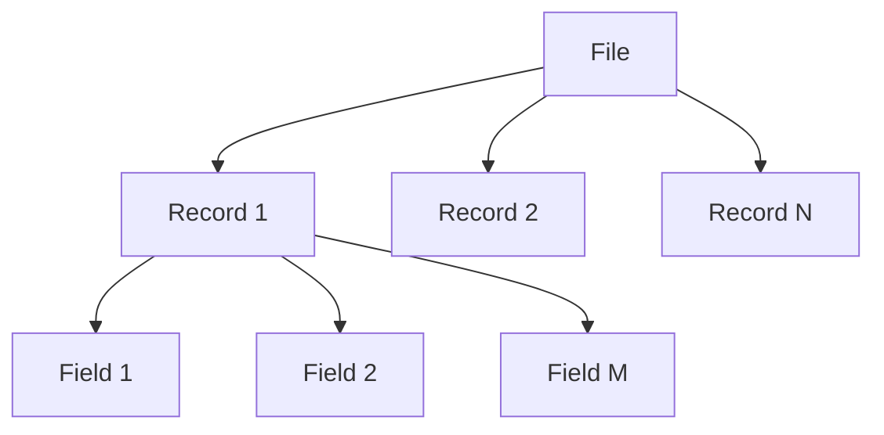

**Hierarchy**:
1. **File**: Collection of similar records
2. **Record**: Collection of related data items (fields/attributes)
3. **Field (Attribute)**: Individual data item

**Field types**:
- **Group item**: Composed of subitems
- **Elementary item (atom/scalar)**: Indecomposable

**Identifier**: Name given to a data item

### Record vs Array Differences

**Array characteristics**:
- Homogeneous data (all same type)
- Elements accessed by numeric index
- Natural ordering

**Record characteristics**:
- **Nonhomogeneous data** (different types allowed)
- Elements accessed by **attribute names**
- **No inherent ordering** of fields

### Level Numbers

Records use **level numbers** to describe hierarchical structure:
- Higher level number = deeper in hierarchy
- Level N item followed by Level N+1 items means it's a group item

### Example 4.17: Newborn Baby Record

**Record structure** for hospital newborn database:

```
1 Newborn
  2 Name
  2 Sex
  2 Birthday
    3 Month
    3 Day
    3 Year
  2 Father
    3 Name
    3 Age
  2 Mother
    3 Name
    3 Age
```

**Level interpretation**:
- **Level 1**: Main record (Newborn)
- **Level 2**: Primary fields (Name, Sex, Birthday, Father, Mother)
- **Level 3**: Subfields (Month, Day, Year under Birthday; Name, Age under Father/Mother)

**Sample record**:

```
Name: BROWN, JOHN M.
Sex: M
Birthday: 04/16/84
Father:
  Name: BROWN, ROBERT S.
  Age: 26
Mother:
  Name: BROWN, SUSAN B.
  Age: 22
```

**Diagram**:

```mermaid
graph TD
    A[Newborn] --> B[Name]
    A --> C[Sex]
    A --> D[Birthday]
    A --> E[Father]
    A --> F[Mother]
    D --> G[Month]
    D --> H[Day]
    D --> I[Year]
    E --> J[Name]
    E --> K[Age]
    F --> L[Name]
    F --> M[Age]
```

**Note**: Name appears 3 times (newborn, father, mother); Age appears twice (father, mother).

### File of Records

**Array notation**: Add array size to top level:

```
1 Newborn(20)
  2 Name
  2 Sex
  ...
```

**Interpretation**: File contains 20 newborn records.

**Subscript notation**:
- `Newborn[1], Newborn[2], ..., Newborn[20]`
- Or: `Newborn1, Newborn2, ..., Newborn20`

### Example 4.18: Student Records

**Structure**:

```
1 Student(20)
  2 Name
    3 Last
    3 First
    3 MI (Middle Initial)
  2 Test(3)
  2 Final
  2 Grade
```

**Analysis**:
- **20 students** (Student is a 20-element array)
- **3 tests per student** (Test is a 3-element array)
- **8 elementary items** per student:
  - Last, First, MI (3 items under Name)
  - Test[1], Test[2], Test[3] (3 items under Test)
  - Final (1 item)
  - Grade (1 item)
- **Total elementary items**: 20 students × 8 items = 160

**Hierarchical view**:

```mermaid
graph TD
    A[Student 20 records] --> B[Name]
    A --> C[Test 3 elements]
    A --> D[Final]
    A --> E[Grade]
    B --> F[Last]
    B --> G[First]
    B --> H[MI]
```

### Indexing Items in Records

**Problem**: Same name may appear multiple times (e.g., "Age" in Example 4.17).

**Solution**: **Qualify** names using group item names with dot notation.

**Dot notation syntax**:
```
GroupItem.SubItem.SubSubItem
```

### Example 4.19: Qualified References

**(a) Newborn record qualifications**:

**Unique references** (no qualification needed):
- `Sex` (only one Sex field)
- `Year` (only one Year field, under Birthday)

**Ambiguous references** (qualification required):
- `Age` appears twice (under Father and Mother)

**Qualified references**:
- `Newborn.Father.Age` (fully qualified)
- `Father.Age` (partially qualified, sufficient if context clear)
- `Newborn.Mother.Age` (fully qualified)
- `Mother.Age` (partially qualified)

**Clarity**: Adding qualifying identifiers improves code readability.

**(b) File of Newborn records** `Newborn(20)`:

All items become **20-element arrays**.

**Accessing Sex of 6th newborn**:
- `Newborn.Sex[6]`
- Or simply: `Sex[6]`

**Accessing father's age of 6th newborn**:
- `Newborn.Father.Age[6]`
- Or: `Father.Age[6]`

**(c) Student record with multi-dimensional array**:

**Structure**: `Student(20)` with `Test(3)`

**Array dimensions**:
- Student: 1D array (20 elements)
- Test: becomes 2D array (20 × 3)

**Accessing second test of sixth student**:
- `Student.Test[6, 2]`
- Or: `Test[6, 2]`

**Subscript order**: Corresponds to qualifying identifier order
- `Test[6, 2]` = Student 6, Test 2
- **NOT** `Test[2, 6]` (Test 2 of Student 6 is incorrect)

**Important**: First subscript = outermost qualifier, Last subscript = innermost

### Alternative: Functional Notation

Some texts use **functional notation** instead of dot notation:

**Examples**:
- Dot: `Newborn.Father.Age`
- Functional: `Age(Father(Newborn))`

- Dot: `Student.Name.First[8]`
- Functional: `First(Name(Student[8]))`

**Note**: Order is **reversed** in functional notation (innermost to outermost).

---

## Section 4.12: Representation of Records in Memory

### Challenge of Nonhomogeneous Data

**Problem**: Records may contain different data types (strings, integers, floats).

**Limitation**: Cannot store nonhomogeneous data in a single array.

**Solution**: Languages like PL/1, Pascal, and COBOL have built-in record structures.

### Example 4.20: PL/1 Structure Declaration

**Newborn record** (from Example 4.17) in PL/1:

```pl1
DECLARE 1 NEWBORN,
        2 NAME CHAR(20),
        2 SEX CHAR(1),
        2 BIRTHDAY,
          3 MONTH FIXED,
          3 DAY FIXED,
          3 YEAR FIXED,
        2 FATHER,
          3 NAME CHAR(20),
          3 AGE FIXED,
        2 MOTHER,
          3 NAME CHAR(20),
          3 AGE FIXED;
```

**Key points**:
- Level numbers indicate hierarchy
- Data types specified (CHAR, FIXED)
- Unique fields (SEX, YEAR) need no qualification
- Ambiguous fields (AGE) need qualification:
  - `FATHER.AGE`
  - `MOTHER.AGE`

### Parallel Arrays Approach

**When to use**: Language doesn't support record structures.

**Single record**: Must use individual variables (one per elementary item).

**File of records**: Use **parallel arrays** - one array per elementary data item.

**Key property**: Elements with same subscript belong to same record.

### Example 4.21: Membership List with Parallel Arrays

**Data per member**: Name, Age, Sex, Phone

**Storage**: Four parallel arrays

```
NAME:                AGE:   SEX:      PHONE:
1  John Brown        28     Male      234-5186
2  Paul Cohen        33     Male      456-7272
3  Mary Davis        24     Female    777-1212
4  Linda Evans       27     Female    876-4478
5  Mark Green        31     Male      255-7654
```

**Interpretation**:
- Record 1: NAME[1], AGE[1], SEX[1], PHONE[1]
- Record 2: NAME[2], AGE[2], SEX[2], PHONE[2]
- Etc.

**Access pattern**: For record K, access NAME[K], AGE[K], SEX[K], PHONE[K].

**Diagram**:

```mermaid
graph LR
    A[Member 1] --> B[NAME 1: John Brown]
    A --> C[AGE 1: 28]
    A --> D[SEX 1: Male]
    A --> E[PHONE 1: 234-5186]
```

### Example 4.22: Newborn Records with Parallel Arrays

**Newborn record** has 9 elementary items:

**Arrays needed**:
```
NAME          - Newborn's name
SEX           - Sex
MONTH         - Birth month
DAY           - Birth day
YEAR          - Birth year
FATHERNAME    - Father's name
FATHERAGE     - Father's age
MOTHERNAME    - Mother's name
MOTHERAGE     - Mother's age
```

**Different variable names required**: Cannot use "Name" and "Age" twice like in record structure.

**Access**: For newborn K:
```
NAME[K], SEX[K], MONTH[K], DAY[K], YEAR[K],
FATHERNAME[K], FATHERAGE[K], MOTHERNAME[K], MOTHERAGE[K]
```

**Trade-off**: More arrays to manage, but can work in any programming language.

### Variable-Length Records

**Definition**: Records where some fields can contain varying amounts of data.

**Example**: Elementary school student record

**Fields**:
1. Name
2. Telephone Number
3. Father (name)
4. Mother (name)
5. Siblings (names) ← **Variable length!**

**Sample records**:

```
Adams, John; 345-6677; Richard; Mary; [no siblings at school]

Bailey, Susan; 222-1234; Steven; Sheila; Jane, William, Donald

Clark, Bruce; 567-3344; XXXX; Barbara; David, Lisa
```

**Special value**: XXXX = deceased, not living with student, or no sibling.

### Storage Strategy for Variable-Length Records

**Fixed-length fields**: Use regular parallel arrays
- NAME, PHONE, FATHER, MOTHER

**Variable-length field** (Siblings): Use additional management arrays
- **SIBLING**: Array storing all sibling names
- **NUMB**: Number of siblings for each student
- **PTR**: Pointer to first sibling in SIBLING array

**Structure**:

```
NAME:           PHONE:      FATHER:   MOTHER:   NUMB:  PTR:  SIBLING:
1 Adams,John   345-6677    Richard   Mary      0      0     1 (empty)
2 Bailey,Susan 222-1234    Steven    Sheila    3      5     2 David
3 Clark,Bruce  567-3344    XXXX      Barbara   2      2     3 Lisa
                                                            4 (empty)
                                                            5 Jane
                                                            6 William
                                                            7 Donald
                                                            8 (empty)
```

**Interpretation**:
- **Student 1** (Adams): NUMB[1]=0, no siblings
- **Student 2** (Bailey): NUMB[2]=3, siblings start at PTR[2]=5
  - SIBLING[5]="Jane", SIBLING[6]="William", SIBLING[7]="Donald"
- **Student 3** (Clark): NUMB[3]=2, siblings start at PTR[3]=2
  - SIBLING[2]="David", SIBLING[3]="Lisa"

**Access algorithm** for siblings of student K:
```
If NUMB[K] = 0:
  No siblings
Else:
  Start = PTR[K]
  End = PTR[K] + NUMB[K] - 1
  Siblings are SIBLING[Start] through SIBLING[End]
```

**Diagram**:

```mermaid
graph TD
    A[Student 2: Bailey] --> B[NUMB 2 = 3 siblings]
    A --> C[PTR 2 = 5]
    C --> D[SIBLING 5: Jane]
    C --> E[SIBLING 6: William]
    C --> F[SIBLING 7: Donald]
```

---

## Section 4.13: Matrices

### Vectors and Matrices

**Mathematical terms** for array-like structures:

**(a) Vector**: n-element list (like linear array)
\[ V = (V_1, V_2, ..., V_n) \]

**(b) Matrix**: m × n rectangular array (like 2D array)
\[ A = \begin{bmatrix}
A_{11} & A_{12} & \cdots & A_{1n} \\
A_{21} & A_{22} & \cdots & A_{2n} \\
\vdots & \vdots & \ddots & \vdots \\
A_{m1} & A_{m2} & \cdots & A_{mn}
\end{bmatrix} \]

**Scalar**: Individual number (in context of vectors/matrices).

**Vector as matrix**: Vector can be viewed as:
- 1 × n matrix (row vector)
- m × 1 matrix (column vector)

**Square matrix**: m = n (same number of rows and columns)
- n-square matrix = n × n matrix

**Main diagonal**: Elements \( A_{11}, A_{22}, ..., A_{nn} \) in n-square matrix

### Matrix Algebra Operations

#### Addition and Scalar Multiplication

**Matrix addition** A + B (both m × n):
- Add corresponding elements
- \( (A + B)_{ij} = A_{ij} + B_{ij} \)

**Scalar multiplication** kA:
- Multiply each element by scalar k
- \( (kA)_{ij} = k \cdot A_{ij} \)

**Same for vectors**:
- Add corresponding components
- Multiply each component by scalar

#### Scalar Product (Dot Product)

**For n-element vectors** U and V:
\[ U \cdot V = U_1V_1 + U_2V_2 + ... + U_nV_n = \sum_{k=1}^{n} U_k V_k \]

**Result**: Scalar (single number), not vector.

#### Matrix Multiplication

**Requirement**: A is m × p, B is p × n

**Result**: C = AB is m × n matrix

**Element formula**:
\[ C_{ij} = A_{i1}B_{1j} + A_{i2}B_{2j} + ... + A_{ip}B_{pj} = \sum_{k=1}^{p} A_{ik}B_{kj} \]

**Interpretation**: \( C_{ij} \) = scalar product of row i of A and column j of B

**Diagram**:

```mermaid
graph LR
    A[Matrix A m×p] --> C[Matrix C=AB m×n]
    B[Matrix B p×n] --> C
    D[Row i of A] -.dot product.-> E[C ij element]
    F[Column j of B] -.dot product.-> E
```

### Example 4.23: Matrix Operations

**(a) Matrix addition and scalar multiplication**:

Given:
\[ A = \begin{bmatrix} 1 & -2 & 3 \\ 6 & 0 & 4 \\ 3 & 5 & -2 \end{bmatrix}, \quad B = \begin{bmatrix} 3 & 0 & -1 \\ 2 & -3 & 5 \\ 0 & 3 & -2 \end{bmatrix} \]

**Addition** A + B:
\[ A + B = \begin{bmatrix} 1+3 & -2+0 & 3+(-1) \\ 6+2 & 0+(-3) & 4+5 \\ 3+0 & 5+3 & -2+(-2) \end{bmatrix} = \begin{bmatrix} 4 & -2 & 2 \\ 8 & -3 & 9 \\ 3 & 8 & -4 \end{bmatrix} \]

**Scalar multiplication** 3A:
\[ 3A = \begin{bmatrix} 3 \times 1 & 3 \times (-2) & 3 \times 3 \\ 3 \times 6 & 3 \times 0 & 3 \times 4 \\ 3 \times 3 & 3 \times 5 & 3 \times (-2) \end{bmatrix} = \begin{bmatrix} 3 & -6 & 9 \\ 18 & 0 & 12 \\ 9 & 15 & -6 \end{bmatrix} \]

**(b) Vector scalar products**:

Given: U = (1, -3, 4, 5), V = (2, -3, -6, 0), W = (3, -5, 2, -1)

**U · V**:
\[ U \cdot V = 1 \times 2 + (-3) \times (-3) + 4 \times (-6) + 5 \times 0 \]
\[ = 2 + 9 - 24 + 0 = -13 \]

**U · W**:
\[ U \cdot W = 1 \times 3 + (-3) \times (-5) + 4 \times 2 + 5 \times (-1) \]
\[ = 3 + 15 + 8 - 5 = 21 \]

**(c) Matrix multiplication**:

Given:
\[ A = \begin{bmatrix} 1 & 3 \\ 4 & 2 \end{bmatrix} (2 \times 2), \quad B = \begin{bmatrix} 2 & 0 & -4 \\ 3 & 2 & 6 \end{bmatrix} (2 \times 3) \]

**Product** AB is 2 × 3:

**First row of AB**:
- Element (1,1): Row 1 of A · Column 1 of B
  \[ = 1 \times 2 + 3 \times 3 = 2 + 9 = 11 \]
- Element (1,2): Row 1 of A · Column 2 of B
  \[ = 1 \times 0 + 3 \times 2 = 0 + 6 = 6 \]
- Element (1,3): Row 1 of A · Column 3 of B
  \[ = 1 \times (-4) + 3 \times 6 = -4 + 18 = 14 \]

**Second row of AB**:
- Element (2,1): Row 2 of A · Column 1 of B
  \[ = 4 \times 2 + 2 \times 3 = 8 + 6 = 14 \]
- Element (2,2): Row 2 of A · Column 2 of B
  \[ = 4 \times 0 + 2 \times 2 = 0 + 4 = 4 \]
- Element (2,3): Row 2 of A · Column 3 of B
  \[ = 4 \times (-4) + 2 \times 6 = -16 + 12 = -4 \]

**Result**:
\[ AB = \begin{bmatrix} 11 & 6 & 14 \\ 14 & 4 & -4 \end{bmatrix} \]

---

This completes the comprehensive structured document covering all concepts, examples, and exercises from Chapter 4 on Arrays, Records, and Pointers. The document includes:

- Detailed explanations of all concepts
- Step-by-step walkthroughs of examples
- Visual diagrams using Mermaid
- Mathematical formulas in LaTeX
- Algorithm pseudocode
- Practical applications

The markdown format with Mermaid diagrams provides excellent visualization for understanding data structures.
