# Linked Lists - Complete Study Guide

## Table of Contents
- [Introduction to Lists](#1-introduction-to-lists)
- [What are Linked Lists?](#2-what-are-linked-lists)
- [How Linked Lists are Stored in Memory](#3-how-linked-lists-are-stored-in-memory)
- [Moving Through a Linked List (Traversing)](#4-moving-through-a-linked-list-traversing)
- [Searching in a Linked List](#5-searching-in-a-linked-list)
- [Memory Management](#6-memory-management)
- [Adding Nodes to a Linked List (Insertion)](#7-adding-nodes-to-a-linked-list-insertion)
- [Removing Nodes from a Linked List (Deletion)](#8-removing-nodes-from-a-linked-list-deletion)
- [Special Types of Linked Lists](#9-special-types-of-linked-lists)
- [Two-Way Lists](#10-two-way-lists)
- [Practice Problems and Solutions](#11-practice-problems-and-solutions)

---

## 📚 Visual Overview: Linked Lists at a Glance

### 🏛️ High-Level Architecture

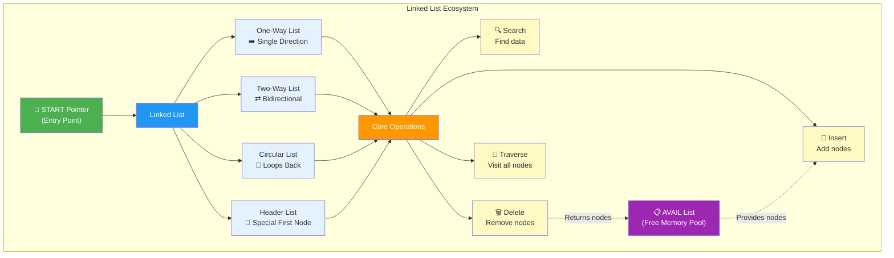

### 🛠️ Operations Quick Reference

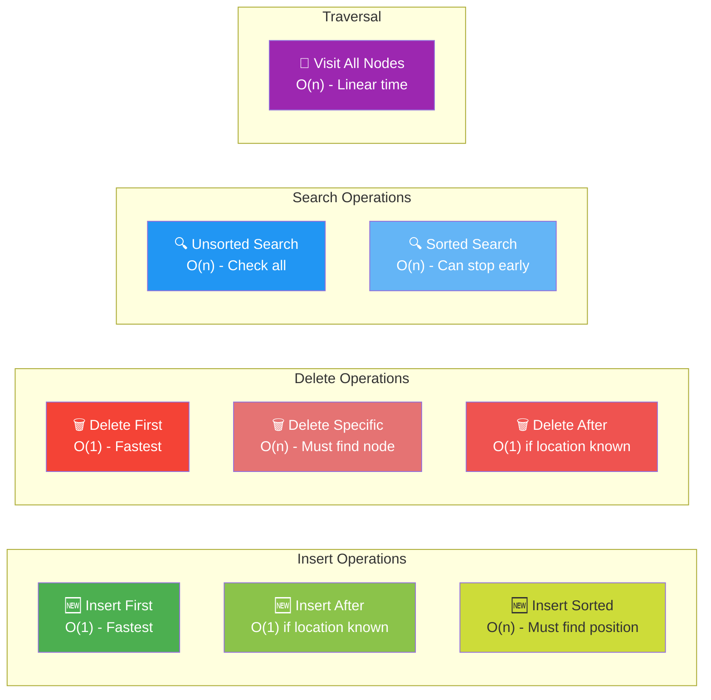

### 📊 Complexity Comparison Table

| Operation | Array | Linked List | Notes |
|-----------|-------|-------------|-------|
| **Access by Index** | O(1) ⚡ | O(n) 🐢 | Arrays win - direct access |
| **Search** | O(n) or O(log n)* | O(n) | *Binary search only for sorted arrays |
| **Insert at Beginning** | O(n) 🐢 | O(1) ⚡ | Linked lists win - no shifting |
| **Insert at End** | O(1)* | O(n) | *If space available |
| **Delete at Beginning** | O(n) 🐢 | O(1) ⚡ | Linked lists win - no shifting |
| **Memory Usage** | Lower ✅ | Higher ❌ | Pointers add overhead |
| **Memory Allocation** | Fixed 🔒 | Dynamic 🔄 | Linked lists are flexible |

> **💡 When to Use What:**
> - **Use Arrays:** When you need fast random access, know the size in advance, or want minimal memory overhead
> - **Use Linked Lists:** When you need frequent insertions/deletions, dynamic sizing, or don't know the final size

### 🎯 Key Concepts Visual Summary

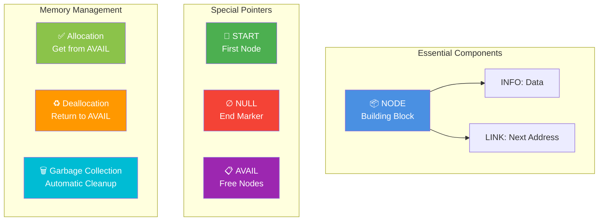

---

## 1. Introduction to Lists

### What is a List?

Think about your everyday lists - a shopping list, a to-do list, or a playlist. A list is simply **a collection of items that follow a specific order**. Every list has:
- **A first item** (where the list begins)
- **Items in the middle** (arranged one after another)
- **A last item** (where the list ends)

Just like when you write a shopping list on paper, the order matters - you read from top to bottom!

### Example: Shopping List
```
Original List:          After Changes:
-----------            ---------------
Milk                   Milk
eggs                   ← deleted
butter                 ← deleted
tomatoes               tomatoes
apples                 apples
oranges                
bread                  bread
                       chicken  ← added
                       corn     ← added
                       lettuce  ← added
```

### Two Ways to Store Lists in Computer Memory

#### Method 1: Using Arrays (The "Bookshelf" Approach)

Imagine a bookshelf where books sit side-by-side in numbered slots:
- **How it works:** All items are stored next to each other in memory, like books on a shelf
- **Advantages:** 
  - ⚡ Super fast to find any item (just jump to its position number)
  - Simple and straightforward
- **Disadvantages:**
  - 🐢 Slow to add or remove items in the middle (you have to shift everything)
  - 🔒 Fixed size - you decide the size upfront and can't easily change it
  - Called "static" or "dense" because the size doesn't change

#### Method 2: Using Linked Lists (The "Treasure Hunt" Approach)

Imagine a treasure hunt where each clue tells you where to find the next clue:
- **How it works:** Each item contains:
  1. The actual data (like the treasure)
  2. A pointer (like a map) showing where the next item is located
- Items can be scattered anywhere in memory - they don't need to be neighbors!

- **Advantages:**
  - ✅ Easy to add or remove items anywhere in the list
  - 🔄 Dynamic size - grows and shrinks automatically as needed
  - Flexible and adaptable
  
- **Disadvantages:**
  - 💾 Uses more memory (each item needs to store a pointer)
  - 🐢 Can't jump directly to the middle (must follow the chain from the start)

#### 🎨 Visual Comparison: Array vs Linked List

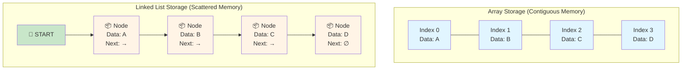

> **💡 Key Insight:** Arrays are like parking spaces in a row - you can jump to any spot instantly. Linked lists are like a treasure hunt - each clue leads to the next location!

## 2. What are Linked Lists?

### Understanding the Basic Building Block: The Node

A linked list is like a chain made of individual links. Each link is called a **node**, and every node has two important parts:

**Think of a node like a box with two compartments:**

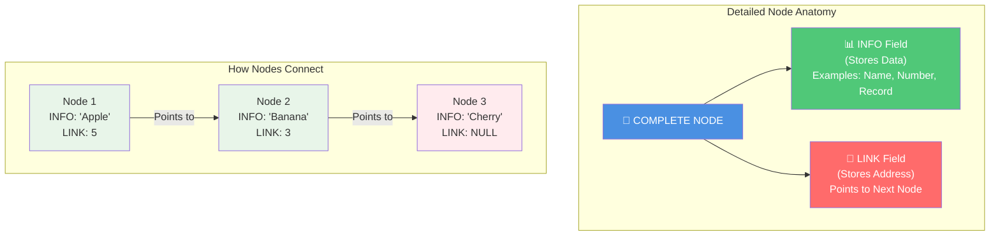

> **🎯 Simple Explanation:** Think of each node as a box with two compartments:
> - **Left compartment (INFO):** Holds your actual data (like a name or number)
> - **Right compartment (LINK):** Holds the address of the next box

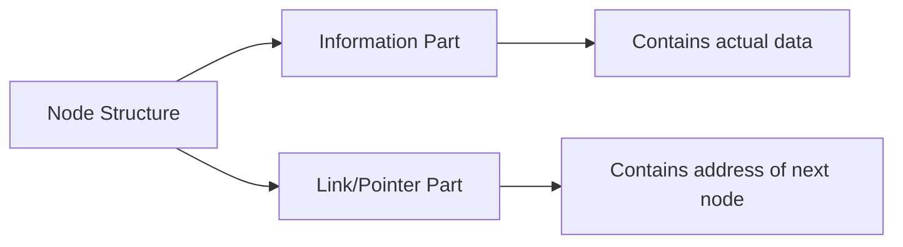

### How Nodes Connect to Form a List

Now imagine connecting multiple boxes in a chain:
```mermaid
graph LR
    START[START] --> N1[Node 1<br/>INFO | LINK]
    N1 --> N2[Node 2<br/>INFO | LINK]
    N2 --> N3[Node 3<br/>INFO | LINK]
    N3 --> N4[Node 4<br/>INFO | LINK]
    N4 --> N5[Node 5<br/>INFO | LINK]
    N5 --> N6[Node 6<br/>INFO | LINK]
    N6 --> NULL[X<br/>NULL]
```

### Key Components (Important Terms to Know)

Let's break down the essential parts of a linked list:

- **Node:** A single box in the chain that contains:
  - **Information part (INFO):** Your actual data - could be a name, a number, or even a complete record
  - **Link field (nextpointer):** The address telling you where the next node is located
  
- **START:** A special pointer that always points to the very first node in the list
  - Think of it as the "entrance" to your list
  - Without START, you wouldn't know where the list begins!
  
- **NULL pointer:** A special value (usually 0 or -1) that means "end of the list"
  - Like a stop sign at the end of the chain
  - When you see NULL, you know there are no more nodes
  
- **Empty list:** When START contains NULL
  - This means the list has zero nodes - it's completely empty

### Example 5.1: Hospital Ward
Let's look at a hospital with 12 beds, where 9 are occupied:

| Bed Number | Patient | Next |
|------------|---------|------|
| 1 | Kirk | 7 |
| 2 | (empty) | |
| 3 | Dean | 11 |
| 4 | Maxwell | 12 |
| 5 | Adams | 3 |
| 6 | (empty) | |
| 7 | Lane | 4 |
| 8 | Green | 1 |
| 9 | Samuels | 0 |
| 10 | (empty) | |
| 11 | Fields | 8 |
| 12 | Nelson | 9 |

**START = 5** (Adams is first alphabetically)

Following the chain alphabetically:
- START points to bed 5 (Adams)
- Adams points to bed 3 (Dean)
- Dean points to bed 11 (Fields)
- Fields points to bed 8 (Green)
- Green points to bed 1 (Kirk)
- Kirk points to bed 7 (Lane)
- Lane points to bed 4 (Maxwell)
- Maxwell points to bed 12 (Nelson)
- Nelson points to bed 9 (Samuels)
- Samuels points to 0 (NULL - end of list)

**Alphabetical order:** Adams → Dean → Fields → Green → Kirk → Lane → Maxwell → Nelson → Samuels

## 3. How Linked Lists are Stored in Memory

### The Storage Method (Understanding the Arrays)

Here's something interesting: even though linked lists seem scattered, we actually use **two parallel arrays** to organize them:

**Think of it like a filing system with two cabinets:**

1. **INFO array (Data Cabinet):** Stores the actual information
   - Like drawers containing the actual documents
   
2. **LINK array (Address Cabinet):** Stores the addresses (pointers) to the next nodes
   - Like drawers containing maps showing where to find the next document

**Plus two special sticky notes:**
- **START:** Shows you which drawer to open first
- **NULL:** A special value (usually 0) that means "you've reached the end"

#### 🗺️ Memory Layout Visualization

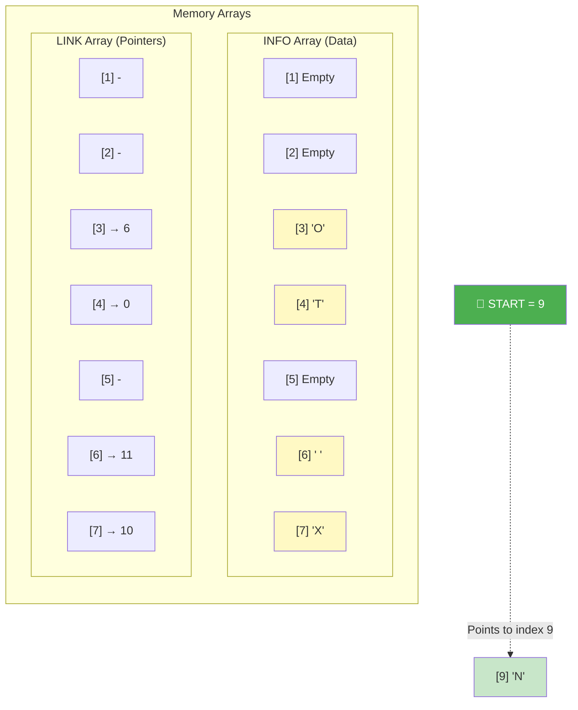

> **📚 Reading the List:** Start at index 9, read the character 'N', then follow LINK[9] to the next position, and repeat until you hit NULL (0)!

### Example 5.2: Character String "NO EXIT"

Let's see how the phrase "NO EXIT" is stored in memory using linked lists:

| Index | INFO | LINK |
|-------|------|------|
| 1 | | |
| 2 | | |
| 3 | O | 6 |
| 4 | T | 0 |
| 5 | | |
| 6 | (space) | 11 |
| 7 | X | 10 |
| 8 | | |
| 9 | N | 3 |
| 10 | I | 4 |
| 11 | E | 7 |
| 12 | | |

**START = 9** (This tells us to begin at index 9)

**Let's follow the treasure hunt to read the string:**

1. START = 9, so look at INFO[9] = **'N'** (first character) ✓
2. LINK[9] = 3, so next look at INFO[3] = **'O'** (second character) ✓
3. LINK[3] = 6, so next look at INFO[6] = **' '** (space character) ✓
4. LINK[6] = 11, so next look at INFO[11] = **'E'** (fourth character) ✓
5. LINK[11] = 7, so next look at INFO[7] = **'X'** (fifth character) ✓
6. LINK[7] = 10, so next look at INFO[10] = **'I'** (sixth character) ✓
7. LINK[10] = 4, so next look at INFO[4] = **'T'** (seventh character) ✓
8. LINK[4] = 0 (NULL - we've reached the end!) 🛑

**Result:** "NO EXIT" ✅

> **💡 Key Insight:** Notice how the characters aren't stored in order (9, 3, 6, 11, 7, 10, 4). The LINK array creates the correct order by connecting them like a treasure map!

### Example 5.3: Multiple Lists in Same Arrays
You can store multiple lists in the same arrays:

Two lists of test scores:

| Index | TEST | LINK | Notes |
|-------|------|------|-------|
| 1 | | | |
| 2 | 74 | 14 | ALG Node 2 |
| 3 | | | |
| 4 | 82 | 0 | ALG Node 4 (last) |
| 5 | 84 | 12 | GEOM Node 1 |
| 6 | 78 | 0 | GEOM Node 6 (last) |
| 7 | 74 | 8 | GEOM Node 3 |
| 8 | 100 | 13 | GEOM Node 4 |
| 11 | 88 | 2 | ALG Node 1 |
| 12 | 62 | 7 | GEOM Node 2 |
| 13 | 74 | 6 | GEOM Node 5 |
| 14 | 93 | 4 | ALG Node 3 |

**ALG = 11** (Algebra test scores: 88, 74, 93, 82)  
**GEOM = 5** (Geometry test scores: 84, 62, 74, 100, 74, 78)

## 4. Moving Through a Linked List (Traversing)

### What is Traversing?

**Simple definition:** Traversing means **walking through the entire list**, visiting each node one by one to look at or process its data.

**Think of it like:**
- Walking through a museum and looking at each painting
- Reading a book page by page from start to finish
- Following a trail of breadcrumbs

The key rule: **Visit each node exactly once** - no skipping, no repeating!

### Algorithm 5.1: Basic Traversing (Step-by-Step)

Here's how to walk through a linked list:

```
Step 1: Set PTR = START 
        (PTR is your "current position" pointer - start at the beginning)
        
Step 2: While PTR ≠ NULL, repeat:
        (Keep going as long as you haven't reached the end)
        
    Step 3: Process INFO[PTR] 
            (Do something with the data at your current position)
            
    Step 4: Set PTR = LINK[PTR] 
            (Move to the next node by following the link)
            
Step 5: Exit
        (You've visited all nodes - done!)
```

> **💡 Think of PTR as your finger:** You point to the first node, read it, then move your finger to the next node by following the link. Repeat until you reach NULL (the end).

### Visual Flow

#### 🔄 Step-by-Step Traversal Animation

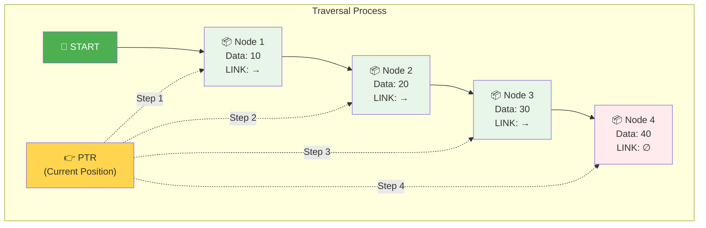

> **🎬 How It Works:**
> 1. **PTR** starts at the first node (where START points)
> 2. Process the data at current node
> 3. Move PTR to the next node using LINK
> 4. Repeat until PTR becomes NULL (end of list)

#### 🔀 Algorithm Flowchart

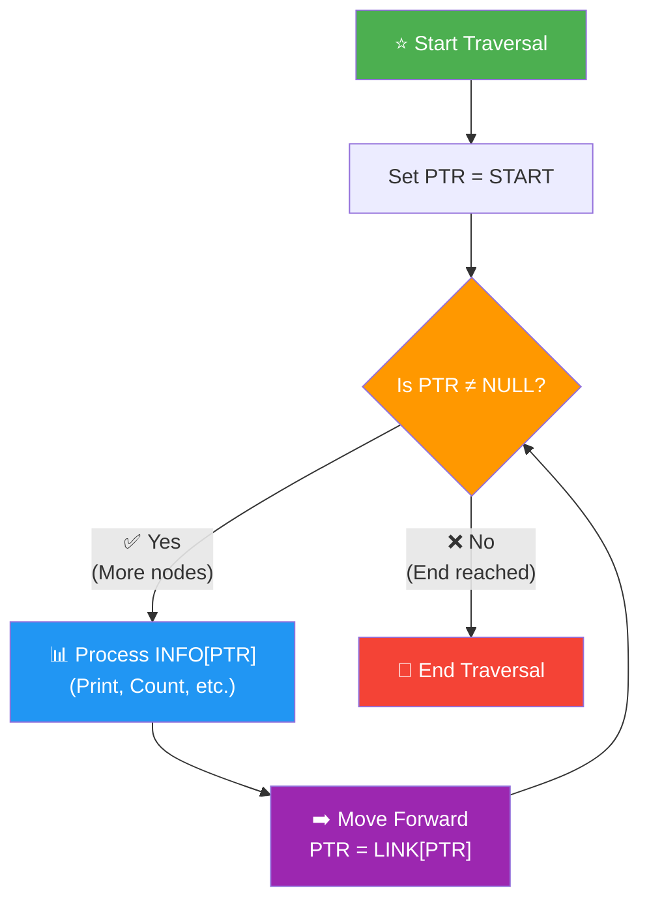

### Example: Printing a List
```
Procedure: PRINT(INFO, LINK, START)
1. Set PTR = START
2. While PTR ≠ NULL, repeat:
   3. Print INFO[PTR]
   4. Set PTR = LINK[PTR]
5. Return
```

### Example: Counting Nodes
```
Procedure: COUNT(INFO, LINK, START, NUM)
1. Set NUM = 0 (start counter at zero)
2. Set PTR = START
3. While PTR ≠ NULL, repeat:
   4. Set NUM = NUM + 1 (increase counter)
   5. Set PTR = LINK[PTR] (move to next)
6. Return
```

**Example:** If list has 5 nodes, NUM will be 5 after completion.

## 5. Searching in a Linked List

### Two Types of Searching

Searching means **finding a specific piece of data** in your list. There are two different approaches depending on whether your list is organized:

#### Type 1: Searching an Unsorted List (The Hard Way)

**The situation:** Your list is like a messy drawer - items are in random order.

**The strategy:** You have no choice but to check every single item until you find what you're looking for (or reach the end).

**Algorithm 5.2: Search Unsorted List**
```
SEARCH(INFO, LINK, START, ITEM, LOC)
Purpose: Find where ITEM appears in an unsorted list

Step 1: Set PTR = START
        (Start at the beginning)
        
Step 2: While PTR ≠ NULL, repeat:
        (Keep searching until you reach the end)
        
    Step 3: If ITEM = INFO[PTR], then:
                (Found it!)
                Set LOC = PTR and Exit
            Else:
                (Not this one, keep looking)
                Set PTR = LINK[PTR]
                
Step 4: Set LOC = NULL 
        (Searched everything - item not found)
        
Step 5: Exit
```

**Efficiency:**
- 🐢 **Worst case:** Have to check all n nodes (item is last or not in list)
- 🐢 **Average case:** Check about n/2 nodes (item is somewhere in the middle)

#### Type 2: Searching a Sorted List (The Smart Way)

**The situation:** Your list is organized in order (like alphabetical or numerical).

**The strategy:** You can **stop early** if you pass where the item should be!

**Example:** Looking for "Jones" in an alphabetical list:
- If you reach "Kelly" and haven't found "Jones", you can stop!
- Why? Because "Jones" comes before "Kelly" alphabetically
- If it's not there yet, it's not in the list at all

**Algorithm 5.3: Search Sorted List**
```
SRCHSL(INFO, LINK, START, ITEM, LOC)
Purpose: Find ITEM in a sorted list (can stop early!)

Step 1: Set PTR = START
        (Start at the beginning)
        
Step 2: While PTR ≠ NULL, repeat:
        (Keep searching)
        
    Step 3: If ITEM < INFO[PTR], then:
                (Item should come before current node - keep looking)
                Set PTR = LINK[PTR]
                
            Else if ITEM = INFO[PTR], then:
                (Found it! ✅)
                Set LOC = PTR and Exit
                
            Else:
                (We've passed where it should be - it's not here! ❌)
                Set LOC = NULL and Exit
                
Step 4: Set LOC = NULL 
        (Reached end without finding it)
        
Step 5: Exit
```

> **⚡ Big Advantage:** In a sorted list, you can often stop searching early, saving time!

### Example 5.8: Employee Salary Update
Using the personnel file, give employee with SSN "NNN" a 5% raise:
```
1. Read: NNN
2. Call SEARCH to find employee
3. If found (LOC ≠ NULL), then:
       Increase salary: SALARY[LOC] = SALARY[LOC] + 0.05 × SALARY[LOC]
   Else:
       Print "NNN is not in file"
4. Return
```

**Important Note:** You cannot use binary search on linked lists (even if sorted) because you can't jump to the middle node directly. This is a disadvantage compared to arrays.

#### 🔍 Search Comparison Visualization

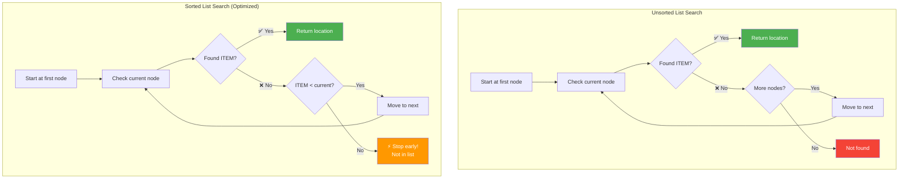

> **⚡ Efficiency Tip:** In a sorted list, you can stop searching early if the current value exceeds your target - you know it won't appear later!

## 6. Memory Management

### The AVAIL List (Your Recycling Bin for Nodes)

**What is the AVAIL list?**

Think of AVAIL as a **recycling bin** for nodes. Instead of throwing away deleted nodes, we save them in the AVAIL list so we can reuse them later!

**Why do we need it?**
- When you delete a node, you don't want to waste that memory space
- When you insert a new node, you don't want to create new memory from scratch
- AVAIL lets you recycle: deleted nodes go in, new nodes come out!

**How it works:**
- AVAIL is itself a linked list of **free (unused) nodes**
- When you need a new node: grab the first one from AVAIL
- When you delete a node: put it back into AVAIL for future use

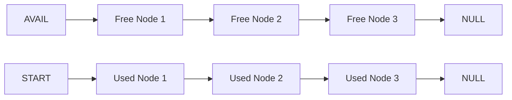

### Complete List Notation (Understanding the Full Picture)

When we write **LIST(INFO, LINK, START, AVAIL)**, here's what each part means:

- **INFO:** The array holding all the actual data
- **LINK:** The array holding all the pointers (addresses)
- **START:** Pointer showing where the active list begins
- **AVAIL:** Pointer showing where the free nodes list begins

**Think of it as two separate lists sharing the same arrays:**
1. Your **active list** (starts at START) - the data you're actually using
2. Your **free list** (starts at AVAIL) - the recycled nodes ready for reuse

### Example 5.10: Hospital Beds
Using the hospital from Example 5.1, here's how empty beds are linked:

| Bed | Patient | LINK |
|-----|---------|------|
| 1 | Kirk | 7 |
| 2 | (empty) | 6 |
| 3 | Dean | 11 |
| 4 | Maxwell | 12 |
| 5 | Adams | 3 |
| 6 | (empty) | 0 |
| 7 | Lane | 4 |
| 8 | Green | 1 |
| 9 | Samuels | 0 |
| 10 | (empty) | 2 |
| 11 | Fields | 8 |
| 12 | Nelson | 9 |

**START = 5** (patient list begins at Adams)  
**AVAIL = 10** (free beds list begins at bed 10)

Free beds chain: 10 → 2 → 6 → NULL

### Garbage Collection (Automatic Cleanup)

**What is garbage collection?**

Sometimes memory gets "lost" - nodes that aren't being used but also aren't in the AVAIL list. Garbage collection is like a **cleanup crew** that finds this lost memory and adds it back to AVAIL.

**How it works (two-step process):**

1. **Mark Phase:** 
   - Go through your active list
   - Tag every node that's currently being used
   - Think of it like putting sticky notes on items you want to keep

2. **Collect Phase:**
   - Find all nodes without tags (the "garbage")
   - Add them back to the AVAIL list
   - Now they're ready to be recycled!

**When does it happen?**
- When AVAIL list is empty or almost empty (running out of free nodes)
- When the computer has idle time (not busy with other tasks)
- Automatically in the background - you don't have to do anything!

### Overflow and Underflow (Error Conditions)

These are the two main errors that can happen with linked lists:

#### ⚠️ OVERFLOW (Out of Space!)

**What it means:** You're trying to add a new node, but AVAIL = NULL (the recycling bin is empty!)

**Why it happens:**
- You've used up all available memory
- No more free nodes to recycle

**What to do:**
- Display an error message: "OVERFLOW - No space available"
- Stop the insertion operation
- Maybe delete some nodes to free up space

#### ⚠️ UNDERFLOW (Nothing to Delete!)

**What it means:** You're trying to delete from an empty list (START = NULL)

**Why it happens:**
- The list has zero nodes
- You can't delete something that doesn't exist!

**What to do:**
- Display an error message: "UNDERFLOW - List is empty"
- Stop the deletion operation

> **💡 Remember:** 
> - **OVERFLOW** = Too full (no free nodes)
> - **UNDERFLOW** = Too empty (no nodes to delete)

## 7. Adding Nodes to a Linked List (Insertion)

### Three Ways to Insert a New Node

When you want to add a new node to your linked list, you have three options depending on where you want to put it:

1. **At the beginning** - Make it the new first node (fastest! ⚡)
2. **After a specific node** - Insert it right after a node you already know
3. **In a sorted list** - Find the right spot to keep the list in order

### Common Steps for All Insertions (The Recipe)

No matter which method you use, **every insertion follows these same basic steps:**

**Step A: Check if you have space**
```
If AVAIL = NULL, then:
    Print "OVERFLOW" and Exit
    (Translation: The recycling bin is empty - no free nodes!)
```

**Step B: Grab a free node from AVAIL**
```
NEW = AVAIL
(Take the first free node)

AVAIL = LINK[AVAIL]
(Update AVAIL to point to the next free node)
```

**Step C: Put your data in the new node**
```
INFO[NEW] = ITEM
(Copy the data into the node you just grabbed)
```

**Then:** Connect it to the list (this part varies by method!)

#### 🎨 Insertion Process Visualization

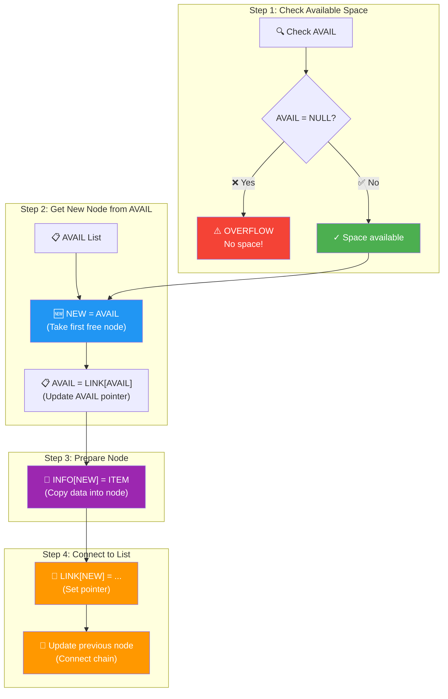

> **💡 Memory Management:** The AVAIL list is like a recycling bin - when you delete nodes, they go back to AVAIL. When you insert, you take from AVAIL!

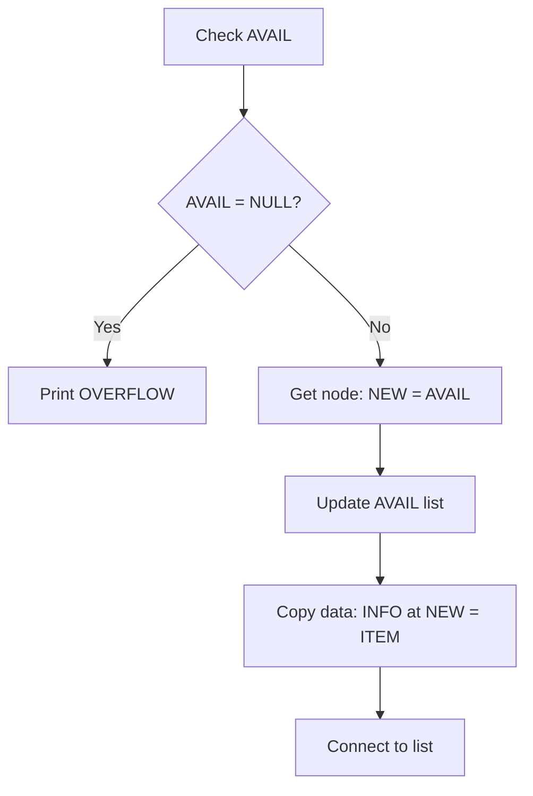

### Method 1: Insert at Beginning

**Algorithm 5.4: INSFIRST**
```
INSFIRST(INFO, LINK, START, AVAIL, ITEM)
Purpose: Insert ITEM as the first node

Step 1: [Check space] If AVAIL = NULL, then:
            Print "OVERFLOW" and Exit
            
Step 2: [Get new node]
        Set NEW = AVAIL
        Set AVAIL = LINK[AVAIL]
        
Step 3: [Copy data]
        Set INFO[NEW] = ITEM
        
Step 4: [Connect to list]
        Set LINK[NEW] = START
        
Step 5: [Update START]
        Set START = NEW
        
Step 6: Exit
```

**Visual Example:**
```
Before:
START → [A] → [B] → [C] → NULL
AVAIL → [X] → [Y] → NULL

After inserting Z:
START → [Z] → [A] → [B] → [C] → NULL
AVAIL → [Y] → NULL
```

#### 🎥 Animated Insertion Example

```mermaid
graph TB
    subgraph "Step 1: Initial State"
        S1_START["🎯 START"] --> S1_A["Node A"]
        S1_A --> S1_B["Node B"]
        S1_B --> S1_C["Node C"]
        S1_C --> S1_NULL["∅"]
        
        S1_AVAIL["📋 AVAIL"] --> S1_X["Free Node X"]
        S1_X --> S1_Y["Free Node Y"]
        
        style S1_A fill:#e8f5e9
        style S1_B fill:#e8f5e9
        style S1_C fill:#e8f5e9
        style S1_X fill:#fff9c4
    end
    
    subgraph "Step 2: Get Node from AVAIL"
        S2_NEW["🆕 NEW"] -.->|"Points to"| S2_X["Node X<br/>(Claimed)"]
        S2_AVAIL["📋 AVAIL"] -.->|"Now points to"| S2_Y["Free Node Y"]
        
        style S2_X fill:#4caf50,color:#fff
        style S2_NEW fill:#ff9800,color:#fff
    end
    
    subgraph "Step 3: Copy Data & Link"
        S3_X["Node X<br/>Data: Z<br/>LINK: →A"]
        S3_A["Node A"]
        S3_X --> S3_A
        
        style S3_X fill:#2196f3,color:#fff
    end
    
    subgraph "Step 4: Final State"
        S4_START["🎯 START"] --> S4_Z["Node Z"]
        S4_Z --> S4_A["Node A"]
        S4_A --> S4_B["Node B"]
        S4_B --> S4_C["Node C"]
        S4_C --> S4_NULL["∅"]
        
        S4_AVAIL["📋 AVAIL"] --> S4_Y["Free Node Y"]
        
        style S4_Z fill:#4caf50,color:#fff
        style S4_A fill:#e8f5e9
        style S4_B fill:#e8f5e9
        style S4_C fill:#e8f5e9
    end
```

> **📌 Key Steps:**
> 1. **Claim:** Take first node from AVAIL (NEW = AVAIL)
> 2. **Update AVAIL:** Move AVAIL pointer to next free node
> 3. **Prepare:** Put data in new node and make it point to current first node
> 4. **Connect:** Update START to point to new node

### Example 5.14: Adding to Geometry List
Adding score 75 to beginning of GEOM list:

**Before:**
- AVAIL = 9
- GEOM = 5
- TEST[5] = 84 (first score)

**Steps:**
1. Check: AVAIL ≠ NULL ✓
2. NEW = 9, then AVAIL = LINK[9] = 10
3. TEST[9] = 75
4. LINK[9] = 5 (point to old first node)
5. GEOM = 9 (new first node)

**After:**
- AVAIL = 10
- GEOM = 9
- TEST[9] = 75 (new first score)
- LINK[9] = 5 (points to 84)

### Method 2: Insert After a Given Node

**Algorithm 5.5: INSLOC**
```
INSLOC(INFO, LINK, START, AVAIL, LOC, ITEM)
Purpose: Insert ITEM after the node at location LOC
         (If LOC = NULL, insert as first node)

Step 1: [Check space] If AVAIL = NULL, then:
            Print "OVERFLOW" and Exit
            
Step 2: [Get new node]
        Set NEW = AVAIL
        Set AVAIL = LINK[AVAIL]
        
Step 3: [Copy data]
        Set INFO[NEW] = ITEM
        
Step 4: [Insert into list]
        If LOC = NULL, then:
            Set LINK[NEW] = START
            Set START = NEW
        Else:
            Set LINK[NEW] = LINK[LOC]
            Set LINK[LOC] = NEW
            
Step 5: Exit
```

**Visual Example:**
```
Inserting X after node A:
Before:
START → [A] → [B] → [C] → NULL
         ↑
        LOC

After:
START → [A] → [X] → [B] → [C] → NULL
         ↑     ↑
        LOC   NEW
```

### Method 3: Insert in Sorted List
For a sorted list, we need to find where to insert to maintain order.

**Procedure 5.6: FINDA**
```
FINDA(INFO, LINK, START, ITEM, LOC)
Purpose: Find the location LOC of the last node where INFO[LOC] < ITEM

Step 1: [Empty list?]
        If START = NULL, then:
            Set LOC = NULL and Return
            
Step 2: [ITEM goes first?]
        If ITEM < INFO[START], then:
            Set LOC = NULL and Return
            
Step 3: [Initialize]
        Set SAVE = START
        Set PTR = LINK[START]
        
Step 4: [Search] While PTR ≠ NULL, repeat:
    Step 5: If ITEM < INFO[PTR], then:
                Set LOC = SAVE and Return
    Step 6: Set SAVE = PTR
            Set PTR = LINK[PTR]
            
Step 7: [ITEM goes at end]
        Set LOC = SAVE
        
Step 8: Return
```

**Algorithm 5.7: INSERT (Complete Sorted Insertion)**
```
INSERT(INFO, LINK, START, AVAIL, ITEM)
Purpose: Insert ITEM into a sorted list

Step 1: [Find position]
        Call FINDA(INFO, LINK, START, ITEM, LOC)
        
Step 2: [Insert after LOC]
        Call INSLOC(INFO, LINK, START, AVAIL, LOC, ITEM)
        
Step 3: Exit
```

### Example 5.15: Adding Jones to Patient List
Patient list (alphabetical): Adams, Dean, Fields, Green, Kirk, Lane, Maxwell, Nelson, Samuels

Adding: Jones

**Step 1: Find location (FINDA)**
- Start: SAVE = 5 (Adams), PTR = 3 (Dean)
- Dean < Jones: SAVE = 3, PTR = 11 (Fields)
- Fields < Jones: SAVE = 11, PTR = 8 (Green)
- Green < Jones: SAVE = 8, PTR = 1 (Kirk)
- Kirk > Jones: LOC = SAVE = 8 (insert after Green)

**Step 2: Insert (INSLOC with LOC = 8)**
- NEW = 10 (first available)
- AVAIL = LINK[10] = 2
- BED[10] = Jones
- LINK[10] = LINK[8] = 1 (point to Kirk)
- LINK[8] = 10 (Green now points to Jones)

**Result:** Adams → Dean → Fields → Green → Jones → Kirk → ...

## 8. Removing Nodes from a Linked List (Deletion)

### How Deletion Works (The Two-Step Dance)

Deleting a node is like removing a link from a chain. You need to:

**Step 1: Bypass the node** (Skip over it in the chain)
- Make the previous node point directly to the next node
- The deleted node is now "disconnected" from the list

**Step 2: Recycle the node** (Return it to AVAIL)
- Add the deleted node back to the AVAIL list
- Now it's available for future use!

**Think of it like:**
- Removing someone from a line of people holding hands
- First: The people on either side join hands (bypass)
- Second: The removed person goes to the "waiting area" (AVAIL)

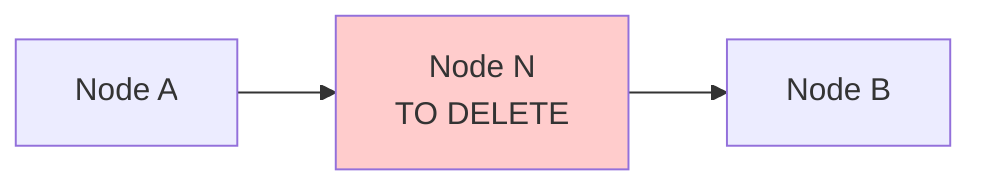

After deletion:
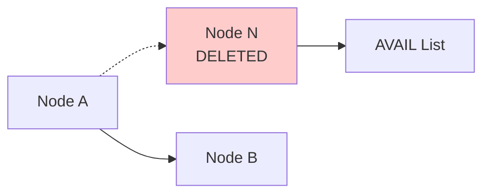

#### 🗑️ Complete Deletion Process

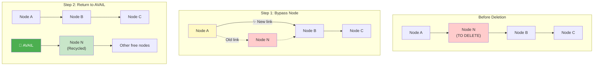

> **♻️ Memory Recycling:** Deletion is a 2-step process:
> 1. **Bypass:** Make the previous node skip over the deleted node
> 2. **Recycle:** Add the deleted node back to AVAIL for future use

### Key Steps in Any Deletion

**Step 1: Change pointers to skip the deleted node**
```
LINK[previous node] = LINK[deleted node]
```

**Step 2: Return deleted node to AVAIL**
```
LINK[deleted node] = AVAIL
AVAIL = deleted node location
```

### Example 5.16: Deleting Green from Hospital

**Before:**
- Fields (bed 11) → Green (bed 8) → Kirk (bed 1)
- AVAIL = 2

**Changes needed:**
- LINK[11] = 10 (Fields now points to Jones, skipping Green)
- LINK[8] = 2 (Green's old link)
- AVAIL = 8 (Green's bed is now first in AVAIL)

**After:**
- Fields (bed 11) → Jones (bed 10) → Kirk (bed 1)
- AVAIL = 8 → 2 → 6

### Method 1: Delete Node After Given Location

**Algorithm 5.8: DEL**
```
DEL(INFO, LINK, START, AVAIL, LOC, LOCP)
Purpose: Delete node at LOC, where LOCP is the previous node
         (If node is first, LOCP = NULL)

Step 1: [Delete from list]
        If LOCP = NULL, then:
            Set START = LINK[START] (delete first node)
        Else:
            Set LINK[LOCP] = LINK[LOC] (skip over deleted node)
            
Step 2: [Return to AVAIL]
        Set LINK[LOC] = AVAIL
        Set AVAIL = LOC
        
Step 3: Exit
```

**Visual: Deleting First Node**
```
Before:
START → [Node 1] → [Node 2] → [Node 3] → NULL

After START = LINK[START]:
START → [Node 2] → [Node 3] → NULL
```

### Method 2: Delete Node Containing Specific Item
First, we need to find the node and its predecessor.

**Procedure 5.9: FINDB**
```
FINDB(INFO, LINK, START, ITEM, LOC, LOCP)
Purpose: Find location LOC of node containing ITEM
         and location LOCP of the previous node

Step 1: [Empty list?]
        If START = NULL, then:
            Set LOC = NULL, LOCP = NULL
            Return
            
Step 2: [First node?]
        If INFO[START] = ITEM, then:
            Set LOC = START, LOCP = NULL
            Return
            
Step 3: [Initialize]
        Set SAVE = START
        Set PTR = LINK[START]
        
Step 4: [Search] While PTR ≠ NULL, repeat:
    Step 5: If INFO[PTR] = ITEM, then:
                Set LOC = PTR, LOCP = SAVE
                Return
    Step 6: Set SAVE = PTR
            Set PTR = LINK[PTR]
            
Step 7: [Not found]
        Set LOC = NULL
        
Step 8: Return
```

**Algorithm 5.10: DELETE**
```
DELETE(INFO, LINK, START, AVAIL, ITEM)
Purpose: Delete first node containing ITEM

Step 1: [Find node]
        Call FINDB(INFO, LINK, START, ITEM, LOC, LOCP)
        
Step 2: [Check if found]
        If LOC = NULL, then:
            Print "ITEM not in list"
            Exit
            
Step 3: [Delete]
        If LOCP = NULL, then:
            Set START = LINK[START]
        Else:
            Set LINK[LOCP] = LINK[LOC]
            
Step 4: [Return to AVAIL]
        Set LINK[LOC] = AVAIL
        Set AVAIL = LOC
        
Step 5: Exit
```

### Example 5.17: Deleting Green (Full Process)
Patient list: Adams → Dean → Fields → Green → Jones → Kirk → ...

**Step 1: Find Green and predecessor (FINDB)**
- Start checking: Adams ≠ Green, Dean ≠ Green, Fields ≠ Green
- Found: Green at bed 8
- Predecessor: Fields at bed 11
- Result: LOC = 8, LOCP = 11

**Step 2-4: Delete (DELETE algorithm)**
- LOC ≠ NULL, so proceed
- LOCP ≠ NULL, so: LINK[11] = LINK[8] = 10
- Return to AVAIL: LINK[8] = 2, AVAIL = 8

**After deletion:**
- Fields (11) → Jones (10) → Kirk (1) → ...
- AVAIL = 8 → 2 → 6

## 9. Special Types of Linked Lists

### Header Linked Lists (Lists with a Special First Node)

**What's different?**

A header list always has a **special header node** at the very beginning - even when the list is "empty"!

**Think of it like:**
- A train where the engine (header) is always there, even if there are no passenger cars
- A necklace where the clasp (header) is always present, even if there are no beads

**Two flavors:**

1. **Grounded Header List:** 
   - Last node points to NULL (normal ending)
   - Like a train track that ends at a station
   
2. **Circular Header List:** 
   - Last node points back to the header (forms a circle)
   - Like a race track that loops back to the start

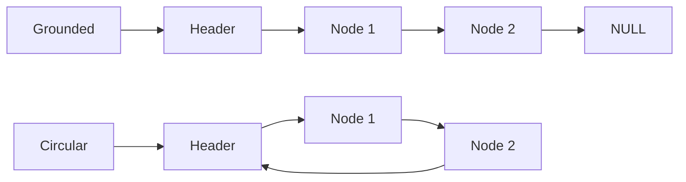

### Why Use Header Lists? (The Benefits)

**Header lists make your life easier!** Here's why:

**Advantages:**

1. **No NULL pointer headaches** (in circular version)
   - You never hit NULL, so no need to constantly check for it
   - Simpler code with fewer "if" statements

2. **Every node has a predecessor**
   - Even the "first" data node has the header before it
   - Makes deletion much easier - no special cases!

3. **Simpler algorithms**
   - Fewer edge cases to worry about
   - Cleaner, more elegant code

4. **Bonus: Store metadata in the header**
   - Count of nodes
   - Sum of values
   - List name or ID
   - Any summary information you want!

**How to detect an empty list:**
- **Grounded:** LINK[START] = NULL means empty
- **Circular:** LINK[START] = START means empty (header points to itself)

#### 🎯 Why Header Lists Are Powerful

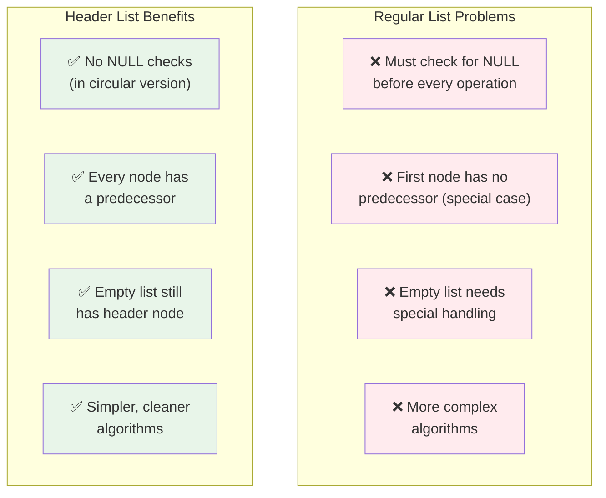

#### 📊 Header Node Use Cases

```mermaid
graph LR
    H["🎯 Header Node"] --> U1["Store metadata<br/>(count, sum, etc.)"]
    H --> U2["Simplify algorithms<br/>(no special cases)"]
    H --> U3["Mark list identity<br/>(name, ID)"]
    H --> U4["Circular linking<br/>(easier traversal)"]
    
    style H fill:#4a90e2,color:#fff
    style U1 fill:#e3f2fd
    style U2 fill:#e3f2fd
    style U3 fill:#e3f2fd
    style U4 fill:#e3f2fd
```

### Example 5.18: Personnel File with Header

| Index | NAME | SSN | SEX | SALARY | LINK |
|-------|------|-----|-----|--------|------|
| 5 | (HEADER) | 9 | | 191,600 | 6 |
| 6 | Brown | 178-52-1065 | Female | 14,700 | 9 |
| 9 | Cohen | 177-44-4557 | Male | 19,000 | 2 |
| 2 | Davis | 192-38-7282 | Female | 22,800 | 12 |
| ... | ... | ... | ... | ... | ... |

**START = 5** (points to header)

Header holds summary data:
- SSN[5] = 9 (number of employees)
- SALARY[5] = 191,600 (total salary)

### Algorithm 5.11: Traversing Circular Header List
```
Step 1: Set PTR = LINK[START] (start at first real node, not header)
Step 2: While PTR ≠ START, repeat: (stop when back at header)
    Step 3: Process INFO[PTR]
    Step 4: Set PTR = LINK[PTR]
Step 5: Exit
```

### Simpler Searching with Headers

**Algorithm 5.12: SRCHHL (Circular Header)**
```
SRCHHL(INFO, LINK, START, ITEM, LOC)
Purpose: Find ITEM in circular header list

Step 1: Set PTR = LINK[START]

Step 2: While INFO[PTR] ≠ ITEM and PTR ≠ START:
            Set PTR = LINK[PTR]
            
Step 3: If INFO[PTR] = ITEM, then:
            Set LOC = PTR
        Else:
            Set LOC = NULL
            
Step 4: Exit
```

**Why simpler?**
- Can check both conditions at once (INFO[PTR] is always defined)
- With regular lists, can't check INFO[PTR] when PTR = NULL

### Simpler Deletion with Headers

**Procedure 5.13: FINDBHL**
```
FINDBHL(INFO, LINK, START, ITEM, LOC, LOCP)
Purpose: Find node and predecessor in header list

Step 1: [Initialize]
        Set SAVE = START
        Set PTR = LINK[START]
        
Step 2: [Search] While INFO[PTR] ≠ ITEM and PTR ≠ START:
            Set SAVE = PTR
            Set PTR = LINK[PTR]
            
Step 3: [Check result]
        If INFO[PTR] = ITEM, then:
            Set LOC = PTR, LOCP = SAVE
        Else:
            Set LOC = NULL, LOCP = SAVE
            
Step 4: Return
```

**Algorithm 5.14: DELLOCHL**
```
DELLOCHL(INFO, LINK, START, AVAIL, ITEM)
Purpose: Delete ITEM from circular header list

Step 1: Call FINDBHL(INFO, LINK, START, ITEM, LOC, LOCP)

Step 2: If LOC = NULL, then:
            Print "ITEM not in list"
            Exit
            
Step 3: Set LINK[LOCP] = LINK[LOC] (delete node)

Step 4: Set LINK[LOC] = AVAIL (return to AVAIL)
        Set AVAIL = LOC
        
Step 5: Exit
```

**No special case needed!** Don't need to check if deleting first node because header always exists.

### 📊 Visual Comparison: All List Types

```mermaid
graph TB
    subgraph "1. One-Way List (Basic)"
        O_START["🎯 START"] --> O1["A | →"]
        O1 --> O2["B | →"]
        O2 --> O3["C | →"]
        O3 --> O_NULL["∅"]
        
        style O1 fill:#e3f2fd
        style O2 fill:#e3f2fd
        style O3 fill:#e3f2fd
    end
    
    subgraph "2. Circular List (No NULL)"
        C_START["🎯 START"] --> C1["A | →"]
        C1 --> C2["B | →"]
        C2 --> C3["C | →"]
        C3 --> C1
        
        style C1 fill:#fff9c4
        style C2 fill:#fff9c4
        style C3 fill:#fff9c4
    end
    
    subgraph "3. Header List (Special First)"
        H_START["🎯 START"] --> H0["🎯 HEADER<br/>(Metadata)"]
        H0 --> H1["A | →"]
        H1 --> H2["B | →"]
        H2 --> H3["C | →"]
        H3 --> H_NULL["∅"]
        
        style H0 fill:#4caf50,color:#fff
        style H1 fill:#e8f5e9
        style H2 fill:#e8f5e9
        style H3 fill:#e8f5e9
    end
    
    subgraph "4. Two-Way List (Bidirectional)"
        T_FIRST["🎯 FIRST"] --> T1["← | A | →"]
        T1 <--> T2["← | B | →"]
        T2 <--> T3["← | C | →"]
        T_LAST["🎯 LAST"] --> T3
        
        style T1 fill:#f3e5f5
        style T2 fill:#f3e5f5
        style T3 fill:#f3e5f5
        style T_FIRST fill:#4caf50,color:#fff
        style T_LAST fill:#f44336,color:#fff
    end
```

> **🎯 Choosing the Right Type:**
> - **One-Way:** Simple, memory-efficient, forward-only traversal
> - **Circular:** No NULL checks, continuous traversal, good for round-robin
> - **Header:** Simplified algorithms, can store metadata, no special cases
> - **Two-Way:** Backward traversal, easy deletion, more memory overhead

### Storing Polynomials
Header lists are perfect for polynomials because the header can store the polynomial's name/identifier.

**Example:** p(x) = 2x⁸ - 5x⁷ - 3x² + 4

```mermaid
graph LR
    H[Header<br/>EXP=-1] --> N1[2, 8<br/>coef, exp]
    N1 --> N2[-5, 7]
    N2 --> N3[-3, 2]
    N3 --> N4[4, 0]
    N4 --> H
```

Each node stores:
- **COEF:** Coefficient of the term
- **EXP:** Exponent of the term
- **LINK:** Pointer to next term

Terms are ordered by decreasing exponent.

## 10. Two-Way Lists (Doubly-Linked Lists)

### What is a Two-Way List?

**Simple definition:** A two-way list lets you **move in both directions** - forward AND backward!

**Think of it like:**
- A two-way street where you can drive in either direction
- A book where you can flip pages forward or backward
- A music playlist where you can go to next song OR previous song

### Node Structure (Three Parts Instead of Two)

Each node now has **three compartments:**

1. **BACK:** Pointer to the **previous** node (backward direction) ⬅️
2. **INFO:** The actual data (same as before) 📊
3. **FORW:** Pointer to the **next** node (forward direction) ➡️

```mermaid
graph LR
    FIRST[FIRST] --> N1
    N1[BACK | INFO | FORW] <--> N2[BACK | INFO | FORW]
    N2 <--> N3[BACK | INFO | FORW]
    N3 --> LAST[LAST]
    
    NULL1[NULL] -.-> N1
    N3 -.-> NULL2[NULL]
```

#### 🔄 Two-Way List Detailed Structure

```mermaid
graph TB
    subgraph "Node Anatomy in Two-Way List"
        N["Complete Node"]
        N --> B["⬅️ BACK<br/>(Previous Node Address)"]
        N --> I["📊 INFO<br/>(Data)"]
        N --> F["➡️ FORW<br/>(Next Node Address)"]
        
        style N fill:#4a90e2,color:#fff
        style B fill:#ff6b6b,color:#fff
        style I fill:#50c878,color:#fff
        style F fill:#ffd93d,color:#fff
    end
    
    subgraph "Bidirectional Navigation"
        FIRST["🎯 FIRST"] --> N1
        N1["⬅️ NULL | A | ➡️"] <-->|"Both directions"| N2["⬅️ | B | ➡️"]
        N2 <--> N3["⬅️ | C | ➡️ NULL"]
        LAST["🎯 LAST"] --> N3
        
        FWD["➡️ Forward Traversal"] -.-> N1
        FWD -.-> N2
        FWD -.-> N3
        
        BWD["⬅️ Backward Traversal"] -.-> N3
        BWD -.-> N2
        BWD -.-> N1
        
        style N1 fill:#e8f5e9
        style N2 fill:#e8f5e9
        style N3 fill:#e8f5e9
        style FIRST fill:#4caf50,color:#fff
        style LAST fill:#f44336,color:#fff
        style FWD fill:#2196f3,color:#fff
        style BWD fill:#9c27b0,color:#fff
    end
```

> **🎯 Key Advantage:** With two-way lists, you can move backward without having to restart from the beginning!

### Two List Pointers
- **FIRST:** Points to first node
- **LAST:** Points to last node

### Important Property
If node A is at LOCA and node B is at LOCB, then:

**FORW[LOCA] = LOCB if and only if BACK[LOCB] = LOCA**

(If B follows A, then A precedes B)

### Example 5.21: Hospital Two-Way List

| Bed | Patient | FORW | BACK |
|-----|---------|------|------|
| 5 | Adams | 3 | 0 |
| 3 | Dean | 11 | 5 |
| 11 | Fields | 8 | 3 |
| 8 | Green | 1 | 11 |
| 1 | Kirk | 7 | 8 |
| 7 | Lane | 4 | 1 |
| 4 | Maxwell | 12 | 7 |
| 12 | Nelson | 9 | 4 |
| 9 | Samuels | 0 | 12 |

**FIRST = 5** (Adams)  
**LAST = 9** (Samuels)

**Forward:** Adams → Dean → Fields → Green → Kirk → Lane → Maxwell → Nelson → Samuels  
**Backward:** Samuels → Nelson → Maxwell → Lane → Kirk → Green → Fields → Dean → Adams

### Two-Way Circular Header List
Combines benefits of both:
- Two-way traversal
- Circular structure
- Header node

```mermaid
graph LR
    START[START] --> H[Header]
    H <--> N1[Node 1]
    N1 <--> N2[Node 2]
    N2 <--> N3[Node 3]
    N3 <--> H
```

Only needs one pointer (START) because:
- Header's FORW points to first node
- Header's BACK points to last node

### Deleting from Two-Way List

**Algorithm 5.15: DELTWL**
```
DELTWL(INFO, FORW, BACK, START, AVAIL, LOC)
Purpose: Delete node at location LOC

Step 1: [Remove from list]
        Set FORW[BACK[LOC]] = FORW[LOC]
        Set BACK[FORW[LOC]] = BACK[LOC]
        
Step 2: [Return to AVAIL]
        Set FORW[LOC] = AVAIL
        Set AVAIL = LOC
        
Step 3: Exit
```

**Visual:**
```
Before:
[A] ↔ [N] ↔ [B]

After:
[A] ↔ [B]     [N] → AVAIL
```

**Key advantage:** Don't need to traverse to find previous node!

### Inserting into Two-Way List

**Algorithm 5.16: INSTWL**
```
INSTWL(INFO, FORW, BACK, START, AVAIL, LOCA, LOCB, ITEM)
Purpose: Insert ITEM between nodes at LOCA and LOCB

Step 1: [Check space]
        If AVAIL = NULL, then:
            Print "OVERFLOW"
            Exit
            
Step 2: [Get new node]
        Set NEW = AVAIL
        Set AVAIL = FORW[AVAIL]
        Set INFO[NEW] = ITEM
        
Step 3: [Insert into list]
        Set FORW[LOCA] = NEW
        Set FORW[NEW] = LOCB
        Set BACK[LOCB] = NEW
        Set BACK[NEW] = LOCA
        
Step 4: Exit
```

**Visual:**
```
Before:
[A] ↔ [B]

After inserting X:
[A] ↔ [X] ↔ [B]
```

Four pointer changes:
1. A's forward → X
2. X's forward → B
3. B's backward → X
4. X's backward → A

### When to Use Two-Way Lists (Decision Guide)

**Use two-way lists when you need to:**

✅ **Frequently find the node before a given node**
   - In a one-way list, you'd have to start from the beginning every time
   - In a two-way list, just follow the BACK pointer - instant access!

✅ **Traverse backward often**
   - Going through the list in reverse order
   - Implementing "undo" functionality
   - Navigation features (previous/next)

✅ **Delete nodes without traversing**
   - You can delete a node immediately if you know its location
   - No need to find the previous node first

**Don't use two-way lists if:**

❌ **Only moving forward**
   - If you never go backward, the extra BACK pointers are wasted
   - A simple one-way list is more efficient

❌ **Memory is limited**
   - Two-way lists use **double the pointer space**
   - Each node needs BACK + FORW instead of just LINK

❌ **Speed is critical for insertions/deletions**
   - Updating two pointers (BACK and FORW) takes longer
   - More pointer operations = slightly slower

> **📊 Bottom Line:** Two-way lists trade extra memory and complexity for the convenience of backward navigation. Use them when that convenience is worth the cost!

## 11. Practice Problems and Solutions

### Problem 5.1: Shopping List Characters
**Given:** Linked list storing "NO EXIT"

| Index | INFO | LINK |
|-------|------|------|
| 3 | O | 6 |
| 4 | T | 0 |
| 6 | (space) | 11 |
| 7 | X | 10 |
| 9 | N | 3 |
| 10 | I | 4 |
| 11 | E | 7 |

**START = 9**

**Solution:** Follow the links:
- 9 → 'N'
- 3 → 'O'
- 6 → ' ' (space)
- 11 → 'E'
- 7 → 'X'
- 10 → 'I'
- 4 → 'T'

**Answer:** "NO EXIT"

### Problem 5.2: Creating Alphabetical List
**Given names:** Mary, June, Barbara, Paula, Diana, Audrey, Karen, Nancy, Ruth, Eileen, Sandra, Helen

**Create:** Alphabetical linked list

**Solution:**

Alphabetical order: Audrey, Barbara, Diana, Eileen, Helen, June, Karen, Mary, Nancy, Paula, Ruth, Sandra

| Index | Name | LINK |
|-------|------|------|
| 1 | Mary | 8 |
| 2 | June | 7 |
| 3 | Barbara | 5 |
| 4 | Paula | 9 |
| 5 | Diana | 10 |
| 6 | Audrey | 3 |
| 7 | Karen | 1 |
| 8 | Nancy | 4 |
| 9 | Ruth | 11 |
| 10 | Eileen | 12 |
| 11 | Sandra | 0 |
| 12 | Helen | 2 |

**START = 6** (Audrey)  
**AVAIL = NULL** (no free space)

### Problem 5.3: Counting Occurrences
**Task:** Count how many times ITEM appears in a list

**Solution:**
```
Procedure: COUNT_ITEM(INFO, LINK, START, ITEM, NUM)
1. Set NUM = 0
2. Set PTR = START
3. While PTR ≠ NULL, repeat:
   4. If INFO[PTR] = ITEM, then:
         Set NUM = NUM + 1
   5. Set PTR = LINK[PTR]
6. Return
```

**Example:** If list is [5, 3, 7, 3, 9, 3] and ITEM = 3, then NUM = 3

### Problem 5.4: Adding Patient
Hospital list: Adams → Dean → Fields → Green → Kirk → Lane → Maxwell → Nelson → Samuels

**Task:** Add Walters (after Samuels) then delete Kirk

**Solution Part (a) - Add Walters:**
- NEW = 10 (first available bed)
- BED[10] = "Walters"
- LINK[9] = 10 (Samuels → Walters)
- LINK[10] = 0 (Walters is last)
- AVAIL = 2

**Solution Part (b) - Delete Kirk:**
- Find predecessor: Green (bed 8)
- LINK[8] = 7 (Green → Lane, skip Kirk)
- LINK[1] = 2 (return Kirk's bed)
- AVAIL = 1

**Final list:** Adams → Dean → Fields → Green → Lane → Maxwell → Nelson → Samuels → Walters

### Problem 5.5: Copying a List
**Task:** Copy NAME1 into NAME2

**Solution:**
```
Algorithm: COPY(INFO, LINK, NAME1, NAME2, AVAIL)

1. Set NAME2 = NULL (start with empty list)

2. If NAME1 = NULL, then Exit (nothing to copy)

3. [Copy first node]
   - Get new node: NEW = AVAIL, AVAIL = LINK[AVAIL]
   - Copy data: INFO[NEW] = INFO[NAME1]
   - Make it first: LINK[NEW] = NAME2, NAME2 = NEW

4. Set PTR = LINK[NAME1] (start at second node of NAME1)
   Set LOC = NAME2 (track last node of NAME2)

5. While PTR ≠ NULL, repeat:
   - Get new node: NEW = AVAIL, AVAIL = LINK[AVAIL]
   - Copy data: INFO[NEW] = INFO[PTR]
   - Add to end: LINK[NEW] = LINK[LOC], LINK[LOC] = NEW
   - Move: PTR = LINK[PTR], LOC = LINK[LOC]

6. Exit
```

### Problem 5.6: Finding Polynomial
**Given:** POLY1 with header at index 1

| Index | COEF | EXP | LINK |
|-------|------|-----|------|
| 1 | 0 | -1 | 5 |
| 5 | 3 | 5 | 8 |
| 8 | -4 | 3 | 3 |
| 3 | 6 | 1 | 7 |
| 7 | -5 | 0 | 1 |

**Solution:** Follow links from header:
- Index 5: 3x⁵
- Index 8: -4x³
- Index 3: 6x¹
- Index 7: -5x⁰

**Answer:** P₁(x) = 3x⁵ - 4x³ + 6x - 5

### Key Concepts Summary Table

| Concept | One-Way List | Two-Way List | Header List |
|---------|--------------|--------------|-------------|
| Pointers per node | 1 (LINK) | 2 (FORW, BACK) | 1 or 2 |
| Can traverse backward | No | Yes | Depends |
| Delete without traversing | No | Yes | No (one-way) |
| Special first node | No | No | Yes |
| NULL pointers | Yes | Yes | No (circular) |
| Memory overhead | Low | High | Medium |
| Complexity | Simple | Complex | Medium |

## Final Tips for Success

### Understanding Linked Lists
- **Draw diagrams:** Always sketch the structure before coding
- **Track pointers:** Know where START, AVAIL, and node pointers point
- **Check NULL:** Always verify pointers before using them
- **Update carefully:** Change pointers in the right order

### Common Mistakes to Avoid
- **Lost nodes:** Forgetting to save a pointer before changing it
- **Wrong order:** Updating pointers in incorrect sequence
- **NULL access:** Trying to access data at NULL pointer
- **Memory leaks:** Not returning deleted nodes to AVAIL

### Practice Strategy
1. Start with small lists (3-5 nodes)
2. Trace algorithms step-by-step on paper
3. Draw before and after diagrams
4. Verify all pointer values
5. Check special cases (empty list, one node, etc.)

**Remember:** Linked lists are powerful because they're flexible, not because they're fast. Use them when you need dynamic sizing and frequent insertions/deletions, not when you need random access or minimal memory usage.
