# Chapter 5: Linked Lists

## Table of Contents

1. [Introduction](#introduction)
2. [What is a Linked List?](#what-is-a-linked-list)
3. [Linked List Representation](#linked-list-representation)
4. [Basic Operations](#basic-operations)
5. [Traversing a Linked List](#traversing-a-linked-list)
6. [Searching](#searching)
7. [Insertion](#insertion)
8. [Deletion](#deletion)
9. [Circular Linked Lists](#circular-linked-lists)
10. [Two-Way Linked Lists](#two-way-linked-lists)
11. [Practice Exercises](#practice-exercises)

---

## 📚 Visual Overview: Linked Lists at a Glance

### 🏛️ High-Level Architecture

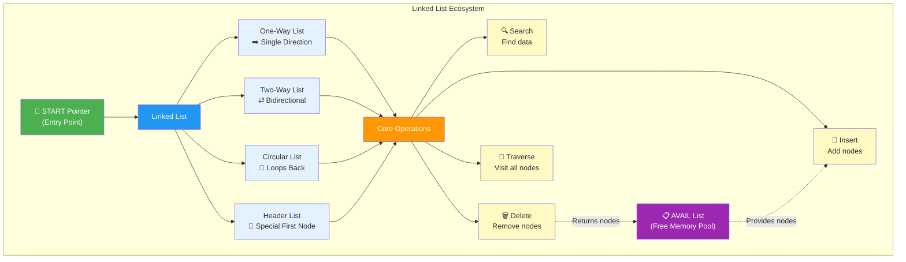

### 🛠️ Operations Quick Reference

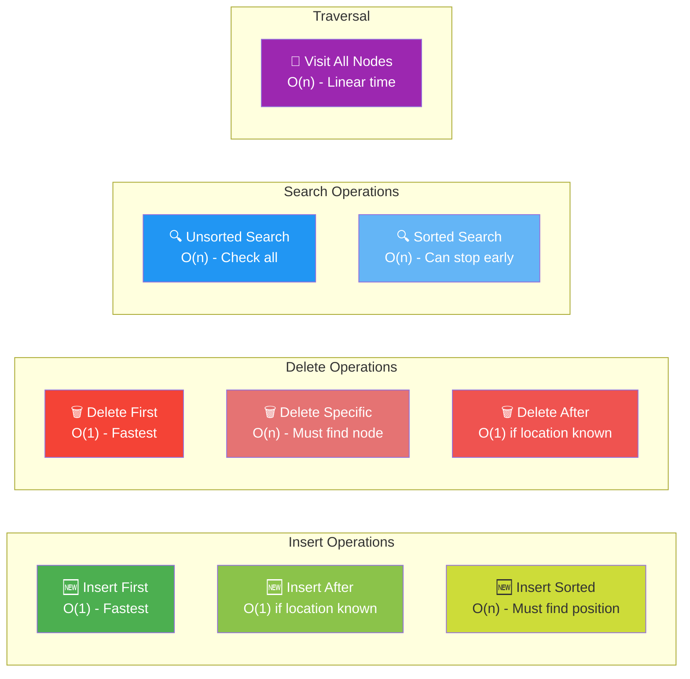

### 📊 Complexity Comparison Table

| Operation | Array | Linked List | Notes |
|-----------|-------|-------------|-------|
| **Access by Index** | O(1) ⚡ | O(n) 🐢 | Arrays win - direct access |
| **Search** | O(n) or O(log n)* | O(n) | *Binary search only for sorted arrays |
| **Insert at Beginning** | O(n) 🐢 | O(1) ⚡ | Linked lists win - no shifting |
| **Insert at End** | O(1)* | O(n) | *If space available |
| **Delete at Beginning** | O(n) 🐢 | O(1) ⚡ | Linked lists win - no shifting |
| **Memory Usage** | Lower ✅ | Higher ❌ | Pointers add overhead |
| **Memory Allocation** | Fixed 🔒 | Dynamic 🔄 | Linked lists are flexible |

> **💡 When to Use What:**
> - **Use Arrays:** When you need fast random access, know the size in advance, or want minimal memory overhead
> - **Use Linked Lists:** When you need frequent insertions/deletions, dynamic sizing, or don't know the final size

### 🎯 Key Concepts Visual Summary

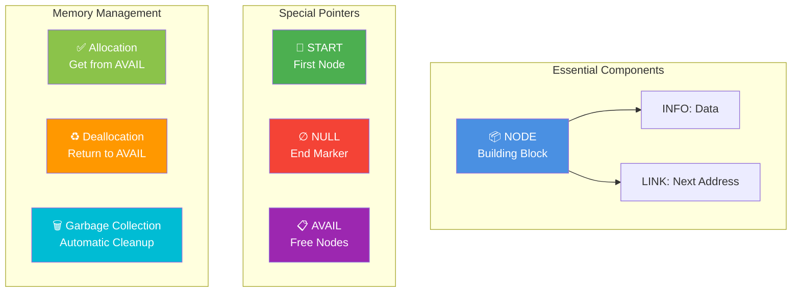
---
## Introduction

### Why Linked Lists?

**In Simple Terms:** Arrays are like parking lots with fixed spaces - you can't easily add more spaces. Linked lists are like a chain where you can add or remove links anywhere!

**Problems with Arrays:**
- [x] Fixed size (hard to expand)
- [x] Expensive to insert/delete (must shift elements)
- [x] Wasted space if not full

**Advantages of Linked Lists:**
- [v] Dynamic size (grows/shrinks as needed)
- [v] Easy insertion/deletion
- [v] No wasted space

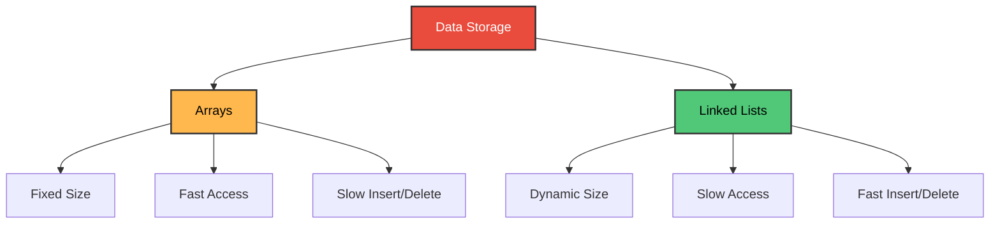

---

## What is a Linked List?

**In Simple Terms:** A linked list is a chain of nodes where each node contains:
1. **Data** (the information)
2. **Pointer** (address of next node)


**Components:**
- **START:** Pointer to first node
- **Node:** Contains data and next pointer
- **NULL:** Marks end of list

---

## Linked List Representation

### Node Structure in C

```c
#include <stdio.h>
#include <stdlib.h>

// Define a node structure
struct Node {
    int data;           // Data part
    struct Node* next;  // Pointer to next node
};

int main() {
    // Create nodes
    struct Node* head = NULL;
    struct Node* second = NULL;
    struct Node* third = NULL;
    
    // Allocate memory
    head = (struct Node*)malloc(sizeof(struct Node));
    second = (struct Node*)malloc(sizeof(struct Node));
    third = (struct Node*)malloc(sizeof(struct Node));
    
    // Assign data
    head->data = 10;
    head->next = second;
    
    second->data = 20;
    second->next = third;
    
    third->data = 30;
    third->next = NULL;  // Last node
    
    // Print the list
    struct Node* temp = head;
    printf("Linked List: ");
    while(temp != NULL) {
        printf("%d -> ", temp->data);
        temp = temp->next;
    }
    printf("NULL\n");
    
    return 0;
}
```

**Output:**
```
Linked List: 10 -> 20 -> 30 -> NULL
```

---

### Memory Representation

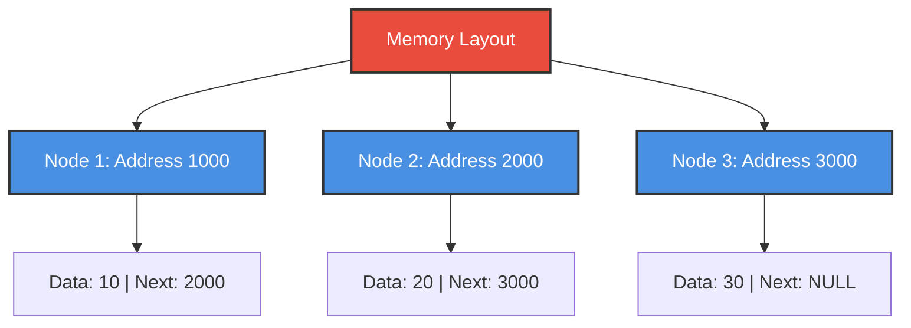

**Key Point:** Nodes don't need to be stored consecutively in memory!

---

## Basic Operations

### Common Linked List Operations

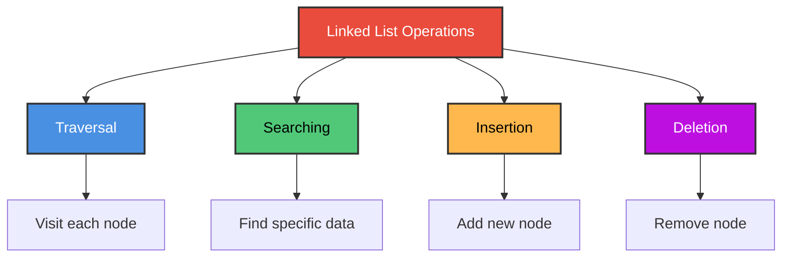

---

## Traversing a Linked List

**In Simple Terms:** Traversing means visiting each node one by one from start to end.

### C Program: Traversal

```c
#include <stdio.h>
#include <stdlib.h>

struct Node {
    int data;
    struct Node* next;
};

void traverse(struct Node* head) {
    struct Node* temp = head;
    int position = 1;
    
    printf("Traversing the list:\n");
    while(temp != NULL) {
        printf("Node %d: %d\n", position, temp->data);
        temp = temp->next;
        position++;
    }
}

int main() {
    // Create a list: 10 -> 20 -> 30 -> NULL
    struct Node* head = (struct Node*)malloc(sizeof(struct Node));
    struct Node* second = (struct Node*)malloc(sizeof(struct Node));
    struct Node* third = (struct Node*)malloc(sizeof(struct Node));
    
    head->data = 10;
    head->next = second;
    
    second->data = 20;
    second->next = third;
    
    third->data = 30;
    third->next = NULL;
    
    traverse(head);
    
    return 0;
}
```

**Output:**
```
Traversing the list:
Node 1: 10
Node 2: 20
Node 3: 30
```

---

## Searching

**In Simple Terms:** Searching means finding if a specific value exists in the list.

### C Program: Search

```c
#include <stdio.h>
#include <stdlib.h>

struct Node {
    int data;
    struct Node* next;
};

int search(struct Node* head, int key) {
    struct Node* temp = head;
    int position = 1;
    
    while(temp != NULL) {
        if(temp->data == key) {
            return position;  // Found
        }
        temp = temp->next;
        position++;
    }
    
    return -1;  // Not found
}

int main() {
    // Create list: 10 -> 20 -> 30 -> NULL
    struct Node* head = (struct Node*)malloc(sizeof(struct Node));
    struct Node* second = (struct Node*)malloc(sizeof(struct Node));
    struct Node* third = (struct Node*)malloc(sizeof(struct Node));
    
    head->data = 10;
    head->next = second;
    
    second->data = 20;
    second->next = third;
    
    third->data = 30;
    third->next = NULL;
    
    // Search for values
    int key1 = 20;
    int key2 = 40;
    
    int pos1 = search(head, key1);
    if(pos1 != -1) {
        printf("%d found at position %d\n", key1, pos1);
    } else {
        printf("%d not found\n", key1);
    }
    
    int pos2 = search(head, key2);
    if(pos2 != -1) {
        printf("%d found at position %d\n", key2, pos2);
    } else {
        printf("%d not found\n", key2);
    }
    
    return 0;
}
```

**Output:**
```
20 found at position 2
40 not found
```

---

## Insertion

### Three Types of Insertion

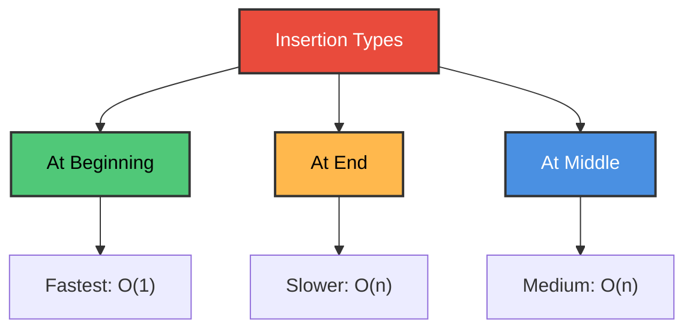

---

### 1. Insert at Beginning

**Steps:**
1. Create new node
2. Point new node to current head
3. Update head to new node

```c
#include <stdio.h>
#include <stdlib.h>

struct Node {
    int data;
    struct Node* next;
};

void insertAtBeginning(struct Node** head, int newData) {
    // Create new node
    struct Node* newNode = (struct Node*)malloc(sizeof(struct Node));
    
    // Assign data
    newNode->data = newData;
    
    // Point to current head
    newNode->next = *head;
    
    // Update head
    *head = newNode;
}

void printList(struct Node* head) {
    struct Node* temp = head;
    while(temp != NULL) {
        printf("%d -> ", temp->data);
        temp = temp->next;
    }
    printf("NULL\n");
}

int main() {
    struct Node* head = NULL;
    
    printf("Original list: ");
    printList(head);
    
    insertAtBeginning(&head, 30);
    printf("After inserting 30: ");
    printList(head);
    
    insertAtBeginning(&head, 20);
    printf("After inserting 20: ");
    printList(head);
    
    insertAtBeginning(&head, 10);
    printf("After inserting 10: ");
    printList(head);
    
    return 0;
}
```

**Output:**
```
Original list: NULL
After inserting 30: 30 -> NULL
After inserting 20: 20 -> 30 -> NULL
After inserting 10: 10 -> 20 -> 30 -> NULL
```

---

### 2. Insert at End

```c
void insertAtEnd(struct Node** head, int newData) {
    // Create new node
    struct Node* newNode = (struct Node*)malloc(sizeof(struct Node));
    newNode->data = newData;
    newNode->next = NULL;
    
    // If list is empty
    if(*head == NULL) {
        *head = newNode;
        return;
    }
    
    // Traverse to last node
    struct Node* temp = *head;
    while(temp->next != NULL) {
        temp = temp->next;
    }
    
    // Link last node to new node
    temp->next = newNode;
}
```

---

### 3. Insert at Position

```c
void insertAtPosition(struct Node** head, int newData, int position) {
    struct Node* newNode = (struct Node*)malloc(sizeof(struct Node));
    newNode->data = newData;
    
    // Insert at beginning
    if(position == 1) {
        newNode->next = *head;
        *head = newNode;
        return;
    }
    
    // Traverse to position-1
    struct Node* temp = *head;
    for(int i = 1; i < position - 1 && temp != NULL; i++) {
        temp = temp->next;
    }
    
    // Insert node
    if(temp != NULL) {
        newNode->next = temp->next;
        temp->next = newNode;
    }
}
```

---

## Deletion

### Three Types of Deletion

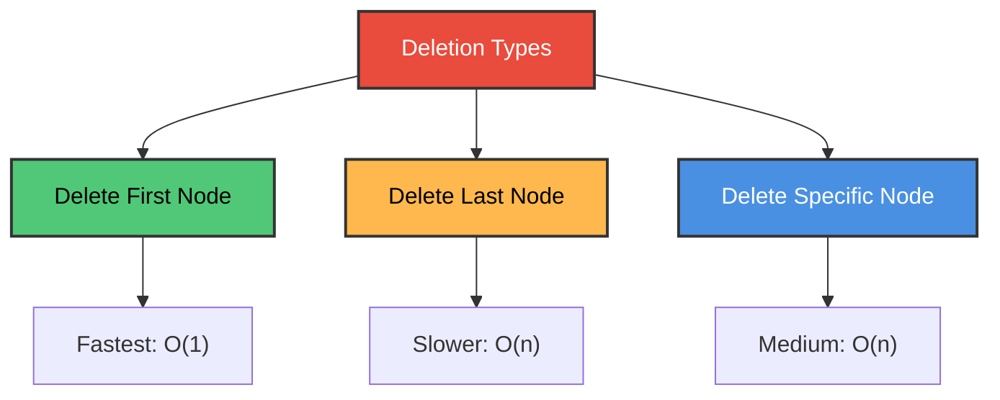

---

### 1. Delete First Node

```c
void deleteFirst(struct Node** head) {
    if(*head == NULL) {
        printf("List is empty\n");
        return;
    }
    
    struct Node* temp = *head;
    *head = (*head)->next;
    free(temp);
}
```

---

### 2. Delete by Value

```c
void deleteByValue(struct Node** head, int key) {
    struct Node* temp = *head;
    struct Node* prev = NULL;
    
    // If head node contains the key
    if(temp != NULL && temp->data == key) {
        *head = temp->next;
        free(temp);
        return;
    }
    
    // Search for the key
    while(temp != NULL && temp->data != key) {
        prev = temp;
        temp = temp->next;
    }
    
    // Key not found
    if(temp == NULL) {
        printf("%d not found in list\n", key);
        return;
    }
    
    // Unlink the node
    prev->next = temp->next;
    free(temp);
}
```

---

### Complete Deletion Example

```c
#include <stdio.h>
#include <stdlib.h>

struct Node {
    int data;
    struct Node* next;
};

void insertAtEnd(struct Node** head, int newData) {
    struct Node* newNode = (struct Node*)malloc(sizeof(struct Node));
    newNode->data = newData;
    newNode->next = NULL;
    
    if(*head == NULL) {
        *head = newNode;
        return;
    }
    
    struct Node* temp = *head;
    while(temp->next != NULL) {
        temp = temp->next;
    }
    temp->next = newNode;
}

void deleteByValue(struct Node** head, int key) {
    struct Node* temp = *head;
    struct Node* prev = NULL;
    
    if(temp != NULL && temp->data == key) {
        *head = temp->next;
        free(temp);
        printf("Deleted %d\n", key);
        return;
    }
    
    while(temp != NULL && temp->data != key) {
        prev = temp;
        temp = temp->next;
    }
    
    if(temp == NULL) {
        printf("%d not found\n", key);
        return;
    }
    
    prev->next = temp->next;
    free(temp);
    printf("Deleted %d\n", key);
}

void printList(struct Node* head) {
    struct Node* temp = head;
    while(temp != NULL) {
        printf("%d -> ", temp->data);
        temp = temp->next;
    }
    printf("NULL\n");
}

int main() {
    struct Node* head = NULL;
    
    // Create list: 10 -> 20 -> 30 -> 40 -> NULL
    insertAtEnd(&head, 10);
    insertAtEnd(&head, 20);
    insertAtEnd(&head, 30);
    insertAtEnd(&head, 40);
    
    printf("Original list: ");
    printList(head);
    
    deleteByValue(&head, 20);
    printf("After deleting 20: ");
    printList(head);
    
    deleteByValue(&head, 50);
    
    return 0;
}
```

**Output:**
```
Original list: 10 -> 20 -> 30 -> 40 -> NULL
Deleted 20
After deleting 20: 10 -> 30 -> 40 -> NULL
50 not found
```

---

## Circular Linked Lists

**In Simple Terms:** The last node points back to the first node instead of NULL, forming a circle!


**Advantages:**
- [v] Can traverse from any node
- [v] Useful for round-robin scheduling
- [v] No NULL pointers to check

### C Program: Circular Linked List

```c
#include <stdio.h>
#include <stdlib.h>

struct Node {
    int data;
    struct Node* next;
};

void insertCircular(struct Node** head, int newData) {
    struct Node* newNode = (struct Node*)malloc(sizeof(struct Node));
    newNode->data = newData;
    
    if(*head == NULL) {
        *head = newNode;
        newNode->next = *head;  // Points to itself
        return;
    }
    
    struct Node* temp = *head;
    while(temp->next != *head) {
        temp = temp->next;
    }
    
    temp->next = newNode;
    newNode->next = *head;
}

void printCircular(struct Node* head) {
    if(head == NULL) {
        printf("List is empty\n");
        return;
    }
    
    struct Node* temp = head;
    printf("Circular List: ");
    do {
        printf("%d -> ", temp->data);
        temp = temp->next;
    } while(temp != head);
    printf("(back to start)\n");
}

int main() {
    struct Node* head = NULL;
    
    insertCircular(&head, 10);
    insertCircular(&head, 20);
    insertCircular(&head, 30);
    
    printCircular(head);
    
    return 0;
}
```

**Output:**
```
Circular List: 10 -> 20 -> 30 -> (back to start)
```

---

## Two-Way Linked Lists

**In Simple Terms:** Each node has TWO pointers - one to the next node and one to the previous node!


**Advantages:**
- [v] Can traverse forward AND backward
- [v] Easier deletion (don't need previous node)
- [v] Can insert before a node easily

**Disadvantages:**
- [x] Extra memory for backward pointer
- [x] More pointers to update

### C Program: Doubly Linked List

```c
#include <stdio.h>
#include <stdlib.h>

struct Node {
    int data;
    struct Node* next;
    struct Node* prev;
};

void insertAtEnd(struct Node** head, int newData) {
    struct Node* newNode = (struct Node*)malloc(sizeof(struct Node));
    newNode->data = newData;
    newNode->next = NULL;
    
    if(*head == NULL) {
        newNode->prev = NULL;
        *head = newNode;
        return;
    }
    
    struct Node* temp = *head;
    while(temp->next != NULL) {
        temp = temp->next;
    }
    
    temp->next = newNode;
    newNode->prev = temp;
}

void printForward(struct Node* head) {
    printf("Forward: ");
    while(head != NULL) {
        printf("%d -> ", head->data);
        head = head->next;
    }
    printf("NULL\n");
}

void printBackward(struct Node* head) {
    if(head == NULL) return;
    
    // Go to last node
    while(head->next != NULL) {
        head = head->next;
    }
    
    printf("Backward: ");
    while(head != NULL) {
        printf("%d -> ", head->data);
        head = head->prev;
    }
    printf("NULL\n");
}

int main() {
    struct Node* head = NULL;
    
    insertAtEnd(&head, 10);
    insertAtEnd(&head, 20);
    insertAtEnd(&head, 30);
    
    printForward(head);
    printBackward(head);
    
    return 0;
}
```

**Output:**
```
Forward: 10 -> 20 -> 30 -> NULL
Backward: 30 -> 20 -> 10 -> NULL
```

---

## Practice Exercises

### Exercise 1: Count Nodes

**Question:** Write a function to count the number of nodes in a linked list.

<details>
<summary>Click for answer</summary>

```c
int countNodes(struct Node* head) {
    int count = 0;
    struct Node* temp = head;
    
    while(temp != NULL) {
        count++;
        temp = temp->next;
    }
    
    return count;
}
```
</details>

---

### Exercise 2: Find Middle Node

**Question:** Write a function to find the middle node of a linked list.

<details>
<summary>Click for answer</summary>

```c
int findMiddle(struct Node* head) {
    struct Node* slow = head;
    struct Node* fast = head;
    
    // Fast pointer moves twice as fast
    while(fast != NULL && fast->next != NULL) {
        slow = slow->next;
        fast = fast->next->next;
    }
    
    return slow->data;
}
```

**Explanation:** Use two pointers - slow moves 1 step, fast moves 2 steps. When fast reaches end, slow is at middle!
</details>

---

### Exercise 3: Reverse a Linked List

**Question:** Write a function to reverse a linked list.

<details>
<summary>Click for answer</summary>

```c
void reverse(struct Node** head) {
    struct Node* prev = NULL;
    struct Node* current = *head;
    struct Node* next = NULL;
    
    while(current != NULL) {
        next = current->next;  // Save next
        current->next = prev;  // Reverse link
        prev = current;        // Move prev forward
        current = next;        // Move current forward
    }
    
    *head = prev;
}
```

**Explanation:** Change the direction of all pointers by traversing and reversing each link.
</details>

---

### Exercise 4: Detect Loop

**Question:** How do you detect if a linked list has a loop?

<details>
<summary>Click for answer</summary>

```c
int hasLoop(struct Node* head) {
    struct Node* slow = head;
    struct Node* fast = head;
    
    while(fast != NULL && fast->next != NULL) {
        slow = slow->next;
        fast = fast->next->next;
        
        if(slow == fast) {
            return 1;  // Loop detected
        }
    }
    
    return 0;  // No loop
}
```

**Explanation:** Floyd's Cycle Detection (Tortoise and Hare). If there's a loop, fast will eventually catch up to slow!
</details>

---

## 📚 Algorithms from Chapter 5

This section covers all algorithms from the Schaum's Data Structures textbook Chapter 5, with easy explanations and visual diagrams.

---

## Algorithm 5.1: Traversing a Linked List

### Problem Statement
**Given:** A linked list in memory with START pointer and NULL end marker  
**Task:** Visit each node exactly once and process its information

### The Idea (Super Simple!)

Think of visiting houses on a street:
1. Start at the first house (START)
2. Visit the house, do what you need to do
3. Follow the arrow to the next house
4. Keep going until you reach "END" (NULL)

### Algorithm (Textbook Format)

```
Algorithm 5.1: TRAVERSING A LINKED LIST
════════════════════════════════════════
Let LIST be a linked list in memory. This algorithm 
traverses LIST, applying an operation PROCESS to each 
element of LIST. The variable PTR points to the node 
currently being processed.

1. Set PTR := START. [Initializes pointer PTR.]
2. Repeat Steps 3 and 4 while PTR ≠ NULL.
3.     Apply PROCESS to INFO[PTR].
4.     Set PTR := LINK[PTR]. [PTR now points to the next node.]
   [End of Step 2 loop.]
5. Exit.
```

### Visual Flowchart

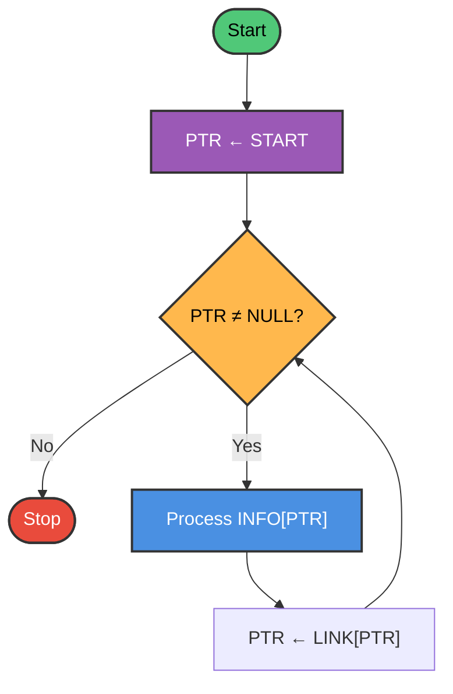

### Step-by-Step Trace

**Given:** LIST with nodes containing [10, 20, 30]


| Step | PTR | INFO[PTR] | Action |
|------|-----|-----------|--------|
| 1 | START | - | Initialize PTR |
| 2 | Node 1 | 10 | PTR ≠ NULL, continue |
| 3 | Node 1 | 10 | Process data: 10 |
| 4 | Node 2 | - | Move to next node |
| 2 | Node 2 | 20 | PTR ≠ NULL, continue |
| 3 | Node 2 | 20 | Process data: 20 |
| 4 | Node 3 | - | Move to next node |
| 2 | Node 3 | 30 | PTR ≠ NULL, continue |
| 3 | Node 3 | 30 | Process data: 30 |
| 4 | NULL | - | Move to next (NULL) |
| 2 | NULL | - | PTR = NULL, exit |

### Complexity Analysis

| Metric | Value | Explanation |
|--------|-------|-------------|
| Time Complexity | O(n) | Visit each of n nodes once |
| Space Complexity | O(1) | Only use PTR variable |
| Best Case | O(n) | Must visit all nodes |
| Worst Case | O(n) | Must visit all nodes |

---

## Algorithm 5.2: Searching an Unsorted Linked List

### Problem Statement
**Given:** An unsorted linked list and an ITEM to find  
**Task:** Find location LOC where ITEM appears, or set LOC = NULL if not found

### The Idea (Super Simple!)

Looking for a book on a messy shelf:
1. Start from the first book
2. Check if it's the one you want
3. If yes, remember the location
4. If no, move to the next book
5. Stop when found or reach the end

### Algorithm (Textbook Format)

```
Algorithm 5.2: SEARCH (Unsorted List)
════════════════════════════════════════
LIST is a linked list in memory. This algorithm finds 
the location LOC of the node where ITEM first appears 
in LIST, or sets LOC = NULL.

1. Set PTR := START.
2. Repeat Step 3 while PTR ≠ NULL:
3.     If ITEM = INFO[PTR], then:
           Set LOC := PTR, and Exit.
       Else:
           Set PTR := LINK[PTR]. [Move to next node.]
       [End of If structure.]
   [End of Step 2 loop.]
4. [Search is unsuccessful.] Set LOC := NULL.
5. Exit.
```

### Visual Flowchart

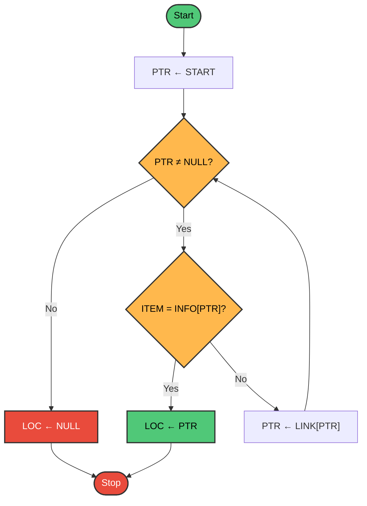

### Example Trace

**Given:** LIST = [45, 23, 78, 12, 89], ITEM = 78

| Step | PTR | INFO[PTR] | ITEM | Comparison | Action |
|------|-----|-----------|------|------------|--------|
| 1 | Node 1 | - | 78 | - | Initialize |
| 2-3 | Node 1 | 45 | 78 | 45 ≠ 78 | Continue |
| 2-3 | Node 2 | 23 | 78 | 23 ≠ 78 | Continue |
| 2-3 | Node 3 | 78 | 78 | 78 = 78 ✓ | LOC = Node 3, Exit |

**Result:** LOC = location of Node 3

**Given:** LIST = [45, 23, 78, 12, 89], ITEM = 99

| Step | PTR | INFO[PTR] | Comparison | Action |
|------|-----|-----------|------------|--------|
| ... | ... | ... | ... | Check all nodes |
| 2 | NULL | - | - | PTR = NULL |
| 4 | - | - | - | LOC = NULL (not found) |

### Complexity Analysis

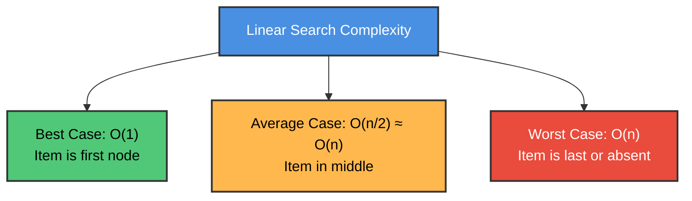

---

## Algorithm 5.3: Searching a Sorted Linked List

### Problem Statement
**Given:** A **sorted** linked list and an ITEM to find  
**Task:** Find location LOC where ITEM appears, or set LOC = NULL

### The Idea (Super Simple!)

Looking for a name in an alphabetically sorted phone book:
1. Start from first name
2. If current name < ITEM, keep looking
3. If current name = ITEM, found it!
4. If current name > ITEM, stop (ITEM doesn't exist)

### Algorithm (Textbook Format)

```
Algorithm 5.3: SRCHSL (Search Sorted List)
════════════════════════════════════════
LIST is a sorted list in memory. This algorithm finds 
the location LOC of the node where ITEM first appears 
in LIST, or sets LOC = NULL.

1. Set PTR := START.
2. Repeat Step 3 while PTR ≠ NULL:
3.     If ITEM < INFO[PTR], then:
           Set PTR := LINK[PTR]. [Move to next node.]
       Else if ITEM = INFO[PTR], then:
           Set LOC := PTR, and Exit. [Search successful.]
       Else:
           Set LOC := NULL, and Exit. [ITEM exceeds INFO[PTR].]
       [End of If structure.]
   [End of Step 2 loop.]
4. Set LOC := NULL.
5. Exit.
```

### Visual Flowchart

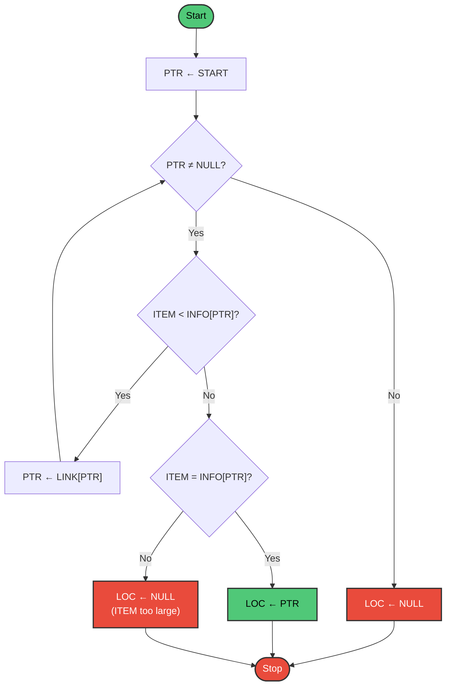

### Example Comparison

**Sorted LIST:** [12, 23, 45, 78, 89]

**Search for 78:**
- Check 12: 78 > 12, continue
- Check 23: 78 > 23, continue  
- Check 45: 78 > 45, continue
- Check 78: 78 = 78, **Found!** ✓

**Search for 50:**
- Check 12: 50 > 12, continue
- Check 23: 50 > 23, continue
- Check 45: 50 > 45, continue
- Check 78: 50 < 78, **Stop! Item doesn't exist** ❌

### Advantage Over Unsorted Search

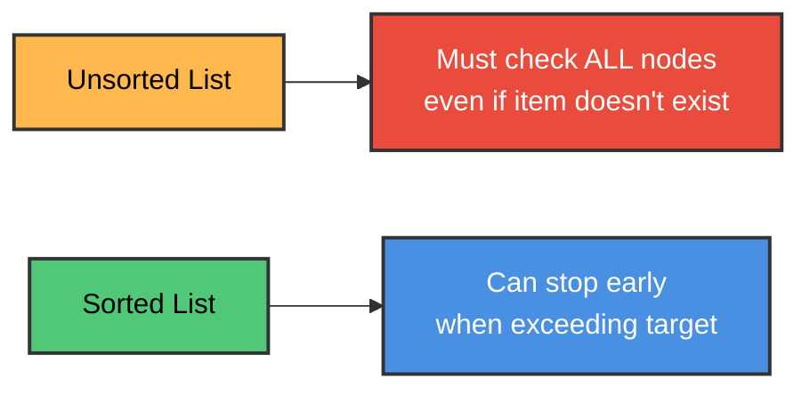

**Note:** We still can't use binary search (need random access), but we can stop early when item is not found!

---

## Algorithm 5.4: Inserting at Beginning of List

### Problem Statement
**Given:** A linked list and a new ITEM  
**Task:** Insert ITEM as the **first node** in the list

### The Idea (Super Simple!)

Adding a new first car to a train:
1. Get a new car from storage (AVAIL list)
2. Put your cargo in the new car
3. Connect new car to current first car
4. Update "First Car" sign to point to new car

### Algorithm (Textbook Format)

```
Algorithm 5.4: INSFIRST (Insert at Beginning)
════════════════════════════════════════
This algorithm inserts ITEM as the first node in the list.

1. [OVERFLOW?] If AVAIL = NULL, then:
       Write: OVERFLOW, and Exit.
2. [Remove first node from AVAIL list.]
   Set NEW := AVAIL and AVAIL := LINK[AVAIL].
3. Set INFO[NEW] := ITEM. [Copy new data into new node.]
4. Set LINK[NEW] := START. [New node points to old first node.]
5. Set START := NEW. [START now points to new node.]
6. Exit.
```

### Visual Step-by-Step

**Before Insertion:**

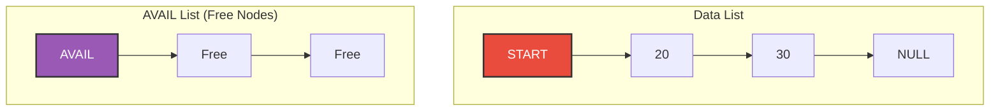

**Step 2: Remove node from AVAIL**

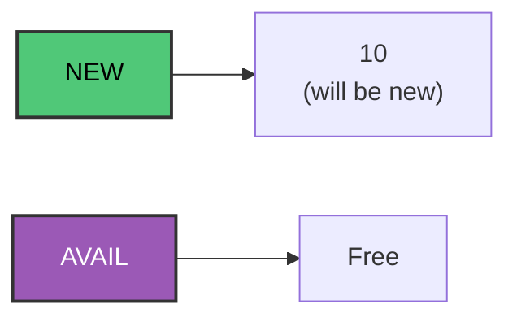

**Step 3-4: Copy data and link to old first**


**Step 5: Update START**

```mermaid
graph LR
    START["START"] --> F1["10"]
    F1 --> N1["20"]
    N1 --> N2["30"]
    N2 --> NULL["NULL"]
    
    style START fill:#E94B3C,stroke:#333,stroke-width:2px,color:#fff
    style F1 fill:#50C878,stroke:#333,stroke-width:2px,color:#000
```

**After Insertion:** List is now [10, 20, 30]

### Why Insert at Beginning is Fast

```mermaid
graph TD
    A["Insert at Beginning"] --> B["O(1) - Constant Time"]
    B --> C["Only 3 pointer changes:<br/>1. AVAIL<br/>2. LINK[NEW]<br/>3. START"]
    
    D["Insert at End"] --> E["O(n) - Linear Time"]
    E --> F["Must traverse entire list<br/>to find last node"]
    
    style A fill:#50C878,stroke:#333,stroke-width:2px,color:#000
    style D fill:#FFB84D,stroke:#333,stroke-width:2px,color:#000
```

---

## Algorithm 5.5: Inserting After a Given Node

### Problem Statement
**Given:** Location LOC of a node (or NULL), and ITEM to insert  
**Task:** Insert ITEM after node at LOC, or at beginning if LOC = NULL

### Algorithm (Textbook Format)

```
Algorithm 5.5: INSLOC (Insert at Location)
════════════════════════════════════════
This algorithm inserts ITEM so that ITEM follows the 
node with location LOC or inserts ITEM as the first 
node when LOC = NULL.

1. [OVERFLOW?] If AVAIL = NULL, then:
       Write: OVERFLOW, and Exit.
2. [Remove first node from AVAIL list.]
   Set NEW := AVAIL and AVAIL := LINK[AVAIL].
3. Set INFO[NEW] := ITEM. [Copy new data into new node.]
4. If LOC = NULL, then: [Insert as first node.]
       Set LINK[NEW] := START and START := NEW.
   Else: [Insert after node with location LOC.]
       Set LINK[NEW] := LINK[LOC] and LINK[LOC] := NEW.
   [End of If structure.]
5. Exit.
```

### Visual Cases

**Case 1: LOC = NULL (Insert at beginning)**

```mermaid
graph LR
    START["START"] --> NEW["NEW: 10"]
    NEW --> N1["20"]
    
    style NEW fill:#50C878,stroke:#333,stroke-width:2px,color:#000
```

**Case 2: LOC points to middle node**

```mermaid
graph LR
    N1["10"] -->|"LOC"| N2["20"]
    N2 --> NEW["NEW: 25"]
    NEW --> N3["30"]
    
    style NEW fill:#50C878,stroke:#333,stroke-width:2px,color:#000
    style N2 fill:#FFB84D,stroke:#333,stroke-width:2px,color:#000
```

**Case 3: LOC points to last node**

```mermaid
graph LR
    N1["10"] --> N2["20"]
    N2 -->|"LOC"| N3["30"]
    N3 --> NEW["NEW: 40"]
    NEW --> NULL["NULL"]
    
    style NEW fill:#50C878,stroke:#333,stroke-width:2px,color:#000
    style N3 fill:#FFB84D,stroke:#333,stroke-width:2px,color:#000
```

---

## Procedure 5.6: Finding Location Before Insertion Point

### Problem Statement
**Given:** A **sorted** list and ITEM to insert  
**Task:** Find location LOC of last node where INFO[LOC] < ITEM

### The Idea (Super Simple!)

Finding where to insert a book in sorted bookshelf:
1. Start from first book
2. Keep moving while current book < your book
3. Stop when you reach a book ≥ your book
4. Remember the previous position (that's LOC)

### Procedure (Textbook Format)

```
Procedure 5.6: FINDA (Find Location A)
════════════════════════════════════════
This procedure finds the location LOC of the last node 
in a sorted list such that INFO[LOC] < ITEM, or sets 
LOC = NULL.

1. [List empty?] If START = NULL, then:
       Set LOC := NULL, and Return.
2. [Special case?] If ITEM < INFO[START], then:
       Set LOC := NULL, and Return.
3. Set SAVE := START and PTR := LINK[START].
   [Initializes pointers.]
4. Repeat Steps 5 and 6 while PTR ≠ NULL.
5.     If ITEM < INFO[PTR], then:
           Set LOC := SAVE, and Return.
       [End of If structure.]
6.     Set SAVE := PTR and PTR := LINK[PTR].
       [Updates pointers.]
   [End of Step 4 loop.]
7. Set LOC := SAVE.
8. Return.
```

### Visual Flowchart

```mermaid
flowchart TD
    START_NODE([Start]) --> EMPTY{"START = NULL?"}
    EMPTY -->|Yes| LOC_NULL1["LOC ← NULL<br/>Return"]
    
    EMPTY -->|No| SPECIAL{"ITEM < INFO[START]?"}
    SPECIAL -->|Yes| LOC_NULL2["LOC ← NULL<br/>Return"]
    
    SPECIAL -->|No| INIT["SAVE ← START<br/>PTR ← LINK[START]"]
    INIT --> LOOP{"PTR ≠ NULL?"}
    
    LOOP -->|No| SET_LOC["LOC ← SAVE<br/>Return"]
    
    LOOP -->|Yes| COMPARE{"ITEM < INFO[PTR]?"}
    COMPARE -->|Yes| FOUND["LOC ← SAVE<br/>Return"]
    
    COMPARE -->|No| UPDATE["SAVE ← PTR<br/>PTR ← LINK[PTR]"]
    UPDATE --> LOOP
    
    style START_NODE fill:#50C878,stroke:#333,stroke-width:2px,color:#000
    style FOUND fill:#50C878,stroke:#333,stroke-width:2px,color:#000
```

### Example Trace

**Given:** Sorted LIST = [10, 20, 30, 40], ITEM = 25

| Step | SAVE | PTR | INFO[PTR] | ITEM | Comparison | Action |
|------|------|-----|-----------|------|------------|--------|
| 1 | - | - | - | 25 | START ≠ NULL | Continue |
| 2 | - | - | 10 | 25 | 25 > 10 | Continue |
| 3 | Node1 | Node2 | - | 25 | - | Initialize |
| 4-5 | Node1 | Node2 | 20 | 25 | 25 > 20 | Continue |
| 6 | Node2 | Node3 | - | 25 | - | Update |
| 4-5 | Node2 | Node3 | 30 | 25 | 25 < 30 ✓ | LOC = Node2 |

**Result:** LOC = Node2 (value 20), so insert after 20

### Two-Pointer Technique

```mermaid
graph LR
    N1["10"] --> N2["20"]
    N2 --> N3["30"]
    N3 --> N4["40"]
    
    SAVE["SAVE"] -.-> N2
    PTR["PTR"] -.-> N3
    
    style SAVE fill:#FFB84D,stroke:#333,stroke-width:2px,color:#000
    style PTR fill:#4A90E2,stroke:#333,stroke-width:2px,color:#fff
```

**Why two pointers?**
- PTR: Checks current node
- SAVE: Remembers previous node
- When PTR finds "too large" value, SAVE has the insertion point!

---

## Algorithm 5.7: Inserting into Sorted List

### Problem Statement
**Given:** A sorted linked list and ITEM to insert  
**Task:** Insert ITEM while maintaining sorted order

### Algorithm (Textbook Format)

```
Algorithm 5.7: INSERT (Insert into Sorted List)
════════════════════════════════════════
This algorithm inserts ITEM into a sorted linked list.

1. [Use Procedure 5.6 to find location of node preceding ITEM.]
   Call FINDA(INFO, LINK, START, ITEM, LOC).
2. [Use Algorithm 5.5 to insert ITEM after node with location LOC.]
   Call INSLOC(INFO, LINK, START, AVAIL, LOC, ITEM).
3. Exit.
```

### Visual Example

**Initial sorted list:** [10, 30, 50]  
**Insert ITEM = 40**

**Step 1: Find LOC using FINDA**

```mermaid
graph LR
    N1["10"] --> N2["30"]
    N2 --> N3["50"]
    
    LOC["LOC"] -.-> N2
    
    style LOC fill:#FFB84D,stroke:#333,stroke-width:2px,color:#000
    style N2 fill:#FFB84D,stroke:#333,stroke-width:2px,color:#000
```

FINDA returns LOC = Node2 (value 30), because 30 < 40 < 50

**Step 2: Insert using INSLOC**

```mermaid
graph LR
    N1["10"] --> N2["30"]
    N2 --> NEW["40"]
    NEW --> N3["50"]
    
    style NEW fill:#50C878,stroke:#333,stroke-width:2px,color:#000
```

**Result:** [10, 30, **40**, 50] - Sorted order maintained!

### Why This Approach is Modular

```mermaid
graph TD
    A["Algorithm 5.7<br/>INSERT"] --> B["Procedure 5.6<br/>FINDA<br/>(Find position)"]
    A --> C["Algorithm 5.5<br/>INSLOC<br/>(Do insertion)"]
    
    B --> D["Separation of Concerns:<br/>Finding vs Inserting"]
    C --> D
    
    style A fill:#E94B3C,stroke:#333,stroke-width:2px,color:#fff
    style B fill:#4A90E2,stroke:#333,stroke-width:2px,color:#fff
    style C fill:#50C878,stroke:#333,stroke-width:2px,color:#000
```

**Benefits:**
- ✅ Code reuse (INSLOC used by multiple algorithms)
- ✅ Easier to understand and maintain
- ✅ Each component does one thing well
- ✅ Can test components independently

---

## Algorithm 5.8: Deleting a Node

### Problem Statement
**Given:** Location LOC of node N to delete, and location LOCP of previous node  
**Task:** Remove node N from list and return it to AVAIL

### Algorithm (Textbook Format)

```
Algorithm 5.8: DEL (Delete Node)
════════════════════════════════════════
This algorithm deletes the node N with location LOC. 
LOCP is the location of the node which precedes N or, 
when N is the first node, LOCP = NULL.

1. If LOCP = NULL, then:
       Set START := LINK[START]. [Deletes first node.]
   Else:
       Set LINK[LOCP] := LINK[LOC]. [Deletes node N.]
   [End of If structure.]
2. [Return deleted node to the AVAIL list.]
   Set LINK[LOC] := AVAIL and AVAIL := LOC.
3. Exit.
```

### Visual Cases

**Case 1: Deleting First Node (LOCP = NULL)**

**Before:**
```mermaid
graph LR
    START["START"] --> N1["10"]
    N1 --> N2["20"]
    N2 --> N3["30"]
    
    style N1 fill:#E94B3C,stroke:#333,stroke-width:2px,color:#fff
```

**After Step 1:** START := LINK[START]
```mermaid
graph LR
    START["START"] --> N2["20"]
    N2 --> N3["30"]
    
    N1["10"] -.-> AVAIL["AVAIL"]
    
    style N1 fill:#9B59B6,stroke:#333,stroke-width:2px,color:#fff
```

**Case 2: Deleting Middle Node**

**Before:**
```mermaid
graph LR
    N1["10"] --> N2["20"]
    N2 --> N3["30"]
    
    LOCP["LOCP"] -.-> N1
    LOC["LOC"] -.-> N2
    
    style N2 fill:#E94B3C,stroke:#333,stroke-width:2px,color:#fff
    style N1 fill:#FFB84D,stroke:#333,stroke-width:2px,color:#000
```

**After Step 1:** LINK[LOCP] := LINK[LOC]
```mermaid
graph LR
    N1["10"] --> N3["30"]
    
    N2["20"] -.-> AVAIL["AVAIL"]
    
    style N2 fill:#9B59B6,stroke:#333,stroke-width:2px,color:#fff
```

**Step 2: Return to AVAIL (Both Cases)**

```mermaid
graph TD
    subgraph "AVAIL List"
        AVAIL["AVAIL"] --> DELETED["Deleted Node"]
        DELETED --> F1["Free"]
        F1 --> F2["Free"]
    end
    
    style DELETED fill:#9B59B6,stroke:#333,stroke-width:2px,color:#fff
    style AVAIL fill:#9B59B6,stroke:#333,stroke-width:2px,color:#fff
```

### Key Steps Explained

```mermaid
graph TD
    A["Step 1: Unlink Node"] --> B{"First Node?"}
    B -->|Yes| C["START ← LINK[START]"]
    B -->|No| D["LINK[LOCP] ← LINK[LOC]"]
    
    C --> E["Step 2: Return to AVAIL"]
    D --> E
    
    E --> F["LINK[LOC] ← AVAIL"]
    F --> G["AVAIL ← LOC"]
    
    style A fill:#4A90E2,stroke:#333,stroke-width:2px,color:#fff
    style E fill:#9B59B6,stroke:#333,stroke-width:2px,color:#fff
```

---

## Procedure 5.9: Finding Node to Delete

### Problem Statement
**Given:** ITEM to delete from list  
**Task:** Find location LOC of node with ITEM and location LOCP of preceding node

### Procedure (Textbook Format)

```
Procedure 5.9: FINDB (Find Node B)
════════════════════════════════════════
This procedure finds the location LOC of the first node N 
which contains ITEM and the location LOCP of the node 
preceding N. If ITEM does not appear in the list, then 
the procedure sets LOC = NULL; and if ITEM appears in 
the first node, then it sets LOCP = NULL.

1. [List empty?] If START = NULL, then:
       Set LOC := NULL and LOCP := NULL, and Return.
   [End of If structure.]
2. [ITEM in first node?] If INFO[START] = ITEM, then:
       Set LOC := START and LOCP := NULL, and Return.
   [End of If structure.]
3. Set SAVE := START and PTR := LINK[START].
   [Initializes pointers.]
4. Repeat Steps 5 and 6 while PTR ≠ NULL.
5.     If INFO[PTR] = ITEM, then:
           Set LOC := PTR and LOCP := SAVE, and Return.
       [End of If structure.]
6.     Set SAVE := PTR and PTR := LINK[PTR].
       [Updates pointers.]
   [End of Step 4 loop.]
7. Set LOC := NULL. [Search unsuccessful.]
8. Return.
```

### Visual Flowchart

```mermaid
flowchart TD
    START_NODE([Start]) --> EMPTY{"START = NULL?"}
    EMPTY -->|Yes| BOTH_NULL["LOC ← NULL<br/>LOCP ← NULL<br/>Return"]
    
    EMPTY -->|No| FIRST{"INFO[START] = ITEM?"}
    FIRST -->|Yes| FIRST_NODE["LOC ← START<br/>LOCP ← NULL<br/>Return"]
    
    FIRST -->|No| INIT["SAVE ← START<br/>PTR ← LINK[START]"]
    INIT --> LOOP{"PTR ≠ NULL?"}
    
    LOOP -->|No| NOT_FOUND["LOC ← NULL<br/>Return"]
    
    LOOP -->|Yes| MATCH{"INFO[PTR] = ITEM?"}
    MATCH -->|Yes| FOUND["LOC ← PTR<br/>LOCP ← SAVE<br/>Return"]
    
    MATCH -->|No| UPDATE["SAVE ← PTR<br/>PTR ← LINK[PTR]"]
    UPDATE --> LOOP
    
    style START_NODE fill:#50C878,stroke:#333,stroke-width:2px,color:#000
    style FOUND fill:#50C878,stroke:#333,stroke-width:2px,color:#000
```

### Example Trace

**Given:** LIST = [10, 20, 30, 40], ITEM = 30

| Step | SAVE | PTR | INFO[PTR] | Found? | Result |
|------|------|-----|-----------|--------|--------|
| 1 | - | - | - | - | START ≠ NULL |
| 2 | - | - | 10 | - | 10 ≠ 30 |
| 3 | Node1 | Node2 | - | - | Initialize |
| 4-5 | Node1 | Node2 | 20 | No | 20 ≠ 30 |
| 6 | Node2 | Node3 | - | - | Update |
| 4-5 | Node2 | Node3 | 30 | **Yes** ✓ | LOC=Node3, LOCP=Node2 |

**Result:** LOC = Node3 (value 30), LOCP = Node2 (value 20)

### Two-Pointer Tracking

```mermaid
graph LR
    N1["10"] --> N2["20"]
    N2 --> N3["30"]
    N3 --> N4["40"]
    
    SAVE["SAVE<br/>(Previous)"] -.-> N2
    PTR["PTR<br/>(Current)"] -.-> N3
    
    style N3 fill:#50C878,stroke:#333,stroke-width:2px,color:#000
    style N2 fill:#FFB84D,stroke:#333,stroke-width:2px,color:#000
```

**Why track both?**
- Need LOC to know which node to delete
- Need LOCP to update the link that points to the deleted node

---

## Algorithm 5.10: Deleting Node with Given Item

### Problem Statement
**Given:** ITEM to delete from list  
**Task:** Delete the first node containing ITEM

### Algorithm (Textbook Format)

```
Algorithm 5.10: DELETE (Delete by Item)
════════════════════════════════════════
This algorithm deletes from a linked list the first 
node N which contains the given ITEM of information.

1. [Use Procedure 5.9 to find location of N and its preceding node.]
   Call FINDB(INFO, LINK, START, ITEM, LOC, LOCP)
2. If LOC = NULL, then:
       Write: ITEM not in list, and Exit.
3. [Delete node.]
   If LOCP = NULL, then:
       Set START := LINK[START]. [Deletes first node.]
   Else:
       Set LINK[LOCP] := LINK[LOC].
   [End of If structure.]
4. [Return deleted node to the AVAIL list.]
   Set LINK[LOC] := AVAIL and AVAIL := LOC.
5. Exit.
```

### Complete Example

**Initial List:** [10, 20, 30, 40]  
**Delete ITEM = 20**

**Step 1: Find node using FINDB**

```mermaid
graph LR
    N1["10"] --> N2["20"]
    N2 --> N3["30"]
    N3 --> N4["40"]
    
    LOCP["LOCP"] -.-> N1
    LOC["LOC"] -.-> N2
    
    style N2 fill:#E94B3C,stroke:#333,stroke-width:2px,color:#fff
    style N1 fill:#FFB84D,stroke:#333,stroke-width:2px,color:#000
```

**Step 2: Check if found**
- LOC ≠ NULL, so continue

**Step 3: Delete node**
- LOCP ≠ NULL (not first node)
- Execute: LINK[LOCP] := LINK[LOC]

```mermaid
graph LR
    N1["10"] --> N3["30"]
    N3 --> N4["40"]
    
    N2["20"] -.-> AVAIL["AVAIL"]
    
    style N2 fill:#9B59B6,stroke:#333,stroke-width:2px,color:#fff
```

**Step 4: Return to AVAIL**

**Final List:** [10, 30, 40]

### Modular Design

```mermaid
graph TD
    A["Algorithm 5.10<br/>DELETE"] --> B["Procedure 5.9<br/>FINDB<br/>(Find node & predecessor)"]
    A --> C["Algorithm 5.8<br/>DEL<br/>(Remove from list)"]
    
    D["Benefit: Reusable Components"]
    B --> D
    C --> D
    
    style A fill:#E94B3C,stroke:#333,stroke-width:2px,color:#fff
    style B fill:#4A90E2,stroke:#333,stroke-width:2px,color:#fff
    style C fill:#9B59B6,stroke:#333,stroke-width:2px,color:#fff
```

---

## Algorithm 5.11: Traversing Circular Header List

### Problem Statement
**Given:** A circular header list (last node points to header)  
**Task:** Traverse all ordinary nodes (skip header)

### What is a Header List?

```mermaid
graph LR
    START["START"] --> H["HEADER<br/>(Special Node)"]
    H --> N1["Data: 10"]
    N1 --> N2["Data: 20"]
    N2 --> N3["Data: 30"]
    N3 --> H
    
    style H fill:#9B59B6,stroke:#333,stroke-width:2px,color:#fff
    style START fill:#E94B3C,stroke:#333,stroke-width:2px,color:#fff
```

**Key Differences from Regular List:**
- First node is LINK[START] (not START)
- Loop ends when PTR = START (not NULL)
- Circular: no NULL pointer

### Algorithm (Textbook Format)

```
Algorithm 5.11: TRAVERSING A CIRCULAR HEADER LIST
════════════════════════════════════════
Let LIST be a circular header list in memory. This 
algorithm traverses LIST, applying an operation PROCESS 
to each node of LIST.

1. Set PTR := LINK[START]. [Initializes pointer PTR.]
2. Repeat Steps 3 and 4 while PTR ≠ START:
3.     Apply PROCESS to INFO[PTR].
4.     Set PTR := LINK[PTR]. [PTR now points to next node.]
   [End of Step 2 loop.]
5. Exit.
```

### Comparison: Regular vs Header List

**Regular List Traversal:**
```
PTR := START
while PTR ≠ NULL:
    Process INFO[PTR]
    PTR := LINK[PTR]
```

**Header List Traversal:**
```
PTR := LINK[START]  ← Skip header
while PTR ≠ START:  ← Stop at header
    Process INFO[PTR]
    PTR := LINK[PTR]
```

### Why Use Header Lists?

```mermaid
graph TD
    A["Advantages of Header Lists"] --> B["No NULL pointers<br/>All pointers valid"]
    A --> C["Every node has predecessor<br/>No special cases"]
    A --> D["Can store metadata<br/>in header node"]
    
    style A fill:#4A90E2,stroke:#333,stroke-width:2px,color:#fff
    style B fill:#50C878,stroke:#333,stroke-width:2px,color:#000
    style C fill:#50C878,stroke:#333,stroke-width:2px,color:#000
    style D fill:#FFB84D,stroke:#333,stroke-width:2px,color:#000
```

**Example metadata in header:**
- Number of nodes in list
- Sum of all values
- Last modification time

---

## Algorithm 5.15: Deleting from Two-Way List

### What is a Two-Way (Doubly Linked) List?

```mermaid
graph LR
    N1["←|10|→"] <--> N2["←|20|→"]
    N2 <--> N3["←|30|→"]
    
    style N1 fill:#4A90E2,stroke:#333,stroke-width:2px,color:#fff
    style N2 fill:#4A90E2,stroke:#333,stroke-width:2px,color:#fff
    style N3 fill:#4A90E2,stroke:#333,stroke-width:2px,color:#fff
```

**Each node has:**
- BACK pointer (to previous node)
- INFO (data)
- FORW pointer (to next node)

### Algorithm (Textbook Format)

```
Algorithm 5.15: DELTWL (Delete from Two-Way List)
════════════════════════════════════════
This algorithm deletes node N with location LOC from a 
two-way circular header list.

1. [Delete node.]
   Set FORW[BACK[LOC]] := FORW[LOC] and
       BACK[FORW[LOC]] := BACK[LOC].
2. [Return node to AVAIL list.]
   Set FORW[LOC] := AVAIL and AVAIL := LOC.
3. Exit.
```

### Visual Explanation

**Before Deletion:**

```mermaid
graph LR
    A["Node A"] <-->|"BACK/FORW"| B["Node N<br/>(to delete)"]
    B <-->|"BACK/FORW"| C["Node C"]
    
    style B fill:#E94B3C,stroke:#333,stroke-width:2px,color:#fff
```

**Step 1a: FORW[BACK[LOC]] := FORW[LOC]**

Make Node A point forward to Node C:

```mermaid
graph LR
    A["Node A"] -->|"FORW"| C["Node C"]
    A <--> B["Node N"]
    B <--> C
    
    style B fill:#E94B3C,stroke:#333,stroke-width:2px,color:#fff
```

**Step 1b: BACK[FORW[LOC]] := BACK[LOC]**

Make Node C point back to Node A:

```mermaid
graph LR
    A["Node A"] <-->|"Complete"| C["Node C"]
    
    B["Node N<br/>(isolated)"]
    
    style B fill:#9B59B6,stroke:#333,stroke-width:2px,color:#fff
```

**After Deletion:**

```mermaid
graph LR
    A["Node A"] <--> C["Node C"]
    
    style A fill:#4A90E2,stroke:#333,stroke-width:2px,color:#fff
    style C fill:#4A90E2,stroke:#333,stroke-width:2px,color:#fff
```

### Why Two-Way Lists are Easier to Delete From

**Singly Linked List:**
```
Need to traverse to find previous node
Time: O(n)
```

**Doubly Linked List:**
```
Have direct access to previous node via BACK pointer
Time: O(1)
```

```mermaid
graph TD
    A["Deletion Complexity"] --> B["Singly Linked: O(n)<br/>Must find predecessor"]
    A --> C["Doubly Linked: O(1)<br/>BACK pointer gives predecessor"]
    
    style B fill:#FFB84D,stroke:#333,stroke-width:2px,color:#000
    style C fill:#50C878,stroke:#333,stroke-width:2px,color:#000
```

### Trade-offs

**Advantages:**
- ✅ Fast deletion O(1)
- ✅ Can traverse both directions
- ✅ No need to track predecessor

**Disadvantages:**
- ❌ Extra memory for BACK pointers
- ❌ More pointers to update on insert/delete
- ❌ Slightly more complex code

---

## Algorithm 5.16: Inserting into Two-Way List

### Algorithm (Textbook Format)

```
Algorithm 5.16: INSTWL (Insert into Two-Way List)
════════════════════════════════════════
This algorithm inserts ITEM between nodes A and B of a 
two-way circular header list, where LOCA and LOCB are 
the locations of A and B.

1. [OVERFLOW?] If AVAIL = NULL, then:
       Write: OVERFLOW, and Exit.
2. [Remove node from AVAIL list and copy new data into node.]
   Set NEW := AVAIL, AVAIL := FORW[AVAIL], INFO[NEW] := ITEM.
3. [Insert node into list.]
   Set FORW[LOCA] := NEW, FORW[NEW] := LOCB,
       BACK[LOCB] := NEW, BACK[NEW] := LOCA.
4. Exit.
```

### Visual Step-by-Step

**Before Insertion:**

```mermaid
graph LR
    A["Node A"] <--> B["Node B"]
    
    LOCA["LOCA"] -.-> A
    LOCB["LOCB"] -.-> B
    
    style LOCA fill:#FFB84D,stroke:#333,stroke-width:2px,color:#000
    style LOCB fill:#FFB84D,stroke:#333,stroke-width:2px,color:#000
```

**Step 3a: FORW[LOCA] := NEW**

```mermaid
graph LR
    A["Node A"] -->|"FORW"| N["NEW"]
    A <--> B["Node B"]
    
    style N fill:#50C878,stroke:#333,stroke-width:2px,color:#000
```

**Step 3b: FORW[NEW] := LOCB**

```mermaid
graph LR
    A["Node A"] --> N["NEW"]
    N -->|"FORW"| B["Node B"]
    A <--> B
    
    style N fill:#50C878,stroke:#333,stroke-width:2px,color:#000
```

**Step 3c: BACK[LOCB] := NEW**

```mermaid
graph LR
    A["Node A"] --> N["NEW"]
    N --> B["Node B"]
    B -->|"BACK"| N
    A <--> B
    
    style N fill:#50C878,stroke:#333,stroke-width:2px,color:#000
```

**Step 3d: BACK[NEW] := LOCA**

```mermaid
graph LR
    A["Node A"] <--> N["NEW"]
    N <--> B["Node B"]
    
    style N fill:#50C878,stroke:#333,stroke-width:2px,color:#000
```

**After Insertion:** Complete two-way links established!

### Four Pointer Updates

```mermaid
graph TD
    A["Step 3: Insert Node"] --> B["1. FORW[LOCA] ← NEW"]
    A --> C["2. FORW[NEW] ← LOCB"]
    A --> D["3. BACK[LOCB] ← NEW"]
    A --> E["4. BACK[NEW] ← LOCA"]
    
    style A fill:#4A90E2,stroke:#333,stroke-width:2px,color:#fff
    style B fill:#50C878,stroke:#333,stroke-width:2px,color:#000
    style C fill:#50C878,stroke:#333,stroke-width:2px,color:#000
    style D fill:#FFB84D,stroke:#333,stroke-width:2px,color:#000
    style E fill:#FFB84D,stroke:#333,stroke-width:2px,color:#000
```

**Memory Aid:** Connect NEW to neighbors, then neighbors to NEW
1. NEW → forward neighbor
2. NEW → backward neighbor  
3. Forward neighbor → NEW
4. Backward neighbor → NEW

---

## 📊 Algorithm Complexity Summary

### Time Complexity Table

| Algorithm | Operation | Singly Linked | Doubly Linked | Array |
|-----------|-----------|---------------|---------------|-------|
| 5.1 | Traverse | O(n) | O(n) | O(n) |
| 5.2 | Search Unsorted | O(n) | O(n) | O(n) |
| 5.3 | Search Sorted | O(n) | O(n) | O(log n) |
| 5.4 | Insert at Begin | O(1) | O(1) | O(n) |
| 5.7 | Insert Sorted | O(n) | O(n) | O(n) |
| 5.8 | Delete (with LOCP) | O(1) | O(1) | O(n) |
| 5.10 | Delete by Item | O(n) | O(n) | O(n) |
| 5.15 | Delete (two-way) | **O(1)** | **O(1)** | O(n) |

### Space Complexity

```mermaid
graph TD
    A["Memory Usage"] --> B["Singly Linked<br/>n nodes × 2 fields"]
    A --> C["Doubly Linked<br/>n nodes × 3 fields"]
    A --> D["Array<br/>n elements × 1 field"]
    
    B --> E["Extra: AVAIL list"]
    C --> E
    
    style A fill:#4A90E2,stroke:#333,stroke-width:2px,color:#fff
    style B fill:#FFB84D,stroke:#333,stroke-width:2px,color:#000
    style C fill:#E94B3C,stroke:#333,stroke-width:2px,color:#fff
    style D fill:#50C878,stroke:#333,stroke-width:2px,color:#000
```

---

## 🎯 When to Use Each List Type

### Decision Tree

```mermaid
graph TD
    START["Choose Data Structure"] --> Q1{"Need dynamic size?"}
    Q1 -->|No| ARR["Use Array"]
    Q1 -->|Yes| Q2{"Frequent insertions<br/>at beginning?"}
    
    Q2 -->|Yes| Q3{"Need backward<br/>traversal?"}
    Q2 -->|No| Q4{"Random access<br/>needed?"}
    
    Q3 -->|Yes| DBL["Doubly Linked List"]
    Q3 -->|No| SGL["Singly Linked List"]
    
    Q4 -->|Yes| ARR2["Use Array"]
    Q4 -->|No| Q5{"Circular<br/>behavior?"}
    
    Q5 -->|Yes| CIR["Circular Linked List"]
    Q5 -->|No| SGL2["Singly Linked List"]
    
    style START fill:#E94B3C,stroke:#333,stroke-width:2px,color:#fff
    style ARR fill:#50C878,stroke:#333,stroke-width:2px,color:#000
    style ARR2 fill:#50C878,stroke:#333,stroke-width:2px,color:#000
    style SGL fill:#4A90E2,stroke:#333,stroke-width:2px,color:#fff
    style SGL2 fill:#4A90E2,stroke:#333,stroke-width:2px,color:#fff
    style DBL fill:#FFB84D,stroke:#333,stroke-width:2px,color:#000
    style CIR fill:#9B59B6,stroke:#333,stroke-width:2px,color:#fff
```

### Use Cases

| List Type | Best For | Example Applications |
|-----------|----------|---------------------|
| **Singly Linked** | Insert at front, one-way traversal | Stack, Queue, Simple lists |
| **Doubly Linked** | Bi-directional traversal, easy deletion | Browser history, Undo/Redo |
| **Circular** | Round-robin, no end | Task scheduling, Music playlist |
| **Header List** | Need metadata, avoid null checks | File systems, Database indices |

---

## Summary

### Key Concepts Learned

- **Linked List Basics:** Nodes with data and pointers  
- **Operations:** Traversal, search, insertion, deletion  
- **Circular Lists:** Last node points to first  
- **Doubly Linked Lists:** Two-way navigation  
- **Memory Management:** Dynamic allocation with malloc/free  
- **AVAIL List:** Free storage management
- **Header Lists:** Special first node for metadata
- **Algorithm Modularity:** Reusable procedure components

### Comparison: Array vs Linked List

| Feature | Array | Linked List |
|---------|-------|-------------|
| Size | Fixed | Dynamic |
| Access | O(1) | O(n) |
| Insert/Delete | O(n) | O(1) at known position |
| Memory | Contiguous | Scattered |
| Extra Space | None | Pointers |
| Binary Search | Yes | No |

### Time Complexity

| Operation | Singly Linked | Doubly Linked | Array |
|-----------|---------------|---------------|-------|
| Access | O(n) | O(n) | O(1) |
| Search | O(n) | O(n) | O(n) unsorted, O(log n) sorted |
| Insert (beginning) | O(1) | O(1) | O(n) |
| Insert (end) | O(n) | O(1)* | O(1) |
| Delete (beginning) | O(1) | O(1) | O(n) |
| Delete (end) | O(n) | O(1)* | O(1) |
| Delete (known position) | O(1)** | O(1) | O(n) |

*With tail pointer  
**With predecessor pointer (LOCP)

### Important Takeaways

1. **Always check for NULL** before accessing nodes
2. **Free memory** when deleting nodes to avoid memory leaks
3. **Use doubly linked lists** when you need backward traversal or O(1) deletion
4. **Circular lists** are useful for round-robin applications
5. **Linked lists excel** at frequent insertions/deletions at known positions
6. **Header lists** simplify algorithms by eliminating special cases
7. **AVAIL list** enables efficient memory reuse
8. **Binary search not possible** on linked lists (no random access)
9. **Two-pointer technique** (SAVE, PTR) essential for many operations
10. **Modular design** makes algorithms easier to understand and maintain

---

**End of Chapter 5**

*Continue to Chapter 6: Stacks and Queues*
